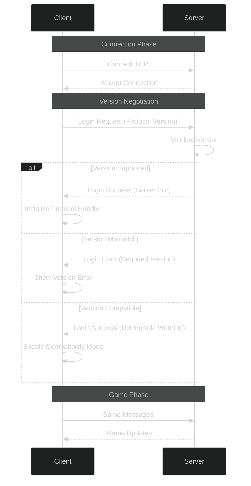

# Protocol Version Compatibility Matrix

## Overview

OTClient v8 supports multiple Tibia protocol versions, enabling connectivity to different server implementations. This document details version compatibility, negotiation, and fallback mechanisms.

## Supported Versions

| Protocol Version | Tibia Version | Status | Features |
|-----------------|---------------|---------|----------|
| 7.4 - 7.6 | 7.40 - 7.60 | Legacy | Basic gameplay, limited features |
| 7.7 - 7.9 | 7.70 - 7.90 | Legacy | Quest system, mounts |
| 8.0 - 8.6 | 8.00 - 8.60 | Supported | Improved UI, battle window |
| 9.0 - 9.6 | 9.00 - 9.60 | Supported | New assets, prey system |
| 10.0 - 10.98 | 10.00 - 10.98 | Supported | Store, analytics, imbuing |
| 11.0 - 11.20 | 11.00 - 11.20 | Supported | Quick loot, stash |
| 12.0+ | 12.00+ | Experimental | Latest features, extended opcodes |

## Version Negotiation

### Client-Server Handshake



### Protocol Detection

```cpp
// protocol.cpp

class ProtocolVersion {
public:
    static uint16_t detectVersion(const std::string& serverAddress) {
        // Try to determine version from server address or config
        auto config = g_config.get("protocol_version_" + serverAddress);
        if (config) {
            return std::stoi(config);
        }
        
        // Default to latest supported
        return LATEST_SUPPORTED_VERSION;
    }
    
    static bool isVersionSupported(uint16_t version) {
        return version >= MIN_SUPPORTED_VERSION && 
               version <= MAX_SUPPORTED_VERSION;
    }
    
    static std::vector<uint16_t> getSupportedVersions() {
        std::vector<uint16_t> versions;
        for (uint16_t v = MIN_SUPPORTED_VERSION; v <= MAX_SUPPORTED_VERSION; v++) {
            versions.push_back(v);
        }
        return versions;
    }
};
```

### Dynamic Version Selection

```cpp
bool ProtocolGame::login(const std::string& account, const std::string& password) {
    // Step 1: Get server's preferred version
    uint16_t serverVersion = queryServerVersion();
    
    // Step 2: Check compatibility
    if (!ProtocolVersion::isVersionSupported(serverVersion)) {
        g_logger.error("Server version %d not supported", serverVersion);
        return false;
    }
    
    // Step 3: Initialize protocol for this version
    initializeForVersion(serverVersion);
    
    // Step 4: Send login packet
    OutputMessagePtr msg = std::make_shared<OutputMessage>();
    msg->addU8(Proto::ClientOpcodes::Login);
    msg->addU16(serverVersion);  // Client version
    msg->addString(account);
    msg->addString(password);
    
    send(msg);
    return true;
}
```

## Version-Specific Features

### Protocol 7.x (Legacy)

```cpp
// Features limited to basic gameplay
class Protocol7x {
    static constexpr bool hasExtendedOpcodes = false;
    static constexpr bool hasMarket = false;
    static constexpr bool hasMounts = false;
    static constexpr uint8_t maxContainers = 16;
    static constexpr uint8_t maxVipEntries = 100;
};
```

### Protocol 8.x-9.x

```cpp
class Protocol8x {
    static constexpr bool hasExtendedOpcodes = true;  // Limited
    static constexpr bool hasMarket = false;
    static constexpr bool hasMounts = true;
    static constexpr uint8_t maxContainers = 32;
    static constexpr uint8_t maxVipEntries = 200;
};
```

### Protocol 10.x+

```cpp
class Protocol10x {
    static constexpr bool hasExtendedOpcodes = true;
    static constexpr bool hasMarket = true;
    static constexpr bool hasMounts = true;
    static constexpr bool hasStore = true;
    static constexpr uint8_t maxContainers = 64;
    static constexpr uint8_t maxVipEntries = 500;
};
```

## Compatibility Mode

### Feature Detection

```cpp
class ProtocolFeatures {
public:
    bool detectFeatures(uint16_t version) {
        m_version = version;
        
        // Detect available features based on version
        m_hasExtendedOpcodes = (version >= 860);
        m_hasMarket = (version >= 980);
        m_hasPrey = (version >= 1100);
        m_hasStash = (version >= 1200);
        
        return true;
    }
    
    bool hasFeature(Feature feature) const {
        switch (feature) {
            case Feature::ExtendedOpcodes:
                return m_hasExtendedOpcodes;
            case Feature::Market:
                return m_hasMarket;
            case Feature::Prey:
                return m_hasPrey;
            case Feature::Stash:
                return m_hasStash;
            default:
                return false;
        }
    }
    
private:
    uint16_t m_version;
    bool m_hasExtendedOpcodes;
    bool m_hasMarket;
    bool m_hasPrey;
    bool m_hasStash;
};
```

### Fallback Handling

```cpp
void GameProtocol::handleFeatureUnavailable(Feature feature) {
    switch (feature) {
        case Feature::Market:
            g_logger.warning("Market not available in this protocol version");
            g_game.disableMarketButton();
            break;
            
        case Feature::Prey:
            g_logger.warning("Prey system not available");
            g_game.disablePreyWindow();
            break;
            
        case Feature::ExtendedOpcodes:
            g_logger.warning("Extended opcodes not supported");
            // Disable bot features that require extended opcodes
            break;
            
        default:
            break;
    }
}
```

## Testing Compatibility

### Multi-Version Test Suite

```cpp
// protocol_test.cpp

TEST(ProtocolTest, VersionNegotiation) {
    std::vector<uint16_t> testVersions = {760, 860, 980, 1098, 1200};
    
    for (uint16_t version : testVersions) {
        ProtocolGame protocol;
        ASSERT_TRUE(protocol.initializeForVersion(version));
        EXPECT_EQ(protocol.getVersion(), version);
    }
}

TEST(ProtocolTest, FeatureDetection) {
    ProtocolFeatures features;
    
    // Test version 8.60
    features.detectFeatures(860);
    EXPECT_TRUE(features.hasFeature(Feature::ExtendedOpcodes));
    EXPECT_FALSE(features.hasFeature(Feature::Market));
    
    // Test version 10.98
    features.detectFeatures(1098);
    EXPECT_TRUE(features.hasFeature(Feature::ExtendedOpcodes));
    EXPECT_TRUE(features.hasFeature(Feature::Market));
    EXPECT_TRUE(features.hasFeature(Feature::Prey));
}
```

## Server-Side Implementation

### TFS (The Forgotten Server)

```lua
-- config.lua

-- Protocol version to accept
protocolVersion = 1098

-- Allow range of versions
protocolVersionMin = 1000
protocolVersionMax = 1098

-- Extended opcode support
enableExtendedOpcodes = true
```

### OTServ

```xml
<!-- config.xml -->
<config>
    <protocol version="860"/>
    <extended_opcodes enabled="true"/>
</config>
```

## Migration Guide

### Upgrading Server Protocol

When upgrading server protocol version:

1. **Update Client Configuration**
   ```lua
   -- modules/client/config.lua
   PROTOCOL_VERSION = 1098  -- Update to new version
   ```

2. **Test Feature Compatibility**
   ```bash
   # Run compatibility test suite
   ./test_protocol_compatibility.sh 1098
   ```

3. **Update Extended Opcodes**
   ```cpp
   // Recompile with new protocol definitions
   #define PROTOCOL_VERSION 1098
   ```

4. **Verify Assets**
   ```bash
   # Ensure assets match protocol version
   ./verify_assets.sh --version 1098
   ```

## Troubleshooting

### Version Mismatch

**Symptom**: "Protocol version mismatch" error

**Solution**:
```cpp
// Check server's expected version
auto serverVersion = g_game.getServerVersion();
g_logger.info("Server requires version: %d", serverVersion);

// Update client version
g_config.set("protocol_version", std::to_string(serverVersion));
```

### Missing Features

**Symptom**: Features not working despite correct version

**Solution**:
```cpp
// Verify feature flags
if (!g_game.getFeature(Otc::GameFeature_Market)) {
    g_logger.warning("Market disabled on server side");
}
```

### Extended Opcode Failure

**Symptom**: Extended opcodes not received

**Solution**:
```cpp
// Enable extended opcodes explicitly
OutputMessagePtr msg = std::make_shared<OutputMessage>();
msg->addU8(Proto::ClientOpcodes::ExtendedOpcode);
msg->addU8(0x00);  // Register for all opcodes
send(msg);
```

## See Also

- [Packet Structure Reference](./packet_structure.md)
- [Extended Opcodes Usage](./extended_opcodes.md)
- [TFS Extended Opcode Patch](./appendix_tfs_extendedopcode.md)
- [Network Protocol Classes](./index.md)
