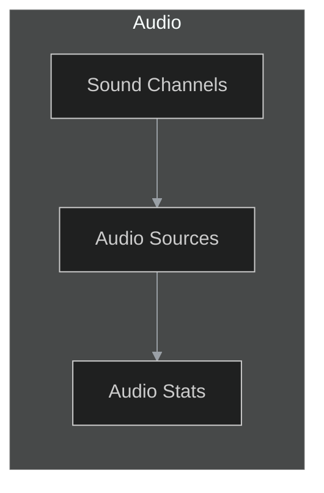
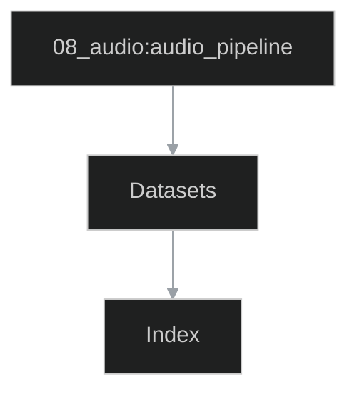
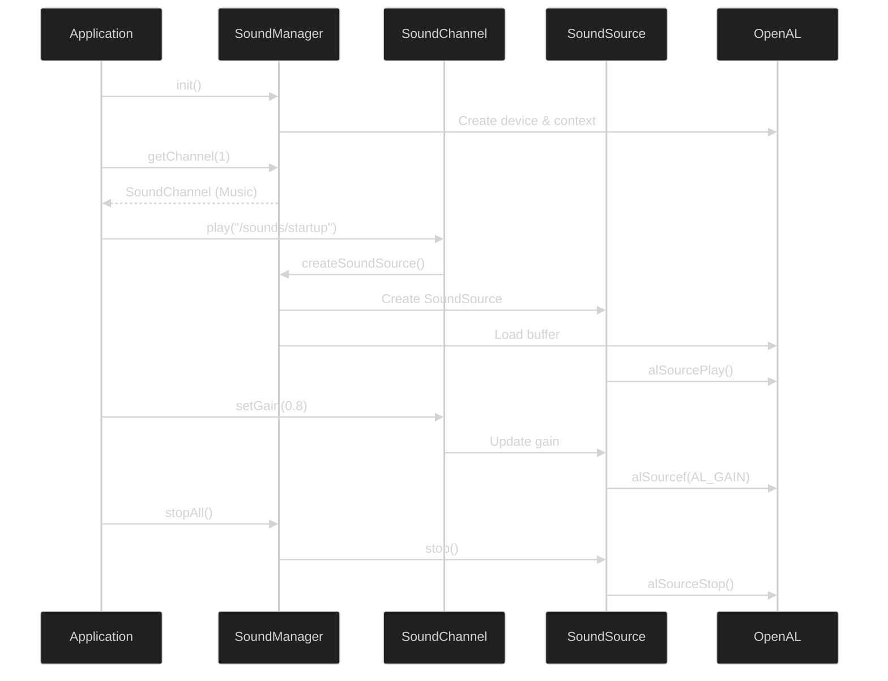
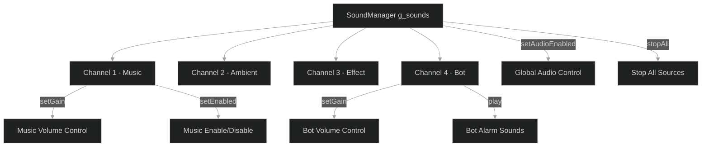
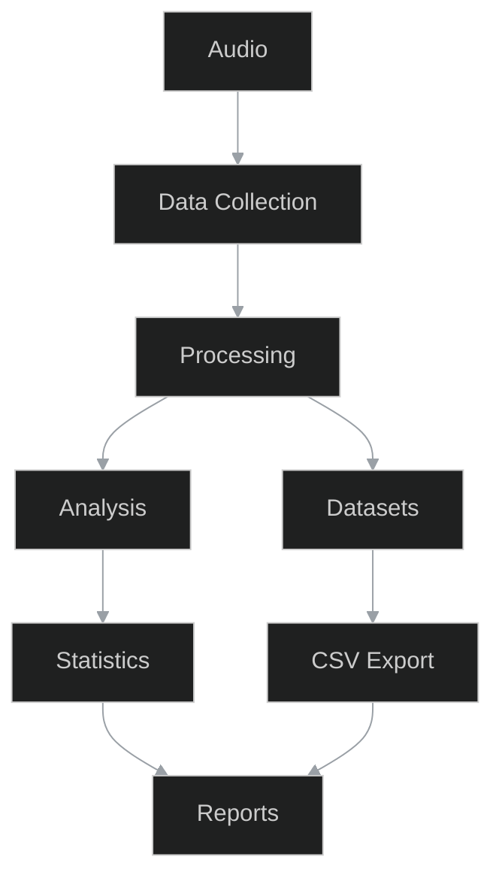
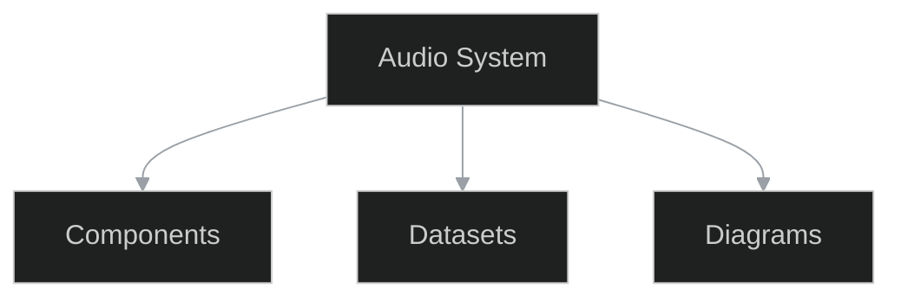
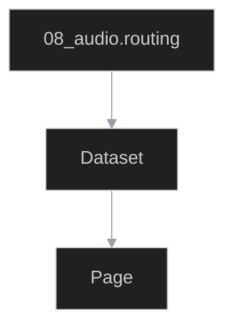

# 08_audio - Audio

```{contents} Table of contents
:depth: 2
:local:
```

## Datasets
### audio_assets
*Facet:* [`08_audio.audio_assets`](#facet-08_audio.audio_assets)

```{csv-table} audio_assets
:header-rows: 1
:file: ./datasets/audio_assets.csv
:widths: auto
```

### audio_config
*Facet:* [`08_audio.audio_config`](#facet-08_audio.audio_config)

```{csv-table} audio_config
:header-rows: 1
:file: ./datasets/audio_config.csv
:widths: auto
```

### audio_examples
*Facet:* [`08_audio.audio_examples`](#facet-08_audio.audio_examples)

```{csv-table} audio_examples
:header-rows: 1
:file: ./datasets/audio_examples.csv
:widths: auto
```

### channels
*Facet:* [`08_audio.channels`](#facet-08_audio.channels)

```{csv-table} channels
:header-rows: 1
:file: ./datasets/channels.csv
:widths: auto
```

### entities
*Facet:* [`08_audio.entities`](#facet-08_audio.entities)

```{csv-table} entities
:header-rows: 1
:file: ./datasets/entities.csv
:widths: auto
```

### events
*Facet:* [`08_audio.events`](#facet-08_audio.events)

```{csv-table} events
:header-rows: 1
:file: ./datasets/events.csv
:widths: auto
```

### summary
*Facet:* [`08_audio.summary`](#facet-08_audio.summary)

```{csv-table} summary
:header-rows: 1
:file: ./datasets/summary.csv
:widths: auto
```

## Diagrams
### architecture
*Facet:* [`08_audio.architecture`](#facet-08_audio.architecture)



### audio_pipeline
*Facet:* [`08_audio.audio_pipeline`](#facet-08_audio.audio_pipeline)



### audio_playback_flow
*Facet:* [`08_audio.audio_playback_flow`](#facet-08_audio.audio_playback_flow)



### channels_hierarchy
*Facet:* [`08_audio.channels_hierarchy`](#facet-08_audio.channels_hierarchy)



### flow
*Facet:* [`08_audio.flow`](#facet-08_audio.flow)



### overview
*Facet:* [`08_audio.overview`](#facet-08_audio.overview)



### routing
*Facet:* [`08_audio.routing`](#facet-08_audio.routing)



## Podkatalogi

```{toctree}
:maxdepth: 1
:titlesonly:
blueprints/index
```

## Crosslinks

- **syncs_with** → `10_game_runtime.tick` (evidence: `docs/authoring/10_game_runtime/datasets/ticks.csv`)
- **uses** → `06_assets.assets_index` (evidence: `docs/authoring/06_assets/datasets/assets_index.csv`)

## Appendix / Facets

(facet-08_audio.architecture)=
### Facet: `08_audio.architecture`
Type: diagram

(facet-08_audio.audio_assets)=
### Facet: `08_audio.audio_assets`
Type: dataset

(facet-08_audio.audio_config)=
### Facet: `08_audio.audio_config`
Type: dataset

(facet-08_audio.audio_examples)=
### Facet: `08_audio.audio_examples`
Type: dataset

(facet-08_audio.audio_pipeline)=
### Facet: `08_audio.audio_pipeline`
Type: diagram

(facet-08_audio.audio_playback_flow)=
### Facet: `08_audio.audio_playback_flow`
Type: diagram

(facet-08_audio.channels)=
### Facet: `08_audio.channels`
Type: dataset

(facet-08_audio.channels_hierarchy)=
### Facet: `08_audio.channels_hierarchy`
Type: diagram

(facet-08_audio.entities)=
### Facet: `08_audio.entities`
Type: dataset

(facet-08_audio.events)=
### Facet: `08_audio.events`
Type: dataset

(facet-08_audio.flow)=
### Facet: `08_audio.flow`
Type: diagram

(facet-08_audio.overview)=
### Facet: `08_audio.overview`
Type: diagram

(facet-08_audio.routing)=
### Facet: `08_audio.routing`
Type: diagram

(facet-08_audio.summary)=
### Facet: `08_audio.summary`
Type: dataset

