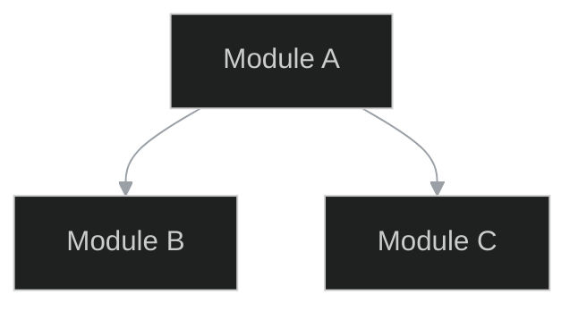
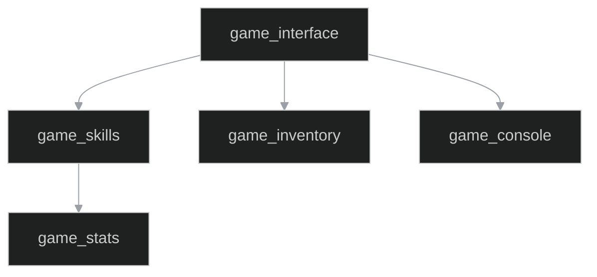
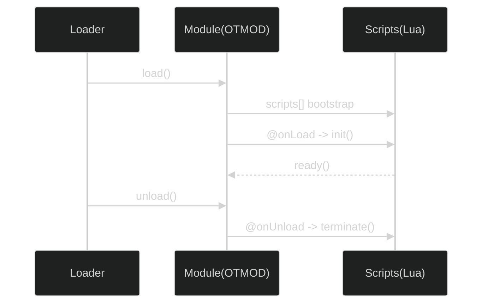
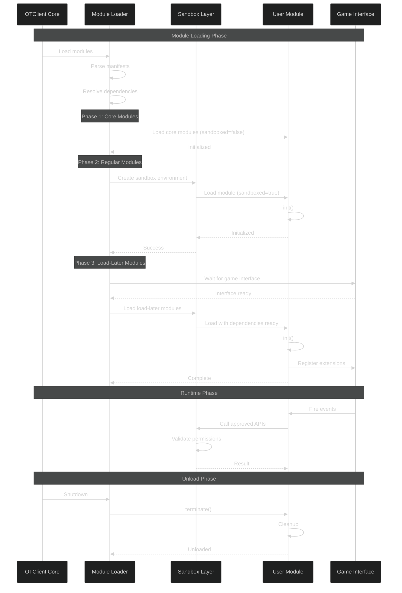
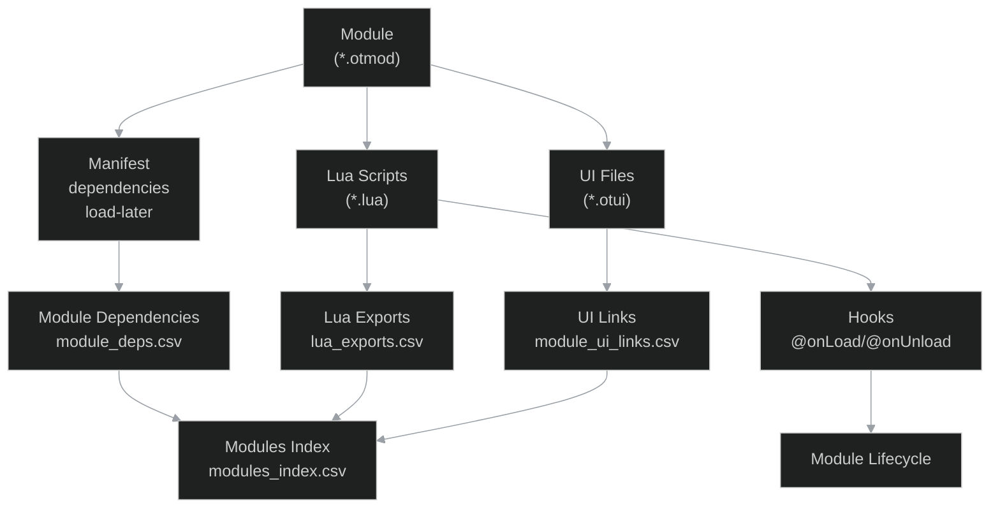
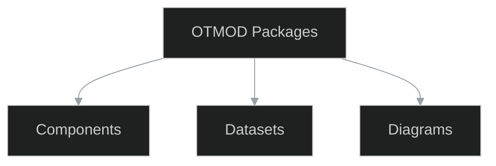

# 12_otmod - Otmod

```{contents} Table of contents
:depth: 2
:local:
```

## Datasets
### lua_exports
*Facet:* [`12_otmod.lua_exports`](#facet-12_otmod.lua_exports)

```{csv-table} lua_exports
:header-rows: 1
:file: ./datasets/lua_exports.csv
:widths: auto
```

### module_deps
*Facet:* [`12_otmod.module_deps`](#facet-12_otmod.module_deps)

```{csv-table} module_deps
:header-rows: 1
:file: ./datasets/module_deps.csv
:widths: auto
```

### module_hooks
*Facet:* [`12_otmod.module_hooks`](#facet-12_otmod.module_hooks)

```{csv-table} module_hooks
:header-rows: 1
:file: ./datasets/module_hooks.csv
:widths: auto
```

### module_scripts
*Facet:* [`12_otmod.module_scripts`](#facet-12_otmod.module_scripts)

```{csv-table} module_scripts
:header-rows: 1
:file: ./datasets/module_scripts.csv
:widths: auto
```

### module_ui_links
*Facet:* [`12_otmod.module_ui_links`](#facet-12_otmod.module_ui_links)

```{csv-table} module_ui_links
:header-rows: 1
:file: ./datasets/module_ui_links.csv
:widths: auto
```

### modules_index
*Facet:* [`12_otmod.modules_index`](#facet-12_otmod.modules_index)

```{csv-table} modules_index
:header-rows: 1
:file: ./datasets/modules_index.csv
:widths: auto
```

### otmod_packages
*Facet:* [`12_otmod.otmod_packages`](#facet-12_otmod.otmod_packages)

```{csv-table} otmod_packages
:header-rows: 1
:file: ./datasets/otmod_packages.csv
:widths: auto
```

### summary
*Facet:* [`12_otmod.summary`](#facet-12_otmod.summary)

```{csv-table} summary
:header-rows: 1
:file: ./datasets/summary.csv
:widths: auto
```

## Diagrams
### deps
*Facet:* [`12_otmod.deps`](#facet-12_otmod.deps)



### deps_graph
*Facet:* [`12_otmod.deps_graph`](#facet-12_otmod.deps_graph)



### lifecycle
*Facet:* [`12_otmod.lifecycle`](#facet-12_otmod.lifecycle)



### module_lifecycle
*Facet:* [`12_otmod.module_lifecycle`](#facet-12_otmod.module_lifecycle)



### modules_deps
*Facet:* [`12_otmod.modules_deps`](#facet-12_otmod.modules_deps)



### overview
*Facet:* [`12_otmod.overview`](#facet-12_otmod.overview)



## Podkatalogi

```{toctree}
:maxdepth: 1
:titlesonly:
blueprints/index
```


## Appendix / Facets

(facet-12_otmod.deps)=
### Facet: `12_otmod.deps`
Type: diagram

(facet-12_otmod.deps_graph)=
### Facet: `12_otmod.deps_graph`
Type: diagram

(facet-12_otmod.lifecycle)=
### Facet: `12_otmod.lifecycle`
Type: diagram

(facet-12_otmod.lua_exports)=
### Facet: `12_otmod.lua_exports`
Type: dataset

(facet-12_otmod.module_deps)=
### Facet: `12_otmod.module_deps`
Type: dataset

(facet-12_otmod.module_hooks)=
### Facet: `12_otmod.module_hooks`
Type: dataset

(facet-12_otmod.module_lifecycle)=
### Facet: `12_otmod.module_lifecycle`
Type: diagram

(facet-12_otmod.module_scripts)=
### Facet: `12_otmod.module_scripts`
Type: dataset

(facet-12_otmod.module_ui_links)=
### Facet: `12_otmod.module_ui_links`
Type: dataset

(facet-12_otmod.modules_deps)=
### Facet: `12_otmod.modules_deps`
Type: diagram

(facet-12_otmod.modules_index)=
### Facet: `12_otmod.modules_index`
Type: dataset

(facet-12_otmod.otmod_packages)=
### Facet: `12_otmod.otmod_packages`
Type: dataset

(facet-12_otmod.overview)=
### Facet: `12_otmod.overview`
Type: diagram

(facet-12_otmod.summary)=
### Facet: `12_otmod.summary`
Type: dataset

