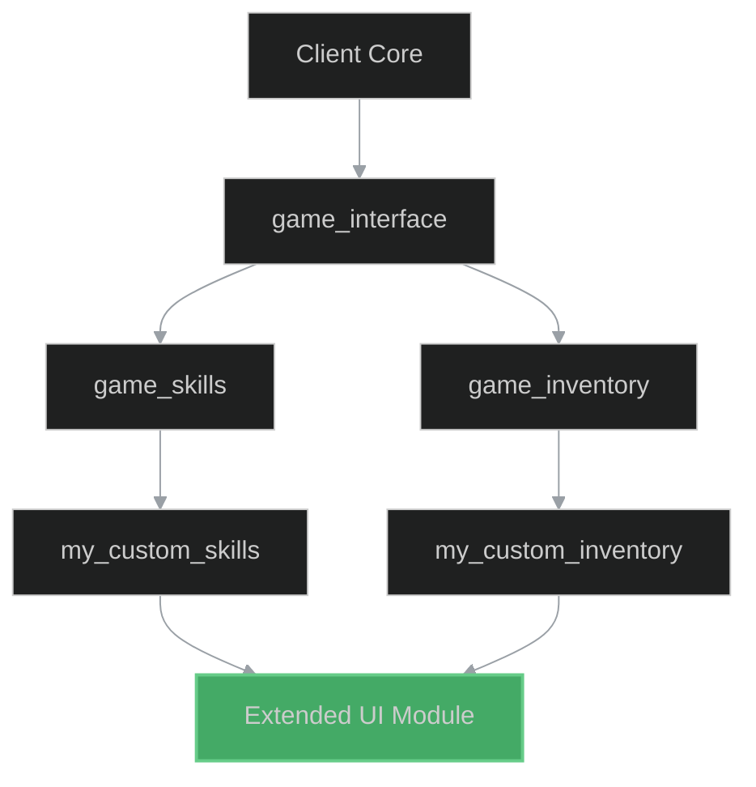

# Load-Later Patterns in OTMOD

## Overview

The **load-later** mechanism in OTClient v8 allows modules to defer their initialization until after all other modules have been loaded. This is crucial for modules that depend on game state or other modules being fully initialized.

## When to Use Load-Later

Use `load-later: true` in your module manifest when:

1. **Game State Dependencies**: Your module requires the game interface or character to be fully loaded
2. **Cross-Module Dependencies**: Your module extends functionality from multiple other modules
3. **UI Modifications**: Your module modifies existing UI elements that must be created first
4. **Configuration Loading**: Your module needs to read configuration from other modules

## Manifest Configuration

Add the `load-later` directive to your `.otmod` file:

```lua
Module
  name: my_custom_module
  description: Custom functionality that extends game interface
  author: Your Name
  version: 1.0
  
  // Mark as load-later
  load-later: true
  
  // Dependencies that must load first
  @onLoad: init.lua
  @onUnload: cleanup.lua
end
```

## Load Order Example

The module loading process follows this sequence:

1. **Phase 1 - Core Modules**: Basic infrastructure (game, client, corelib)
2. **Phase 2 - Regular Modules**: Standard functionality modules
3. **Phase 3 - Load-Later Modules**: Deferred initialization modules

### Dependency Chain



## Implementation Patterns

### Pattern 1: Game Interface Extension

```lua
-- modules/my_extension/init.lua

local myExtension = {}

function init()
  -- Check if game interface is loaded
  if not g_game or not g_game.isOnline() then
    -- Register a callback for when game connects
    connect(g_game, {
      onGameStart = onGameStart
    })
    return
  end
  
  -- Interface already loaded, initialize immediately
  onGameStart()
end

function onGameStart()
  -- Safe to extend UI and register events
  local gameInterface = modules.game_interface
  if gameInterface then
    -- Extend functionality
    local panel = gameInterface.getLeftPanel()
    if panel then
      myExtension.addCustomButton(panel)
    end
  end
end

function myExtension.addCustomButton(panel)
  local button = g_ui.createWidget('MyCustomButton', panel)
  button.onClick = function()
    -- Custom functionality
  end
  return button
end
```

### Pattern 2: Soft Dependencies

Use `load-later` with soft dependencies for optional module integration:

```lua
-- Check if optional module is loaded
function init()
  local botModule = g_modules.getModule('game_bot')
  
  if botModule and botModule:isLoaded() then
    -- Integrate with bot module
    registerBotExtensions()
  else
    -- Run without bot integration
    print("Bot module not available, running in basic mode")
  end
  
  initCore()
end

function registerBotExtensions()
  -- Add custom bot functionality
  if Bot and Bot.registerExtension then
    Bot.registerExtension('myExtension', myExtensionAPI)
  end
end
```

### Pattern 3: Configuration Override

```lua
-- Override configuration from other modules
function init()
  -- Wait for config module
  addEvent(function()
    local config = g_configs.getNode('game_interface')
    if config then
      -- Override settings
      config.showExtraPanel = true
      config.customLayout = 'extended'
    end
    
    -- Initialize with modified config
    initWithConfig(config)
  end)
end
```

## Best Practices

### 1. Explicit Dependency Declaration

Always declare dependencies even if using load-later:

```lua
Module
  name: my_module
  load-later: true
  
  // Explicit dependencies
  dependency: game_interface
  dependency: game_skills
end
```

### 2. Graceful Degradation

Handle missing dependencies gracefully:

```lua
function init()
  local hasGameInterface = modules.game_interface ~= nil
  local hasBot = modules.game_bot ~= nil
  
  if not hasGameInterface then
    g_logger.warning("game_interface not loaded, disabling UI extensions")
  end
  
  initCore(hasGameInterface, hasBot)
end
```

### 3. Event-Driven Initialization

Use events instead of polling:

```lua
-- BAD: Polling approach
function init()
  addEvent(function()
    if g_game.isOnline() then
      onReady()
    else
      init() -- Recursive polling (bad!)
    end
  end, 100)
end

-- GOOD: Event-driven approach
function init()
  if g_game.isOnline() then
    onReady()
  else
    connect(g_game, { onGameStart = onReady })
  end
end
```

### 4. Cleanup on Unload

Always clean up registered callbacks:

```lua
local connections = {}

function init()
  connections.gameStart = connect(g_game, {
    onGameStart = onGameStart
  })
end

function terminate()
  for _, connection in pairs(connections) do
    disconnect(connection)
  end
  connections = {}
end
```

## Common Pitfalls

### Circular Dependencies

Avoid circular dependencies even with load-later:

```lua
-- BAD: Module A depends on B, B depends on A with load-later
-- Module A:
dependency: module_b

-- Module B:
dependency: module_a
load-later: true

-- This will cause loading issues!
```

### Assuming Load Order

Never assume specific load order among load-later modules:

```lua
-- BAD: Assuming module_x loads before module_y
function init()
  local dataFromX = modules.module_x.getData() -- May be nil!
  processData(dataFromX)
end

-- GOOD: Check availability
function init()
  if modules.module_x and modules.module_x.getData then
    local data = modules.module_x.getData()
    processData(data)
  end
end
```

## Performance Considerations

Load-later modules are initialized after the main UI is rendered, which:

- **Pros**: Faster initial load time, better user experience
- **Cons**: Slight delay before extended functionality is available

Best practices:
- Keep load-later init functions lightweight
- Defer heavy operations with `scheduleEvent()`
- Show loading indicators if initialization takes > 100ms

## See Also

<!-- - [Module Dependencies](./module_dependencies.md) TODO: Create this document -->
<!-- - [Sandbox Security](./sandbox_security.md) TODO: Create this document -->
<!-- - [OTMOD Manifest Reference](./blueprints/otmod_template.md) TODO: Create this document -->
- [Datasets: module_deps.csv](./datasets/module_deps.csv)

## Diagram: module_dependencies


