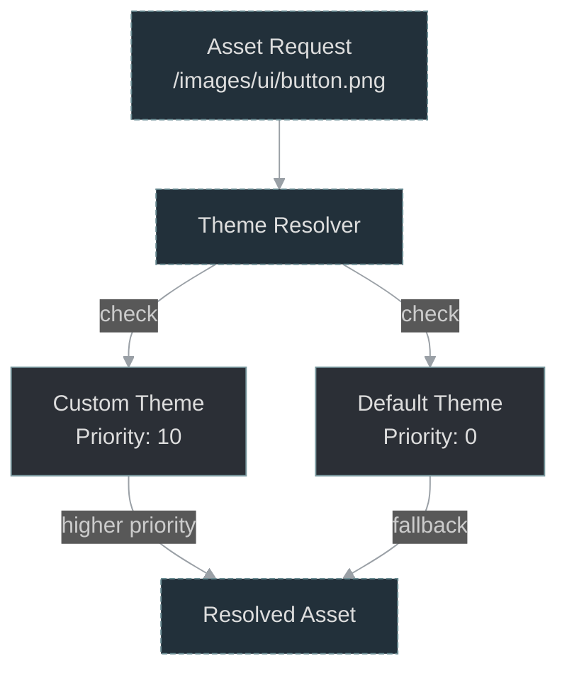
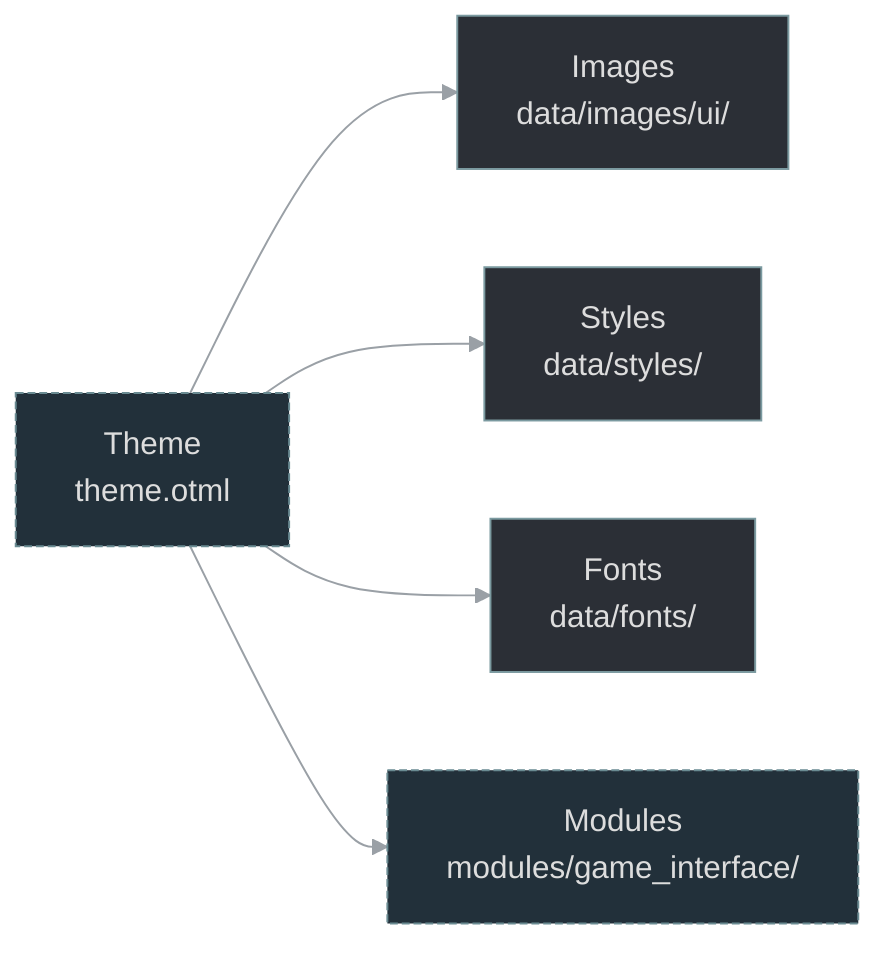
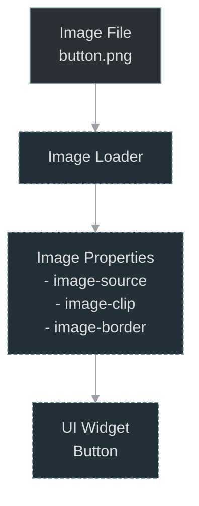

# Theme Creation Tutorial

## Overview

OTClient v8 supports custom themes (layouts) that override default UI assets and styles. This tutorial covers creating, testing, and distributing custom themes.

## Theme Structure

```
layouts/
└── my_custom_theme/
    ├── data/
    │   ├── images/
    │   │   └── ui/
    │   │       ├── button.png
    │   │       └── panel.png
    │   ├── styles/
    │   │   └── buttons.otui
    │   └── fonts/
    │       └── custom_font.ttf
    ├── modules/
    │   └── game_interface/
    │       └── custom_panel.otui
    └── theme.otml
```

## Theme Manifest

### theme.otml

```yaml
Theme
  name: My Custom Theme
  description: A dark theme with custom UI elements
  author: Your Name
  version: 1.0
  
  // Override priority (higher = more priority)
  priority: 10
  
  // Assets to override
  overrides:
    data/images/ui/button.png: data/images/ui/button.png
    data/images/ui/panel.png: data/images/ui/panel.png
    data/styles/buttons.otui: data/styles/buttons.otui
```

## Creating Theme Assets

### 1. Button Customization

```lua
-- data/styles/buttons.otui

Button < UIButton
  size: 106 24
  text-offset: 0 0
  font: verdana-11px-antialised
  
  image-source: /images/ui/button.png
  image-clip: 0 0 22 23
  image-border: 3
  
  $hover:
    image-clip: 0 23 22 23
  
  $pressed:
    image-clip: 0 46 22 23
  
  $disabled:
    image-clip: 0 69 22 23
    color: #888888
```

### 2. Panel Styling

```lua
-- Custom panel style
GamePanel < Panel
  image-source: /images/ui/panel.png
  image-border: 8
  padding: 8
  
  background-color: #1a1a1aaa
  border-width: 1
  border-color: #333333
```

### 3. Color Scheme

```lua
-- data/styles/colors.otui

$color-primary: #3498db
$color-secondary: #2ecc71
$color-danger: #e74c3c
$color-warning: #f39c12
$color-background: #1a1a1a
$color-text: #ecf0f1

CustomButton < Button
  background-color: $color-primary
  
  $hover:
    background-color: #2980b9
  
  $pressed:
    background-color: #2471a3
```

## Image Property Reference

### image-source

Path to image file:

```lua
image-source: /images/ui/button.png
```

### image-clip

Define region to use from image (9-patch):

```lua
// Syntax: x y width height
image-clip: 0 0 22 23  // Top-left corner
image-clip: 0 23 22 23 // Hover state (below normal)
```

### image-border

Border size for 9-patch scaling:

```lua
image-border: 3  // All sides
image-border: 3 5  // Horizontal, Vertical
image-border: 3 5 7 9  // Top, Right, Bottom, Left
```

### image-scale

Scaling mode:

```lua
image-scale: 2  // 2x scale
image-scale: 0.5  // Half size
```

### image-origin

Anchor point for positioning:

```lua
image-origin: center  // Center anchor
image-origin: top-left
image-origin: bottom-right
```

## Advanced Techniques

### State-Based Styling

```lua
StatefulButton < Button
  // Normal state
  image-clip: 0 0 32 32
  
  // Hover
  $hover:
    image-clip: 32 0 32 32
  
  // Pressed
  $pressed:
    image-clip: 64 0 32 32
  
  // Disabled
  $disabled:
    image-clip: 96 0 32 32
    opacity: 0.5
  
  // Selected
  $checked:
    image-clip: 128 0 32 32
  
  // Focus
  $focus:
    border-color: #ffff00
    border-width: 2
```

### Sprite Sheets

Use sprite sheets for efficient loading:

```lua
// Single sprite sheet: icons.png (256x256)
// Contains 16x16 icons in 16x16 grid

Icon < UIImage
  size: 16 16
  image-source: /images/ui/icons.png
  
  // Specific icons
  &icon-sword:
    image-clip: 0 0 16 16
  
  &icon-shield:
    image-clip: 16 0 16 16
  
  &icon-potion:
    image-clip: 32 0 16 16
```

### Dynamic Theming

```lua
-- Theme switching in Lua

function setTheme(themeName)
  local theme = g_resources.loadTheme(themeName)
  
  if theme then
    g_ui.applyTheme(theme)
    g_logger.info("Theme changed to: " .. themeName)
  else
    g_logger.error("Theme not found: " .. themeName)
  end
end

// Usage
setTheme("dark")
setTheme("light")
setTheme("custom")
```

## Testing Themes

### Enable Theme

```lua
-- modules/client/config.lua

// Specify theme directory
g_resources.addSearchPath("layouts/my_custom_theme", true)

// Load theme
local theme = g_resources.loadTheme("layouts/my_custom_theme/theme.otml")
if theme then
  g_ui.applyTheme(theme)
end
```

### Hot Reload

Enable hot reload for development:

```lua
-- Enable theme hot reload
g_resources.enableThemeHotReload(true)

// Theme will reload automatically when files change
```

### Preview Mode

```lua
-- modules/client_options/options.lua

function previewTheme(themeName)
  -- Save current theme
  local original = g_ui.getCurrentTheme()
  
  -- Load preview
  setTheme(themeName)
  
  -- Schedule restore after 5 seconds
  scheduleEvent(function()
    setTheme(original)
  end, 5000)
end
```

## Distribution

### Package Structure

```bash
my_custom_theme.zip
├── theme.otml
├── README.md
├── LICENSE
└── data/
    ├── images/
    ├── styles/
    └── fonts/
```

### Installation Instructions

```markdown
## Installation

1. Download `my_custom_theme.zip`
2. Extract to `layouts/` directory
3. Open OTClient
4. Go to Options → Theme
5. Select "My Custom Theme"
6. Restart client
```

## Examples

### Dark Theme

```lua
-- Dark theme with blue accents

$bg-dark: #1a1a1a
$bg-medium: #2a2a2a
$bg-light: #3a3a3a
$accent: #3498db
$text: #ecf0f1

Panel
  background-color: $bg-dark
  border-color: $bg-light

Button
  background-color: $bg-medium
  
  $hover:
    background-color: $accent
```

### Minimalist Theme

```lua
-- Clean, minimal interface

Panel
  background-color: #ffffff
  border-width: 1
  border-color: #e0e0e0
  
Button
  background-color: transparent
  border-width: 1
  border-color: #333333
  
  $hover:
    background-color: #f5f5f5
```

### Retro Theme

```lua
-- Pixel art style

Panel
  image-source: /images/ui/retro_panel.png
  image-border: 4
  // Use nearest-neighbor scaling
  image-smooth: false

Font
  font: terminus-14px
  // Crisp, pixelated text
  antialias: false
```

## See Also

- [Override Resolution](./diagrams/override_resolution.mmd)
- [Layouts Overview](./index.md)
- [OTUI Reference](../04_ui/index.md)
- [Asset Management](../11_data/index.md)

## Diagram: Theme Override Resolution

<!-- mermaid-diagram: generated-by=diagram-agent v1; source_sha=3ead5ec; generated_at=2025-01-27T00:00:00Z -->

<!-- /mermaid-diagram -->

## Diagram: Theme Structure

<!-- mermaid-diagram: generated-by=diagram-agent v1; source_sha=3ead5ec; generated_at=2025-01-27T00:00:00Z -->

<!-- /mermaid-diagram -->

## Diagram: Image Properties Flow

<!-- mermaid-diagram: generated-by=diagram-agent v1; source_sha=3ead5ec; generated_at=2025-01-27T00:00:00Z -->

<!-- /mermaid-diagram -->
