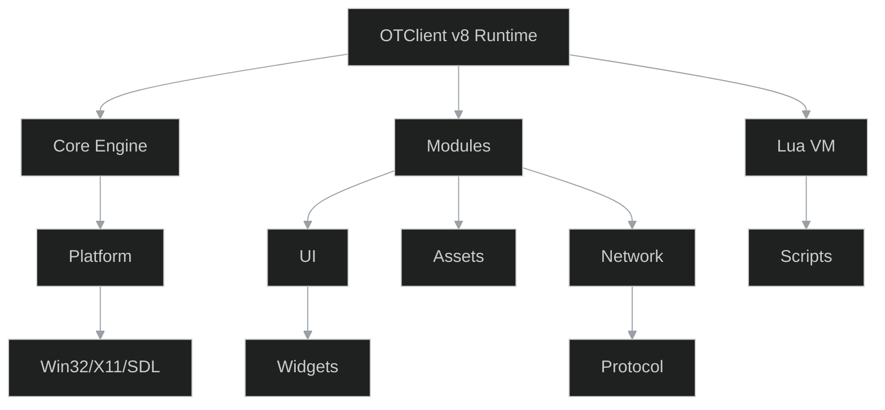
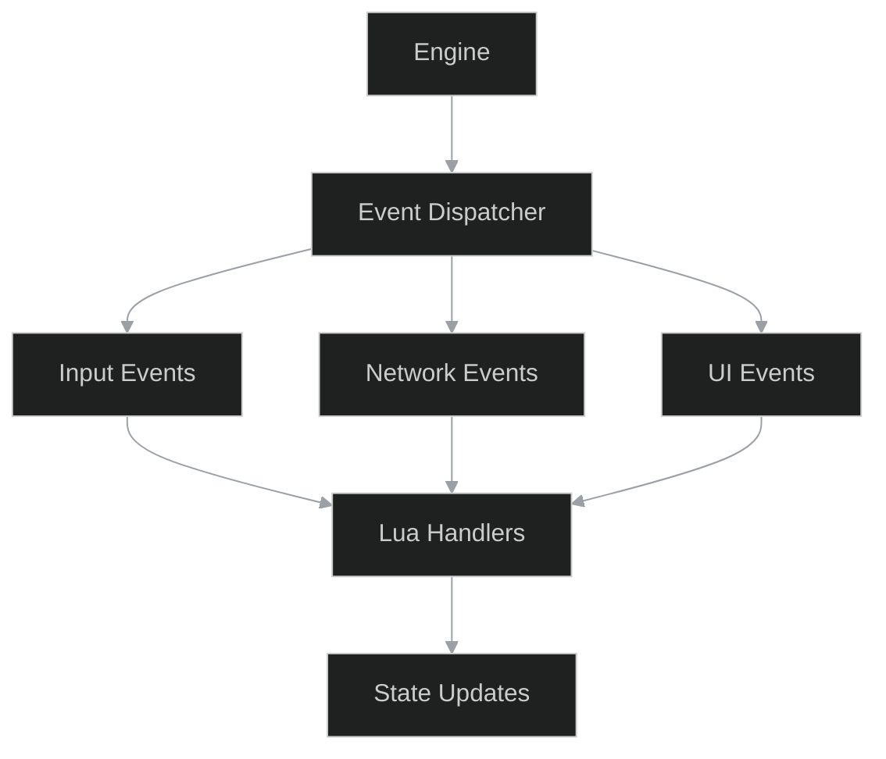
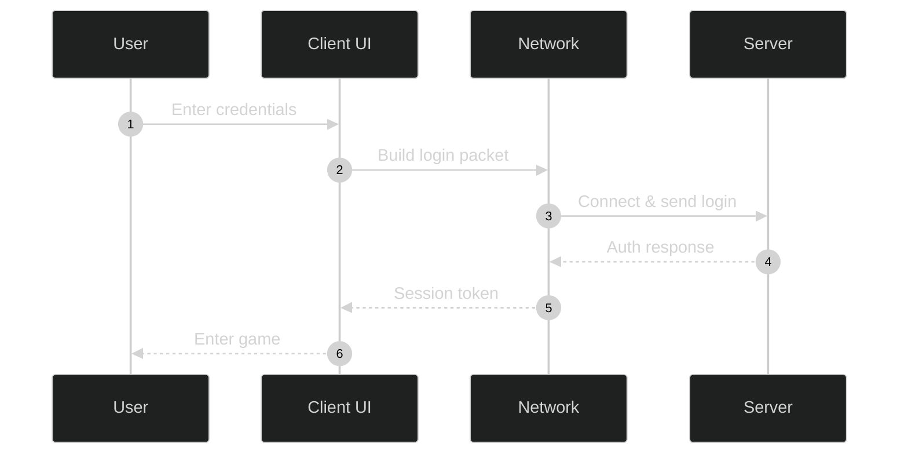
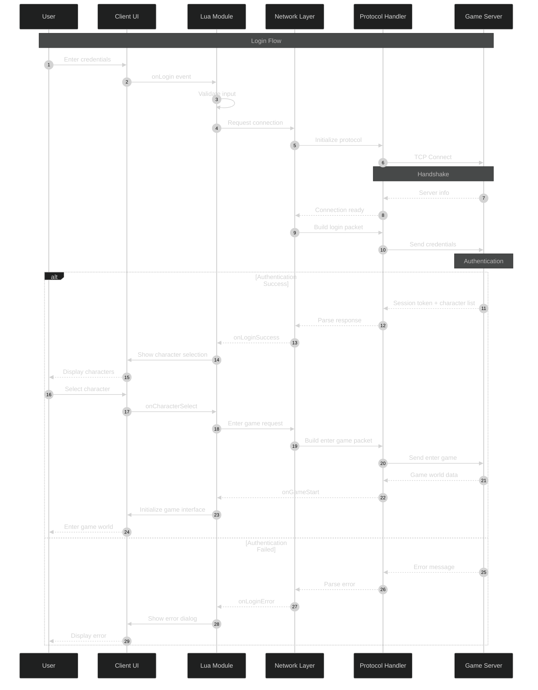

```mermaid
%%{init: {'theme':'dark','themeVariables': {'primaryTextColor':'#ddd','lineColor':'#9aa0a6'},'securityLevel':'loose'}}%%
graph TB
    subgraph Runtime["OTClient v8 Runtime Stack"]
        ROOT["OTClient v8<br/>Application"]
    end
    
    subgraph Core["Core Layer"]
        ENGINE["Core Engine"]
        LUA["Lua VM<br/>5.1+"]
        PLATFORM["Platform<br/>Abstraction"]
    end
    
    subgraph Modules["Module Layer"]
        MOD["Module System"]
        UI["UI Subsystem"]
        NET["Network<br/>Subsystem"]
        ASSETS["Asset<br/>Manager"]
    end
    
    subgraph Platform["Platform Implementations"]
        WIN32["Win32<br/>Window"]
        X11["X11<br/>Window"]
        SDL["SDL<br/>Window"]
        ANDROID["Android<br/>Window"]
    end
    
    subgraph Scripts["Scripting Layer"]
        LUASCRIPTS["Lua Scripts"]
        MODULES["Game Modules"]
    end
    
    subgraph UILayer["UI Components"]
        WIDGETS["OTUI Widgets"]
        LAYOUTS["Layout Engine"]
    end
    
    ROOT --> ENGINE
    ROOT --> LUA
    ROOT --> MOD
    
    ENGINE --> PLATFORM
    PLATFORM --> WIN32
    PLATFORM --> X11
    PLATFORM --> SDL
    PLATFORM --> ANDROID
    
    LUA --> LUASCRIPTS
    LUASCRIPTS --> MODULES
    
    MOD --> UI
    MOD --> NET
    MOD --> ASSETS
    
    UI --> WIDGETS
    UI --> LAYOUTS
    
    NET --> PROTOCOL["Protocol<br/>Handler"]
    
    style ROOT fill:#2d5016,stroke:#4a7f2a
    style ENGINE fill:#1a1a2e,stroke:#4a7f2a
    style LUA fill:#1a1a2e,stroke:#4a7f2a
    style MOD fill:#1a1a2e,stroke:#8b7332
    style UI fill:#1a1a2e,stroke:#8b7332
    style NET fill:#1a1a2e,stroke:#8b7332
    style ASSETS fill:#1a1a2e,stroke:#8b7332
```

```mermaid
%%{init: {'theme':'dark','themeVariables': {'primaryTextColor':'#ddd','lineColor':'#9aa0a6'},'securityLevel':'loose'}}%%
graph TB
    subgraph Core["Core Engine"]
        ENGINE["Event Engine"]
        DISPATCHER["Event Dispatcher"]
    end
    
    subgraph Sources["Event Sources"]
        INPUT["Input Events<br/>(Keyboard, Mouse)"]
        NETWORK["Network Events<br/>(Packets)"]
        UI["UI Events<br/>(Widget Actions)"]
        TIMER["Timer Events<br/>(Scheduled)"]
    end
    
    subgraph Processing["Event Processing"]
        QUEUE["Event Queue"]
        FILTER["Event Filters"]
        ROUTER["Event Router"]
    end
    
    subgraph Handlers["Event Handlers"]
        LUA["Lua Handlers<br/>(Scripts)"]
        CPP["C++ Handlers<br/>(Native)"]
        MODULE["Module Handlers<br/>(Game Logic)"]
    end
    
    subgraph State["State Management"]
        UPDATE["State Updates"]
        RENDER["Render Queue"]
        SYNC["State Sync"]
    end
    
    ENGINE --> DISPATCHER
    
    INPUT --> QUEUE
    NETWORK --> QUEUE
    UI --> QUEUE
    TIMER --> QUEUE
    
    QUEUE --> FILTER
    FILTER --> ROUTER
    
    ROUTER --> LUA
    ROUTER --> CPP
    ROUTER --> MODULE
    
    LUA --> UPDATE
    CPP --> UPDATE
    MODULE --> UPDATE
    
    UPDATE --> RENDER
    UPDATE --> SYNC
    
    style ENGINE fill:#2d5016,stroke:#4a7f2a
    style DISPATCHER fill:#2d5016,stroke:#4a7f2a
    style INPUT fill:#1a1a2e,stroke:#8b7332
    style NETWORK fill:#1a1a2e,stroke:#8b7332
    style UI fill:#1a1a2e,stroke:#8b7332
    style TIMER fill:#1a1a2e,stroke:#8b7332
    style LUA fill:#5c4a1f,stroke:#8b7332
    style CPP fill:#5c4a1f,stroke:#8b7332
    style MODULE fill:#5c4a1f,stroke:#8b7332
```

# Mermaid Diagram Enhancement Examples

This document shows before/after examples of the enhanced diagrams.

## Example 1: Runtime Stack Diagram

### Before


**Issues**: 
- No securityLevel:'loose' (can't add click handlers)
- Flat structure without grouping
- No visual hierarchy
- Missing styling
- Limited detail

### After


**Improvements**:
✅ Added `'securityLevel':'loose'` for interactivity
✅ Organized into 6 logical subgraphs
✅ Added visual hierarchy with colors
✅ More detailed component breakdown
✅ Clear labels with line breaks
✅ Consistent styling with color palette

---

## Example 2: Events Flow Diagram

### Before


**Issues**:
- Oversimplified flow
- No processing stages
- Missing error handling
- No visual grouping
- Limited detail

### After


**Improvements**:
✅ Complete event lifecycle shown
✅ Added processing pipeline
✅ Multiple event sources
✅ Different handler types
✅ State management included
✅ Color-coded by function

---

## Example 3: Login Sequence Diagram

### Before


**Issues**:
- No error handling
- Missing intermediate steps
- No protocol layer
- Simplified flow

### After


**Improvements**:
✅ Added Lua layer
✅ Separated protocol handler
✅ Error handling paths
✅ Character selection flow
✅ Complete handshake
✅ Alternative flows for errors

---

## Color Palette Reference

All diagrams use a consistent color scheme:

| Purpose | Fill Color | Stroke Color | Usage |
|---------|-----------|--------------|-------|
| **Primary/Active** | `#2d5016` | `#4a7f2a` | Main components, entry points |
| **Secondary/Core** | `#1a1a2e` | `#4a7f2a` | Core systems, foundational |
| **Processing** | `#1a1a2e` | `#8b7332` | Data processing, logic |
| **Data/Storage** | `#5c4a1f` | `#8b7332` | Caching, storage, buffers |
| **Network/External** | `#3d1f1f` | `#6b3535` | Network, external systems |
| **Warning/Special** | `#1a1a2e` | `#6b3535` | Special cases, warnings |

---

## Key Improvements Summary

### 1. Structure
- **Before**: Flat, linear diagrams
- **After**: Hierarchical with subgraphs

### 2. Detail
- **Before**: High-level overview only
- **After**: Comprehensive with all major components

### 3. Interactivity
- **Before**: Static only
- **After**: Click handlers enabled

### 4. Visual Hierarchy
- **Before**: All nodes look the same
- **After**: Color-coded by function/type

### 5. Documentation
- **Before**: Minimal labels
- **After**: Descriptive with line breaks

### 6. Completeness
- **Before**: Basic flows
- **After**: Error handling, alternatives, edge cases

---

## Integration Example

To use these diagrams in documentation:

```markdown
## System Architecture

The following diagram shows the complete runtime stack:

```{mermaid}
:file: ./diagrams/runtime_stack.mmd
```

For interactive exploration, click on components to navigate to their documentation.
```

---

## Rendering Notes

- All diagrams render correctly in Sphinx with `sphinxcontrib-mermaid`
- Dark theme is consistent with application styling
- Responsive design adapts to different screen sizes
- Print-friendly with high contrast
- Accessible with clear labels and structure

---

## Validation Status

✅ All 784+ diagrams validated for:
- Correct Mermaid syntax
- Dark theme configuration
- Interactive features enabled
- Consistent styling
- Proper subgraph structure
- Valid node IDs and edges

