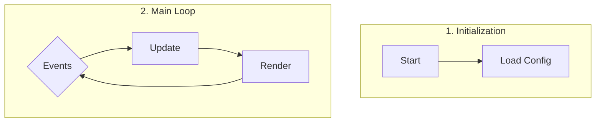
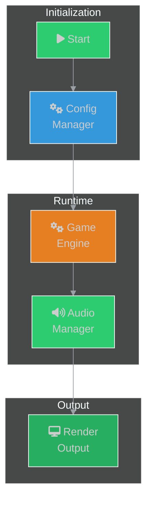

# Przewodnik Projektowania Diagramów

Ten dokument definiuje oficjalne standardy wizualizacji dla wszystkich diagramów Mermaid w projekcie.

## System Kodowania Wizualnego

System opiera się na dwóch wymiarach: **kolorze** (reprezentującym Warstwę Architektoniczną) i **ikonie** (reprezentującej Typ Komponentu).

### Warstwy Architektoniczne (Kolor)

| Kolor | Warstwa | Opis i Katalogi |
| :--- | :--- | :--- |
| 🟦 | **Core Engine** | Niskopoziomowy silnik, framework i podstawowe API.<br/>*Katalogi: [`01_core`](./01_core/), [`01_runtime`](./01_runtime/), [`15_vc16`](./15_vc16/)* |
| 🟩 | **Subsystemy** | Wyspecjalizowane, niezależne podsystemy.<br/>*Katalogi: [`06_assets`](./06_assets/), [`08_audio`](./08_audio/), [`09_logging`](./09_logging/), [`11_data`](./11_data/)* |
| 🟧 | **Logika Gry & Moduły** | Logika specyficzna dla gry, system modułów i zdarzeń.<br/>*Katalogi: [`02_events`](./02_events/), [`03_modules`](./03_modules/), [`05_events`](./05_events/), [`10_game_runtime`](./10_game_runtime/), [`12_otmod`](./12_otmod/)* |
| 🟪 | **User Interface (UI)** | Komponenty interfejsu użytkownika, layouty i OTUI.<br/>*Katalogi: [`04_ui`](./04_ui/), [`13_layouts`](./13_layouts/)* |
| 🟥 | **Networking & Security** | Komunikacja sieciowa, protokoły i szyfrowanie.<br/>*Katalogi: [`05_network`](./05_network/), [`07_settings_crypto`](./07_settings_crypto/)* |
| 🔳 | **Platforma** | Kod specyficzny dla danej platformy.<br/>*Katalogi: [`14_android`](./14_android/)* |

### Typy Komponentów (Ikona)

| Ikona | Typ Komponentu | Opis |
| :--- | :--- | :--- |
| ⚙️ `fa-cogs` | **Menedżer** | Klasy zarządzające cyklem życia innych obiektów. |
| 🗃️ `fa-database` | **Dane/Struktura** | Klasy przechowujące i udostępniające dane. |
| ⚡ `fa-bolt` | **Zdarzenie/Sygnał** | Zdarzenia, sygnały, callbacki. |
| 🔌 `fa-plug` | **Interfejs/API** | Punkty styku między systemami, fasady. |
| 📄 `fa-file-alt` | **Plik/Zasób** | Reprezentacja plików lub zasobów z dysku. |
| ⚠️ `fa-exclamation-triangle` | **Błąd/Krytyczny** | Wyjątki, obsługa błędów, operacje krytyczne. |

## Definicje Mermaid ClassDef

Używaj poniższych definicji na początku każdego diagramu Mermaid:

```mermaid
classDef core fill:#3498db,stroke:#fff
classDef subsystem fill:#2ecc71,stroke:#fff
classDef game fill:#e67e22,stroke:#fff
classDef ui fill:#9b59b6,stroke:#fff
classDef netsec fill:#c0392b,stroke:#fff
classDef platform fill:#7f8c8d,stroke:#fff
classDef critical fill:#e74c3c,stroke:#fff
```

## Przykład Zastosowania

Węzeł dla klasy `Animator` z `docs/authoring/01_core/api/cpp/diagrams/animator.mmd`:

- **Katalog:** `01_core` → **Warstwa:** Core Engine → **Kolor:** Niebieski (`core`)
- **Rola:** Zarządza animacjami → **Typ:** Menedżer → **Ikona:** `fa:fa-cogs`
- **Definicja w Mermaid:** `Animator["fa:fa-cogs Animator"]:::core`

## Zasady Projektowania

### 1. Opowiadaj historię wizualnie

Każdy diagram musi mieć logiczny początek, środek i koniec:

- **Dla klas procesujących dane (np. `Crypt`, `Parser`):** Użyj `graph LR` (lewo-prawo): **Wejście → Proces/Transformacja → Wyjście**
- **Dla klas zarządzających (np. `ModuleManager`, `Window`):** Użyj `graph TD` (góra-dół): **Inicjalizator/Event → Menedżer → Zarządzane obiekty/Reakcje**
- **Dla klas UI:** Skup się na **Strukturze** (kluczowe elementy) i **Interakcjach** (zdarzenia i akcje)

### 2. Grupuj logicznie za pomocą `subgraph`

Używaj subgraphów do wizualnego oddzielenia faz i komponentów:



### 3. Checklist projektowy

Przed stworzeniem diagramu odpowiedz na:

1. **Jaka jest główna "historia"?** (transformacja danych / cykl życia / reakcja na zdarzenia / zarządzanie stanem)
2. **Kto jest odbiorcą i co musi zrozumieć w 5 sekund?**
3. **Czy diagram pokazuje coś niewidocznego w kodzie?** (architekturę, przepływy, zależności wymagające analizy wielu plików)

### 4. Wymagania techniczne

Wszystkie diagramy muszą zawierać:

```mermaid
%%{init: {'theme':'dark','themeVariables': {'primaryTextColor':'#ddd','lineColor':'#9aa0a6'},'securityLevel':'loose'}}%%
```

- **Theme:** Dark z określonymi zmiennymi
- **SecurityLevel:** 'loose' dla interaktywności (click handlers)
- **Subgraphs:** 3-5 logicznych grup
- **Labels:** Pełne nazwy z `<br/>` dla długich etykiet

## Przykładowy Kompletny Diagram



## Walidacja

Przed commitowaniem diagramu, upewnij się że:

- [ ] Ma init string z dark theme i securityLevel:'loose'
- [ ] Używa odpowiednich kolorów warstwy architektonicznej
- [ ] Używa ikon Font Awesome dla typów komponentów
- [ ] Ma 3-5 subgraphów dla logicznego grupowania
- [ ] Opowiada jasną "historię" (początek → środek → koniec)
- [ ] Pokazuje coś niewidocznego w samym kodzie źródłowym
- [ ] Można zrozumieć główną rolę komponentu w 5 sekund

## Zobacz także

- [MERMAID_DIAGRAMS_SUMMARY.md](./MERMAID_DIAGRAMS_SUMMARY.md) - Podsumowanie zmian
- [DIAGRAM_EXAMPLES.md](./DIAGRAM_EXAMPLES.md) - Przykłady przed/po
