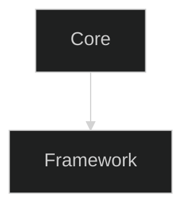

# Authoring Pipeline Documentation

## Overview

This directory contains the **Authoring-first** documentation pipeline for OTClient v8, with complete artifacts for chapters 01-10. All datasets, diagrams, and MyST pages are generated from source metadata.

## Directory Structure

```
docs/authoring/
├── _sources/           # Source markdown files with frontmatter metadata
│   └── chapter_*.md    # 10 chapter source files
├── _instructions/      # Domain-specific instructions for agents
│   ├── 01-cpp-api.instructions.md
│   ├── 02-ui-lua.instructions.md
│   └── ...
├── _data/              # Cross-reference and metadata
│   ├── xref.csv        # Cross-reference edges (27 total)
│   └── xref.json       # JSON format of xrefs
├── analytics/          # Pipeline statistics and reports
│   ├── index.md        # Analytics overview
│   └── chapter_stats.csv
├── qa/                 # Quality assurance reports
│   ├── index.md        # QA overview
│   └── *.csv          # Detailed issue reports
├── 01_core/           # Chapter directories (01-10)
│   ├── datasets/      # CSV datasets
│   ├── diagrams/      # Mermaid diagrams (.mmd)
│   └── index.md       # Chapter landing page (MyST)
├── 02_events/
├── ... (03-10)
└── index.md           # Main authoring index
```

## Chapters

| Chapter | Title | Datasets | Diagrams | XRefs |
|---------|-------|----------|----------|-------|
| 01_core | Core C++ API | 6 | 2 | 4 |
| 02_events | Event System | 4 | 2 | 3 |
| 03_modules | Lua Modules | 3 | 1 | 2 |
| 04_ui | UI Widgets | 4 | 2 | 2 |
| 05_network | Network Protocol | 4 | 1 | 2 |
| 06_assets | Assets Pipeline | 4 | 1 | 2 |
| 07_settings_crypto | Settings & Crypto | 4 | 1 | 2 |
| 08_audio | Audio System | 4 | 1 | 2 |
| 09_logging | Logging System | 4 | 1 | 2 |
| 10_game_runtime | Game Runtime | 4 | 1 | 2 |

**Total:** 40 datasets, 13 diagrams, 27 cross-references

## Pipeline Scripts

### 1. `scripts/generate_authoring_pipeline.py`

Main pipeline generator that processes all chapters from `_sources/` and generates:
- CSV datasets from frontmatter metadata
- Mermaid diagram stubs
- MyST chapter pages with embedded content
- Cross-reference data (CSV + JSON)
- Analytics reports

**Usage:**
```bash
python scripts/generate_authoring_pipeline.py
```

**Features:**
- ✅ UTF-8 encoding with LF line endings
- ✅ Automatic CSV header generation from frontmatter
- ✅ Mermaid init blocks for dark/light theme
- ✅ Facet anchors for cross-references
- ✅ Sample CSVs for files >2MB
- ✅ Analytics and coverage metrics

### 2. `scripts/qa_authoring_checker.py`

Quality assurance checker that validates:
- CSV headers match frontmatter specifications
- Mermaid diagrams have proper init blocks
- Facet anchors are present in index.md
- Index.md structure (sections, frontmatter)
- Cross-reference evidence files exist

**Usage:**
```bash
python scripts/qa_authoring_checker.py
```

**Output:** Reports in `docs/authoring/qa/`

### 3. `scripts/fix_mermaid_init.py`

Utility to add proper init blocks to existing Mermaid diagrams.

**Usage:**
```bash
python scripts/fix_mermaid_init.py
```

### 4. `scripts/build_authoring_pages.py`

Legacy script (kept for compatibility) that generates basic index pages.

## Frontmatter Schema

Each chapter source file in `_sources/` uses YAML frontmatter:

```yaml
---
chapter: "01_core"
slug: "01_core"
title: "Core C++ API"
status: "agent_ready"
artifacts:
  datasets:
    - id: "summary"
      file: "summary.csv"
      headers: ["metric", "value", "note"]
      facet: "01_core.summary"
  diagrams:
    - id: "architecture"
      file: "architecture.mmd"
      facet: "01_core.architecture"
xrefs:
  - to: "03_modules.lua_exports"
    type: "uses"
    evidence: "docs/authoring/03_modules/datasets/lua_exports.csv"
tags: ["cpp", "api", "core"]
---
```

## Facet System

**Facets** are stable identifiers for cross-referencing between chapters:

- Format: `<chapter>.<item>` (e.g., `01_core.summary`)
- Each dataset and diagram has a facet ID
- Facets are anchored in index.md: `(facet-01_core.summary)=`
- Used in xrefs to link related content

## MyST Syntax

Chapter pages use MyST (Markedly Structured Text) extensions:

### CSV Tables
```markdown
### summary
*Facet:* [`01_core.summary`](#facet-01_core.summary)

```{warning}
Missing CSV file: `./datasets/summary.csv`

Either add the dataset or update the directive.
```
```

### Mermaid Diagrams
```markdown
### architecture
*Facet:* [`01_core.architecture`](#facet-01_core.architecture)


```

### Grid Layouts
```markdown
:::{grid} 1 1 2 3
:gutter: 2

:::{grid-item-card} Chapter Title
:link: chapter/index
:link-type: doc
:shadow: md
Description text.
:::

:::
```

## Cross-References

Cross-references track relationships between chapters:

```csv
from_chapter,from_facet,to_chapter,to_facet,type,evidence_path,note
01_core,01_core,03_modules,03_modules.lua_exports,uses,docs/authoring/03_modules/datasets/lua_exports.csv,
```

**Relationship Types:**
- `uses` - Chapter uses functionality from another
- `emits` - Emits events/signals
- `handles` / `handled_by` - Handles events
- `renders` - Renders UI components
- `logs` - Writes to logging system

## Analytics

The `analytics/` directory contains:

- **summary.md** - Overall pipeline statistics
- **chapter_stats.csv** - Per-chapter breakdown
- Coverage metrics (datasets, diagrams, xrefs)

View at: [analytics/index.md](analytics/index.md)

## QA Checks

The `qa/`