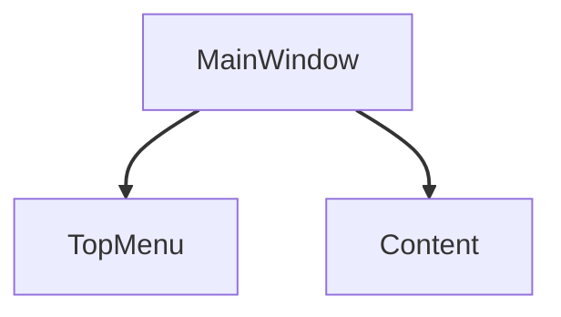

---
title: 04_ui — UI + Lua (OTUI, widoki, snippety)
owner: docs/authoring
inputs:
  - źródła: layouts/**/*{otui,otml,txt}, modules/**/*.lua, src/**/*.lua
  - zależności: brak (regex/heurystyki)
outputs:
  - pliki_md: docs/authoring/04_ui/otui/*.md + docs/authoring/04_ui/index.md
render:
  - myst: grids, tab-set, code-blocks (lua/otui), admonitions, mermaid
  - otui lexer: `otui` (mapowane na INI w conf.py)
rules:
  - idempotent: czyść docs/authoring/04_ui/otui przed generacją
  - 2-kolumnowy layout: kod vs diagram
acceptance:
  - index.md z kartami do grup ekranów i ToC
  - dla każdego ekranu: tabs (Lua/OTUI), mermaid tree, klikane węzły
---

## Zadanie
1) Z `layouts/**` wylistuj widżety i ich drzewo → renderuj **Mermaid graph/mindmap**.
2) Z Lua wyciągnij snippety użycia (heurystyki `on[A-Z]`, `UI.`, `g_ui.`).
3) Dla każdego ekranu wygeneruj `docs/authoring/04_ui/otui/<nazwa>.md`:
:::{grid} 1 1 2 2
:gutter: 2

:::{grid-item}
```{tab-set}
:sync-group: ui-snips

```{tab-item} Lua
```lua
-- przykładowy snippet (auto)
UI.createWindow("MainWindow")
```
```

```{tab-item} OTUI
```otui
MainWindow
  id: mainWindow
  anchors.fill: parent
```
```
:::

:::{grid-item}

:::

:::
4) Landing `docs/authoring/04_ui/index.md`:
   - karty do grup ekranów, ```{{toctree}}``` do `otui/*`.
:::{admonition} Wskazówka: jakość diagramów
:class: tip
- Używamy `sphinxcontrib-mermaid` + `docs/_static/custom-dark-mermaid.css`, aby strzałki i etykiety były czytelne w dark/light mode.
- Węzły mają linki (`click <id> "<rel-url>" "otwórz"`), co poprawia nawigację w dokumentacji.
- Dla dużych diagramów użyj `:class: dropdown` aby były zwijane.
:::
