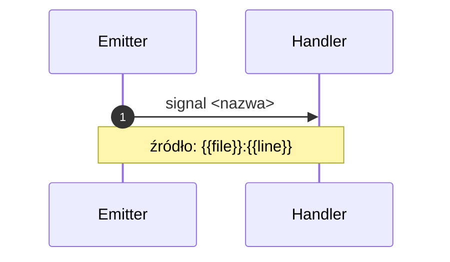

---
title: 02_events — emitery i subskrybenci
owner: docs/authoring
inputs:
  - źródła: src/**/*.{h,hpp,cpp}, modules/**/*.lua
outputs:
  - md: docs/authoring/02_events/index.md
  - csv: docs/authoring/02_events/datasets/events.csv
  - diagrams: docs/authoring/02_events/diagrams/*.mmd
render:
  - myst: {csv-table}, mermaid (sequence), admonitions
rules:
  - idempotent: czyść katalog docelowy
acceptance:
  - sequence diagrams per event, ToC osadzony
---

## Kolumny CSV
`emitter,module,signal,handler,location`

## Szablon diagramu

:::{admonition} Wskazówka: jakość diagramów
:class: tip
- Używamy `sphinxcontrib-mermaid` + `docs/_static/custom-dark-mermaid.css`, aby strzałki i etykiety były czytelne w dark/light mode.
- Węzły mają linki (`click <id> "<rel-url>" "otwórz"`), co poprawia nawigację w dokumentacji.
- Dla dużych diagramów użyj `:class: dropdown` aby były zwijane.
:::
