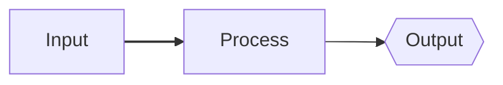

---
title: Diagramy (architektura/flow) — standard
owner: docs/authoring
inputs:
  - źródła: analiza repo (moduły, katalogi), heurystyki po nazwach
outputs:
  - mmd: docs/authoring/<chapter>/diagrams/{architecture.mmd,flow.mmd}
render:
  - mermaid: classDiagram | flowchart | graph TD
rules:
  - nazewnictwo plików stabilne
  - dla dużych diagramów użyj admonition dropdown
acceptance:
  - diagramy czytelne w dark/light
---

## Szablony
```{{admonition}} Diagram: Architektura
:class: dropdown

```mermaid
classDiagram
  class Client{{Client}}
  class Protocol{{Protocol}}
  Client <|-- Protocol
```
```

```{{admonition}} Diagram: Flow
:class: dropdown


```
:::{admonition} Wskazówka: jakość diagramów
:class: tip
- Używamy `sphinxcontrib-mermaid` + `docs/_static/custom-dark-mermaid.css`, aby strzałki i etykiety były czytelne w dark/light mode.
- Węzły mają linki (`click <id> "<rel-url>" "otwórz"`), co poprawia nawigację w dokumentacji.
- Dla dużych diagramów użyj `:class: dropdown` aby były zwijane.
:::
