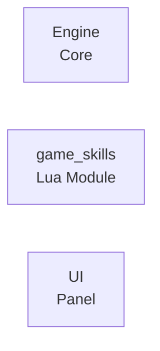
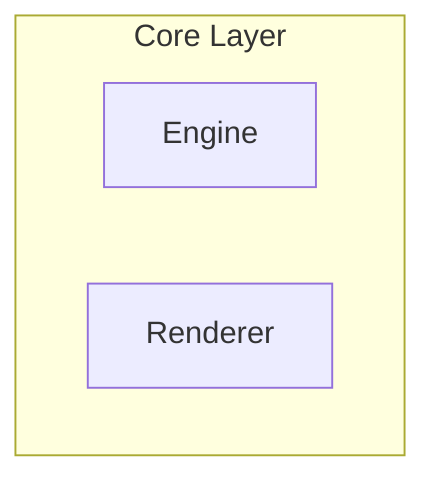
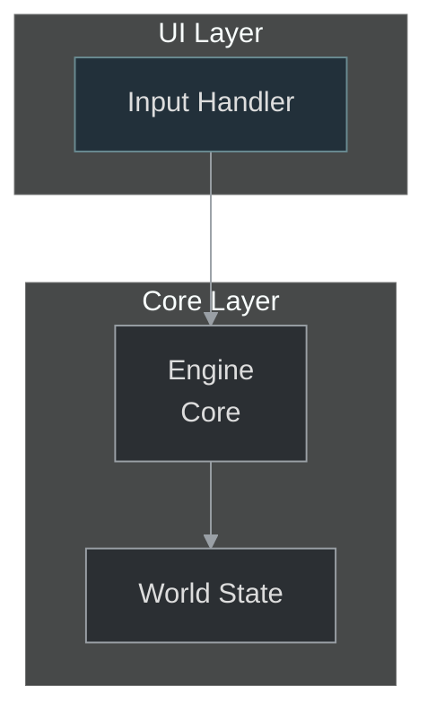

# Specyfikacja Wizualna Diagramów (uzupełniona, canonical)

Ten dokument jest ścisłą specyfikacją techniczną i jedynym źródłem prawdy dla elementów wizualnych w diagramach Mermaid w repozytorium. Wszystkie diagramy powinny przestrzegać poniższych reguł — to zapewnia spójność, czytelność i zgodność z systemem dokumentacji.

Przed użyciem: zapoznaj się też z głównym README systemu diagramów (README.md) i biblioteką wzorców (03_DESIGN_PATTERNS). Wzorce dostosowuj (nie kopiuj 1:1).

---

## 1. Globalny blok inicjalizujący (canonical init)

Wszystkie bloki Mermaid w repo muszą zaczynać się od tego canonical headera (dokładne formatowanie):

```text
%%{init: {'theme':'dark','themeVariables': {'primaryTextColor':'#ddd','lineColor':'#9aa0a6'}, 'securityLevel':'loose'}}%%
```

Uwaga:
- `securityLevel:'loose'` jest wymagane tam, gdzie używamy `click` i innych elementów interaktywnych. Jeśli docsite nie akceptuje `loose`, zamieść fallback linki pod diagramem i opisz to w PR.
- Jeśli wyjątkowo potrzebujesz innych `themeVariables`, dodaj krótkie uzasadnienie w commit/PR i upewnij się, że zmiana jest akceptowalna przez maintainerów.

---

## 2. Oficjalne classDef-y i paleta (canonical classDef)

Aby utrzymać spójność, używamy predefiniowanych klas dla najczęstszych warstw i ról. Dla `graph`/`flowchart` preferujemy `classDef`. Tam, gdzie `classDef` nie jest wspierany (np. `sequenceDiagram`, `erDiagram`), używamy `themeVariables` w init lub fallbacków.

Zalecane definicje do kopiowania w każdym diagramie `graph` (przykład):

```text
classDef core     fill:#2b2f33,stroke:#9aa0a6,color:#ddd,stroke-width:1px;
classDef module   fill:#24343a,stroke:#8fa2a8,color:#ddd,stroke-width:1px;
classDef ui       fill:#22303a,stroke:#6a8b92,color:#ddd,stroke-dasharray:4 2;
classDef event    fill:#2a3a2f,stroke:#9aa0a6,color:#ddd,stroke-width:1px;
classDef data     fill:#2b2f36,stroke:#7b9aa0,color:#ddd;
classDef critical fill:#c0392b,stroke:#ffffff,color:#fff;
classDef note     fill:#4b5563,color:#e5e7eb,stroke:#9ca3af,stroke-dasharray:3 3;
```

Przykładowe użycie:


Reguły:
- Wybierz klasę na podstawie katalogu źródłowego (lokacja pliku) i roli technicznej (opis elementu).
- `critical` używaj tylko gdy element reprezentuje błąd/stan krytyczny.
- `note` przeznaczony dla placeholderów/TODO.

---

## 3. Mapowanie typów elementów na style i ikony

Tabela skrócona (konkretne mapowania):

- core — silnik, framework, niskopoziomowe API (kolor: #2b2f33)
- module — moduły / biblioteki (kolor: #24343a)
- ui — elementy UI, panele, widgety (kolor: #22303a)
- event — zdarzenia / sygnały (kolor: #2a3a2f)
- data — zasoby / pliki / bazy danych (kolor: #2b2f36)
- critical — wyjątki / błędy (kolor: #c0392b)
- note — placeholdery, wskazówki (kolor: #4b5563)

Ikony:
- Używamy Font Awesome 4.7 (`fa-*`) tam, gdzie to ma sens (np. `fa-database` dla danych). Dodawaj ikonę w etykiecie tylko jeśli zwiększa czytelność.

---

## 4. Format etykiet i łamanie tekstu

Zasady:
- Długie etykiety łamiemy przy użyciu `<br/>`. Maksymalnie 3 linie w etykiecie, preferowane 1–2 linie.
- Nie łam słowa w środku; łam w miejscach logicznych (oddzielne słowa, nawiasy).
- Dla identyfikatorów użyj formatu: `Name<br/>(Type)` zamiast `Name (Type)` jeśli potrzeba przewidzieć długość.

Przykłady:
```mermaid
A["Component Name<br/>(Short Description)"]
B["Long Module Name<br/>with Multiple Lines<br/>of Text"]
```

Reguła praktyczna: jeśli etykieta > 28 znaków, rozważ dodanie `<br/>`.

---

## 5. Node-id: nazewnictwo i normalizacja (ważne dla generatorów)

Aby uniknąć konfliktów i problemów z parserami, stosuj następujące reguły dla identyfikatorów węzłów (node-id):

- Normalizacja:
  - lowercase
  - spaces → underscore
  - usuń znaki niealfanumeryczne poza underscore i minus
  - prefiks opcjonalny: `<doc_id>_` (przy automatycznym generowaniu, aby zapewnić unikalność)
- Przykład: `Game Engine` → `game_engine`; `game-skills.v2` → `game_skills_v2`
- Regex akceptowalny (proponowany): `^[a-z0-9_:-]+$` po normalizacji

Zalecenie: generatory powinny normalizować nazwę przed wykorzystaniem jako node-id i zachować mapę oryginalnej etykiety (do wyświetlenia).

---

## 6. Subgraph: użycie i ograniczenia

`subgraph` służy do logicznego grupowania powiązanych elementów.

Zasady:
- Nadaj subgraphowi tytuł opisowy (1–4 słowa).
- Kontroluj układ wewnętrzny za pomocą `direction LR` / `direction TB`.
- Nie zagnieżdżaj więcej niż 2 poziomy subgraphów (czytelność).
- GitHub renderuje subgraphy w ograniczony sposób — nie polegaj na stylizowaniu subgraphów przez `classDef` (często ignorowane). Jeśli subgraph psuje layout, zastąp go komentarzem `%%` z granicą.

Przykład:


---

## 7. Style linii i semantyka połączeń

Semantyka:
- `-->` : wywołanie synchroniczne / główny przepływ
- `-.->` : asynchroniczne / zdarzenie / callback
- `==>` : silne zależności / główna ścieżka danych
- `~~~` : invisible link / manual layout control (stosować oszczędnie)

Stosowanie `linkStyle`:
- Numeruj połączenia w kolejności deklaracji (linkStyle 0, 1, ...).
- Przykładowe kolory:
  - zielony `#2ecc71` — happy path / sukces
  - niebieski `#3498db` — standardowy przepływ
  - pomarańczowy `#e67e22` — asynchroniczny / event
  - czerwony `#c0392b` — błąd / wyjątek
  - szary `#9ca3af` — opcjonalny

Przykład:
```mermaid
A --> B
B -.-> C
linkStyle 0 stroke:#3498db,stroke-width:2px
linkStyle 1 stroke:#e67e22,stroke-width:1px,stroke-dasharray:5 5
```

---

## 8. Click (interaktywność) i fallback

`click` jest dozwolony i rekomendowany w `graph`/`flowchart` i `mindmap` tam, gdzie ma sens, ale wymaga fallbacku.

Reguły:
1. Jeśli używasz `click node "path" "tooltip"`, dodaj pod diagramem listę fallback linków w formacie markdown (Powiązane dokumenty).
2. Fallback powinien zawierać relatywną ścieżkę lub pełen URL do zasobu.
3. Przed commitem waliduj, że target istnieje (jeśli odwołuje się do pliku w repo). Jeśli anchor nie istnieje, oznacz w raporcie PR.

Przykład w diagramie:
```mermaid
click engine "./index.html#facet-01_core.engine" "Open Engine docs"
%% Fallback: Engine -> ./index.html#facet-01_core.engine
```

Pod diagramem (markdown fallback):
```markdown
Powiązane dokumenty:
- Engine — ./index.html#facet-01_core.engine
```

---

## 9. Typy diagramów bez wsparcia classDef

Niektóre typy diagramów (np. `sequenceDiagram`, `erDiagram`, `gantt`, `mindmap`) nie wspierają `classDef` w rendererach. Dla nich:

- Używaj globalnych `themeVariables` w `init` do ujednolicenia kolorów.
- Unikaj `classDef` w tych diagramach; zamiast tego stosuj predefiniowany styl tekstu w etykietach i opisach.
- Jeśli konieczne, dołącz krótką instrukcję poniżej diagramu o warunkach stylu (np. 'This diagram uses themeVariables because classDef not supported').

Przykład init dla `sequenceDiagram`:
```text
%%{init: {'theme':'dark','themeVariables': {'actorBorder':'#9b59b6','signalColor':'#2ecc71'}, 'securityLevel':'loose'}}%%
```

---

## 10. Node-count / dzielenie diagramów (próg czytelności)

Reguły dzielenia:
- Jeśli diagram ma więcej niż 12 węzłów OR więcej niż 3 poziomy zagnieżdżenia, rozważ:
  - stwórz `overview` (poziom wyżej, grupujący subgraphy),
  - i wydziel `details` dla każdego głównego modułu.
- W PR dodaj cytat decision: "Podzielono diagram z powodu N węzłów" wraz z krótkim opisem.

---

## 11. Accessibility (ALT / opis)

Każdy diagram musi mieć krótki opis (1–2 zdania) bezpośrednio pod nim — to służy jako alternatywny tekst i szybkie wyjaśnienie dla osób korzystających z czytników ekranu.

Format:
```markdown
**Opis diagramu:** Krótkie zdanie opisujące, co diagram przedstawia i jaka jest jednostka (np. komponenty systemu, przepływ autoryzacji).
```

---

## 12. Node-id uniqueness i konflikty między diagramami

- Przy generatorach: prefixuj node-id nazwą dokumentu (`doc_id_`) przy generowaniu wielu diagramów w jednym repo, aby uniknąć kolizji przy łączeniu diagramów.
- W przypadku ręcznej edycji: upewnij się, że node-id są unikatowe w obrębie danego diagramu.

---

## 13. Przykładowe snippet-y i wzorce (do kopiowania)

Canonical init + minimalny flowchart z subgraph/classDef/click/fallback:



---

## 14. Walidacja stylów i linter

Rekomendujemy:
- `mermaid-lint` do szybkich zasad syntaktycznych (np. brak duplikatów id, długość etykiet).
- `mmdc` (mermaid-cli) do renderowania testowego SVG jako część CI.

Przykładowe reguły lintera (sugestia):
- Brak duplikowanych node-id.
- Max 3 linie w etykiecie.
- Każdy `click` ma odpowiadający fallback link.
- Każdy wygenerowany diagram posiada marker idempotencyjny (README wymaga).

---

## 15. Konwencje commit/PR przy adaptacji wzorców

W commit message/PR opisz:
- który wzorzec z 03_DESIGN_PATTERNS adaptowano,
- dlaczego dany typ diagramu został wybrany (heurystyka),
- liczba węzłów i decyzja o podziale (jeśli dotyczy),
- informację o zmianach frontmatter (jeśli były),
- listę plików, które wymagają ręcznej weryfikacji.

Przykład commit message:
```
diagram: adapt A_Flows_and_Processes -> docs/authoring/xyz.md
- used flowchart pattern; added classDef core/ui
- reason: document describes stepwise processing
```

---

## 16. FAQ i antywzorce

- Nie kopiuj wzorca 1:1 — wzorce są przykładami, nie szablonami.
- Nie używaj `classDef` w diagramach które go nie wspierają — zamiast tego użyj `themeVariables`.
- Jeśli `click` psuje render, usuń `click`, dodaj fallback i opisz to w PR.
- Nie twórz niestandardowych stylów globalnych poza tymi zdefiniowanymi (prośba: dodania nowych kolorów / klas — otwórz issue i zaproponuj aktualizację dokumentu).

---

## 17. Narzędzia i wersje

- Target: Mermaid v10+ (mermaid-cli / mermaid-lint zgodne z tą wersją).
- W CI używaj `@mermaid-js/mermaid-cli` oraz opcjonalnie `mermaid-lint`.
- Jeśli docsite używa innej wersji, zgłoś to w PR — może wymagać dostosowania init i funkcji.

---

Konieczne przypomnienie
- Wszystkie zmiany w stylach diagramów należy wykonywać poprzez aktualizację tego dokumentu. Jeżeli potrzebujesz nowej klasy semantycznej — zgłoś PR z propozycją nowej `classDef` i przykładowym użyciem.
- Dla generatorów: stosuj node-id normalization, idempotency marker oraz canonical init header — to gwarantuje spójność i idempotencję przy wielokrotnych uruchomieniach.

Dziękujemy za dbanie o spójność wizualną dokumentacji — te zasady ułatwiają automatyzację i poprawiają jakość przeglądania dokumentów przez użytkowników.
