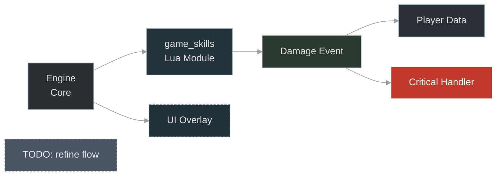
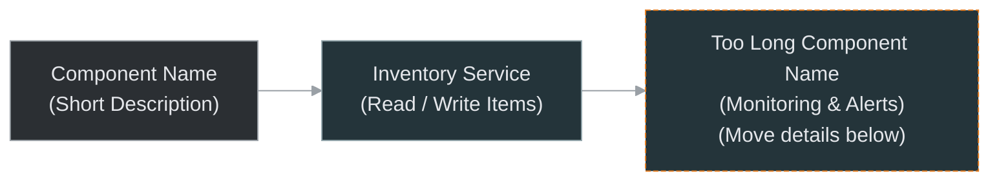
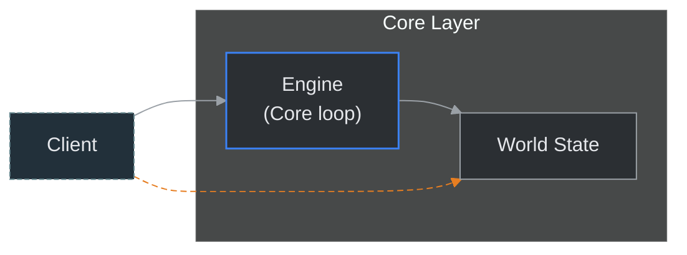
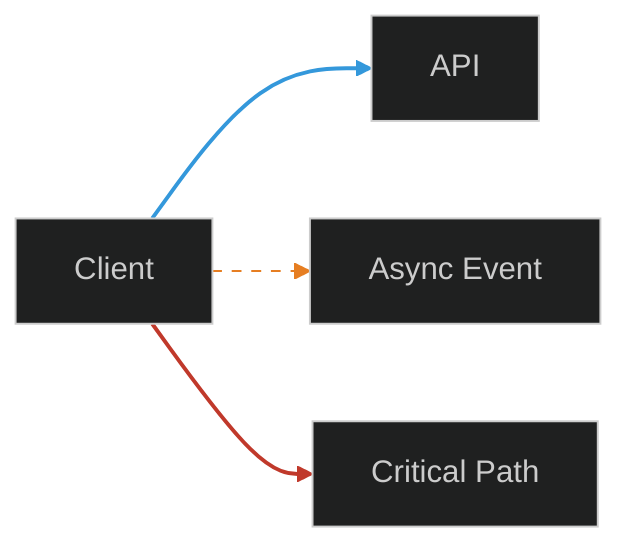
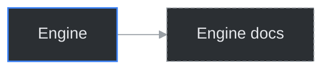
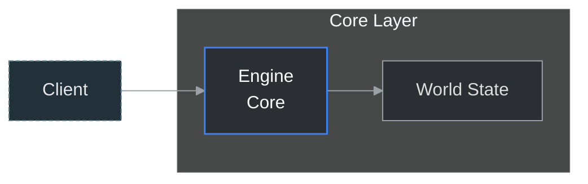

# Specyfikacja Wizualna Diagramów (canonical, kompletna)

Ten dokument jest jedynym źródłem prawdy dla stylów, klas i reguł wizualnych dla diagramów Mermaid w repozytorium. Upewnij się, że adaptacje wzorców z [03_DESIGN_PATTERNS](./03_DESIGN_PATTERNS/) oraz diagramy osadzone w dokumentach respektują poniższe zasady.

---

## 1. Canonical init header (przypomnienie)

Wszystkie diagramy MUSZĄ używać canonical init header:
```text
%%{init: {'theme':'dark','themeVariables': {'primaryTextColor':'#ddd','lineColor':'#9aa0a6'}, 'securityLevel':'loose'}}%%
```

Jeśli wymagana jest inna paleta — opisz to w PR i uzasadnij.

---

## 2. Oficjalne classDef (kopiuj do diagramu `graph`/`flowchart`)

Używaj tych definicji by zachować spójność:

```text
classDef core     fill:#2b2f33,stroke:#9aa0a6,color:#ddd,stroke-width:1px;
classDef module   fill:#24343a,stroke:#8fa2a8,color:#ddd,stroke-width:1px;
classDef ui       fill:#22303a,stroke:#6a8b92,color:#ddd,stroke-dasharray:4 2;
classDef event    fill:#2a3a2f,stroke:#9aa0a6,color:#ddd,stroke-width:1px;
classDef data     fill:#2b2f36,stroke:#7b9aa0,color:#ddd;
classDef critical fill:#c0392b,stroke:#ffffff,color:#fff;
classDef note     fill:#4b5563,color:#e5e7eb,stroke:#9ca3af,stroke-dasharray:3 3;
```

Przykład użycia:


Reguły:
- Decyduj o klasie na podstawie katalogu źródłowego i roli elementu.
- `note` wyłącznie dla placeholderów/TODO.
- Komentarz dla czytelnika (tekstem, nie w kodzie)

---

## 3. Mapowanie typów elementów, ikony i kształty

- core — silnik / niskopoziomowe API (use `core`).
- module — moduły / biblioteki (use `module`).
- ui — komponenty interfejsu (use `ui`).
- event — zdarzenia / callback (use `event`).
- data — pliki i bazy danych (use `data`).
- critical — błędy / wyjątki (use `critical`).
- note — placeholdery (use `note`).

Ikony: stosuj Font Awesome 4.7 (`fa-*`) tylko jeśli ikona zwiększa zrozumiałość.

Kształty:
- Prostokąt A["Text"] — domyślny,
- Zaokrąglony B("Text") — proces / akcja,
- Romb C{"Text"} — decyzja / warunek.

---

## 4. Etykiety i łamanie tekstu

- Używaj `<br/>` do łamania długich etykiet. Maksymalnie 3 linie.
- Nie łam słowa w środku.
- Jeśli etykieta > 28 znaków, rozważ łamanie lub przeniesienie szczegółów do opisu pod diagramem.

Przykład:


**Interpretacja do opisu pod punktem:**
  - A/B = poprawne użycie <br/> (2 linie).
  - C = specjalnie za długie + przerywana ramka jako sygnał „to przenieś do tekstu pod diagramem”.

---

## 5. Node-id: normalizacja i regex

Standard normalizacji (generator powinien to stosować):
- lowercase,
- spaces → underscore,
- usuń znaki inne niż [a-z0-9_\-:],
- opcjonalny prefiks doc_id_ przy automatycznym generowaniu.

Akceptowalny regex po normalizacji:
```
^[a-z0-9_:-]+$
```

Generator powinien utrzymywać mapę oryginalnych etykiet → node-id (dla czytelności).

---

## 6. Subgraph: zasady i ograniczenia

- Nadaj tytuł (1–4 słowa).
- Użyj `direction LR` / `direction TB` dla kontroli układu.
- Nie zagnieżdżaj więcej niż 2 poziomy subgraph.
- Nie polegaj na stylowaniu subgraph przez `classDef` (często ignorowane przez renderery).

Przykład:


**Co tu demonstrujesz jednocześnie:**
  - subgraph z tytułem i własnym direction LR,
  - różne klasy węzłów (ui, core, corePrimary z niebieską ramką dla Engine),
  - etykietę wielolinijkową przy Engine (<br/>(Core loop)),
  - alternatywną, asynchroniczną ścieżkę (kropkowana -.-> + linkStyle).

---

## 7. Style linii i semantyka (linkStyle)

Semantyka strzałek:
- `-->` — synchronizacja / główny przepływ,
- `-.->` — asynchroniczny / zdarzenie,
- `==>` — silne zależności / główna ścieżka danych.

Przykładowe `linkStyle`:


Rekomendowane kolory: zielony #2ecc71 (happy path), niebieski #3498db (standard), pomarańcz #e67e22 (event), czerwony #c0392b (error), szary #9ca3af (opcjonalny).

---

## 8. Click + fallback (dokładna procedura)

1. Jeśli używasz `click node "path" "tooltip"`:
   - Dodaj komentarz fallback w linii `%% Fallback: Node -> path`.
   - Pod diagramem dodaj sekcję markdown "Powiązane dokumenty" z listą linków.
2. CI: sprawdź istnienie pliku target (dla relatywnych ścieżek) lub oznacz brak w raporcie PR.

Przykład:


Fallback w Markdown (poza blokiem):
```markdown
Powiązane dokumenty:
- Engine — `./index.html#facet-01_core.engine`
```

---

## 9. Typy diagramów bez wsparcia `classDef`

Dla `sequenceDiagram`, `erDiagram`, `gantt`, `mindmap`:
- Nie używaj `classDef` — użyj `init` themeVariables.
- Dodaj pod diagramem notę wyjaśniającą ograniczenia stylu, jeśli to ważne.

Przykład init dla sequenceDiagram:
```text
%%{init: {'theme':'dark','themeVariables': {'actorBorder':'#9b59b6','signalColor':'#2ecc71'}, 'securityLevel':'loose'}}%%
```

---

## 10. Progi dzielenia diagramów (czytelność)

- Próg: >12 węzłów lub >3 poziomy zagnieżdżenia → rozważ overview + details.
- W PR opisz, że diagram został podzielony i dlaczego (liczba węzłów).

---

## 11. Accessibility i opis pod diagramem

Każdy diagram wymaga krótkiego opisu (1–2 zdania) bezpośrednio pod nim — to pełni rolę alt-text i kontekstu.

Format:
```markdown
**Opis diagramu:** Krótkie zdanie opisujące, co diagram przedstawia.
```

---

## 12. Walidacja stylów (linter / mmdc)

Rekomendacje:
- mermaid-lint: wykrywanie duplikatów id, długości etykiet, brak fallbacku.
- mmdc (mermaid-cli): render testowy SVG.

Sugestia konfiguracji lintera (przykład do zewnętrznego pliku .mermaid-lintrc):
- require-fallback-for-click: true
- max-label-lines: 3
- no-duplicate-node-ids: true

---

## 13. Przykłady i snippet-y (gotowe do kopiowania)

Canonical init + classDef + subgraph + click + fallback:


**To pokazuje w jednym strzale: init, theme, klasy, subgraph, direction, <br/>, klik, fallback**

---

## 14. Commit/PR: co zawrzeć przy adaptacji wzorca

- Wskaż źródłowy wzorzec z 03_DESIGN_PATTERNS,
- Opisz heurystykę wyboru typu diagramu,
- Podaj liczbę węzłów i decyzję o podziale,
- Wymień pliki wymagające ręcznej weryfikacji (brakujące anchor-y, nieistniejące targety).

Przykład commit message:
```
diagram: adapt A_Flows_and_Processes -> docs/authoring/xyz.md
- used flowchart pattern; added classDef core/ui
- reason: document describes stepwise processing
```

---

## 15. Dobre praktyki i antywzorce

- Nie kopiuj wzorca 1:1; adaptuj.
- Nie używaj `classDef` w diagramach, które go nie wspierają.
- Nie wprowadzaj nowych globalnych stylów bez PR do tego pliku.
- Zawsze dodaj idempotency marker przy automatycznym generowaniu.

---

Dzięki — ten dokument zawiera kompletną i spójną specyfikację wizualną, gotową do stosowania przez ludzi i narzędzia automatyzujące.
