# Wzorce Projektowe Diagramów

## 1. Cel Dokumentu

Ten dokument to zbiór gotowych do użycia **wzorców projektowych ("przepisów")** dla szerokiej gamy zadań wizualizacyjnych w dokumentacji technicznej. Odpowiada na dwa pytania:

* **Co chcę pokazać?** → **Jaki typ diagramu wybieram?**
* **Jak to narysować tak, żeby było spójne, czytelne i klikalne?**

## 1.1. Standardy Globalne

Obowiązują dla wszystkich przykładów w tym dokumencie oraz dla nowo tworzonych diagramów.

1. **Blok inicjalizujący (`init`):**

   * Każdy diagram Mermaid w tym dokumencie zaczyna się od prefiksu:
     `%%{init: {'theme': 'dark'}}%%`
   * Ten prefiks znajduje się jako **pierwsza linia wewnątrz bloku ` ```mermaid`**, nigdy samodzielnie.

2. **Interaktywność (`click`):**

   * Stosujemy `click` tylko w diagramach, które go poprawnie wspierają (np. `flowchart`).
   * Dopuszczalne użycia:

     * `click NODE_ID "#anchor" "Opis"` → link do sekcji w tym samym pliku.
     * `click NODE_ID "./plik.md" "Opis"` → link do innego dokumentu.
   * Jeśli renderer (np. konkretny podgląd GitHuba) nie obsłuży `click`, diagram nadal musi pozostać czytelny.

3. **Rozbijanie złożoności:**

   * Zamiast jednego przeładowanego diagramu:

     * 1 diagram **overview**,
     * kilka diagramów **szczegółowych**,
     * połączenia między nimi przez `click` lub zwykłe linki Markdown.

---

## 2. Indeks Wzorców

### Część A: Przepływy i Procesy

1. [Wzorzec Przepływu Danych (`flowchart`)](#wzorzec-przeplywu-danych-flowchart)
2. [Wzorzec Sekwencji Interakcji (`sequenceDiagram`)](#wzorzec-sekwencji-interakcji-sequencediagram)
3. [Wzorzec Maszyny Stanów (`stateDiagram-v2`)](#wzorzec-maszyny-stanow-statediagram-v2)
4. [Wzorzec Podróży Użytkownika/Systemu (`journey`)](#wzorzec-podrozy-uzytkownikasystemu-journey)
5. [Wzorzec Analizy Przepływu Zasobów (`sankey-beta`)](#wzorzec-analizy-przeplywu-zasobow-sankey-beta)

### Część B: Struktura i Relacje

6. [Wzorzec Struktury Klas (`classDiagram`)](#wzorzec-struktury-klas-classdiagram)
7. [Wzorzec Modelu Danych (`erDiagram`)](#wzorzec-modelu-danych-erdiagram)
8. [Wzorzec Mapy Myśli (`mindmap`)](#wzorzec-mapy-mysli-mindmap)

### Część C: Czas i Planowanie

9. [Wzorzec Osi Czasu Zdarzeń (`timeline`)](#wzorzec-osi-czasu-zdarzen-timeline)
10. [Wzorzec Harmonogramu Projektu (`gantt`)](#wzorzec-harmonogramu-projektu-gantt)
11. [Wzorzec Historii Wersji (`gitGraph`)](#wzorzec-historii-wersji-gitgraph)

### Część D: Wizualizacja Danych i Analiza

12. [Wzorzec Dystrybucji Danych (`pie`)](#wzorzec-dystrybucji-danych-pie)
13. [Wzorzec Analizy Strategicznej (`quadrantChart`)](#wzorzec-analizy-strategicznej-quadrantchart)
14. [Wzorzec Danych XY (`xychart-beta`)](#wzorzec-danych-xy-xychart-beta)

### Część E: Techniki Zaawansowane

15. [Złożony Wzorzec Wizualizacji (Łączenie Diagramów)](#zlozony-wzorzec-wizualizacji-laczenie-diagramow)

---

### Wzorzec Przepływu Danych (`flowchart` / `graph`)

Diagramy przepływu (`flowchart`, znany również jako `graph`) są najbardziej uniwersalnym i potężnym typem diagramów w Mermaid. Pozwalają na wizualizację niemal każdego procesu, struktury czy systemu. Poniższe warianty pokazują, jak dostosować `flowchart` do różnych, specyficznych zadań.

---

#### **Wariant 1: Liniowy Potok Danych (Pipeline)**

*   **Kiedy stosować:** Do wizualizacji prostych, liniowych procesów przetwarzania danych, takich jak potoki ETL (Extract, Transform, Load), walidacja, transformacja i eksport.
*   **Czego uczy:** Jak pokazać sekwencyjny przepływ danych "krok po kroku", z wyraźnie zaznaczoną ścieżką sukcesu i ścieżką błędu. Demonstruje również, jak linkować poszczególne kroki do innych, bardziej szczegółowych diagramów (np. `click V ...`).
*   **Przykładowy Kod:**
    ```mermaid
    %%{init: {'theme': 'dark'}}%%
    flowchart TD
        classDef data fill:#27ae60,color:#000
        classDef process fill:#3498db,color:#fff
        classDef error fill:#c0392b,color:#fff

        Input["Raw Data"]:::data

        subgraph "Processing Pipeline"
            V["Validate"]:::process
            T["Transform"]:::process
            S["Store"]:::process
        end

        Output["Processed Data"]:::data
        Err["Error"]:::error

        Input ==> V --> T --> S ==> Output
        V -- "Invalid" --> Err

        click V "#wzorzec-maszyny-stanow-statediagram-v2" "Zobacz stany walidatora"
        click S "#wzorzec-modelu-danych-erdiagram" "Zobacz model danych"
    ```

---

#### **Wariant 2: Centralny Serwis (Hub & Spoke)**
*   **Kiedy stosować:** Aby pokazać, jak jeden centralny komponent (np. `Logger`, `ConfigManager`) służy jako współdzielony serwis dla wielu innych komponentów z różnych części systemu.
*   **Czego uczy:** Jak wizualizować relacje "wiele do jednego" i pokazać kontekst użycia centralnego serwisu w całej architekturze, wykorzystując kolory do rozróżnienia warstw.
*   **Przykładowy Kod:**
    ```mermaid
    %%{init: {'theme': 'dark'}}%%
    graph TD
        classDef subsystem fill:#2ecc71,stroke:#333,color:#000;
        classDef game fill:#e67e22,stroke:#fff,color:#fff;
        classDef netsec fill:#c0392b,stroke:#fff,color:#fff;

        subgraph "Źródła Logów (Przykłady)"
            direction LR
            A["fa:fa-user-astronaut Player"]:::game;
            B["fa:fa-network-wired Connection"]:::netsec;
        end

        Logger["
            <div style='text-align:left; padding:5px;'>
                <div style='font-size:16px; font-weight:bold;'>fa:fa-file-alt Logger</div><hr/>
                <i>&lt;&lt;singleton&gt;&gt;</i>
            </div>
        "]:::subsystem;

        LogFile["fa:fa-file-text log_file.txt"]:::subsystem;

        A -.->|log: Player jumped| Logger;
        B -.->|log: Connection lost| Logger;
        Logger -- "writes to" --> LogFile;
        
        click Logger "#" "Go to Logger API";
    ```

---

#### **Wariant 3: Kolaboracja (Przepływ Zależności)**
*   **Kiedy stosować:** Gdy chcemy pokazać, jak jeden komponent ("fabryka") **współpracuje** z wieloma innymi ("zależnościami"), aby stworzyć nowy obiekt ("produkt").
*   **Czego uczy:** Jak używać orientacji `LR` do stworzenia naturalnej narracji wizualnej **Wejście → Proces → Wyjście**, eliminując krzyżujące się linie i jasno pokazując przepływ zależności.
*   **Przykładowy Kod:**
    ```mermaid
    %%{init: {'theme': 'dark'}}%%
    graph LR
        classDef game fill:#e67e22,stroke:#fff,color:#fff;
        classDef core fill:#3498db,stroke:#fff,color:#fff;
        classDef subsystem fill:#2ecc71,stroke:#333,color:#000;
        classDef netsec fill:#c0392b,stroke:#fff,color:#fff;

        subgraph "Zależności (Inputs)"
            Config["fa:fa-file-alt ConfigManager"]:::core;
            Assets["fa:fa-archive AssetManager"]:::subsystem;
        end

        subgraph "Proces (Factory)"
            Factory["fa:fa-industry PlayerFactory"]:::core;
        end

        subgraph "Wynik (Output)"
            Player["fa:fa-user-astronaut Player"]:::game;
        end

        Config -- "config data" --> Factory;
        Assets -- "asset data" --> Factory;
        Factory -- "<strong>creates</strong>" --> Player;

        linkStyle 2 stroke:#2ecc71,stroke-width:4px;
    ```

---

#### **Wariant 4: Rodzina Klas (Kompaktowy)**
*   **Kiedy stosować:** Gdy musimy pokazać hierarchię dziedziczenia i relacje w grupie małych, silnie powiązanych ze sobą klas (np. niestandardowe kontrolki UI).
*   **Czego uczy:** Jak używać mniejszych węzłów i orientacji `TD` do stworzenia zwartego, czytelnego diagramu hierarchii, wykorzystując kolorowe linie do pokazania typów relacji (`extends`, `contains`).
*   **Przykładowy Kod:**
    ```mermaid
    %%{init: {'theme': 'dark'}}%%
    graph TD
        classDef ui fill:#9b59b6,stroke:#fff,color:#fff;

        subgraph "Rodzina Widgetów UI"
            Widget["fa:fa-puzzle-piece UIWidget"]:::ui;
            Button["StyledButton<br/><i>&lt;&lt;widget&gt;&gt;</i>"]:::ui;
            Panel["DraggablePanel<br/><i>&lt;&lt;widget&gt;&gt;</i>"]:::ui;
            Slider["ColorSlider<br/><i>&lt;&lt;widget&gt;&gt;</i>"]:::ui;
        end

        Button -- "[extends]" --> Widget;
        Panel -- "[extends]" --> Widget;
        Panel -- "[contains]" --> Slider;

        linkStyle 0,1 stroke:#2ecc71,stroke-width:2px;
        linkStyle 2 stroke:#9b59b6,stroke-width:3px;
    ```

---

### Wzorzec Sekwencji Interakcji (`sequenceDiagram`)

Diagramy sekwencji są niezastąpione do wizualizacji **interakcji między komponentami w czasie**. Pokazują, kto, do kogo i w jakiej kolejności wysyła komunikaty.

---

#### **Wariant 1: Wzorzec Złożonej Interakcji**

*   **Kiedy stosować:** Do szczegółowej analizy złożonych procesów, które obejmują wiele komponentów, logikę warunkową i notatki. To jest nasz flagowy, najbardziej informacyjny wzorzec.
*   **Czego uczy:** Jak używać pełnego spektrum funkcji: uczestników z ikonami, zrównoważonych aktywacji (`+`/`-`), notatek (`note`), a przede wszystkim logiki warunkowej (`alt`/`else` dla sukcesu/błędu).
*   Pokazuje:
  - *note over* i *note right* of – objaśnienia kontekstu.
  - *rect* – wizualne grupowanie etapów (np. UI vs backend).
  - *alt* – rozgałęzienia sukces / błąd.
  - *opt* – opcjonalny flow (remember-me).
  - *loop* – cykliczne akcje (np. rate limiting / logging).
  - *themeVariables* – globalne kolory aktorów, linii, aktywacji.
*   **Przykładowy Kod:**
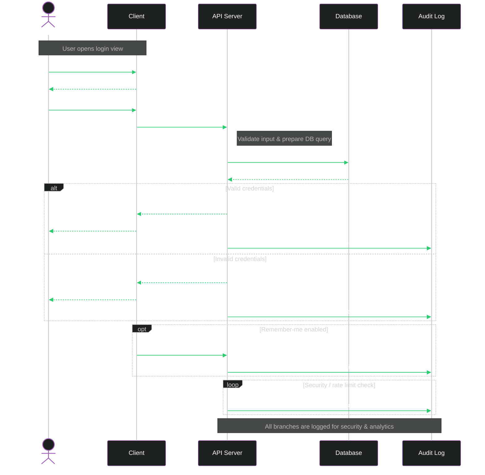
```mermaid
%%{init: {
  'theme': 'dark',
  'themeVariables': {
    'primaryColor': '#3498db',
    'primaryTextColor': '#ffffff',
    'actorBorder': '#9b59b6',
    'actorTextColor': '#ffffff',
    'signalColor': '#2ecc71',
    'signalTextColor': '#ffffff',
    'activationBorderColor': '#e67e22',
    'activationBackgroundColor': '#1f2933'
  }
}}%%
sequenceDiagram
    %% Uczestnicy
    actor User as End User
    participant C as Client
    participant API as API Server
    participant DB as Database
    participant LOG as Audit Log

    %% Sekcja: start flow
    rect rgba(255,255,255,0.03)
        note over User,C: User opens login view
        User->>C: Open /login
        C-->>User: Render login form
    end

    %% Sekcja: wysłanie danych
    User->>C: Submit credentials
    C->>API: POST /auth { user, pass }
    note right of API: Validate input & prepare DB query

    %% Zapytanie do bazy
    API->>DB: SELECT user_hash, salt FROM users
    DB-->>API: user_hash, salt

    alt Valid credentials
        API-->>C: 200 OK { token, roles }
        C-->>User: Login success + redirect
        API->>LOG: write(login_success)
    else Invalid credentials
        API-->>C: 401 Unauthorized
        C-->>User: Show error banner
        API->>LOG: write(login_failed)
    end

    opt Remember-me enabled
        C->>API: POST /session/persistent
        API->>LOG: write(remember_me_issued)
    end

    %% Przykład pętli dla audytu / ratelimit
    loop Security / rate limit check
        API->>LOG: read(request_count)
    end

    note over API,LOG: All branches are logged for security & analytics

```

---

#### **Wariant 2: Prosty Request-Response**

*   **Kiedy stosować:** Do szybkiego zilustrowania podstawowej komunikacji klient-serwer lub wywołania dowolnego API.
*   **Czego uczy:** Jak w prosty i czytelny sposób pokazać cykl "zapytanie -> odpowiedź", używając ikon do identyfikacji uczestników.
*   Pokazuje:
  - ikony uczestników,
  - blok kontekstu (rect + note),
  - aktywacje (+ / -) użyte poprawnie.

*   **Przykładowy Kod:**
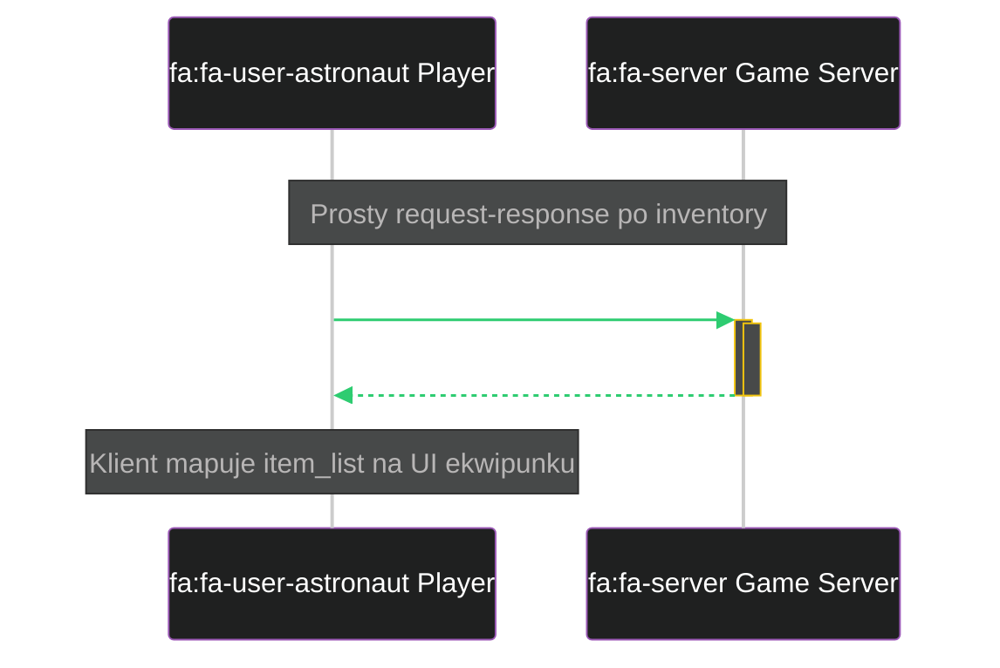
```mermaid
%%{init: {
  'theme': 'dark',
  'themeVariables': {
    'actorBorder': '#9b59b6',
    'actorTextColor': '#ffffff',
    'signalColor': '#2ecc71',
    'signalTextColor': '#ffffff',
    'activationBorderColor': '#f1c40f',
    'activationBackgroundColor': '#1f2933'
  }
}}%%
sequenceDiagram
    participant P as fa:fa-user-astronaut Player
    participant GS as fa:fa-server Game Server

    rect rgba(255,255,255,0.03)
        note over P,GS: Prosty request-response po inventory
        P->>+GS: request_inventory_items()
        activate GS
        GS-->>-P: item_list[]
        deactivate GS
    end

    note over P: Klient mapuje item_list na UI ekwipunku

```

---

#### **Wariant 3: Komunikat Asynchroniczny ("Fire and Forget")**

*   **Kiedy stosować:** Gdy chcemy pokazać wysłanie komunikatu, na który nadawca nie czeka na natychmiastową odpowiedź (np. wysłanie zdarzenia do systemu, logowanie).
*   **Czego uczy:** Jak używać strzałek (`->>`) do sygnalizowania komunikacji asynchronicznej i jak używać notatek do wyjaśnienia kontekstu.
*   Pokazuje:
  - asynchroniczność (brak odpowiedzi do Playera),
  - notkę wyjaśniającą,
  - równoległe przetwarzanie (par) po stronie Loggera.

*   **Przykładowy Kod:**
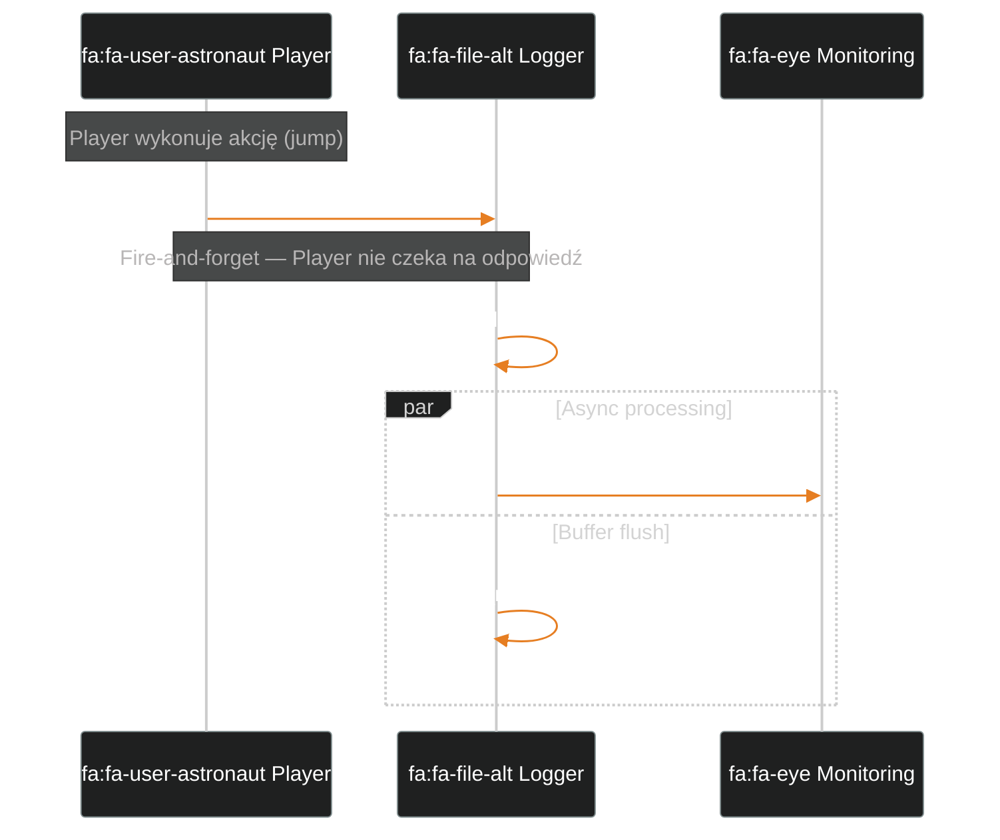
```mermaid
%%{init: {
  'theme': 'dark',
  'themeVariables': {
    'actorBorder': '#7f8c8d',
    'actorTextColor': '#ffffff',
    'signalColor': '#e67e22',
    'signalTextColor': '#ffffff'
  }
}}%%
sequenceDiagram
    participant Player as fa:fa-user-astronaut Player
    participant Logger as fa:fa-file-alt Logger
    participant Monitor as fa:fa-eye Monitoring

    note over Player: Player wykonuje akcję (jump)
    Player->>Logger: log("player_jumped")

    note over Player,Logger: Fire-and-forget — Player nie czeka na odpowiedź

    Logger->>Logger: enqueue(log_event)

    par Async processing
        Logger->>Monitor: emit_metric("jump_event")
    and Buffer flush
        Logger->>Logger: flush_if_needed()
    end

```
---

### Wzorzec Maszyny Stanów (`stateDiagram-v2`)

**Kiedy:** Tryby pracy, lifecycle, sesje.

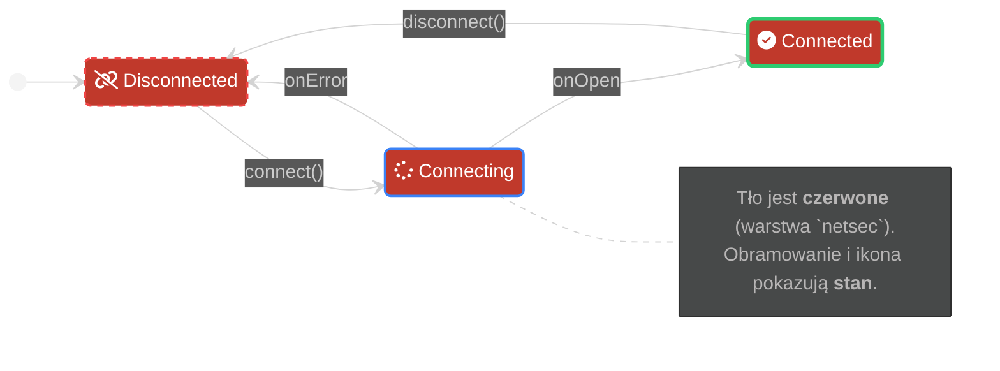
```mermaid
%%{init: {'theme': 'dark'}}%%
stateDiagram-v2
    direction LR

    %% Definicje stylów pochodzą z 02_VISUAL_GUIDELINES.md.
    %% Poniższe definicje są tylko dla celów demonstracyjnych w tym bloku.
    classDef netsec fill:#c0392b,stroke:#fff,color:#fff
    classDef stateActive stroke-width:3px,stroke:#2ecc71
    classDef stateInactive stroke-dasharray:5 5,stroke-width:2px,stroke:#ef4444
    classDef stateTransition stroke-width:2px,stroke:#3b82f6

    [*] --> Disconnected

    state "fa:fa-chain-broken Disconnected" as Disconnected
    state "fa:fa-spinner Connecting" as Connecting
    state "fa:fa-check-circle Connected" as Connected

    Disconnected --> Connecting: connect()
    Connecting --> Connected: onOpen
    Connecting --> Disconnected: onError
    Connected --> Disconnected: disconnect()

    note right of Connecting
      Tło jest **czerwone** (warstwa `netsec`).
      Obramowanie i ikona pokazują **stan**.
    end note

    %% Krok 1: Zastosuj klasę warstwy do wszystkich stanów.
    class Disconnected,Connecting,Connected netsec
    %% Krok 2: Zastosuj modyfikatory stanu do konkretnych węzłów.
    class Disconnected stateInactive
    class Connecting stateTransition
    class Connected stateActive
```

---

### Wzorzec Podróży Użytkownika/Systemu (`journey`)

Diagramy podróży są doskonałym narzędziem do wizualizacji **sekwencji kroków, które użytkownik (lub system) podejmuje, aby osiągnąć cel**. Ich unikalną cechą jest możliwość przypisania **oceny satysfakcji** do każdego etapu, co pozwala na identyfikację "bolesnych punktów" (pain points) w procesie.

**Kiedy stosować:**
*   **User Onboarding:** Mapowanie pierwszych kroków nowego użytkownika w aplikacji.
*   **Analiza Lejków (Funnels):** Wizualizacja ścieżki użytkownika przez proces zakupowy lub rejestracyjny.
*   **Projektowanie Funkcjonalności:** Opisywanie, jak użytkownik będzie wchodził w interakcję z nową funkcją (np. wykonanie pierwszego zadania w grze).
*   **Mapowanie Procesów Systemowych:** Śledzenie, jak zadanie przechodzi przez różne etapy backendu.

> **Ograniczenie:** Stylizacja jest ograniczona głównie do `themeVariables`. Nie można używać `classDef`.

---

#### **Wariant 1: Zaawansowana Podróż Użytkownika (Pierwsze Zadanie w Grze)**

*   **Cel:** Pokazuje pełną ścieżkę gracza podczas wykonywania pierwszego zadania, włączając w to interakcje z różnymi aktorami (NPC, System Gry) oraz wizualizację jego satysfakcji na każdym etapie.
*   **Czego uczy:** Jak używać sekcji do grupowania kroków, jak przypisywać zadania do różnych aktorów i, co najważniejsze, jak dodawać oceny satysfakcji (w skali 1-5), które są wizualizowane jako emotikony.
*   **Przykładowy Kod:**
    ```mermaid
    %%{init: {
      "theme": "dark",
      "themeVariables": {
        "primaryTextColor": "#e5e7eb", "sectionBackgroundColor": "#1f2937",
        "taskBorderColor": "#9b59b6", "taskTextColor": "#e5e7eb",
        "taskFill": "#111827", "actorColor": "#e67e22"
      }
    }}%%
    journey
        title Player's First Quest: "Goblin Menace"
        
        section Accepting the Quest
          Talk to Guard: 4: Player, NPC Guard
          Accept Quest: 5: Player
          Quest Started Notification: 5: Game System
        
        section Completing Objectives
          Find Goblin Camp: 3: Player
          Defeat Goblins (3/3): 5: Player, Game System
          Objective Complete!: 5: Game System

        section Receiving the Reward
          Return to Guard: 4: Player, NPC Guard
          Receive Gold & XP: 5: Player, Game System
          Quest Complete Popup: 5: Game System
    ```
    **Interpretacja:**
    *   *Skala ocen: 1 = frustracja, 5 = satysfakcja.*
    *   Diagram wizualizuje podróż gracza. Widzimy, że znalezienie obozu goblinów było nieco nużące (ocena 3/5), ale walka i otrzymanie nagrody były bardzo satysfakcjonujące (ocena 5/5).

---

#### **Wariant 2: Prosta Ścieżka Użytkownika (Happy Path)**
*   **Cel:** Szybkie zmapowanie podstawowej, oczekiwanej ścieżki użytkownika przez prosty proces, np. rejestrację.
*   **Przykładowy Kod:**
    ```mermaid
    %%{init: {'theme': 'dark'}}%%
    journey
        title New User Onboarding (Happy Path)
        section Registration
          Open app: 4: User
          Fill form: 3: User
          Submit form: 3: User
          Account created: 5: System
        section First session
          Login: 4: User
          Show guided tour: 4: System
          Complete tour: 3: User
    ```
    **Interpretacja:**
    *   *Skala ocen: 1 = frustracja, 5 = satysfakcja.*

---

#### **Wariant 3: Wzorzec Porównawczy (Przed i Po)**
*   **Cel:** Potężne narzędzie do wizualizacji **efektu zmian** (np. po refaktoryzacji UX) poprzez porównanie ocen satysfakcji dla tego samego procesu przed i po modyfikacji.
*   **Przykładowy Kod:**
    ```mermaid
    %%{init: {'theme': 'dark'}}%%
    journey
        title Onboarding — Before vs After Redesign
        section Before
          Find signup: 2: User
          Long form: 1: User
          Email verification confusion: 2: User
          First login: 3: User
        section After
          One-click signup: 5: User
          Short form: 4: User
          Clear verification link: 4: User
          First login success: 5: User
    ```
    **Interpretacja:**
    *   *Skala ocen: 1 = frustracja, 5 = satysfakcja.*
    *   Diagram jednoznacznie pokazuje, jak redesign poprawił doświadczenie użytkownika na każdym etapie procesu.

---

#### **Wariant 4: Wzorzec Techniczny (Ścieżka Systemu i Ryzyka)**
*   **Cel:** Pokazuje, że `journey` może być używany nie tylko do UX, ale także do mapowania **wewnętrznych procesów systemowych** i identyfikacji potencjalnych **punktów ryzyka** lub błędów.
*   **Przykładowy Kod:**
    ```mermaid
    %%{init: {'theme': 'dark'}}%%
    journey
        title Login Funnel with System Perspective
        section User path
          Open login page: 4: User
          Enter credentials: 4: User
          Submit: 3: User
          Wait for response: 2: User
        section System path
          Validate request: 5: System
          Check rate limits: 4: System
          Query auth DB: 4: System
          Generate token: 5: System
        section Risk points
          Slow response (>2s): 1: User, System
          Captcha triggered: 2: User
    ```
    **Interpretacja:**
    *   *Skala ocen: dla Użytkownika = satysfakcja; dla Systemu = stabilność/pewność.*
    *   Diagram mapuje zarówno ścieżkę użytkownika, jak i kroki wykonywane przez system, a także identyfikuje kluczowe ryzyka, które negatywnie wpływają na obie strony.
---

### Wzorzec Analizy Przepływu Zasobów (`sankey-beta`)

Diagramy Sankeya służą do wizualizacji **przepływu i dystrybucji mierzalnych zasobów** między elementami systemu. Nie pokazują kolejności zdarzeń, tylko odpowiedź na pytanie:

> „Ile czego gdzie płynie i gdzie się rozprasza?”

**Kiedy stosować:**

Używaj `sankey-beta`, gdy możesz wstawić liczby typu:

- logi: ile zdarzeń trafia do jakich systemów,
- ruch: które moduły generują ruch na które endpointy,
- koszt: które komponenty pożerają ile budżetu,
- kod / assety: które katalogi / moduły dominują objętościowo,
- użycie UI: które ekrany/feature’y konsumują czas / kliknięcia.

**Na co uważać:**

- Sankey pokazuje **proporcje**, nie timeline. Do czasu masz `timeline` i `sequenceDiagram`.
- Zawsze określ **jednostkę**: `%`, req/s, MB, liczba plików, sesje, cokolwiek.
- Renderer GitHuba ma ograniczoną stylizację. Tu wygrywa treść, nie gradienty.

---

#### Wariant 1: Przepływ Logów od Źródeł do Systemów Docelowych

**Cel:** Pokaż, ile logów przechodzi przez kolejne etapy i gdzie lądują.

```mermaid
%%{init: {'theme': 'dark'}}%%
sankey-beta
    %% Źródła logów (np. zdarzenia/sekundę)
    Game_Client, Ingest, 80
    Game_Server, Ingest, 140

    %% Wstępna filtracja
    Ingest, Filtered, 180
    Ingest, Dropped_on_ingest, 40

    %% Dystrybucja do systemów docelowych
    Filtered, Security_Alerts, 40
    Filtered, Metrics_TSDB, 60
    Filtered, Full_Storage, 80

    %% Podział storage
    Full_Storage, Cold_Archive, 50
    Full_Storage, Adhoc_Analysis, 30
````

**Jak użyć:**

* Podpis: „Wartości = zdarzenia/s”.
* Pokazujesz szum (`Dropped_on_ingest`), ścieżkę bezpieczeństwa, metryk i archiwum.
* Lepsze niż ściana tekstu typu „40% tu, 60% tam”.

---

#### Wariant 2: Przepływ Ruchu z Modułów UI do Endpointów API

**Cel:** Zidentyfikować, które części UI duszą API.

```mermaid
%%{init: {'theme': 'dark'}}%%
sankey-beta
    %% Źródła requestów (np. % wszystkich zapytań)
    UI_Inventory, NetClient, 30
    UI_Map, NetClient, 20
    UI_Login, NetClient, 15
    UI_Chat, NetClient, 10
    Background_Sync, NetClient, 25

    %% Dystrybucja requestów do backendu
    NetClient, API_Inventory, 30
    NetClient, API_Character, 25
    NetClient, API_Map, 20
    NetClient, API_Chat, 15
    NetClient, API_Other, 10
```

**Jak użyć:**

* Podpis: „Wartości = % wszystkich requestów”.
* Widać „gorące” feature’y bez dłubania w logach.
* Pod to podpinasz decyzje: cache, throttling, osobne endpointy.

---

#### Wariant 3: Udział Katalogów w Bazie Kodu

**Cel:** Szybko pokazać, gdzie siedzi masa kodu w repo.

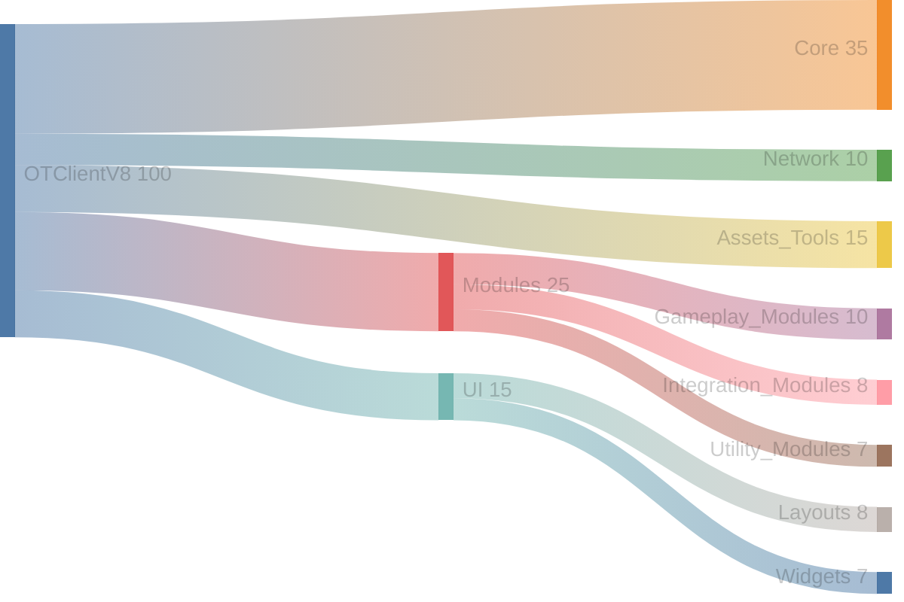
```mermaid
%%{init: {'theme': 'dark'}}%%
sankey-beta
    %% Główne warstwy
    OTClientV8, Core, 35
    OTClientV8, Modules, 25
    OTClientV8, UI, 15
    OTClientV8, Network, 10
    OTClientV8, Assets_Tools, 15

    %% Rozbicie Modules
    Modules, Gameplay_Modules, 10
    Modules, Integration_Modules, 8
    Modules, Utility_Modules, 7

    %% Rozbicie UI
    UI, Layouts, 8
    UI, Widgets, 7
```

**Jak użyć:**

* Podpis: „Wartości = % linii kodu / plików”.
* Działa jako szybki heatmap: gdzie inwestować testy, code review, refactor.
* Tak, jest to legalny zamiennik „nudnej tabelki LOC per katalog”.

---

#### Wariant 4: Przepływ Assetów w Pipeline (Edytor → Build → Runtime)

**Cel:** Pokazać, ile contentu przeżywa pipeline i gdzie jest używany.

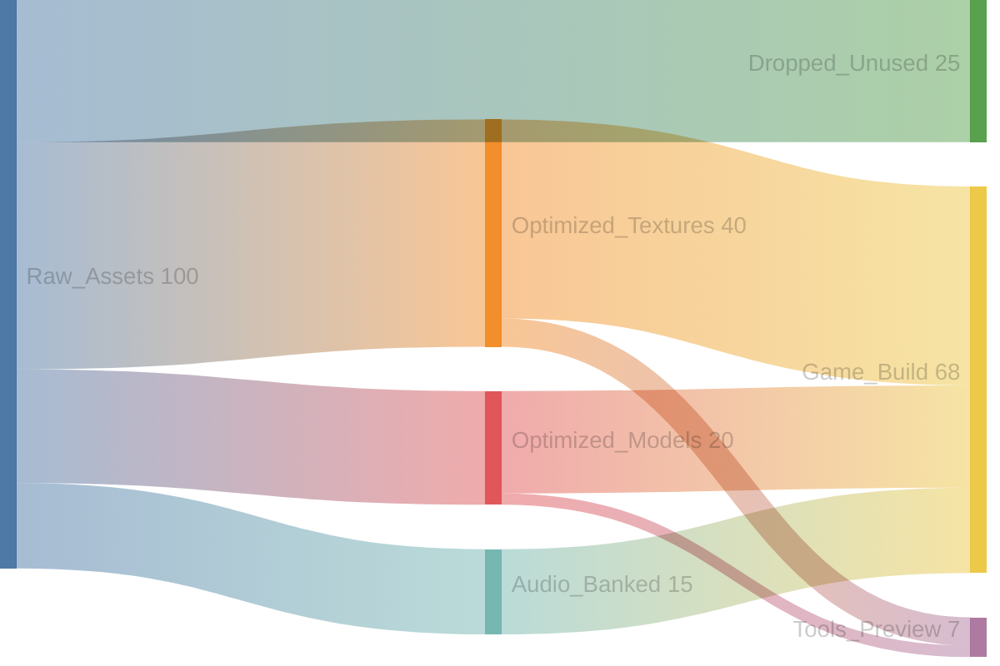
```mermaid
%%{init: {'theme': 'dark'}}%%
sankey-beta
    %% Wejście: wszystkie assety
    Raw_Assets, Optimized_Textures, 40
    Raw_Assets, Optimized_Models, 20
    Raw_Assets, Audio_Banked, 15
    Raw_Assets, Dropped_Unused, 25

    %% Wyjście: do builda i narzędzi
    Optimized_Textures, Game_Build, 35
    Optimized_Textures, Tools_Preview, 5
    Optimized_Models, Game_Build, 18
    Optimized_Models, Tools_Preview, 2
    Audio_Banked, Game_Build, 15
```

**Jak użyć:**

* Podpis: „Wartości = % assetów”.
* Pokazujesz, jaki procent kontentu faktycznie trafia do gry, a co jest syfem do sprzątnięcia.

---

#### Wariant 5: Użycie UI / Ekranów w Kliencie

**Cel:** Pokazać, gdzie użytkownicy realnie spędzają czas w kliencie (na podstawie telemetry), bez rysowania sekwencji.

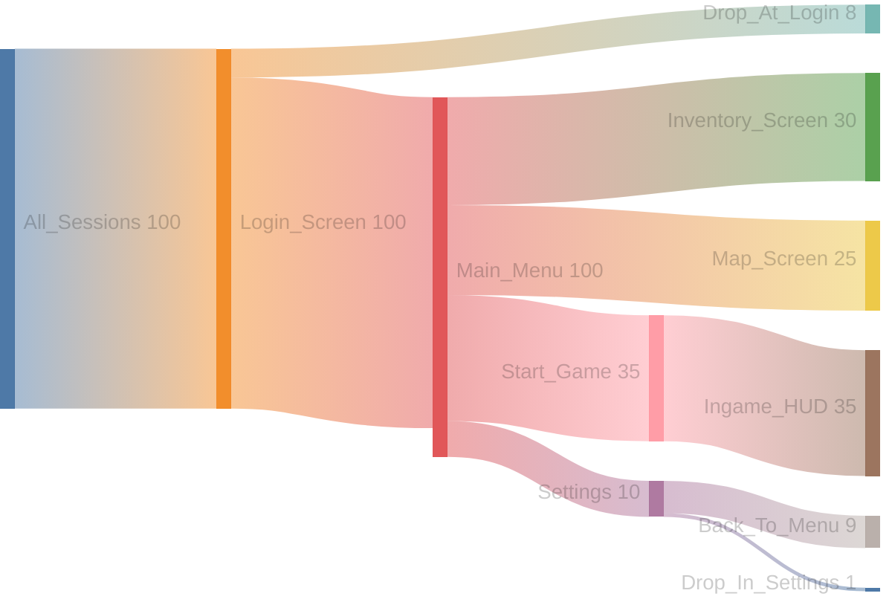
```mermaid
%%{init: {'theme': 'dark'}}%%
sankey-beta
    %% Sesje użytkowników przechodzące przez główne ekrany (np. % sesji)
    All_Sessions, Login_Screen, 100
    Login_Screen, Main_Menu, 92
    Login_Screen, Drop_At_Login, 8

    Main_Menu, Inventory_Screen, 30
    Main_Menu, Map_Screen, 25
    Main_Menu, Settings, 10
    Main_Menu, Start_Game, 35

    Start_Game, Ingame_HUD, 35
    Settings, Back_To_Menu, 9
    Settings, Drop_In_Settings, 1
```

**Jak użyć:**

* Podpis: „Wartości = % sesji przechodzących przez dane ekrany”.
* Idealne do:

  * pokazania dropów (np. `Drop_At_Login`, `Drop_In_Settings`),
  * argumentowania zmian UX bez lania eseju.
* Dobrze współgra z `journey` i `sequenceDiagram`: Sankey = gdzie, tamte = jak i w jakiej kolejności.

---

### Kiedy NIE używać `sankey-beta`

* Jeśli chcesz pokazać czyste drzewo katalogów → użyj `mindmap` / `flowchart`.
* Jeśli pokazujesz zależności modułów → `flowchart`, `classDiagram`, `erDiagram`.
* Jeśli ważna jest kolejność i czas → `sequenceDiagram`, `timeline`, `journey`.

Reguła końcowa:

> Jeśli nie podajesz liczby i nie ma realnego “przepływu”, nie używaj Sankeya. To narzędzie do danych, nie do ozdoby.

---

## Część B: Struktura i Relacje

### Wzorzec Struktury Klas (`classDiagram`)

**Kiedy:** API, dziedziczenie, interfejsy, kontrakty.

> Uwaga: `click` w `classDiagram` nie jest gwarantowany w każdym rendererze.

### Wzorzec Struktury Klas (symulowany za pomocą `flowchart`)
*   **Kiedy stosować:** Do pokazywania relacji między klasami,  API, dziedziczenie, interfejsy, kontrakty. **Ten wzorzec zastępuje `classDiagram`, aby zapewnić pełne wsparcie dla naszego systemu stylów na GitHubie.**
*   **Kluczowe Elementy:** Węzły reprezentujące klasy (ze stylami warstw), listy członków (metody/atrybuty) wewnątrz węzłów, strzałki reprezentujące relacje (dziedziczenie, kompozycja).
*   **Przykłady Kod:**

### **Wariant 1** Wzorzec Pełnej Struktury Klas
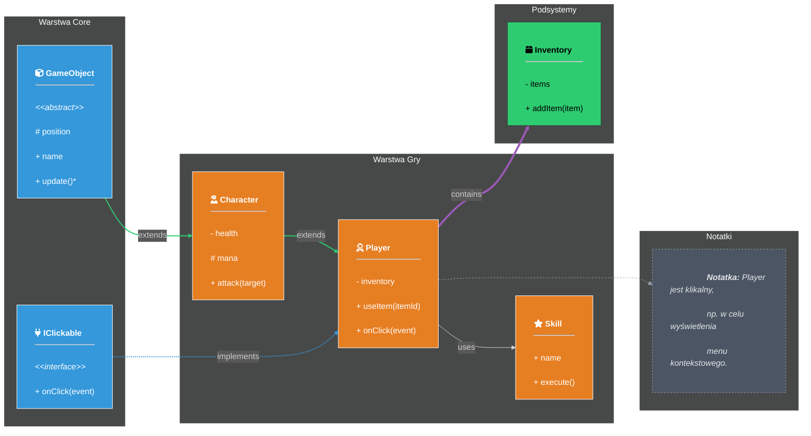
```mermaid
%%{init: {'theme': 'dark'}}%%
graph LR
    %% --- Definicja palety kolorów i stylów ---
    classDef core fill:#3498db,stroke:#fff,color:#fff;
    classDef game fill:#e67e22,stroke:#fff,color:#fff;
    classDef subsystem fill:#2ecc71,stroke:#333,color:#000;
    classDef note fill:#4b5563,color:#e5e7eb,stroke:#9ca3af,stroke-dasharray:3 3;

    %% --- Definicja Węzłów-Klas ---
    subgraph "Warstwa Core"
        IClickable["
            <div style='text-align:left; padding:5px;'>
                <div style='font-size:16px; font-weight:bold;'>fa:fa-plug IClickable</div><hr/>
                <i>&lt;&lt;interface&gt;&gt;</i><br/>
                + onClick(event)
            </div>
        "]:::core;
        
        GameObject["
            <div style='text-align:left; padding:5px;'>
                <div style='font-size:16px; font-weight:bold;'>fa:fa-cube GameObject</div><hr/>
                <i>&lt;&lt;abstract&gt;&gt;</i><br/>
                # position<br/>
                + name<br/>
                + update()*
            </div>
        "]:::core;
    end;

    subgraph "Warstwa Gry"
        Character["
            <div style='text-align:left; padding:5px;'>
                <div style='font-size:16px; font-weight:bold;'>fa:fa-user-ninja Character</div><hr/>
                - health<br/>
                # mana<br/>
                + attack(target)
            </div>
        "]:::game;

        Player["
            <div style='text-align:left; padding:5px;'>
                <div style='font-size:16px; font-weight:bold;'>fa:fa-user-astronaut Player</div><hr/>
                - inventory<br/>
                + useItem(itemId)<br/>
                + onClick(event)
            </div>
        "]:::game;

        Skill["
            <div style='text-align:left; padding:5px;'>
                <div style='font-size:16px; font-weight:bold;'>fa:fa-star Skill</div><hr/>
                + name<br/>
                + execute()
            </div>
        "]:::game;
    end;
    
    subgraph "Podsystemy"
        Inventory["
            <div style='text-align:left; padding:5px;'>
                <div style='font-size:16px; font-weight:bold;'>fa:fa-box Inventory</div><hr/>
                - items<br/>
                + addItem(item)
            </div>
        "]:::subsystem;
    end;
    
    subgraph "Notatki"
        PlayerNote["
            <div style='text-align:left; padding:5px;'>
                <i><b>Notatka:</b> Player jest klikalny,<br/>
                np. w celu wyświetlenia<br/>
                menu kontekstowego.</i>
            </div>"
        ]:::note;
    end;

    %% --- Widoczne Relacje ---
    GameObject -- "extends" --> Character;
    Character -- "extends" --> Player;
    IClickable -.->|"implements"| Player;
    Player -- "uses" --> Skill;
    Player -- "contains" --> Inventory;
    Player -.-> PlayerNote;

    %% --- Niewidzialne Linki Sterujące Układem ---
    %% Te linki tworzą "rusztowanie", które wymusza poprawny układ.
    GameObject ~~~ Inventory;
    Skill ~~~ PlayerNote;

    %% --- Zaawansowana stylizacja linii ---
    linkStyle 0,1 stroke:#2ecc71,stroke-width:2px;
    %% extends
    linkStyle 2 stroke:#3498db,stroke-width:2px;
    %%implements
    linkStyle 4 stroke:#9b59b6,stroke-width:4px;
    %%contains
    linkStyle 5 stroke:#9ca3af,stroke-dasharray:3 3;
    %% link do notatki
    linkStyle 6,7 stroke-width:0px;
    %% Ukrycie linków sterujących

    %% --- Interaktywność ---
    click Inventory "#" "Kliknij, aby zobaczyć szczegółowy diagram ekwipunku";
```

---

### **Wariant 2: Wzorzec Prostej Klasy (Minimalistyczny)**

*   **Kiedy stosować:** Dla prostych klas narzędziowych lub struktur danych, które mają niewiele lub żadnych złożonych zależności.
*   **Czego uczy:** Jak tworzyć czyste, minimalistyczne diagramy, które nie są przeładowane informacjami. Pokazuje, że nie zawsze trzeba używać `subgraph` i wielu warstw.
*   **Przykładowy Kod:**
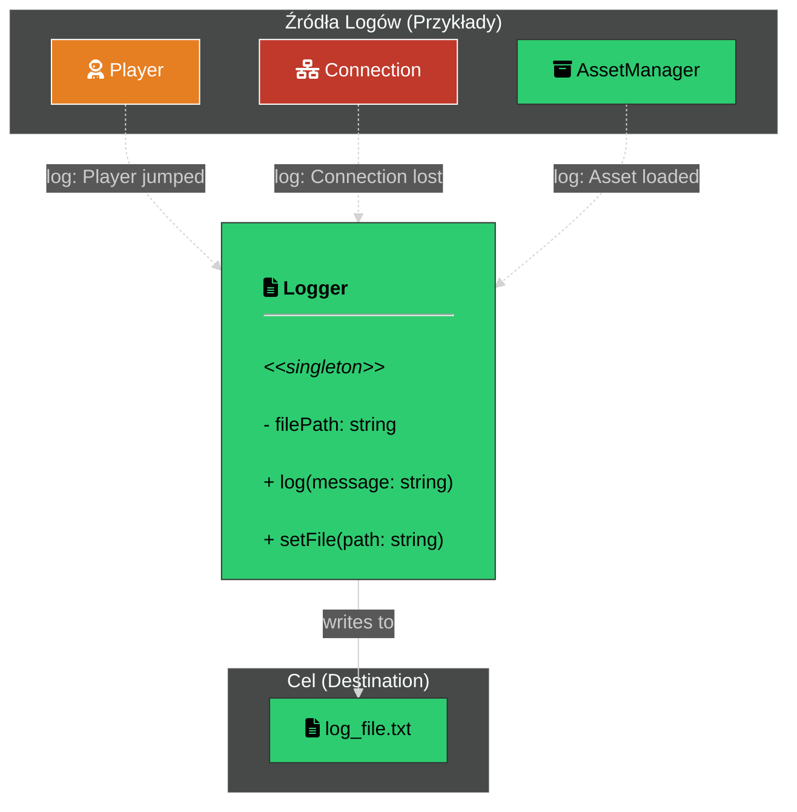
```mermaid
%%{init: {'theme': 'dark'}}%%
graph TD
    %% Pełna definicja stylów, aby pokazać interakcję między warstwami
    classDef subsystem fill:#2ecc71,stroke:#333,color:#000;
    classDef game fill:#e67e22,stroke:#fff,color:#fff;
    classDef netsec fill:#c0392b,stroke:#fff,color:#fff;

    %% Źródła logów z różnych warstw architektonicznych
    subgraph "Źródła Logów (Przykłady)"
        direction LR
        A["fa:fa-user-astronaut Player"]:::game;
        B["fa:fa-network-wired Connection"]:::netsec;
        C["fa:fa-archive AssetManager"]:::subsystem;
    end

    %% Centralny serwis
    Logger["
        <div style='text-align:left; padding:5px;'>
            <div style='font-size:16px; font-weight:bold;'>fa:fa-file-alt Logger</div><hr/>
            <i>&lt;&lt;singleton&gt;&gt;</i><br/>
            - filePath: string<br/>
            + log(message: string)<br/>
            + setFile(path: string)
        </div>
    "]:::subsystem;

    %% Cel (miejsce docelowe logów)
    subgraph "Cel (Destination)"
        LogFile["fa:fa-file-text log_file.txt"]:::subsystem;
    end

    %% --- Definicje Relacji (z bezpiecznymi etykietami) ---
    A -.->|log: Player jumped| Logger;
    B -.->|log: Connection lost| Logger;
    C -.->|log: Asset loaded| Logger;
    Logger -- "writes to" --> LogFile;
    
    %% --- Interaktywność ---
    click Logger "#" "Go to Logger API";
```

---

### **Wariant 3: Wzorzec Kolaboracji (Skupiony na Zależnościach)**

*   **Kiedy stosować:** Gdy chcemy pokazać, jak jedna klasa **współpracuje** z wieloma innymi, aby wykonać zadanie (np. wzorzec Fabryki, Budowniczego). Tutaj relacje są ważniejsze niż wewnętrzna struktura klas.
*   **Czego uczy:** Jak używać prostszych węzłów (nawet bez listy metod) i skupić się na **liniach połączeń**, aby opowiedzieć historię o współpracy.
*   **Przykładowy Kod:**
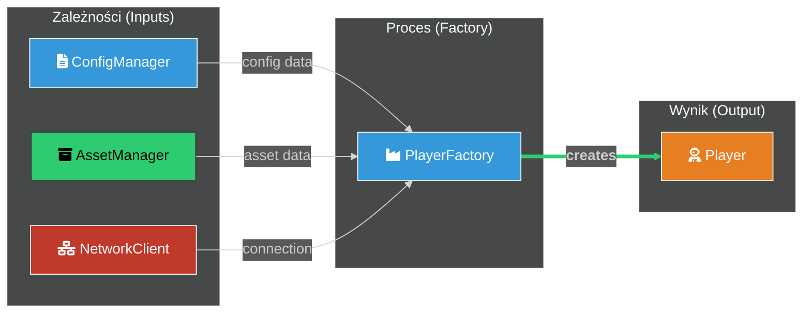
```mermaid
%%{init: {'theme': 'dark'}}%%
graph LR
    %% Pełna definicja stylów, w tym brakujący netsec
    classDef game fill:#e67e22,stroke:#fff,color:#fff;
    classDef core fill:#3498db,stroke:#fff,color:#fff;
    classDef subsystem fill:#2ecc71,stroke:#333,color:#000;
    classDef netsec fill:#c0392b,stroke:#fff,color:#fff;

    %% Zależności po lewej stronie
    subgraph "Zależności (Inputs)"
        Config["fa:fa-file-alt ConfigManager"]:::core;
        Assets["fa:fa-archive AssetManager"]:::subsystem;
        Network["fa:fa-network-wired NetworkClient"]:::netsec;
    end

    %% Proces w środku
    subgraph "Proces (Factory)"
        Factory["fa:fa-industry PlayerFactory"]:::core;
    end

    %% Wynik po prawej stronie
    subgraph "Wynik (Output)"
        Player["fa:fa-user-astronaut Player"]:::game;
    end

    %% --- Definicje Relacji ---
    %% Zależności "wpływają" do fabryki
    Config -- "config data" --> Factory;
    Assets -- "asset data" --> Factory;
    Network -- "connection" --> Factory;
    
    %% Fabryka "tworzy" produkt
    Factory -- "<strong>creates</strong>" --> Player;

    %% --- Stylizacja Linii ---
    %% Podkreślenie kluczowej relacji "creates"
    linkStyle 3 stroke:#2ecc71,stroke-width:4px;
```

---

### **Wariant 4: Wzorzec Kompaktowy (Wysoka Gęstość)**

*   **Kiedy stosować:** Gdy musimy pokazać grupę wielu małych, silnie powiązanych ze sobą klas (np. zestaw wyjątków, niestandardowe kontrolki UI). Użycie pełnych, dużych węzłów byłoby nieczytelne.
*   **Czego uczy:** Jak używać mniejszych węzłów (tylko nazwa i stereotyp) i orientacji `LR`, aby stworzyć zwarty, gęsty, ale wciąż czytelny diagram.
*   **Przykładowy Kod:**
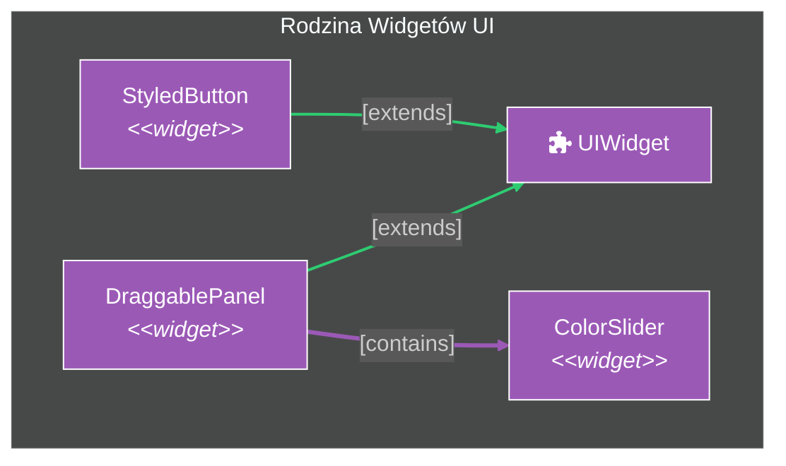
```mermaid
%%{init: {'theme': 'dark'}}%%
graph TD
    %% Definicja stylu dla warstwy UI
    classDef ui fill:#9b59b6,stroke:#fff,color:#fff;

    subgraph "Rodzina Widgetów UI"
        %% Klasa bazowa na górze
        Widget["fa:fa-puzzle-piece UIWidget"]:::ui;

        %% Klasy pochodne poniżej
        Button["StyledButton<br/><i>&lt;&lt;widget&gt;&gt;</i>"]:::ui;
        Panel["DraggablePanel<br/><i>&lt;&lt;widget&gt;&gt;</i>"]:::ui;
        
        %% Komponent zagnieżdżony jeszcze niżej
        Slider["ColorSlider<br/><i>&lt;&lt;widget&gt;&gt;</i>"]:::ui;
    end

    %% --- Definicje Relacji ---
    %% Strzałki idą OD klasy pochodnej DO klasy bazowej
    Button -- "[extends]" --> Widget;
    Panel -- "[extends]" --> Widget;
    Panel -- "[contains]" --> Slider;

    %% --- Stylizacja Linii ---
    linkStyle 0,1 stroke:#2ecc71,stroke-width:2px;
    %% Dziedziczenie = zielony
    linkStyle 2 stroke:#9b59b6,stroke-width:3px;
    %% Kompozycja = fioletowy
```

---


### Wzorzec Modelu Danych

Do wizualizacji modeli danych i schematów baz danych oferujemy dwa warianty, każdy dostosowany do innych potrzeb.

---

#### **Wariant 1: Szybki Szkic (`erDiagram`)**
*   **Kiedy stosować:** Do **szybkich, prostych szkiców**, gdzie liczy się tylko pokazanie encji i ich podstawowych relacji, a precyzyjny układ i stylizacja nie mają krytycznego znaczenia.
*   **Zalety:** Bardzo prosta i zwięzła składnia.
*   **Wady:** Brak kontroli nad układem, bardzo ograniczone możliwości stylizacji (nie wspiera naszego systemu `classDef`), co może prowadzić do nieczytelnego rozciągnięcia diagramu.
*   **Przykładowy Kod:**
    ```mermaid
    %%{init: {
      "theme": "dark",
      "themeVariables": {
        "primaryTextColor": "#e5e7eb", "secondaryColor": "#1f2937",
        "erEntityColor": "#0f172a", "erEntityTitleColor": "#9ca3af"
      }
    }}%%
    erDiagram
        CUSTOMER ||--|{ ORDER : places
        PRODUCT }|..|| LINE_ITEM : "is item for"
        ORDER ||--|{ LINE_ITEM : contains

        CUSTOMER {
            int id PK
            string name
            string email "unique"
        }
        ORDER {
            int id PK
            int customer_id FK
            datetime created_at
        }
        PRODUCT {
            int id PK
            string name
            decimal price "cannot be negative"
        }
        LINE_ITEM {
            int order_id FK
            int product_id FK
            int quantity
            decimal unit_price
        }
    ```

---

#### **Wariant 2: Zaawansowany Model (`graph` - Rekomendowany)**
*   **Kiedy stosować:** Zawsze, gdy **jakość wizualna, czytelność i precyzyjny układ mają znaczenie**. To jest nasz **oficjalny, rekomendowany wzorzec** dla finalnej, publicznej dokumentacji.
*   **Zalety:**
    *   **Pełna, manualna kontrola nad układem** za pomocą niewidzialnych linków.
    *   **Pełna integracja z naszym systemem `classDef`**, co pozwala na spójną stylizację.
    *   Możliwość użycia zaawansowanych funkcji, takich jak `linkStyle` i `click`.
*   **Wady:** Znacznie bardziej złożony i "gadatliwy" kod (użycie tabel HTML).
*   **Przykładowy Kod:**
    ```mermaid
    %%{init: {'theme': 'dark'}}%%
    graph TD
        %% Definicja stylu dla encji, spójna z estetyką erDiagram
        classDef entity fill:#0f172a,stroke:#9ca3af,color:#e5e7eb;

        %% --- Definicja Węzłów-Encji ---
        subgraph "Dane Klienta"
            CUSTOMER["
                <div style='padding:5px;'>
                    <div style='font-weight:bold; border-bottom:1px solid #9ca3af; margin-bottom:5px; text-align:center;'>CUSTOMER</div>
                    <table style='width:100%; text-align:left; font-size:14px;'>
                        <tr><td style='padding-right:10px;'><b>int id</b></td><td><i>PK</i></td></tr>
                        <tr><td>string name</td><td></td></tr>
                        <tr><td>string email</td><td><i>unique</i></td></tr>
                    </table>
                </div>
            "]:::entity;
        end;

        subgraph "Dane Produktu"
            PRODUCT["
                <div style='padding:5px;'>
                    <div style='font-weight:bold; border-bottom:1px solid #9ca3af; margin-bottom:5px; text-align:center;'>PRODUCT</div>
                    <table style='width:100%; text-align:left; font-size:14px;'>
                        <tr><td><b>int id</b></td><td><i>PK</i></td></tr>
                        <tr><td>string name</td><td></td></tr>
                        <tr><td>decimal price</td><td></td></tr>
                    </table>
                </div>
            "]:::entity;
        end;

        subgraph "Dane Zamówienia"
            ORDER["
                <div style='padding:5px;'>
                    <div style='font-weight:bold; border-bottom:1px solid #9ca3af; margin-bottom:5px; text-align:center;'>ORDER</div>
                    <table style='width:100%; text-align:left; font-size:14px;'>
                        <tr><td><b>int id</b></td><td><i>PK</i></td></tr>
                        <tr><td>int customer_id</td><td><i>FK</i></td></tr>
                        <tr><td>datetime created_at</td><td></td></tr>
                    </table>
                </div>
            "]:::entity;

            LINE_ITEM["
                <div style='padding:5px;'>
                    <div style='font-weight:bold; border-bottom:1px solid #9ca3af; margin-bottom:5px; text-align:center;'>LINE_ITEM</div>
                    <table style='width:100%; text-align:left; font-size:14px;'>
                        <tr><td>int order_id</td><td><i>FK</i></td></tr>
                        <tr><td>int product_id</td><td><i>FK</i></td></tr>
                        <tr><td>int quantity</td><td></td></tr>
                    </table>
                </div>
            "]:::entity;
        end;

        %% --- Niewidzialne Linki Sterujące Układem ---
        %% Tworzą "rusztowanie", które wymusza pozycje bloków obok siebie.
        CUSTOMER ~~~ PRODUCT;

        %% --- Widoczne Relacje ---
        CUSTOMER -- "places" --> ORDER;
        ORDER -- "contains" --> LINE_ITEM;
        PRODUCT -.->|"is item for"| LINE_ITEM;

        %% --- Interaktywność ---
        click CUSTOMER "#" "Przejdź do dokumentacji API Klienta";
    ```

---

### Wzorzec Mapy Myśli (`mindmap`)

**Kiedy:** Spis treści dokumentacji, moduły, funkcjonalności.

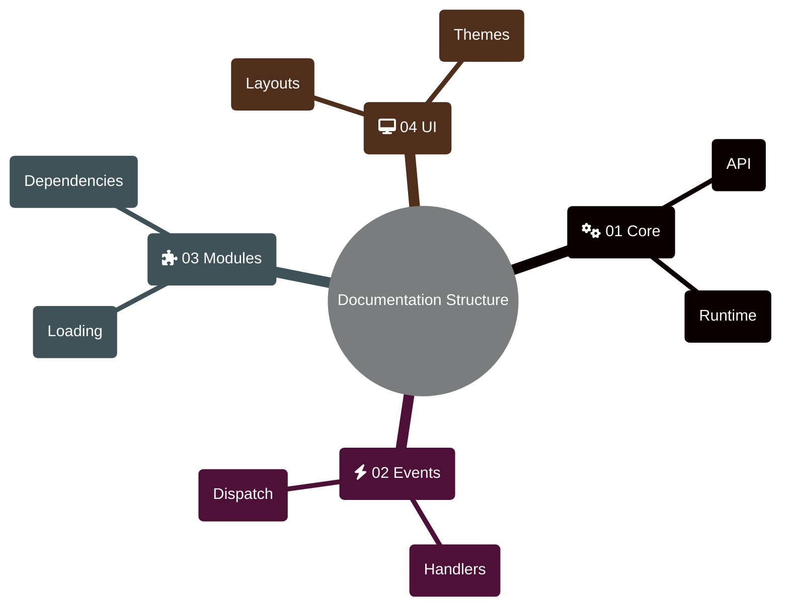
```mermaid
%%{init: {'theme': 'dark'}}%%
mindmap
  root((<font color="white">Documentation Structure</font>))
    %% --- Core ---
    "01 Core"("<font color='white'>fa:fa-cogs 01 Core</font>")
      ("<font color='white'>API</font>")
      ("<font color='white'>Runtime</font>")
    %% --- Game & Modules ---
    "02 Events"("<font color='white'>fa:fa-bolt 02 Events</font>")
      ("<font color='white'>Dispatch</font>")
      ("<font color='white'>Handlers</font>")
    "03 Modules"("<font color='white'>fa:fa-puzzle-piece 03 Modules</font>")
      ("<font color='white'>Loading</font>")
      ("<font color='white'>Dependencies</font>")
    %% --- UI ---
    "04 UI"("<font color='white'>fa:fa-desktop 04 UI</font>")
      ("<font color='white'>Layouts</font>")
      ("<font color='white'>Themes</font>")
```

---

### Część C: Czas i Planowanie

### Wzorzec Sekwencji Chronologicznej (`timeline`)

Diagramy `timeline` są doskonałym narzędziem do wizualizacji **uporządkowanej sekwencji zdarzeń lub kroków wzdłuż jednej osi**. Chociaż najczęściej jest to oś czasu, możemy ją kreatywnie wykorzystać do opisywania struktur i procesów.

> **Ograniczenie:** Stylizacja jest ograniczona do bloku `init` i `themeVariables`. Nie można stosować naszego systemu `classDef`. Poniższe wzorce używają oficjalnego motywu dla wszystkich diagramów `timeline`.

---

#### **Wariant 1: Startup OTClienta (Oś = Kroki Inicjalizacji)**

* **Cel:** Pokazać w jakiej kolejności OTClient inicjalizuje kolejne warstwy i subsystemy oraz gdzie mogą pojawić się problemy startowe.
* **Kiedy stosować:**

  * **Diagnostyka Startu:** Analiza, na którym etapie aplikacja się wysypuje lub blokuje.
  * **Onboarding Devów:** Szybki przegląd krytycznych kroków uruchamiania bez czytania całego kodu startowego.
  * **Dokumentacja Architektury:** Powiązanie etapów inicjalizacji z odpowiednimi modułami / katalogami.
* **Przykładowe użycie:** Pod diagramem linkujesz do sekcji `Core`, `Assets`, `UI`, `Network` i pokazujesz, które katalogi odpowiadają za dany krok.

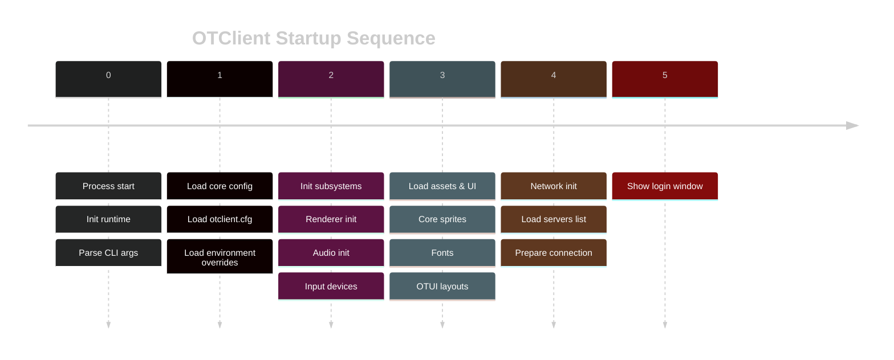
```mermaid
%%{init: {'theme': 'dark'}}%%
timeline
    title OTClient Startup Sequence
    0 : Process start
      : Init runtime
      : Parse CLI args
    1 : Load core config
      : Load otclient.cfg
      : Load environment overrides
    2 : Init subsystems
      : Renderer init
      : Audio init
      : Input devices
    3 : Load assets & UI
      : Core sprites
      : Fonts
      : OTUI layouts
    4 : Network init
      : Load servers list
      : Prepare connection
    5 : Show login window

```

---

#### **Wariant 2: Sekwencja Przestrzenna (Oś = Struktura)**

*   **Cel:** Kreatywne użycie `timeline` do stworzenia **wizualnego spisu treści** dla pliku, modułu lub nawet skomplikowanego interfejsu użytkownika. Oś reprezentuje tu przestrzeń (np. numery linii, sekcje UI), a nie czas.
*   **Kiedy stosować:**
    *   **Anatomia Pliku Źródłowego:** Aby szybko pokazać, gdzie w dużym pliku znajdują się kluczowe sekcje (nagłówki, konstruktory, główne metody).
    *   **Struktura Modułu/Katalogu:** Aby zwizualizować zawartość i przeznaczenie głównych podkatalogów w module.
    *   **Układ Interfejsu Użytkownika (OTUI):** Aby pokazać, jak widgety są zagnieżdżone i ułożone w pliku `.otui`.
*   **Przykładowy Kod (Anatomia Pliku):**
    ```mermaid
    %%{init: {'theme': 'dark'}}%%
    timeline
        title Anatomy of Player.cpp
        
        section Includes & Headers
            Lines 1-20 : Include dependencies (GameObject.h, Skill.h)
        
        section Class Definition & Constructor
            Lines 22-50 : Player class definition
                        : Constructor initializes health and mana
        
        section Core Logic
            Lines 52-100 : update() method (handles input)
            Lines 102-150 : attack() method (calculates damage)
        
        section Helper Methods
            Lines 152-200 : Private helper functions (e.g., check_stamina())
    ```

---

#### **Wariant 3: Sekwencja Procesu (Oś = Etapy Przetwarzania)**

*   **Cel:** Użycie `timeline` do pokazania **kolejnych etapów transformacji danych lub logiki biznesowej**. Skupia się na kolejności kroków, a nie na konkretnym czasie.
*   **Kiedy stosować:**
    *   **Cykl Życia Pakietu Sieciowego:** Pokazanie, jak pakiet jest tworzony, serializowany, wysyłany, odbierany i przetwarzany.
    *   **Pipeline Renderowania Grafiki:** Wizualizacja kolejnych etapów w klatce (np. Culling -> Shaders -> Post-processing).
    *   **Logika Biznesowa:** Opisanie kroków w złożonej operacji (np. przetwarzanie zakupu w sklepie w grze).
*   **Przykładowy Kod (Cykl Życia Pakietu):**
    ```mermaid
    %%{init: {'theme': 'dark'}}%%
    timeline
        title Network Packet Lifecycle (Client -> Server)
        
        section Client Side
            Step 1 : Create Packet
                   : (e.g., PlayerMovePacket)
            Step 2 : Serialize Data
                   : (object -> byte array)
            Step 3 : Send to Network
        
        section Transmission
            Step 4 : TCP/IP Transmission
        
        section Server Side
            Step 5 : Receive & Deserialize
                   : (byte array -> object)
            Step 6 : Process Logic
                   : (update player position)
            Step 7 : Send Confirmation (optional)
    ```
---

#### **Wariant 4: Lifecycle Modułu OTClienta (Oś = Etapy Życia Feature’a)**

* **Cel:** Zwizualizować cykl życia konkretnego modułu lub większej funkcjonalności (np. Inventory, Party UI, minimapa) od pomysłu do wyłączenia.
* **Kiedy stosować:**

  * **Roadmapa Techniczna:** Pokazanie, gdzie na osi życia znajduje się dany moduł (draft / beta / stable / legacy).
  * **Refactor & Cleanup:** Uzasadnienie, które elementy są do utrzymania, a które do wycięcia.
  * **Komunikacja w zespole:** Zamiast tabel „Status: WIP/Done/Deprecated” jeden czytelny timeline.
* **Przykładowe użycie:** Każdy etap może linkować w tekście do odpowiednich PR-ów, ticketów lub sekcji dokumentacji modułu.

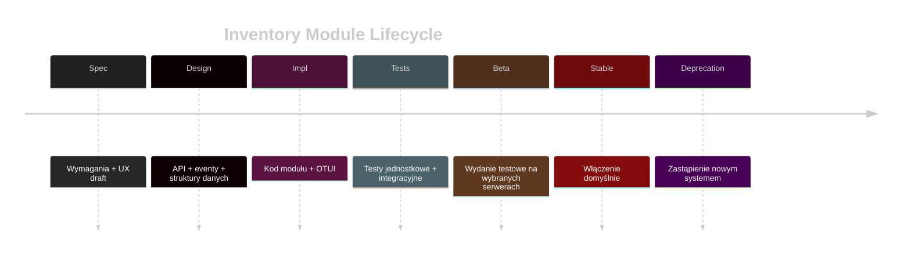
```mermaid
%%{init: {'theme': 'dark'}}%%
timeline
    title Inventory Module Lifecycle
    Spec : Wymagania + UX draft
    Design : API + eventy + struktury danych
    Impl : Kod modułu + OTUI
    Tests : Testy jednostkowe + integracyjne
    Beta : Wydanie testowe na wybranych serwerach
    Stable : Włączenie domyślnie
    Deprecation : Zastąpienie nowym systemem
```

---


#### **Wariant 5: Sesja Użytkownika jako High-level Oś Czasu (Oś = Flow Gracza)**

* **Cel:** Pokazać typowy przebieg sesji gracza w kliencie (od uruchomienia do wyjścia) na jednym prostym widoku.
* **Kiedy stosować:**

  * **User Journey Overview:** Przed szczegółowymi `sequenceDiagram` pokazującymi logowanie, wybór postaci, wejście do świata.
  * **Analiza Friction Points:** Oznaczenie kroków, gdzie najczęściej dochodzi do porzuceń (np. login, wybór świata).
  * **Powiązanie z Telemetrią:** Łatwe mapowanie eventów analitycznych do etapów sesji.
* **Przykładowe użycie:** `timeline` daje ogólny flow, a osobne diagramy (`sequenceDiagram`, `sankey-beta`) pokazują techniczne szczegóły lub proporcje w wybranych krokach.

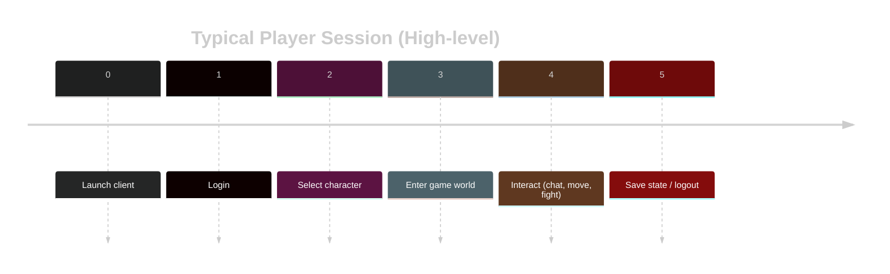
```mermaid
%%{init: {'theme': 'dark'}}%%
timeline
    title Typical Player Session (High-level)
    0 : Launch client
    1 : Login
    2 : Select character
    3 : Enter game world
    4 : Interact (chat, move, fight)
    5 : Save state / logout
```

---

### Wzorzec Harmonogramu Projektu (`gantt`)

Diagramy Gantta są doskonałym narzędziem do wizualizacji **planów, harmonogramów i zależności czasowych** w projektach. Ich siła leży w pokazywaniu, co, kiedy i przez jak długo ma być robione.

> **Ograniczenie:** Stylizacja jest ograniczona do bloku `init` i `themeVariables`. Nie można stosować naszego systemu `classDef`. Poniższe wzorce używają oficjalnego motywu dla wszystkich diagramów `gantt`.

---

#### **Wariant 1: Harmonogram Prac nad Dokumentacją**

*   **Cel:** Wizualizacja postępów w tworzeniu i aktualizacji dokumentacji technicznej. Pozwala szybko zidentyfikować, które rozdziały są ukończone, które są w trakcie, a które jeszcze nie zostały rozpoczęte.
*   **Kiedy stosować:** W plikach `README.md` lub na głównej stronie dokumentacji, aby pokazać status projektu dokumentacyjnego.
*   **Przykładowy Kod:**
    ```mermaid
    %%{init: { "theme": "dark" }}%%
    gantt
        title Status Dokumentacji Technicznej
        dateFormat  YYYY-MM-DD
        axisFormat %b %Y
        
        section Struktura i API
        Dokumentacja Core API      :done, doc1, 2024-01-01, 30d
        Dokumentacja UI API        :active, doc2, 2024-02-01, 30d
        Dokumentacja Modułów API   :doc3, after doc2, 30d
        
        section Poradniki i Wzorce
        Przepisanie Wzorców        :done, guide1, 2024-01-15, 45d
        Poradnik Tworzenia Modułu  :crit, active, guide2, after guide1, 30d
    ```

---

#### **Wariant 2: Analiza Czasu Cyklu Życia Modułu (`otmod`)**

*   **Cel alternatywny:** Użycie `gantt` do wizualizacji, ile czasu (w milisekundach) zajmują poszczególne etapy w cyklu życia modułu podczas startu gry.
*   **Kiedy stosować:** W dokumentacji modułów, aby pokazać deweloperom, które etapy są najbardziej kosztowne czasowo i gdzie powinni optymalizować swój kod.
*   **Przykładowy Kod:**
    ```mermaid
    %%{init: { "theme": "dark" }}%%
    gantt
        title Cykl Życia Modułu "SuperFeature" (w ms)
        dateFormat SSS
        axisFormat %Lms
        
        section Ładowanie
        Wczytywanie pliku modułu :done, load1, 0, 50ms
        Parsowanie manifestu     :done, load2, after load1, 20ms
        
        section Inicjalizacja
        Wywołanie `onLoad()`      :crit, done, init1, after load2, 150ms
        Rejestracja widgetów     :done, init2, after init1, 30ms
        
        section Aktywacja
        Wywołanie `onEnable()`    :active, enable1, after init2, 10ms
    ```
    **Interpretacja:**
    *   Diagram jasno pokazuje, że funkcja `onLoad()` jest "wąskim gardłem" i zajmuje najwięcej czasu (150ms) podczas ładowania tego modułu.

---

#### **Wariant 3: Analiza Wydajności Startu Klienta (Profiling)**

*   **Cel alternatywny:** Użycie `gantt` do zwizualizowania **rzeczywistego profilu wydajności** podczas uruchamiania `otclient`. Pokazuje, które podsystemy najbardziej spowalniają start.
*   **Kiedy stosować:** W dokumentacji `Core`, aby zilustrować architekturę startową i zidentyfikować potencjalne obszary do optymalizacji.
*   **Przykładowy Kod:**
    ```mermaid
    %%{init: { "theme": "dark" }}%%
    gantt
        title Profil Wydajności Startu Klienta (w ms)
        dateFormat SSS
        axisFormat %Lms
        
        section Inicjalizacja Niskopoziomowa
        Start Aplikacji       :done, s1, 0, 10ms
        Inicjalizacja Okna    :done, s2, after s1, 50ms
        
        section Ładowanie Podsystemów
        ConfigManager         :done, sub1, after s2, 25ms
        Logger                :done, sub2, after s2, 15ms
        AssetManager          :crit, active, sub3, after sub2, 350ms
        
        section Faza Końcowa
        ModuleManager         :done, f1, after sub3, 120ms
        Wyświetlenie UI       :f2, after f1, 40ms
    ```
    **Interpretacja:**
    *   Diagram natychmiast ujawnia, że `AssetManager` jest krytycznym "blokerem", który zajmuje 350ms i wstrzymuje cały dalszy proces uruchamiania.

---

### Wzorzec Grafu Zależności / Historii (`gitGraph`)

`gitGraph` jest projektowany głównie do wizualizacji **historii Git i strategii branchowania**. Można go kreatywnie użyć w dokumentacji, ale tylko tam, gdzie dane da się sensownie przedstawić jako „gałęzie + commity + merge”.

> **Ograniczenia:**
> - Stylizacja jest bardzo ograniczona (bez `classDef`, minimalny wpływ `themeVariables`).
> - Składnia jest mocno specyficzna dla Gita: `commit`, `branch`, `checkout`, `merge`, `tag`.
> - Nadaje się do „historii i wariantów”, **nie** do dokładnego modelowania dowolnego DAG ani dziedziczenia klas (do tego jest `classDiagram`).

Dlatego traktujemy `gitGraph` jako wzorzec do:
- pokazywania strategii pracy z repozytorium,
- ilustrowania cyklu releasów i hotfixów,
- wizualizacji alternatywnych ścieżek rozwoju (np. eksperymentalne feature’y).

---

#### **Wariant 1: Strategia Branchowania w Projekcie (Git Workflow)**

**Cel:** Zdefiniowanie zalecanego przepływu pracy w Git dla OTClienta (main, feature branches, hotfixy).  
**Kiedy stosować:** W `CONTRIBUTING.md`, dokumentacji deweloperskiej, onboarding nowych kontrybutorów.  
**Czego uczy:** Jak powstają gałęzie, gdzie robić feature, gdzie hotfix, co trafia do releasu.


```mermaid
%%{init: {'theme': 'dark'}}%%
gitGraph
    commit id: "v2.0.0" tag: "v2.0.0"

    branch feature/new-ui
    checkout feature/new-ui
    commit id: "UI Draft"
    commit id: "UI Final"

    checkout main
    branch hotfix/login-bug
    checkout hotfix/login-bug
    commit id: "Fix Login"

    checkout main
    merge hotfix/login-bug

    checkout feature/new-ui
    commit id: "Rebase on main"

    checkout main
    merge feature/new-ui
    commit id: "v2.1.0" tag: "v2.1.0"
````

**Jak użyć:**

* Pokazujesz konkretny, wspierany workflow zamiast opisu słownego.
* Możesz dodać pod spodem listę zasad:

  * `main` zawsze releasowalny,
  * feature’y tylko w branchach,
  * hotfix → osobna gałąź → merge do `main`.

---

#### **Wariant 2: Ścieżki Rozwoju Feature’a (Eksperymentalne vs Stabilne)**

**Cel:** Pokazać, jak jeden większy feature OTClienta rozwija się w kilku gałęziach (np. eksperymentalne UI, nowe efekty), z merge’ami tylko stabilnych elementów.
**Kiedy stosować:** W dokumentacji większych zmian, aby wytłumaczyć „czemu są 3 podobne gałęzie”.

```mermaid
%%{init: {'theme': 'dark'}}%%
gitGraph
    commit id: "Feature: New Inventory (spec)"

    branch ui
    checkout ui
    commit id: "UI layout draft"
    commit id: "UI layout stable"

    branch backend
    checkout backend
    commit id: "Server sync logic"
    commit id: "Validation and security"

    branch fx
    checkout fx
    commit id: "Fancy animations"
    commit id: "Performance issues"

    checkout main
    merge ui
    merge backend
    %% fx nie jest mergowany (pozostaje eksperymentalny)
    commit id: "Inventory v1 (no heavy FX)" tag: "stable"
```

**Jak użyć:**

* Jasno tłumaczy:

  * co weszło do stabilnej wersji,
  * które gałęzie są eksperymentalne / odrzucone,
* Lepsze niż opis typu „mieliśmy parę prób, coś się z tego ostało”.

---

#### **Wariant 3: Asset Pipeline / Build Branches (Opcjonalne, Ostrożne)**

**Cel:** Pokazać high-level koncepcję, że różne „linie” przygotowania assetów zbiegają się w finalny build.
**Uwaga:** To jest kreatywne użycie, **tylko jeśli** opowiadasz historię procesu zbliżoną do workflow Gita. Jeśli chcesz precyzyjne proporcje i przepływy, użyj `sankey-beta`.

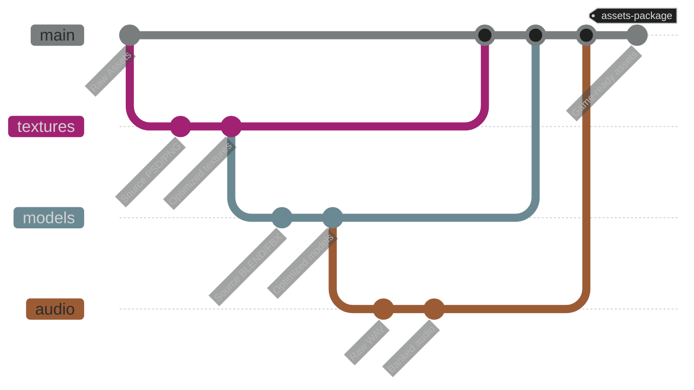
```mermaid
%%{init: {'theme': 'dark'}}%%
gitGraph
    commit id: "Raw Assets"

    branch textures
    checkout textures
    commit id: "Source PSD/PNG"
    commit id: "Optimized textures"

    branch models
    checkout models
    commit id: "Source BLEND/FBX"
    commit id: "Optimized models"

    branch audio
    checkout audio
    commit id: "Raw WAV"
    commit id: "Banked audio"

    checkout main
    merge textures
    merge models
    merge audio
    commit id: "Game-ready assets" tag: "assets-package"
```

**Jak użyć:**

* Jako **metafora**: różne ścieżki przygotowania kontentu zbiegają się w jeden punkt „Game-ready assets”.
* Jeśli zaczynasz upychać tu liczby albo prawdziwe zależności, przejdź na:

  * `sankey-beta` dla przepływów,
  * `flowchart` dla etapów procesu.

#### **Wariant 4: Struktura Dziedziczenia i Zależności Funkcji**

*   **Cel alternatywny:** Użycie `gitGraph` do stworzenia zwartej wizualizacji **zależności między funkcjami lub hierarchii dziedziczenia**. "Commity" reprezentują poszczególne funkcje lub klasy, a "gałęzie" i "merge" pokazują, jak są one ze sobą powiązane.
*   **Kiedy stosować:** Do szybkiego pokazania, jak bardziej złożona funkcja jest zbudowana z mniejszych, pomocniczych funkcji, lub jak klasa `Player` dziedziczy i łączy w sobie funkcjonalności z wielu klas bazowych.
*   **Przykładowy Kod:**
    ```mermaid
    %%{init: {'theme': 'dark'}}%%
    gitGraph
        %% 'main' reprezentuje klasę bazową GameObject
        commit id: "GameObject"
        
        branch "Drawable"
        checkout "Drawable"
        commit id: "draw()"
        
        branch "Clickable"
        checkout "Clickable"
        commit id: "onClick()"
        
        checkout main
        %% Character dziedziczy po GameObject
        commit id: "Character"
        
        branch "Player"
        checkout "Player"
        %% Player dziedziczy po Character
        commit id: " "
        
        %% Player "łączy w sobie" funkcjonalności z innych gałęzi
        merge "Drawable"
        merge "Clickable"
        commit id: "Player Ready" tag: "Final Class"
    ```

---

### Czego NIE robić `gitGraph`:

* Nie rysuj nim:

  * hierarchii dziedziczenia (`classDiagram` jest do tego),
  * zależności modułów (`flowchart` / `erDiagram`),
  * ogólnych DAG-ów biznesowych.
* Traktuj go jako:

  * „diagram historii i wariantów”, nie „multi-tool do wszystkiego”.

---


## Część D: Wizualizacja Danych i Analiza

### Wzorzec Dystrybucji Danych (`pie`)

`pie` służy do pokazania **proporcji** w jednym wymiarze. Jest prosty, ograniczony i dokładnie o to chodzi.

**Kiedy stosować:**

- udział typów błędów,
- udział platform / środowisk,
- udział modułów w ruchu / zdarzeniach / ticketach,
- szybki „snapshot” bez potrzeby pełnego `sankey-beta`.

> Jeśli zaczynasz kombinować z więcej niż 6–7 kategoriami, użyj czegoś innego.

---

#### Wariant 1: Typy Błędów w Kliencie

**Cel:** Pokazać, co naprawdę psuje użytkownikom dzień.

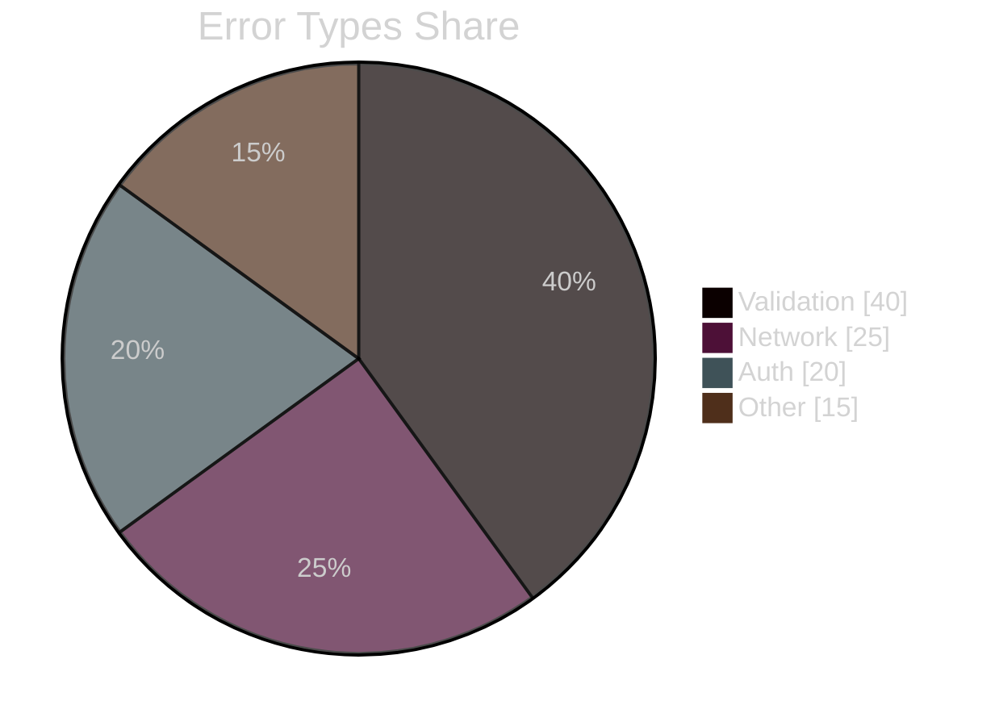
```mermaid
%%{init: {'theme': 'dark'}}%%
pie showData
    title Error Types Share
    "Validation" : 40
    "Network" : 25
    "Auth" : 20
    "Other" : 15
```

**Jak użyć:**
Opis pod spodem: dane z crash reporter + logów za ostatni okres. Szybki argument, gdzie inwestować w stabilizację.

---

#### Wariant 2: Udział Platform / Środowisk

**Cel:** Pokazać, gdzie OTClient jest realnie używany.

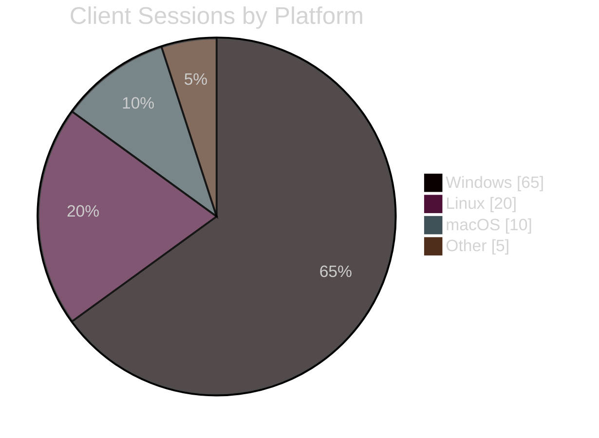
```mermaid
%%{init: {'theme': 'dark'}}%%
pie showData
    title Client Sessions by Platform
    "Windows" : 65
    "Linux" : 20
    "macOS" : 10
    "Other" : 5
```

**Jak użyć:**
Uzasadnia priorytety: testy, optymalizacje, bugfixy per platforma, bez wypisywania tego w tabelkach.

---

#### Wariant 3: Udział Modułów w Zgłoszeniach Bugów

**Cel:** Pokazać, które obszary kodu generują najwięcej problemów.

```mermaid
%%{init: {'theme': 'dark'}}%%
pie showData
    title Bug Reports by Module
    "UI" : 30
    "Network" : 25
    "Inventory" : 15
    "Rendering" : 20
    "Other" : 10
```

**Jak użyć:**

* Pomaga zdecydować, które moduły docelowo dostać:

  * więcej testów,
  * więcej dokumentacji,
  * własne diagramy (`flowchart`, `sequenceDiagram`).

---

To wystarczy. `pie` jest narzędziem jednowymiarowym. Jak tylko próbujesz pokazać coś bardziej złożonego niż „udział X w Y”, przesiadasz się na `sankey-beta`, `xychart-beta` albo `quadrantChart`.


---

### Wzorzec Analizy Strategicznej (`quadrantChart`)

`quadrantChart` służy do podejmowania decyzji na podstawie **dwóch wymiarów**. Typowe zastosowania:

- wartość vs złożoność,
- ryzyko vs krytyczność,
- pokrycie testami vs złożoność,
- wpływ na użytkownika vs koszt utrzymania.

Dobre tam, gdzie normalnie robisz tabelkę „Feature / Value / Cost / Risk”, a każdy interpretuje ją inaczej.

> Jeśli Twój renderer nie wspiera `quadrantChart`, traktuj ten wzorzec jako opcjonalny.

---

#### Wariant 1: Priorytetyzacja Feature’ów OTClienta

**Cel:** Określić, które funkcje robić najpierw, patrząc na stosunek wartości do złożoności.

```mermaid
%%{init: {
  "theme": "dark",
  "quadrantChart": {
    "chartWidth": 600,
    "chartHeight": 380,
    "titleFontSize": 18,
    "quadrantLabelFontSize": 13,
    "xAxisLabelFontSize": 12,
    "yAxisLabelFontSize": 12,
    "quadrantInternalBorderStrokeWidth": 1,
    "quadrantExternalBorderStrokeWidth": 2,
    "xAxisPosition": "bottom",
    "yAxisPosition": "left"
  }
}}%%
quadrantChart
    title Feature Prioritization (Value vs Complexity)
    x-axis Low Complexity --> High Complexity
    y-axis Low Value --> High Value

    quadrant-1 Quick Wins
    quadrant-2 Strategic Bets
    quadrant-3 Fillers
    quadrant-4 Avoid

    "Improved Logging UI": [0.2, 0.7]
    "Inventory QoL": [0.3, 0.9]
    "New Theme System": [0.6, 0.8]
    "Full Engine Rewrite": [0.95, 0.6]
    "Obscure Debug Panel": [0.4, 0.2]
```

**Jak użyć:**

* Quick Wins (Q1) → kandydaci na najbliższy sprint.
* Q2 → wysoka wartość, ale wymagają decyzji architektonicznej.
* Q4 → kulturalny parking dla pomysłów, których nie warto ruszać.

---

#### Wariant 2: Tech Debt vs Ryzyko Produkcyjne

**Cel:** Pokazać, które długi techniczne są realnym zagrożeniem, a które są tylko estetycznym wstydem.

```mermaid
%%{init: {'theme': 'dark'}}%%
quadrantChart
    title Tech Debt (Risk vs Criticality)
    x-axis Low Risk --> High Risk
    y-axis Cosmetic --> Critical

    quadrant-1 Monitor
    quadrant-2 Fix Soon
    quadrant-3 Low Priority
    quadrant-4 Immediate Action

    "Legacy NetClient": [0.9, 0.95]
    "Ad-hoc Logging": [0.7, 0.8]
    "Old UI Skin Code": [0.2, 0.2]
    "Custom Build Script": [0.4, 0.5]
```

**Jak użyć:**

* Q4 → tu pakujesz czas najpierw, bez dyskusji.
* Q1 → obserwuj, ale nie dramatyzuj.
* Zastępuje losowe listy „critical/high/medium/low”.

---

#### Wariant 3: Moduły vs Testowalność / Złożoność

**Cel:** Wskazać moduły wymagające testów, dokumentacji i diagramów w pierwszej kolejności.

```mermaid
%%{init: {'theme': 'dark'}}%%
quadrantChart
    title Modules (Coverage vs Complexity)
    x-axis Low Coverage --> High Coverage
    y-axis Low Complexity --> High Complexity

    quadrant-1 Safe Zone
    quadrant-2 Overprotected
    quadrant-3 Blind Spot
    quadrant-4 Critical Risk

    "Core Engine": [0.3, 0.9]
    "Modules System": [0.4, 0.8]
    "UI Layouts": [0.7, 0.5]
    "Network Layer": [0.2, 0.8]
    "Assets Tools": [0.6, 0.4]
```

**Jak użyć:**

* Q3 + Q4 → lista miejsc do:

  * dopisania testów,
  * opisania w dokumentacji,
  * narysowania (`flowchart`, `sequenceDiagram`).
* Diagram działa jako radar, gdzie realnie przyłożyć wysiłek.

---

### Zasady użycia `quadrantChart` w tej dokumentacji

* Stosuj, gdy masz N opcji i 2 sensowne osie porównania.
* Nie stosuj, gdy opisujesz:

  * czas (`timeline`),
  * przepływy (`sankey-beta`),
  * strukturę (`classDiagram`, `erDiagram`).

---

### Wzorzec Danych XY (`xychart-beta`)

**Kiedy:** Wydajność, metryki, trendy, porównanie stanu realnego z celem i kosztu (np. obciążenie GPU).

```mermaid
%%{init: {'theme': 'dark'}}%%
xychart-beta
    title "FPS vs Objects (detailed)"
    x-axis "Objects" [0, 100, 500, 1000, 2000]
    y-axis "FPS" 0 --> 140

    %% Główna linia: realnie zmierzony FPS
    line "Measured FPS" [120, 115, 95, 70, 40]

    %% Linia referencyjna: oczekiwany minimalny poziom
    line "Target 90 FPS" [90, 90, 90, 90, 90]

    %% Słupki: obciążenie GPU w % przy tych samych punktach pomiarowych
    bar "GPU Load (%)" [20, 35, 55, 75, 95]
```

Legenda (opis pod diagramem, nie w kodzie):

* **Measured FPS** – realne wyniki benchmarku klienta.
* **Target 90 FPS** – minimalny akceptowalny poziom wydajności.
* **GPU Load (%)** – koszt osiągnięcia danego FPS przy rosnącej liczbie obiektów.

> Uwaga: `xychart-beta` nie wspiera `click` w sposób stabilny w każdym rendererze. Jeśli potrzebujesz nawigacji, dodaj linki Markdown w tekście obok wykresu (np. do rozdziału o benchmarkach lub optymalizacjach).mermaid
> %%{init: {'theme': 'dark'}}%%

> xychart-beta

> title "FPS vs Objects"

> x-axis "Objects" 0 2000

> y-axis "FPS" 0 140

> line "FPS"
> 0 120
> 100 115
> 500 95
> 1000 70
> 2000 40

---

## Część E: Techniki Zaawansowane

### Złożony Wzorzec Wizualizacji (Łączenie Diagramów)

* jeden Overview,
* mapę modułów powiązaną z rozdziałami,
* przykład interakcji modułu z Core,
* zero czarnego tekstu na czarnym,
* zero HTML w `mindmap`,
* sensowne linki między diagramami.

---

### Diagram 1: Przegląd architektury (wejście do wszystkiego)

Ulepszenia:

* Core jako centralny węzeł.
* Dodatkowe bloki: Storage, Telemetry.
* Jasne klasy wizualne.
* Klikalne przejścia do innych sekcji/diagramów.

```mermaid
%%{init: {
  "theme": "dark",
  "themeVariables": {
    "primaryColor": "#111827",
    "primaryTextColor": "#e5e7eb",
    "lineColor": "#4b5563",
    "fontFamily": "Inter, system-ui, sans-serif"
  }
}}%%
flowchart TD
    classDef core fill:#3498db,stroke:#ffffff,color:#ffffff
    classDef subsystem fill:#2ecc71,stroke:#ffffff,color:#ffffff
    classDef game fill:#e67e22,stroke:#ffffff,color:#ffffff
    classDef ui fill:#9b59b6,stroke:#ffffff,color:#ffffff
    classDef netsec fill:#c0392b,stroke:#ffffff,color:#ffffff
    classDef platform fill:#7f8c8d,stroke:#ffffff,color:#ffffff
    classDef critical fill:#e74c3c,stroke:#ffffff,color:#ffffff
    classDef legend fill:#111827,stroke:#4b5563,color:#9ca3af,stroke-dasharray:3 3

    Core["⚙️ Core Engine"]:::core
    GameLogic["🔥 Game Modules"]:::game
    UiLayer["🎨 UI Layer"]:::ui
    NetStack["🔌 Net & Security"]:::netsec
    Subsys["🟩 Subsystems"]:::subsystem
    Telemetry["📈 Telemetry / Logging"]:::subsystem
    Platform["🔳 Platform"]:::platform

    Core ==> GameLogic
    Core ==> UiLayer
    Core ==> NetStack
    Core --> Subsys
    Core --> Telemetry
    Core --> Platform
    NetStack -.-> Telemetry
    GameLogic -.-> Telemetry

    %% Legend / nawigacja
    L["Core = niebieski<br/>Game = pomarańczowy<br/>UI = fiolet<br/>Net/Sec = czerwony<br/>Subsystems = zielony<br/>Platform = szary"]:::legend
    Core --- L

    click Core "../01_core/" "Core Engine docs"
    click GameLogic "../03_modules/" "Game Modules docs"
    click UiLayer "../04_ui/" "UI docs"
    click NetStack "../05_network/" "Networking & Security"
    click Subsys "../11_data/" "Subsystems / Data"
    click Telemetry "../09_logging/" "Telemetry & Logging"
    click Platform "../14_android/" "Platform-specific code"

```

To jest główna mapa. Każdy inny diagram jest zoomem w jeden z tych boxów.

---

### Diagram 2: Mapa modułów (bez HTML syfu, spięta z rozdziałami)

Ulepszenia:

* Kolory przez `classDef`, żadnych `<font>`.
* Moduły odpowiadają rozdziałom dokumentacji.
* Od razu gotowe pod anchory w treści.

```mermaid
%%{init: {
  "theme": "dark",
  "themeVariables": {
    "primaryTextColor": "#e5e7eb",
    "secondaryTextColor": "#e5e7eb",
    "tertiaryTextColor": "#e5e7eb",
    "lineColor": "#4b5563",
    "fontFamily": "Inter, system-ui, sans-serif"
  }
}}%%
mindmap
  root((<font color="white">Documentation Hub</font>))
    "🟦 01 Core — Core Engine & Runtime"("<font color='white'>fa:fa-bolt 02 Events</font>")
      ("<font color='white'>Core API</font>")
      ("<font color='white'>Engine Loop</font>")
    "🟧 02 Events & Modules"("<font color='white'>fa:fa-bolt 02 Events</font>")
      ("<font color='white'>Event Dispatch</font>")
      ("<font color='white'>Module Contracts</font>")
    "🟪 03 UI — Layouts & OTUI"("<font color='white'>fa:fa-bolt 02 Events</font>")
      ("<font color='white'>Layouts</font>")
      ("<font color='white'>Widgets / HUD</font>")
    "🟥 04 Networking & Security"("<font color='white'>fa:fa-bolt 02 Events</font>")
      ("<font color='white'>Protocols</font>")
      ("<font color='white'>Crypto / Settings</font>")
    "🟩 05 Subsystems — Assets & Data"("<font color='white'>fa:fa-bolt 02 Events</font>")
      ("<font color='white'>Assets</font>")
      ("<font color='white'>Data Pipelines</font>")
    "🔳 06 Platform"("<font color='white'>fa:fa-bolt 02 Events</font>")
      ("<font color='white'>Desktop</font>")
      ("<font color='white'>Android</font>")
```

Jeśli chcesz, agent może tu podmieniać etykiety na podstawie CSV (kolumna `chapter`, `topics[]`) i zachowywać klasy.

---

### Diagram 3: Interakcja modułu z Core (konkretny przykład)

Ulepszenia:

* Pokazujesz realny przepływ: klient -> moduł -> Core -> Storage.
* Nadaje sens temu, po co są wcześniejsze mapy.

```mermaid
%%{init: {
  "theme": "dark",
  "securityLevel": "loose",
  "themeVariables": {
    "fontFamily": "Inter, system-ui, sans-serif",
    "actorBorder": "#3498db",
    "actorBackground": "#020817",
    "actorTextColor": "#e5e7eb",
    "signalColor": "#2ecc71",
    "signalTextColor": "#e5e7eb",
    "activationBorderColor": "#facc15",
    "activationBackgroundColor": "#111827",
    "noteBorderColor": "#4b5563",
    "noteBackgroundColor": "#0f172a",
    "noteTextColor": "#e5e7eb",
    "lineColor": "#4b5563"
  },
  "sequence": {
    "messageFontSize": 22,
    "actorFontSize": 20,
    "noteFontSize": 18,
    "sequenceNumberFontSize": 16
  }
}}%%
sequenceDiagram
    autonumber

    box rgba(15,23,42,0.96) Client / UI 🟪 ui
        participant GC as 🎮 UI Client
    end

    box rgba(9,9,11,0.96) Game Logic 🟧 game / 🟦 core
        participant CM as 🧩 CombatModule
        participant CORE as ⚙️ CoreAPI
    end

    box rgba(17,24,39,0.96) Infra & Net 🟩 subsystem / 🟥 netsec
        participant DB as 🗃️ Storage
        participant LOG as 📈 Telemetry
        participant NET as 🔌 NetClient
    end

    rect rgba(56,189,248,0.14)
        note over GC,LOG: Hot path: attack → damage calc → persist → telemetry
    end

    GC->>+CM: onAttack(target, ability)
    CM->>+CORE: requestDamageCalc(ctx)
    CORE-->>-CM: damageResult
    CM->>+DB: persistHit(damageResult)
    DB-->>-CM: ack
    CM->>LOG: logCombatEvent(damageResult)

    alt Core error
        CORE-->>CM: error(code)
        CM->>GC: showErrorToast(code)
        CM->>LOG: logError("damageCalc_failed", code)
    else High latency
        note over CORE,DB: markSlowCall()
        CM->>LOG: logWarning("damageCalc_slow")
    end

    rect rgba(148,163,253,0.12)
        note over LOG: Events z tej ścieżki zasilają dashboard, alerty, audyt
    end

    %% Actor menu links (jeśli środowisko wspiera)
    link GC: UI docs @ ../04_ui/
    link CM: CombatModule @ ../03_modules/combat.md
    link CORE: Core API @ ../01_core/core_api.md
    link DB: Storage layer @ ../11_data/storage.md
    link LOG: Telemetry @ ../09_logging/telemetry.md
    link NET: Net client @ ../05_network/client.md

```

---
```mermaid
%%{init: {
  "theme": "dark",
  "securityLevel": "loose",
  "themeVariables": {
    "actorBorder": "#3498db",
    "actorTextColor": "#e5e7eb"
  }
}}%%
sequenceDiagram
    participant GC as UI Client
    participant CORE as CoreAPI

    GC->>CORE: requestDamageCalc()
    CORE-->>GC: damageResult

    %% Actor menu links:
    link GC: UI docs @ ../04_ui/
    link CORE: Core API @ ../01_core/core_api.md
```


---

### Diagram 4: Sankey: dwa przypadki `sankey-beta`.
* 4A = szczegółowa analiza jednego hot path,
* 4B = strategiczny podział ruchu między modułami.

### Diagram 4A: Sankey — Hot path: request → Core → Storage/Telemetry

**Cel:** pokazać faktyczny przepływ jednego krytycznego scenariusza (np. atak z Diagramu 3): którędy idzie ruch, gdzie lądują dane, gdzie generują się logi.

```mermaid
%%{init:{
  "theme":"dark",
  "themeVariables":{
    "primaryTextColor":"#e5e7eb",
    "fontFamily":"Inter, system-ui, sans-serif"
  }
}}%%
sankey-beta
    UI_Client,CombatModule,100
    CombatModule,CoreAPI,100
    CoreAPI,Cache,80
    Cache,Storage,80
    CoreAPI,Storage,20
    CoreAPI,Telemetry,40
    CombatModule,Telemetry,20
    UI_Client,NetClient,10
    NetClient,CoreAPI,10
```

**Jak to czytać:**

* szerokość strumienia = udział ruchu / zapisów,
* `UI_Client → CombatModule → CoreAPI` = główna ścieżka z Diagramu 3,
* większość trafia do `Cache/Storage`, część do `Telemetry`,
* `UI_Client → NetClient → CoreAPI` pokazuje koszt transportu sieciowego,
* używasz tego diagramu przy rozmowie o bottleneckach, cache, IO i logowaniu dla konkretnego flow.

---

### Diagram 4B: Sankey — Rozkład ruchu między modułami (porównanie profili)

**Cel:** inny przypadek użycia. Nie pojedynczy hot path, tylko jak cały klient rozrzuca ruch na moduły i jak to przekłada się na Storage/Telemetry. Dobry do priorytetyzacji optymalizacji.

```mermaid
%%{init:{
  "theme":"dark",
  "themeVariables":{
    "primaryTextColor":"#e5e7eb",
    "fontFamily":"Inter, system-ui, sans-serif"
  }
}}%%
sankey-beta
    %% UI dzieli ruch na moduły
    UI_Client,Combat_Module,40
    UI_Client,Inventory_Module,30
    UI_Client,Social_Module,30

    %% Wszystko ląduje w Core
    Combat_Module,CoreAPI,40
    Inventory_Module,CoreAPI,30
    Social_Module,CoreAPI,30

    %% Zapis do Storage (persist)
    Combat_Module,Storage,20
    Inventory_Module,Storage,20
    Social_Module,Storage,10

    %% Telemetria (observability)
    Combat_Module,Telemetry,20
    Inventory_Module,Telemetry,10
    Social_Module,Telemetry,5
```

**Jak to czytać:**

* pokazuje, które moduły naprawdę generują koszt (I/O + logi),
* widać, że Combat dominuje, Inventory jest istotne, Social jest tańszy,
* ten diagram służy do:

  * decyzji „który moduł optymalizujemy pierwszy”,
  * mapowania priorytetów logowania i retencji danych,
  * spięcia z Overview (moduły) i ER (tabele Storage/Telemetry).

Możesz w tekście obok doprecyzować mapowanie ID → kolory/specyfikacja, np.:

* `UI_Client` = UI (🟪),
* `CombatModule` / `Combat_Module` = Logika gry (🟧),
* `CoreAPI` = Core (🟦),
* `Storage` / `Telemetry` = Subsystems (🟩),
* `NetClient` = Networking (🟥).

---

### Diagram 5: ERDiagram jako zaawansowany model danych

Ten rozdział pokazuje „production-ready” modele danych w dwóch warstwach:
- `erDiagram` — formalny model relacyjny (pod SQL / migracje / kontrakty).
- `graph` — „kafelkowy” i kompozytowy widok encji jako advanced usage Mermaida (subgraphy, style, relacje domenowe).

Trzy perspektywy:
- 5A — ekwipunek, ekonomia i assety gry.
- 5B — telemetria hot path i SLO.
- 5C — audyt, integralność i PII.

Każda ma wariant „+” pokazujący alternatywny styl i szersze możliwości.

---

### Diagram 5A: ER — Ekwipunek, ekonomia i assety gry

**Cel:** model itemów, wariantów i loadoutów spójny z warstwą Game **(game)** i asset Subsystems **(subsystem)**.

```mermaid
%%{init:{
  "theme":"dark",
  "themeVariables":{
    "primaryTextColor":"#e5e7eb",
    "erEntityColor":"#020817",
    "erEntityBorderColor":"#9ca3af",
    "erEntityTitleColor":"#93c5fd"
  }
}}%%
erDiagram
    PLAYER ||--o{ INVENTORY_SLOT : has
    ITEM ||--o{ INVENTORY_SLOT : can_occupy
    ITEM ||--o{ ITEM_VARIANT : has_version
    PLAYER ||--o{ LOADOUT_PRESET : owns
    PLAYER ||--o{ WALLET : holds
    WALLET ||--o{ CURRENCY_TRANSACTION : records
    ITEM ||--o{ ITEM_TAG_MAP : tagged_as
    ITEM_TAG ||--o{ ITEM_TAG_MAP : defines
    ITEM ||--o{ COSMETIC_SKIN : has_skin
    SHOP_OFFER ||--o{ SHOP_OFFER_ITEM : bundles

    PLAYER {
      int player_id PK
      string name "unique"
      int level
    }

    ITEM {
      int item_id PK
      string name
      int base_tier
      bool tradable
    }

    ITEM_VARIANT {
      int variant_id PK
      int item_id FK
      string quality "normal/rare/legendary"
      json meta "affixy, roll"
    }

    INVENTORY_SLOT {
      int slot_id PK
      int player_id FK
      int item_id FK
      int variant_id FK "nullable"
      int qty
      string location "bag/depot/stash"
    }

    LOADOUT_PRESET {
      int preset_id PK
      int player_id FK
      string label
      json slots "mapa slot->item"
    }

    WALLET {
      int wallet_id PK
      int player_id FK
      string currency_code
      decimal balance
    }

    CURRENCY_TRANSACTION {
      bigint tx_id PK
      int wallet_id FK
      decimal amount
      string reason "loot/shop/trade"
      datetime created_at
    }

    ITEM_TAG {
      int tag_id PK
      string code "e.g. legendary,set,pvp"
    }

    ITEM_TAG_MAP {
      int item_id FK
      int tag_id FK
    }

    COSMETIC_SKIN {
      int skin_id PK
      int item_id FK
      string code
      string rarity
    }

    SHOP_OFFER {
      int offer_id PK
      string name
      string type "single/bundle/lootbox"
      decimal price
      string currency_code
      bool limited
    }

    SHOP_OFFER_ITEM {
      int offer_id FK
      int item_id FK
      int quantity
      decimal weight "dla losowych"
    }

```

#### Diagram 5A+: Widok kafelkowy ekwipunku i assetów

```mermaid
%%{init:{
  'theme':'dark',
  'themeVariables':{
    'primaryTextColor':'#e5e7eb',
    'lineColor':'#6b7280',
    'primaryColor':'#020817',
    'secondaryColor':'#020817'
  }
}}%%
graph LR
    classDef entity fill:#020817,stroke:#9ca3af,stroke-width:1px,color:#e5e7eb;
        font-size:10px,font-family:Inter,padding:6px;
    classDef rel color:#9ca3af,font-size:9px,stroke-dasharray:3 3;

    subgraph "Core Player"
        P["PLAYER\n———\nPK player_id\nname (unique)\nlevel"]:::entity
        L["LOADOUT_PRESET\n———\nPK preset_id\nFK player_id\nlabel\nslots (json)"]:::entity
    end

    subgraph "Inventory & Items"
        I["ITEM\n———\nPK item_id\nname\nbase_tier\ntradable"]:::entity
        V["ITEM_VARIANT\n———\nPK variant_id\nFK item_id\nquality\nmeta"]:::entity
        S["INVENTORY_SLOT\n———\nPK slot_id\nFK player_id\nFK item_id\nFK variant_id?\nqty\nlocation"]:::entity
        TAG["ITEM_TAG\n———\nPK tag_id\ncode"]:::entity
        MAP["ITEM_TAG_MAP\n———\nitem_id, tag_id"]:::entity
        SKIN["COSMETIC_SKIN\n———\nPK skin_id\nFK item_id\ncode,rarity"]:::entity
    end

    subgraph "Economy"
        W["WALLET\n———\nPK wallet_id\nFK player_id\ncurrency_code,balance"]:::entity
        TX["CURRENCY_TRANSACTION\n———\nPK tx_id\nFK wallet_id\namount,reason,ts"]:::entity
        OFFER["SHOP_OFFER\n———\nPK offer_id\nname,type,price"]:::entity
        OFFERI["SHOP_OFFER_ITEM\n———\noffer_id,item_id,qty,weight"]:::entity
    end

    P --> S:::rel
    P --> L:::rel
    I --> S:::rel
    I --> V:::rel
    I --> MAP:::rel
    TAG --> MAP:::rel
    I --> SKIN:::rel

    P --> W:::rel
    W --> TX:::rel
    OFFER --> OFFERI:::rel
    OFFERI --> I:::rel

```

> Pattern: PLAYER/LOADOUT = gameplay, ITEM/VARIANT/INVENTORY = kontrakt z subsystemem assetów. Czysty przykład integracji domen.

---

### Diagram 5B: ER — Telemetria hot path i SLO

**Cel:** model danych pod SLO/SLA, latency, error-rate i korelację z logami dla kluczowych ścieżek.

```mermaid
%%{init:{
  "theme":"dark",
  "themeVariables":{
    "primaryTextColor":"#e5e7eb",
    "erEntityColor":"#020817",
    "erEntityBorderColor":"#9ca3af",
    "erEntityTitleColor":"#f97316"
  }
}}%%
erDiagram
    SERVICE_NODE ||--o{ REQUEST_METRIC : records
    REQUEST_METRIC ||--o{ LATENCY_BUCKET : buckets
    REQUEST_METRIC ||--o{ ERROR_SAMPLE : errors
    REQUEST_METRIC ||--o{ TELEMETRY_LOG : logs

    SERVICE_NODE {
      string node_id PK
      string role        "core/api/gateway"
      string region
    }

    REQUEST_METRIC {
      string metric_id PK
      string node_id FK
      string route       "/damage/calc"
      string method      "POST"
      int    total_calls
      int    success_calls
      int    error_calls
      datetime window_start
      datetime window_end
    }

    LATENCY_BUCKET {
      int    bucket_id PK
      string metric_id FK
      int    le_ms        "<= próg ms"
      int    count
    }

    ERROR_SAMPLE {
      int    sample_id PK
      string metric_id FK
      string error_code
      string error_type   "timeout/5xx/validation"
      int    count
    }

    TELEMETRY_LOG {
      string log_id PK
      string metric_id FK
      string level        "INFO/WARN/ERROR"
      string source       "core/game/net"
      string message_code
      json   context
      datetime created_at
    }

    style SERVICE_NODE   fill:#111827,stroke:#f97316,color:#e5e7eb
    style REQUEST_METRIC fill:#064e3b,stroke:#f97316,color:#e5e7eb
    style LATENCY_BUCKET fill:#064e3b,stroke:#f97316,color:#e5e7eb
    style ERROR_SAMPLE   fill:#7c2d12,stroke:#f97316,color:#e5e7eb
    style TELEMETRY_LOG  fill:#022c22,stroke:#f97316,color:#e5e7eb
```

#### Diagram 5B+: Telemetria jako ścieżka przepływu danych

Inny pattern: layout przepływu, subgraphy, różne style krawędzi pokazujące etapy przetwarzania.

```mermaid
%%{init:{
  "theme":"dark",
  "themeVariables":{
    "primaryTextColor":"#e5e7eb",
    "lineColor":"#f97316",
    "primaryColor":"#020817"
  }
}}%%
graph LR
    classDef node fill:#020817,stroke:#6b7280,stroke-width:5px,color:#e5e7eb,font-size:20px,font-family:Inter,padding:6px;
    classDef metric fill:#022c22,stroke:#22c55e,color:#bbf7d0,font-size:14px,padding:6px;
    classDef error fill:#7c2d12,stroke:#f97316,color:#fee2e2,font-size:14px,padding:6px;
    classDef log fill:#111827,stroke:#9ca3af,color:#e5e7eb,font-size:14px,padding:6px;
    classDef relSoft stroke-dasharray:3 3,color:#9ca3af,font-size:12px;
    classDef relHard color:#f97316,font-size:12px;

    subgraph "Service Topology"
        SN["SERVICE_NODE\nrole: core/api/gateway\nregion"]:::node
    end

    subgraph "Rolling Metrics Window"
        RM["REQUEST_METRIC\nwindow_start/window_end\ntotal/success/error"]:::metric
        LB["LATENCY_BUCKET\nle_ms,count"]:::metric
    end

    subgraph "Errors & Samples"
        ES["ERROR_SAMPLE\nerror_code,error_type,count"]:::error
    end

    subgraph "Logs & Correlation"
        TL["TELEMETRY_LOG\nlevel,source,message_code,context"]:::log
    end

    SN --> RM:::relHard
    RM --> LB:::relHard
    RM --> ES:::relHard
    RM --> TL:::relSoft
    ES -. "link by metric_id" .-> TL:::relSoft
```

> Pattern: pokazujesz nie tylko tabele, ale przepływ: node → metryki → bucketizacja → próbkowanie błędów → korelacja z logami.

---

### Diagram 5C: ER — Audit, integralność i PII (Security / Compliance)

**Cel:** model audytu z wyraźnym rozdzieleniem PII, podpisów i polityk retencji.

```mermaid
%%{init:{
  "theme":"dark",
  "themeVariables":{
    "primaryTextColor":"#e5e7eb",
    "erEntityColor":"#020817",
    "erEntityBorderColor":"#ef4444",
    "erEntityTitleColor":"#ef4444"
  }
}}%%
erDiagram
    TELEMETRY_LOG ||--o{ AUDIT_EVENT : elevated_from
    AUDIT_EVENT  ||--o{ AUDIT_LOG   : snapshotted_as
    AUDIT_EVENT  ||--o{ PII_ENVELOPE: pii_link
    AUDIT_LOG    }o--|| RETENTION_POLICY : governed_by
    AUDIT_LOG    }o--|| KEY_REFERENCE    : signed_with

    TELEMETRY_LOG {
      string log_id PK
      string source
      string level
      string message_code
      json   context
      datetime created_at
    }

    AUDIT_EVENT {
      string audit_event_id PK
      string log_id FK
      string category      "security/gameplay/compliance"
      string actor_type    "player/system/gm"
      string actor_ref
      datetime occurred_at
    }

    AUDIT_LOG {
      string audit_log_id PK
      string audit_event_id FK
      string snapshot_hash "hash payloadu"
      string signature_id  "ref do KEY_REFERENCE"
      bool   immutable
      datetime locked_at
    }

    PII_ENVELOPE {
      string pii_id PK
      string external_ref
      string scope
      bool   encrypted
      datetime last_accessed_at
    }

    RETENTION_POLICY {
      string policy_id PK
      string name
      int    days_to_keep
      bool   legal_hold_supported
    }

    KEY_REFERENCE {
      string key_id PK
      string provider      "HSM/KMS"
      string key_alias
      bool   rotation_enabled
    }

    style TELEMETRY_LOG    fill:#064e3b,stroke:#22c55e,color:#e5e7eb
    style AUDIT_EVENT      fill:#7f1d1d,stroke:#ef4444,color:#e5e7eb
    style AUDIT_LOG        fill:#b91c1c,stroke:#ef4444,color:#e5e7eb
    style PII_ENVELOPE     fill:#6b7280,stroke:#9ca3af,color:#e5e7eb
    style RETENTION_POLICY fill:#374151,stroke:#9ca3af,color:#e5e7eb
    style KEY_REFERENCE    fill:#374151,stroke:#9ca3af,color:#e5e7eb
```

#### Diagram 5C+: Audit jako warstwy bezpieczeństwa i granice PII

Inny pattern: subgraphy jako warstwy bezpieczeństwa, strzałki pokazujące przepływ z logów do „cold storage” PII.

```mermaid
%%{init:{
  "theme":"dark",
  "themeVariables":{
    "primaryTextColor":"#e5e7eb",
    "lineColor":"#ef4444",
    "primaryColor":"#020817"
  }
}}%%
graph LR
    classDef base fill:#020817,stroke:#6b7280,stroke-width:4px,color:#e5e7eb,font-size:18px,font-family:Inter,padding:6px;
    classDef hot fill:#7f1d1d,stroke:#ef4444,color:#fee2e2,font-size:16px,padding:5px;
    classDef cold fill:#374151,stroke:#9ca3af,color:#e5e7eb,font-size:16px,padding:7px;
    classDef pii fill:#6b7280,stroke:#9ca3af,color:#e5e7eb,font-size:16px,padding:9px;
    classDef relSoft stroke-dasharray:3 3,color:#9ca3af,font-size:14px;
    classDef relHard color:#ef4444,font-size:14px;

    subgraph "Operational Telemetry"
        T["TELEMETRY_LOG\noperacyjne logi runtime"]:::base
    end

    subgraph "Audit Trail (Immutable Zone)"
        AE["AUDIT_EVENT\nwybrane zdarzenia wrażliwe"]:::hot
        AL["AUDIT_LOG\nsnapshot_hash + signature_id\nimmutable"]:::hot
    end

    subgraph "Secure Perimeter"
        PII["PII_ENVELOPE\nodseparowane identyfikatory\nencrypted = true"]:::pii
        RP["RETENTION_POLICY\ndni przechowywania\nlegal_hold_supported"]:::cold
        KR["KEY_REFERENCE\nHSM/KMS\nrotation_enabled"]:::cold
    end

    T -->|"elevated_from"| AE:::relHard
    AE -->|"snapshotted_as"| AL:::relHard
    AE -. "opcjonalne powiązanie PII" .-> PII:::relSoft
    AL -->|"governed_by"| RP:::relSoft
    AL -->|"signed_with"| KR:::relSoft
```

> Pattern: tu pokazujesz granice bezpieczeństwa, separację PII i niezmienialny audit log jako osobną strefę. Działa jako materiał referencyjny pod compliance.

---


### Diagram 6: Wzorzec stanów połączenia (stateDiagram-v2)

Cel tego bloku: pokazać zaawansowane użycie `stateDiagram-v2` jako wzorca dla klient–serwer, z wykorzystaniem różnych „assetów” Mermaida:
- klasy i kolory domen,
- `choice` (decyzje),
- stany z opisem,
- `fork` / `join` (równoległe kanały),
- notatki,
- retry z backoffem,
- opcjonalnie klikalne odnośniki do sekcji dokumentacji.

Uwaga: Dotyczy wyłącznie warstwy połączenia (network/netsec/telemetria). Modele danych domeny (itemy, ekonomia, audit, PII) są w Diagramie 5.

---

### Diagram 6A: Bazowy lifecycle produkcyjnego klienta

**Co pokazuje:**
- minimalny, implementowalny model stanów,
- rozróżnienie stanów stabilnych / przejściowych / krytycznych,
- prosty retry z backoffem,
- integrację z SLO i security events.

```mermaid
%%{init:{
  "theme":"dark",
  "securityLevel":"loose",
  "themeVariables":{
    "primaryTextColor":"#e5e7eb",
    "fontFamily":"Inter, system-ui, sans-serif"
  }
}}%%
stateDiagram-v2
    direction LR

    classDef netsec fill:#c0392b,stroke:#ffffff,color:#ffffff,stroke-width:1.2px
    classDef stable fill:#2ecc71,stroke:#111827,color:#111827,stroke-width:1.4px
    classDef degraded fill:#9b59b6,stroke:#ffffff,color:#ffffff,stroke-width:1.2px
    classDef retry fill:#7f8c8d,stroke:#ffffff,color:#ffffff,stroke-width:1.2px,stroke-dasharray:3 3
    classDef critical fill:#e74c3c,stroke:#ffffff,color:#ffffff,stroke-width:1.6px

    [*] --> Disconnected

    state "Connecting" as CONNECT
    state "Auth" as AUTH
    state "Connected" as OK
    state "Degraded" as SLOW
    state "Retry (backoff)" as RETRY
    state "AuthFailed" as AUTH_FAIL
    state CH <<choice>>

    Disconnected --> CONNECT: connect()
    CONNECT --> AUTH: tcp_ok
    CONNECT --> Disconnected: tcp_fail

    AUTH --> CH: validate_token()
    CH --> OK: 200 OK
    CH --> AUTH_FAIL: 401 / 403

    AUTH_FAIL --> RETRY: schedule_retry()
    RETRY --> CONNECT: retry()
    RETRY --> Disconnected: max_retries_exceeded

    OK --> SLOW: rtt > threshold / loss
    SLOW --> OK: recover()
    SLOW --> RETRY: timeout

    OK --> Disconnected: disconnect() / fatal

    note right of SLOW
      Stan ostrzegawczy:
      - zwiększ sampling,
      - generuj SLO-alerty.
    end note

    note right of AUTH_FAIL
      Emit security_event(critical)
      → pipeline nadużyć / banów.
    end note

    class Disconnected,CONNECT,AUTH,CH netsec
    class OK stable
    class SLOW degraded
    class RETRY retry
    class AUTH_FAIL critical
````

---

### Diagram 6B: Równoległe kanały Telemetry + Heartbeat

**Co dodaje:**

* `fork` do uruchomienia kanałów pomocniczych,
* wewnętrzne sub-stany Telemetry i Heartbeat,
* pokazuje, jak „bajery” stanowe mapują się na realne komponenty (monitoring, ping/pong),
* dalej ten sam kontrakt co 6A, ale bogatszy runtime.

```mermaid
%%{init:{
  "theme":"dark",
  "themeVariables":{
    "primaryTextColor":"#e5e7eb",
    "fontFamily":"Inter, system-ui, sans-serif"
  }
}}%%
stateDiagram-v2
    direction LR

    classDef netsec fill:#c0392b,stroke:#ffffff,color:#ffffff,stroke-width:1.2px
    classDef stable fill:#2ecc71,stroke:#111827,color:#111827,stroke-width:1.4px
    classDef transient fill:#9b59b6,stroke:#ffffff,color:#ffffff,stroke-width:1.2px
    classDef retry fill:#7f8c8d,stroke:#ffffff,color:#ffffff,stroke-width:1.2px,stroke-dasharray:3 3
    classDef critical fill:#e74c3c,stroke:#ffffff,color:#ffffff,stroke-width:1.6px

    [*] --> Disconnected

    Disconnected: no session
    Connecting: TCP handshake
    Auth: validate token
    Connected: ready
    Degraded: high RTT / loss
    ReconnectQueue: backoff
    AuthFailed: invalid / banned

    Disconnected --> Connecting: connect()
    Connecting --> Auth: tcp_ok
    Connecting --> Disconnected: tcp_fail

    state Decision <<choice>>
    Auth --> Decision
    Decision --> Connected: 200 OK
    Decision --> AuthFailed: 401 / 403

    AuthFailed --> ReconnectQueue: schedule_retry()
    ReconnectQueue --> Connecting: retry()
    ReconnectQueue --> Disconnected: max_retries_exceeded

    Connected --> Degraded: rtt > threshold
    Degraded --> Connected: recover()
    Degraded --> ReconnectQueue: timeout

    Connected --> Disconnected: disconnect() / fatal

    %% Fork: kanały równoległe
    state Fork <<fork>>
    Connected --> Fork: start side-channels
    Fork --> Telemetry
    Fork --> Heartbeat

    state Telemetry {
        [*] --> TelemetryOn
        TelemetryOn: logs + metrics
    }

    state Heartbeat {
        [*] --> Alive
        Alive: ping/pong
    }

    note right of Degraded
      Zwiększ częstotliwość Telemetry,
      przygotuj alerty SLO.
    end note

    note right of AuthFailed
      Traktuj jako incydent bezpieczeństwa.
    end note

    class Disconnected,Connecting,Auth,Decision,ReconnectQueue,Fork,Telemetry,Heartbeat netsec
    class Connected,TelemetryOn,Alive stable
    class Degraded transient
    class AuthFailed critical
    class ReconnectQueue retry
```

---

### Diagram 6C: Retry + flush telemetry + linki do dokumentacji

**Co demonstruje:**

* `fork` + `join` jako kontrolowany reconnect:

  * równoległy flush metryk/logów,
  * równoległy retry połączenia,
  * dopiero po obu krokach powrót do `Connecting`.
* spójne kolory warstw (netsec / subsystem),
* opcjonalne klikalne odnośniki do innych rozdziałów dokumentacji.

```mermaid
%%{init:{
  "theme":"dark",
  "securityLevel":"loose",
  "themeVariables":{
    "primaryTextColor":"#e5e7eb",
    "fontFamily":"Inter, system-ui, sans-serif"
  }
}}%%
stateDiagram-v2
    direction LR

    classDef netsec fill:#c0392b,stroke:#ffffff,color:#ffffff
    classDef subsystem fill:#2ecc71,stroke:#ffffff,color:#111827
    classDef critical fill:#e74c3c,stroke:#ffffff,color:#ffffff
    classDef aux fill:#7f8c8d,stroke:#ffffff,color:#ffffff,stroke-dasharray:3 3

    [*] --> Disconnected

    state "Connecting" as CONNECT
    state "Connected" as OK
    state "Degraded" as SLOW
    state "AuthFailed" as AUTH_FAIL
    state "Retry (backoff)" as RETRY
    state "Flush telemetry" as FLUSH
    state CH <<choice>>
    state F <<fork>>
    state J <<join>>

    Disconnected --> CONNECT: connect()
    CONNECT --> CH: handshake + auth
    CH --> OK: 200 OK
    CH --> AUTH_FAIL: 401 / 403

    AUTH_FAIL --> RETRY: schedule_retry()
    RETRY --> CONNECT: retry()
    RETRY --> Disconnected: max_retries_exceeded

    OK --> SLOW: rtt > threshold / drops
    SLOW --> OK: recover()

    %% Fatal / utrata linku → flush + retry w równoległych gałęziach
    OK --> F: fatal_error / link_down
    SLOW --> F: timeout / circuit_open

    F --> FLUSH: flush_pending()
    F --> RETRY: reconnect()
    FLUSH --> J
    RETRY --> J
    J --> CONNECT

    %% Graceful close
    OK --> Disconnected: disconnect() / graceful_close()

    note right of FLUSH
      Wymuszony zapis:
      - metryki sesji,
      - błędy,
      - ostatnie eventy.
    end note

    note right of RETRY
      Backoff + jitter,
      limity prób z configu.
    end note

    class Disconnected,CONNECT,CH,F,J,RETRY netsec
    class OK,SLOW,FLUSH subsystem
    class AUTH_FAIL critical

    %% Opcjonalne linki (jeśli wspierane przez renderer)
    click OK "../05_network/#session" "Kontrakt stabilnej sesji"
    click SLOW "../09_logging/#slo" "SLO i alerty opóźnień"
    click FLUSH "../09_logging/#flush" "Flush telemetry"
    click RETRY "../05_network/#retry" "Retry / backoff"
    click AUTH_FAIL "../07_settings_crypto/#auth-fail" "Obsługa błędów auth"
```

> Ten wariant pokazuje pełne, „produkcyjne” podejście do reconnectów:
> flush danych + kontrolowany retry + powiązania z resztą dokumentacji.

---

## 3. Zasady doboru diagramu (w tej dokumentacji)

To nie jest „co autor Mermaida miał na myśli”.
To jest jak te typy **realnie** wykorzystujemy w tym repo, na bazie wzorców poniżej.

Każdy typ ma:
- zastosowanie kanoniczne,
- dozwolone zastosowanie rozszerzone (które już pokazujemy w przykładach),
- granicę, za którą zaczyna się radosna twórczość i tego nie robimy.

---

#### 3.1. `flowchart` / `graph` — struktura, przepływ, widoki nawigacyjne

**Kanonicznie:** procesy, warunki, strzałki.

**U nas:**

1. **Liniowy pipeline**  
   Wariant 1: ETL / walidacja / transform / store.  
   Użycie ok, gdy:
   - pokazujesz kroki po kolei,
   - masz ścieżkę sukcesu i ścieżkę błędu,
   - z kroków możesz linkować (`click`) do szczegółowych diagramów.

2. **Hub & Spoke (centralny serwis)**  
   Logger, ConfigManager itp. jako centralny node.  
   Użycie ok, gdy:
   - pokazujesz relacje wiele → jeden (np. wiele źródeł logów),
   - kolorami oznaczasz warstwy (game / netsec / subsystem).

3. **Kolaboracja / fabryka**  
   Wariant z `PlayerFactory`: config + assety → factory → Player.  
   Użycie ok, gdy:
   - robisz narrację Wejście → Proces → Wyjście,
   - nie próbujesz w tym upychać całej domeny.

4. **Małe hierarchie (rodzina klas / widgetów)**  
   Użycie ok, gdy:
   - struktura jest prosta,
   - chcesz tylko „pokaż rodzinę”, a nie pełne UML,
   - jak się robi poważne dziedziczenie, wchodzimy w `classDiagram`.

**Granica:**
- jak zaczynasz rysować wielkie UML/DDD w `flowchart`, przerzuć się na `erDiagram` / `classDiagram`.
- HTML/ikony w labelach są dopuszczalne, ale z zastrzeżeniem: różne renderery, brak gwarancji.

---

#### 3.2. `erDiagram` — dane, kontrakty, integra między modułami

**Kanonicznie:** relacyjne modele.

**U nas:**
- 5A: assety gry (item, wariant, wallet, shop, skiny, tagi),
- 5B: metryki i telemetria hot path,
- 5C: audit, PII, retencja, klucze.

**Dopuszczalne rozszerzenie:**
- traktujemy `erDiagram` jako **kontrakt pomiędzy modułami**, nie tylko schemat DB.
- kafelkowe `graph` (5A+/5B+/5C+) są wizualnym „frontendem” do tego samego modelu.

Granica jest ok. Tu jest spójnie.

---

#### 3.3. `sequenceDiagram` — interakcje w czasie (bez filozofii)

**Kanonicznie:** kto do kogo, w jakiej kolejności.

**U nas:**

1. **Full-fat wzorzec logowania / security**
   - aktorzy, notatki, `rect`, `alt/else`, `opt`, `loop`,
   - logowanie sukcesów i porażek,
   - spięcie z audytem.

2. **Prosty request-response**
   - Player ↔ Game Server,
   - pokazanie kontraktu API w 5 linijkach.

3. **Fire-and-forget**
   - Player → Logger → Monitor,
   - bez odpowiedzi do Playera,
   - par dla równoległego przetwarzania.

**Dopuszczalne rozszerzenie:**
- ikony w labelach, prosty kolor zgodny z guideline.

**Granica:**
- nie robimy z sequence diag diagramu danych ani architektury całego systemu.
- jak zaczynasz rysować stany w sequence → przenieś to do `stateDiagram-v2`.

---

#### 3.4. `stateDiagram-v2` — stany, tryby, polityki

**Kanonicznie:** machine state.

**U nas (spójne z Diagramem 6):**

- lifecycle połączenia: Disconnected → Connecting → Auth → Connected → Degraded → Retry,
- retry z backoffem,
- flush telemetry przed reconnect,
- kanały Telemetry / Heartbeat (`fork`),
- decyzje auth (`choice`),
- wyróżnienie stanów krytycznych i warstw (netsec, subsystem).

**Dopuszczalne rozszerzenie:**
- użycie `fork/join` do wymuszenia zachowań „flush + reconnect",
- klas domen jako kolory.

**Granica:**
- nie rysujemy tu struktury danych ani architektury modułów.

---

#### 3.5. `journey` — ścieżki, UX, porównania

**Kanonicznie:** podróż użytkownika z oceną.

**U nas:**

- First quest / onboarding: oceny satysfakcji 1–5.
- Funnel „przed vs po redesign”.
- Login funnel z sekcją „Risk points”:
  - rozszerzenie: nie tylko UX, też stabilność systemu i ryzyka.

**Dopuszczalne rozszerzenie:**
- użycie journey do procesów technicznych, jeśli:
  - zachowujesz semantykę „ocena na etapie” (dla Usera, Systemu, SLO),
  - nie udajesz, że to diagram architektury.

**Granica:**
- brak `classDef`, ograniczona stylizacja. Jak potrzebujesz struktur → `flowchart` / `sequence`.

---

#### 3.6. `sankey-beta` — przepływy ilościowe (nie dekoracja)

Spójne z Twoim rozdziałem Sankeya.

**U nas:**
- logi: ingest → filter → security/metrics/storage,
- ruch: UI moduły → endpointy API,
- LOC / assety: udział katalogów / typów,
- asset pipeline: ile raw assetów żyje do buildu,
- usage UI: sesje przez ekrany, drop-offy.

**Zasady:**
- zawsze jednostka (`%`, req/s, liczba logów, % assetów, % sesji),
- nie timeline,
- nie „flow bez liczb”.

---

#### 3.7. `gantt` — czas, także w milisekundach

**Kanonicznie:** harmonogram.

**U nas:**
- klasyczny: rollouty, migracje, okna maintenance,
- techniczny: profil startu klienta, cykl życia modułu:
  - oś = ms (`dateFormat SSS`),
  - paski = etapy ładowania/inicjalizacji.

**Dopuszczalne rozszerzenie:**
- użycie gantta jako czytelnego wykresu „który etap żre czas”.

**Granica:**
- nadal musi reprezentować czas (u nas: mikroczas).  
  Jeśli to nie czas, nie używaj `gantt`.

---

#### 3.8. `gitGraph` — tylko historia i workflow Gita

**Kanonicznie:** gałęzie, commity, merge.

**U nas:**
- strategia branchowania (main / feature / hotfix),
- wizualizacja co weszło do releasu, co zostało jako eksperyment.

**Dopuszczalne:**
- asset pipeline jako metafora **tylko** jeśli narracja pasuje do „gałęzi + merge”.
  I jasno zaznaczone, że to metafora, nie schemat danych.

**Granica (ważne):**
- nie używamy `gitGraph` do:
  - dziedziczenia klas (do tego jest `classDiagram`),
  - zależności modułów (flowchart/erDiagram),
  - ogólnych DAG-ów.

Ten „Wariant 4: gitGraph jako dziedziczenie” traktuj jako anty-przykład. Nie promujemy.

---

#### 3.9. Meta: jak nie robić syfu

1. Najpierw pytanie: *co chcę pokazać: strukturę, czas, przepływ, decyzję, priorytet, historię?*
2. Potem dobór:
   - struktura / relacje → `flowchart` / `graph` / `erDiagram` / `classDiagram`
   - interakcje w czasie → `sequenceDiagram`
   - stany / polityki → `stateDiagram-v2`
   - UX / ścieżki → `journey`
   - przepływy ilościowe → `sankey-beta`
   - priorytety / metryki → `quadrantChart` / `xychart-beta` / `pie`
   - czas / rollout / profilowanie → `gantt`
   - historia repo → `gitGraph`
3. Każdy diagram ma mieć jedno jasne zadanie.  
   Jak zaczyna robić za choinkę od wszystkiego, wywalamy albo dzielimy na dwa.
