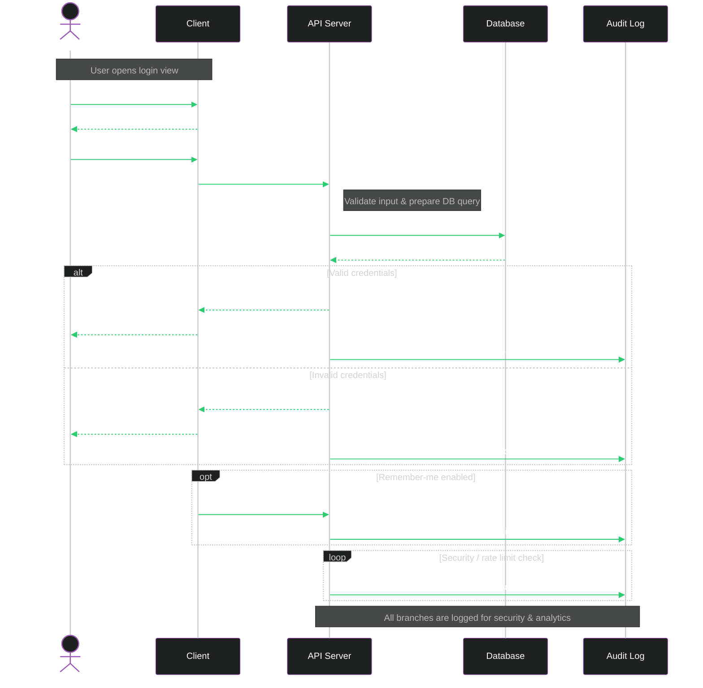
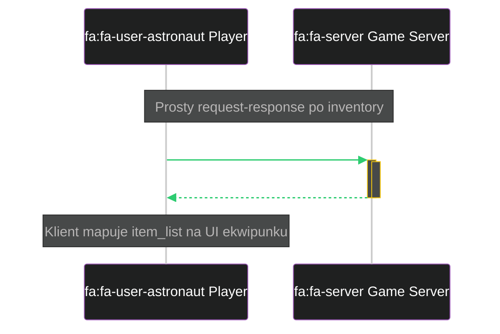
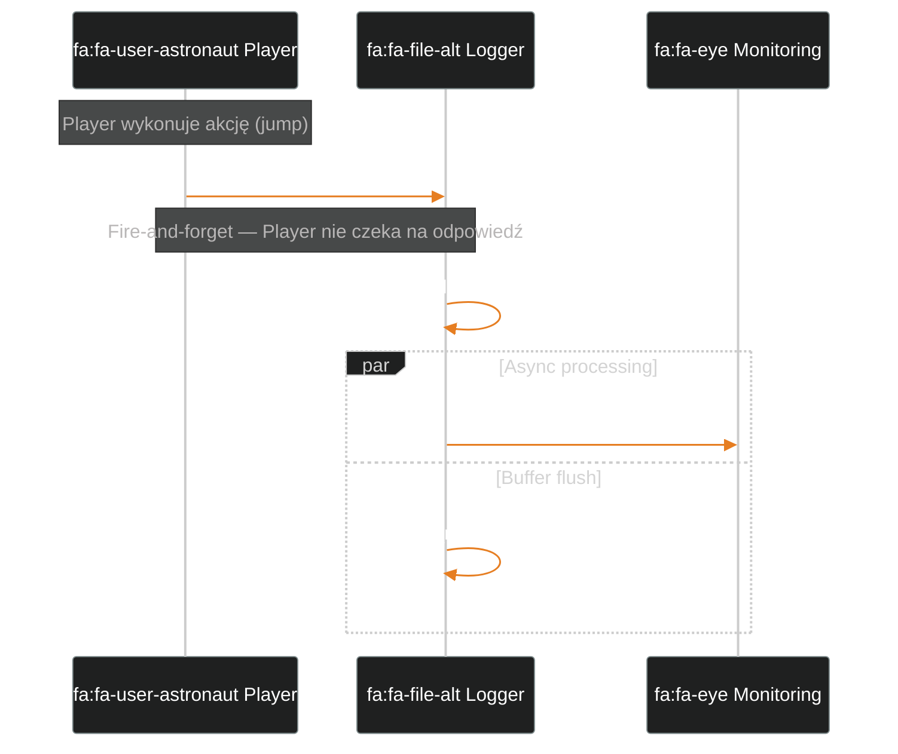
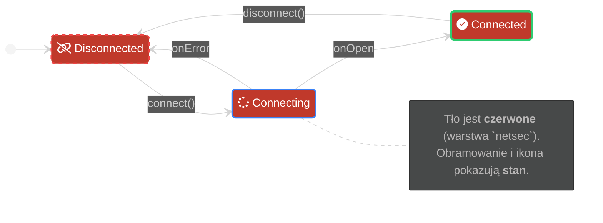
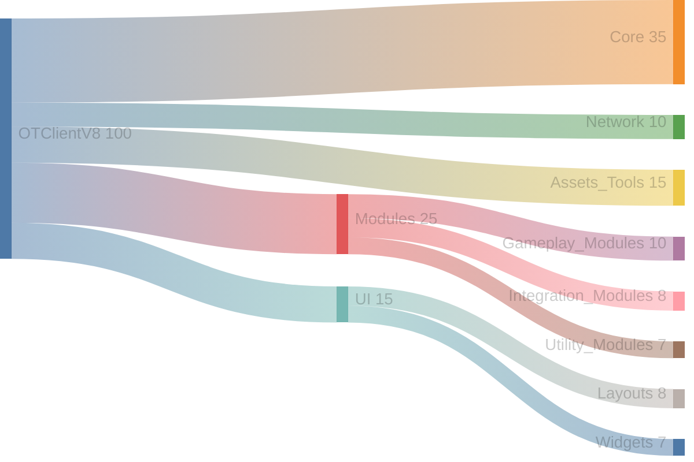
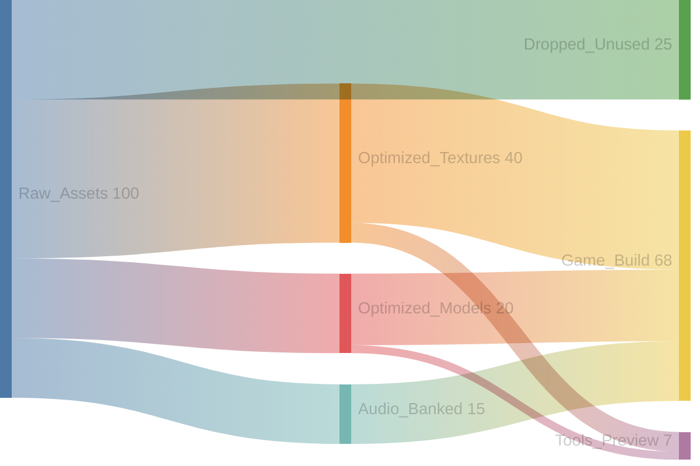
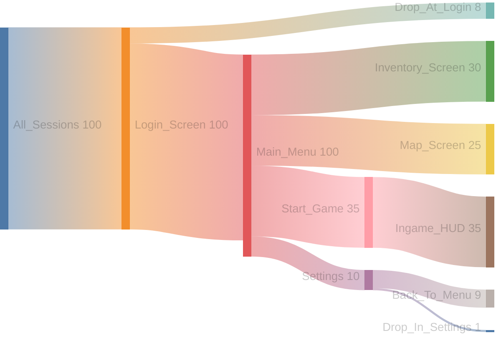

# Część A: Przepływy i Procesy

### Wzorzec Przepływu Danych (`flowchart` / `graph`)

Diagramy przepływu (`flowchart`, znany również jako `graph`) są najbardziej uniwersalnym i potężnym typem diagramów w Mermaid. Pozwalają na wizualizację niemal każdego procesu, struktury czy systemu. Poniższe warianty pokazują, jak dostosować `flowchart` do różnych, specyficznych zadań.

---

#### **Wariant 1: Liniowy Potok Danych (Pipeline)**

*   **Kiedy stosować:** Do wizualizacji prostych, liniowych procesów przetwarzania danych, takich jak potoki ETL (Extract, Transform, Load), walidacja, transformacja i eksport.
*   **Czego uczy:** Jak pokazać sekwencyjny przepływ danych "krok po kroku", z wyraźnie zaznaczoną ścieżką sukcesu i ścieżką błędu. Demonstruje również, jak linkować poszczególne kroki do innych, bardziej szczegółowych diagramów (np. `click V ...`).
*   **Przykładowy Kod:**
    ```mermaid
    %%{init: {'theme': 'dark'}}%%
    flowchart TD
        classDef data fill:#27ae60,color:#000
        classDef process fill:#3498db,color:#fff
        classDef error fill:#c0392b,color:#fff

        Input["Raw Data"]:::data

        subgraph "Processing Pipeline"
            V["Validate"]:::process
            T["Transform"]:::process
            S["Store"]:::process
        end

        Output["Processed Data"]:::data
        Err["Error"]:::error

        Input ==> V --> T --> S ==> Output
        V -- "Invalid" --> Err

        click V "#wzorzec-maszyny-stanow-statediagram-v2" "Zobacz stany walidatora"
        click S "#wzorzec-modelu-danych-erdiagram" "Zobacz model danych"
    ```

---

#### **Wariant 2: Centralny Serwis (Hub & Spoke)**
*   **Kiedy stosować:** Aby pokazać, jak jeden centralny komponent (np. `Logger`, `ConfigManager`) służy jako współdzielony serwis dla wielu innych komponentów z różnych części systemu.
*   **Czego uczy:** Jak wizualizować relacje "wiele do jednego" i pokazać kontekst użycia centralnego serwisu w całej architekturze, wykorzystując kolory do rozróżnienia warstw.
*   **Przykładowy Kod:**
    ```mermaid
    %%{init: {'theme': 'dark'}}%%
    graph TD
        classDef subsystem fill:#2ecc71,stroke:#333,color:#000;
        classDef game fill:#e67e22,stroke:#fff,color:#fff;
        classDef netsec fill:#c0392b,stroke:#fff,color:#fff;

        subgraph "Źródła Logów (Przykłady)"
            direction LR
            A["fa:fa-user-astronaut Player"]:::game;
            B["fa:fa-network-wired Connection"]:::netsec;
        end

        Logger["
            <div style='text-align:left; padding:5px;'>
                <div style='font-size:16px; font-weight:bold;'>fa:fa-file-alt Logger</div><hr/>
                <i>&lt;&lt;singleton&gt;&gt;</i>
            </div>
        "]:::subsystem;

        LogFile["fa:fa-file-text log_file.txt"]:::subsystem;

        A -.->|log: Player jumped| Logger;
        B -.->|log: Connection lost| Logger;
        Logger -- "writes to" --> LogFile;
        
        click Logger "#" "Go to Logger API";
    ```

---

#### **Wariant 3: Kolaboracja (Przepływ Zależności)**
*   **Kiedy stosować:** Gdy chcemy pokazać, jak jeden komponent ("fabryka") **współpracuje** z wieloma innymi ("zależnościami"), aby stworzyć nowy obiekt ("produkt").
*   **Czego uczy:** Jak używać orientacji `LR` do stworzenia naturalnej narracji wizualnej **Wejście → Proces → Wyjście**, eliminując krzyżujące się linie i jasno pokazując przepływ zależności.
*   **Przykładowy Kod:**
    ```mermaid
    %%{init: {'theme': 'dark'}}%%
    graph LR
        classDef game fill:#e67e22,stroke:#fff,color:#fff;
        classDef core fill:#3498db,stroke:#fff,color:#fff;
        classDef subsystem fill:#2ecc71,stroke:#333,color:#000;
        classDef netsec fill:#c0392b,stroke:#fff,color:#fff;

        subgraph "Zależności (Inputs)"
            Config["fa:fa-file-alt ConfigManager"]:::core;
            Assets["fa:fa-archive AssetManager"]:::subsystem;
        end

        subgraph "Proces (Factory)"
            Factory["fa:fa-industry PlayerFactory"]:::core;
        end

        subgraph "Wynik (Output)"
            Player["fa:fa-user-astronaut Player"]:::game;
        end

        Config -- "config data" --> Factory;
        Assets -- "asset data" --> Factory;
        Factory -- "<strong>creates</strong>" --> Player;

        linkStyle 2 stroke:#2ecc71,stroke-width:4px;
    ```

---

#### **Wariant 4: Rodzina Klas (Kompaktowy)**
*   **Kiedy stosować:** Gdy musimy pokazać hierarchię dziedziczenia i relacje w grupie małych, silnie powiązanych ze sobą klas (np. niestandardowe kontrolki UI).
*   **Czego uczy:** Jak używać mniejszych węzłów i orientacji `TD` do stworzenia zwartego, czytelnego diagramu hierarchii, wykorzystując kolorowe linie do pokazania typów relacji (`extends`, `contains`).
*   **Przykładowy Kod:**
    ```mermaid
    %%{init: {'theme': 'dark'}}%%
    graph TD
        classDef ui fill:#9b59b6,stroke:#fff,color:#fff;

        subgraph "Rodzina Widgetów UI"
            Widget["fa:fa-puzzle-piece UIWidget"]:::ui;
            Button["StyledButton<br/><i>&lt;&lt;widget&gt;&gt;</i>"]:::ui;
            Panel["DraggablePanel<br/><i>&lt;&lt;widget&gt;&gt;</i>"]:::ui;
            Slider["ColorSlider<br/><i>&lt;&lt;widget&gt;&gt;</i>"]:::ui;
        end

        Button -- "[extends]" --> Widget;
        Panel -- "[extends]" --> Widget;
        Panel -- "[contains]" --> Slider;

        linkStyle 0,1 stroke:#2ecc71,stroke-width:2px;
        linkStyle 2 stroke:#9b59b6,stroke-width:3px;
    ```

---

### Wzorzec Sekwencji Interakcji (`sequenceDiagram`)

Diagramy sekwencji są niezastąpione do wizualizacji **interakcji między komponentami w czasie**. Pokazują, kto, do kogo i w jakiej kolejności wysyła komunikaty.

---

#### **Wariant 1: Wzorzec Złożonej Interakcji**

*   **Kiedy stosować:** Do szczegółowej analizy złożonych procesów, które obejmują wiele komponentów, logikę warunkową i notatki. To jest nasz flagowy, najbardziej informacyjny wzorzec.
*   **Czego uczy:** Jak używać pełnego spektrum funkcji: uczestników z ikonami, zrównoważonych aktywacji (`+`/`-`), notatek (`note`), a przede wszystkim logiki warunkowej (`alt`/`else` dla sukcesu/błędu).
*   Pokazuje:
  - *note over* i *note right* of – objaśnienia kontekstu.
  - *rect* – wizualne grupowanie etapów (np. UI vs backend).
  - *alt* – rozgałęzienia sukces / błąd.
  - *opt* – opcjonalny flow (remember-me).
  - *loop* – cykliczne akcje (np. rate limiting / logging).
  - *themeVariables* – globalne kolory aktorów, linii, aktywacji.
*   **Przykładowy Kod:**


---

#### **Wariant 2: Prosty Request-Response**

*   **Kiedy stosować:** Do szybkiego zilustrowania podstawowej komunikacji klient-serwer lub wywołania dowolnego API.
*   **Czego uczy:** Jak w prosty i czytelny sposób pokazać cykl "zapytanie -> odpowiedź", używając ikon do identyfikacji uczestników.
*   Pokazuje:
  - ikony uczestników,
  - blok kontekstu (rect + note),
  - aktywacje (+ / -) użyte poprawnie.

*   **Przykładowy Kod:**


---

#### **Wariant 3: Komunikat Asynchroniczny ("Fire and Forget")**

*   **Kiedy stosować:** Gdy chcemy pokazać wysłanie komunikatu, na który nadawca nie czeka na natychmiastową odpowiedź (np. wysłanie zdarzenia do systemu, logowanie).
*   **Czego uczy:** Jak używać strzałek (`->>`) do sygnalizowania komunikacji asynchronicznej i jak używać notatek do wyjaśnienia kontekstu.
*   Pokazuje:
  - asynchroniczność (brak odpowiedzi do Playera),
  - notkę wyjaśniającą,
  - równoległe przetwarzanie (par) po stronie Loggera.

*   **Przykładowy Kod:**

---

### Wzorzec Maszyny Stanów (`stateDiagram-v2`)

**Kiedy:** Tryby pracy, lifecycle, sesje.



---

### Wzorzec Podróży Użytkownika/Systemu (`journey`)

Diagramy podróży są doskonałym narzędziem do wizualizacji **sekwencji kroków, które użytkownik (lub system) podejmuje, aby osiągnąć cel**. Ich unikalną cechą jest możliwość przypisania **oceny satysfakcji** do każdego etapu, co pozwala na identyfikację "bolesnych punktów" (pain points) w procesie.

**Kiedy stosować:**
*   **User Onboarding:** Mapowanie pierwszych kroków nowego użytkownika w aplikacji.
*   **Analiza Lejków (Funnels):** Wizualizacja ścieżki użytkownika przez proces zakupowy lub rejestracyjny.
*   **Projektowanie Funkcjonalności:** Opisywanie, jak użytkownik będzie wchodził w interakcję z nową funkcją (np. wykonanie pierwszego zadania w grze).
*   **Mapowanie Procesów Systemowych:** Śledzenie, jak zadanie przechodzi przez różne etapy backendu.

> **Ograniczenie:** Stylizacja jest ograniczona głównie do `themeVariables`. Nie można używać `classDef`.

---

#### **Wariant 1: Zaawansowana Podróż Użytkownika (Pierwsze Zadanie w Grze)**

*   **Cel:** Pokazuje pełną ścieżkę gracza podczas wykonywania pierwszego zadania, włączając w to interakcje z różnymi aktorami (NPC, System Gry) oraz wizualizację jego satysfakcji na każdym etapie.
*   **Czego uczy:** Jak używać sekcji do grupowania kroków, jak przypisywać zadania do różnych aktorów i, co najważniejsze, jak dodawać oceny satysfakcji (w skali 1-5), które są wizualizowane jako emotikony.
*   **Przykładowy Kod:**
    ```mermaid
    %%{init: {
      "theme": "dark",
      "themeVariables": {
        "primaryTextColor": "#e5e7eb", "sectionBackgroundColor": "#1f2937",
        "taskBorderColor": "#9b59b6", "taskTextColor": "#e5e7eb",
        "taskFill": "#111827", "actorColor": "#e67e22"
      }
    }}%%
    journey
        title Player's First Quest: "Goblin Menace"
        
        section Accepting the Quest
          Talk to Guard: 4: Player, NPC Guard
          Accept Quest: 5: Player
          Quest Started Notification: 5: Game System
        
        section Completing Objectives
          Find Goblin Camp: 3: Player
          Defeat Goblins (3/3): 5: Player, Game System
          Objective Complete!: 5: Game System

        section Receiving the Reward
          Return to Guard: 4: Player, NPC Guard
          Receive Gold & XP: 5: Player, Game System
          Quest Complete Popup: 5: Game System
    ```
    **Interpretacja:**
    *   *Skala ocen: 1 = frustracja, 5 = satysfakcja.*
    *   Diagram wizualizuje podróż gracza. Widzimy, że znalezienie obozu goblinów było nieco nużące (ocena 3/5), ale walka i otrzymanie nagrody były bardzo satysfakcjonujące (ocena 5/5).

---

#### **Wariant 2: Prosta Ścieżka Użytkownika (Happy Path)**
*   **Cel:** Szybkie zmapowanie podstawowej, oczekiwanej ścieżki użytkownika przez prosty proces, np. rejestrację.
*   **Przykładowy Kod:**
    ```mermaid
    %%{init: {'theme': 'dark'}}%%
    journey
        title New User Onboarding (Happy Path)
        section Registration
          Open app: 4: User
          Fill form: 3: User
          Submit form: 3: User
          Account created: 5: System
        section First session
          Login: 4: User
          Show guided tour: 4: System
          Complete tour: 3: User
    ```
    **Interpretacja:**
    *   *Skala ocen: 1 = frustracja, 5 = satysfakcja.*

---

#### **Wariant 3: Wzorzec Porównawczy (Przed i Po)**
*   **Cel:** Potężne narzędzie do wizualizacji **efektu zmian** (np. po refaktoryzacji UX) poprzez porównanie ocen satysfakcji dla tego samego procesu przed i po modyfikacji.
*   **Przykładowy Kod:**
    ```mermaid
    %%{init: {'theme': 'dark'}}%%
    journey
        title Onboarding — Before vs After Redesign
        section Before
          Find signup: 2: User
          Long form: 1: User
          Email verification confusion: 2: User
          First login: 3: User
        section After
          One-click signup: 5: User
          Short form: 4: User
          Clear verification link: 4: User
          First login success: 5: User
    ```
    **Interpretacja:**
    *   *Skala ocen: 1 = frustracja, 5 = satysfakcja.*
    *   Diagram jednoznacznie pokazuje, jak redesign poprawił doświadczenie użytkownika na każdym etapie procesu.

---

#### **Wariant 4: Wzorzec Techniczny (Ścieżka Systemu i Ryzyka)**
*   **Cel:** Pokazuje, że `journey` może być używany nie tylko do UX, ale także do mapowania **wewnętrznych procesów systemowych** i identyfikacji potencjalnych **punktów ryzyka** lub błędów.
*   **Przykładowy Kod:**
    ```mermaid
    %%{init: {'theme': 'dark'}}%%
    journey
        title Login Funnel with System Perspective
        section User path
          Open login page: 4: User
          Enter credentials: 4: User
          Submit: 3: User
          Wait for response: 2: User
        section System path
          Validate request: 5: System
          Check rate limits: 4: System
          Query auth DB: 4: System
          Generate token: 5: System
        section Risk points
          Slow response (>2s): 1: User, System
          Captcha triggered: 2: User
    ```
    **Interpretacja:**
    *   *Skala ocen: dla Użytkownika = satysfakcja; dla Systemu = stabilność/pewność.*
    *   Diagram mapuje zarówno ścieżkę użytkownika, jak i kroki wykonywane przez system, a także identyfikuje kluczowe ryzyka, które negatywnie wpływają na obie strony.
---

### Wzorzec Analizy Przepływu Zasobów (`sankey-beta`)

Diagramy Sankeya służą do wizualizacji **przepływu i dystrybucji mierzalnych zasobów** między elementami systemu. Nie pokazują kolejności zdarzeń, tylko odpowiedź na pytanie:

> „Ile czego gdzie płynie i gdzie się rozprasza?”

**Kiedy stosować:**

Używaj `sankey-beta`, gdy możesz wstawić liczby typu:

- logi: ile zdarzeń trafia do jakich systemów,
- ruch: które moduły generują ruch na które endpointy,
- koszt: które komponenty pożerają ile budżetu,
- kod / assety: które katalogi / moduły dominują objętościowo,
- użycie UI: które ekrany/feature’y konsumują czas / kliknięcia.

**Na co uważać:**

- Sankey pokazuje **proporcje**, nie timeline. Do czasu masz `timeline` i `sequenceDiagram`.
- Zawsze określ **jednostkę**: `%`, req/s, MB, liczba plików, sesje, cokolwiek.
- Renderer GitHuba ma ograniczoną stylizację. Tu wygrywa treść, nie gradienty.

---

#### Wariant 1: Przepływ Logów od Źródeł do Systemów Docelowych

**Cel:** Pokaż, ile logów przechodzi przez kolejne etapy i gdzie lądują.

```mermaid
%%{init: {'theme': 'dark'}}%%
sankey-beta
    %% Źródła logów (np. zdarzenia/sekundę)
    Game_Client, Ingest, 80
    Game_Server, Ingest, 140

    %% Wstępna filtracja
    Ingest, Filtered, 180
    Ingest, Dropped_on_ingest, 40

    %% Dystrybucja do systemów docelowych
    Filtered, Security_Alerts, 40
    Filtered, Metrics_TSDB, 60
    Filtered, Full_Storage, 80

    %% Podział storage
    Full_Storage, Cold_Archive, 50
    Full_Storage, Adhoc_Analysis, 30
````

**Jak użyć:**

* Podpis: „Wartości = zdarzenia/s”.
* Pokazujesz szum (`Dropped_on_ingest`), ścieżkę bezpieczeństwa, metryk i archiwum.
* Lepsze niż ściana tekstu typu „40% tu, 60% tam”.

---

#### Wariant 2: Przepływ Ruchu z Modułów UI do Endpointów API

**Cel:** Zidentyfikować, które części UI duszą API.

```mermaid
%%{init: {'theme': 'dark'}}%%
sankey-beta
    %% Źródła requestów (np. % wszystkich zapytań)
    UI_Inventory, NetClient, 30
    UI_Map, NetClient, 20
    UI_Login, NetClient, 15
    UI_Chat, NetClient, 10
    Background_Sync, NetClient, 25

    %% Dystrybucja requestów do backendu
    NetClient, API_Inventory, 30
    NetClient, API_Character, 25
    NetClient, API_Map, 20
    NetClient, API_Chat, 15
    NetClient, API_Other, 10
```

**Jak użyć:**

* Podpis: „Wartości = % wszystkich requestów”.
* Widać „gorące” feature’y bez dłubania w logach.
* Pod to podpinasz decyzje: cache, throttling, osobne endpointy.

---

#### Wariant 3: Udział Katalogów w Bazie Kodu

**Cel:** Szybko pokazać, gdzie siedzi masa kodu w repo.



**Jak użyć:**

* Podpis: „Wartości = % linii kodu / plików”.
* Działa jako szybki heatmap: gdzie inwestować testy, code review, refactor.
* Tak, jest to legalny zamiennik „nudnej tabelki LOC per katalog”.

---

#### Wariant 4: Przepływ Assetów w Pipeline (Edytor → Build → Runtime)

**Cel:** Pokazać, ile contentu przeżywa pipeline i gdzie jest używany.



**Jak użyć:**

* Podpis: „Wartości = % assetów”.
* Pokazujesz, jaki procent kontentu faktycznie trafia do gry, a co jest syfem do sprzątnięcia.

---

#### Wariant 5: Użycie UI / Ekranów w Kliencie

**Cel:** Pokazać, gdzie użytkownicy realnie spędzają czas w kliencie (na podstawie telemetry), bez rysowania sekwencji.



**Jak użyć:**

* Podpis: „Wartości = % sesji przechodzących przez dane ekrany”.
* Idealne do:

  * pokazania dropów (np. `Drop_At_Login`, `Drop_In_Settings`),
  * argumentowania zmian UX bez lania eseju.
* Dobrze współgra z `journey` i `sequenceDiagram`: Sankey = gdzie, tamte = jak i w jakiej kolejności.

---

### Kiedy NIE używać `sankey-beta`

* Jeśli chcesz pokazać czyste drzewo katalogów → użyj `mindmap` / `flowchart`.
* Jeśli pokazujesz zależności modułów → `flowchart`, `classDiagram`, `erDiagram`.
* Jeśli ważna jest kolejność i czas → `sequenceDiagram`, `timeline`, `journey`.

Reguła końcowa:

> Jeśli nie podajesz liczby i nie ma realnego “przepływu”, nie używaj Sankeya. To narzędzie do danych, nie do ozdoby.
