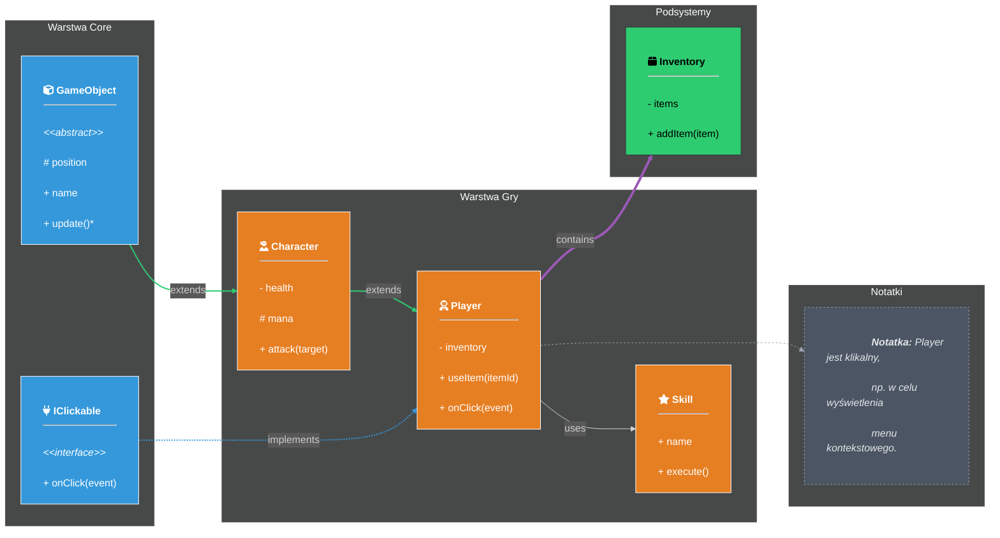
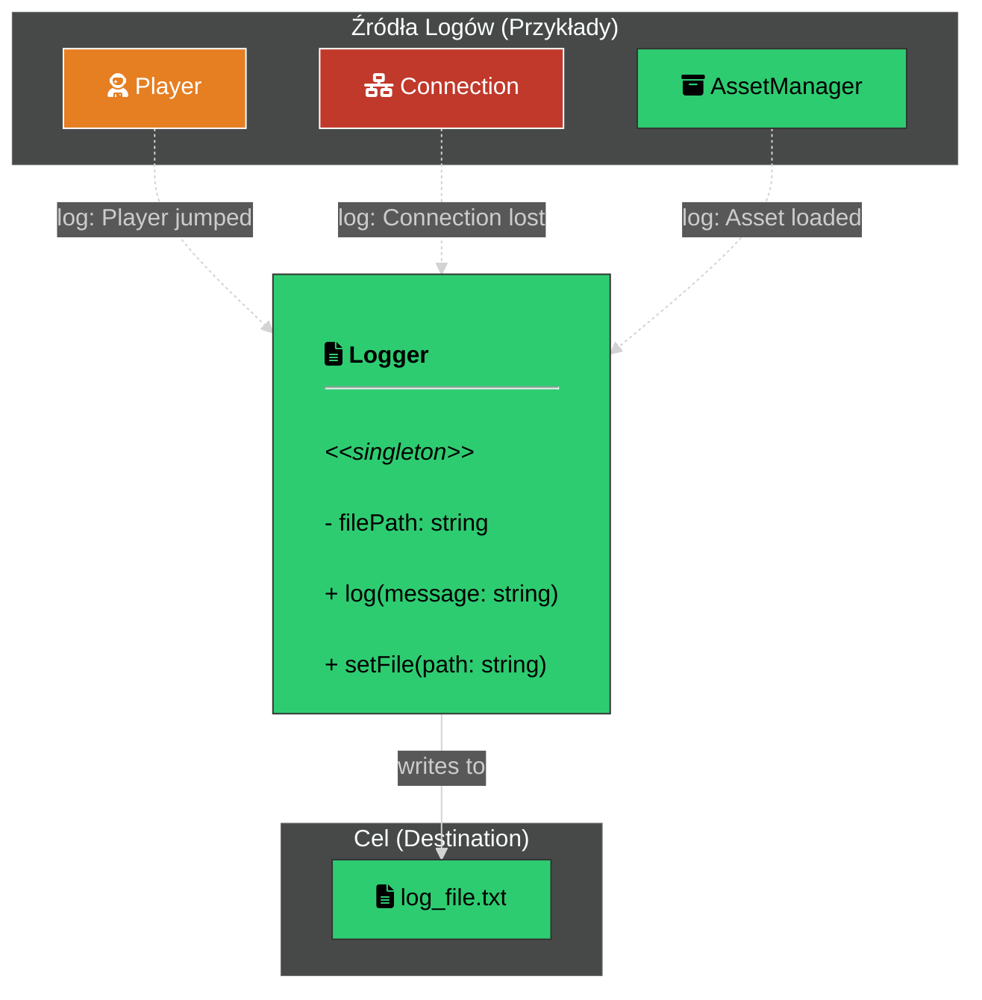
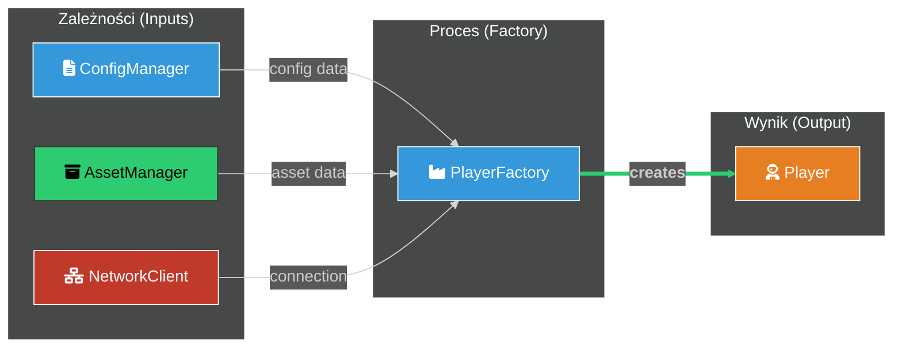
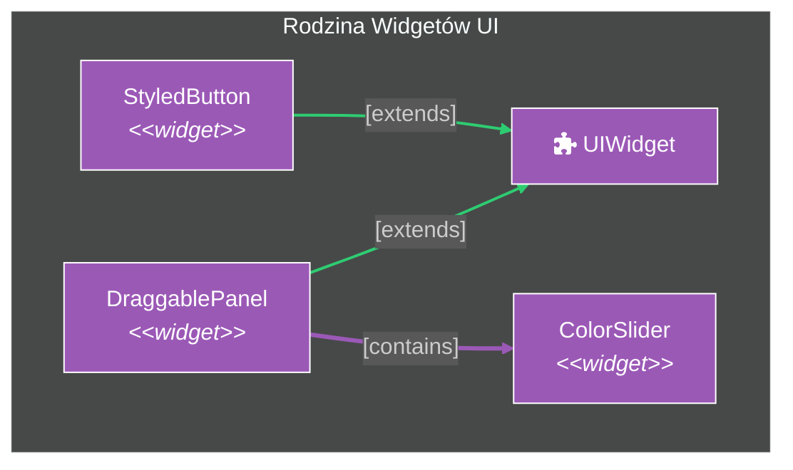
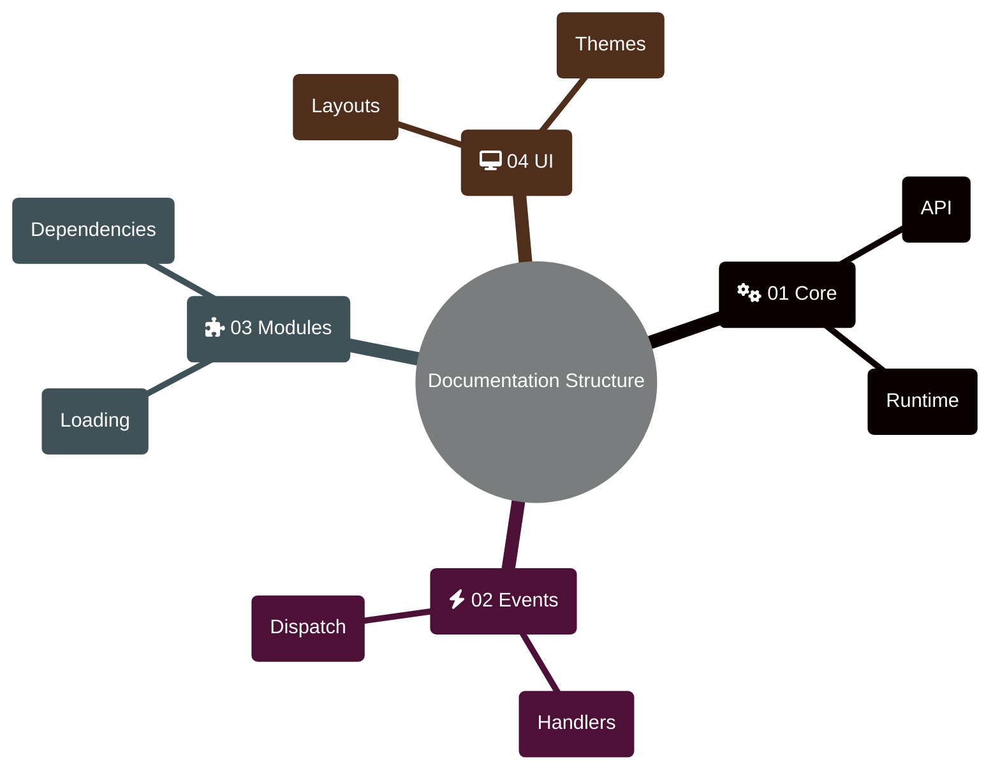

## Część B: Struktura i Relacje

### Wzorzec Struktury Klas (`classDiagram`)

**Kiedy:** API, dziedziczenie, interfejsy, kontrakty.

> Uwaga: `click` w `classDiagram` nie jest gwarantowany w każdym rendererze.

### Wzorzec Struktury Klas (symulowany za pomocą `flowchart`)
*   **Kiedy stosować:** Do pokazywania relacji między klasami,  API, dziedziczenie, interfejsy, kontrakty. **Ten wzorzec zastępuje `classDiagram`, aby zapewnić pełne wsparcie dla naszego systemu stylów na GitHubie.**
*   **Kluczowe Elementy:** Węzły reprezentujące klasy (ze stylami warstw), listy członków (metody/atrybuty) wewnątrz węzłów, strzałki reprezentujące relacje (dziedziczenie, kompozycja).
*   **Przykłady Kod:**

### **Wariant 1** Wzorzec Pełnej Struktury Klas


---

### **Wariant 2: Wzorzec Prostej Klasy (Minimalistyczny)**

*   **Kiedy stosować:** Dla prostych klas narzędziowych lub struktur danych, które mają niewiele lub żadnych złożonych zależności.
*   **Czego uczy:** Jak tworzyć czyste, minimalistyczne diagramy, które nie są przeładowane informacjami. Pokazuje, że nie zawsze trzeba używać `subgraph` i wielu warstw.
*   **Przykładowy Kod:**


---

### **Wariant 3: Wzorzec Kolaboracji (Skupiony na Zależnościach)**

*   **Kiedy stosować:** Gdy chcemy pokazać, jak jedna klasa **współpracuje** z wieloma innymi, aby wykonać zadanie (np. wzorzec Fabryki, Budowniczego). Tutaj relacje są ważniejsze niż wewnętrzna struktura klas.
*   **Czego uczy:** Jak używać prostszych węzłów (nawet bez listy metod) i skupić się na **liniach połączeń**, aby opowiedzieć historię o współpracy.
*   **Przykładowy Kod:**


---

### **Wariant 4: Wzorzec Kompaktowy (Wysoka Gęstość)**

*   **Kiedy stosować:** Gdy musimy pokazać grupę wielu małych, silnie powiązanych ze sobą klas (np. zestaw wyjątków, niestandardowe kontrolki UI). Użycie pełnych, dużych węzłów byłoby nieczytelne.
*   **Czego uczy:** Jak używać mniejszych węzłów (tylko nazwa i stereotyp) i orientacji `LR`, aby stworzyć zwarty, gęsty, ale wciąż czytelny diagram.
*   **Przykładowy Kod:**


---


### Wzorzec Modelu Danych

Do wizualizacji modeli danych i schematów baz danych oferujemy dwa warianty, każdy dostosowany do innych potrzeb.

---

#### **Wariant 1: Szybki Szkic (`erDiagram`)**
*   **Kiedy stosować:** Do **szybkich, prostych szkiców**, gdzie liczy się tylko pokazanie encji i ich podstawowych relacji, a precyzyjny układ i stylizacja nie mają krytycznego znaczenia.
*   **Zalety:** Bardzo prosta i zwięzła składnia.
*   **Wady:** Brak kontroli nad układem, bardzo ograniczone możliwości stylizacji (nie wspiera naszego systemu `classDef`), co może prowadzić do nieczytelnego rozciągnięcia diagramu.
*   **Przykładowy Kod:**
    ```mermaid
    %%{init: {
      "theme": "dark",
      "themeVariables": {
        "primaryTextColor": "#e5e7eb", "secondaryColor": "#1f2937",
        "erEntityColor": "#0f172a", "erEntityTitleColor": "#9ca3af"
      }
    }}%%
    erDiagram
        CUSTOMER ||--|{ ORDER : places
        PRODUCT }|..|| LINE_ITEM : "is item for"
        ORDER ||--|{ LINE_ITEM : contains

        CUSTOMER {
            int id PK
            string name
            string email "unique"
        }
        ORDER {
            int id PK
            int customer_id FK
            datetime created_at
        }
        PRODUCT {
            int id PK
            string name
            decimal price "cannot be negative"
        }
        LINE_ITEM {
            int order_id FK
            int product_id FK
            int quantity
            decimal unit_price
        }
    ```

---

#### **Wariant 2: Zaawansowany Model (`graph` - Rekomendowany)**
*   **Kiedy stosować:** Zawsze, gdy **jakość wizualna, czytelność i precyzyjny układ mają znaczenie**. To jest nasz **oficjalny, rekomendowany wzorzec** dla finalnej, publicznej dokumentacji.
*   **Zalety:**
    *   **Pełna, manualna kontrola nad układem** za pomocą niewidzialnych linków.
    *   **Pełna integracja z naszym systemem `classDef`**, co pozwala na spójną stylizację.
    *   Możliwość użycia zaawansowanych funkcji, takich jak `linkStyle` i `click`.
*   **Wady:** Znacznie bardziej złożony i "gadatliwy" kod (użycie tabel HTML).
*   **Przykładowy Kod:**
    ```mermaid
    %%{init: {'theme': 'dark'}}%%
    graph TD
        %% Definicja stylu dla encji, spójna z estetyką erDiagram
        classDef entity fill:#0f172a,stroke:#9ca3af,color:#e5e7eb;

        %% --- Definicja Węzłów-Encji ---
        subgraph "Dane Klienta"
            CUSTOMER["
                <div style='padding:5px;'>
                    <div style='font-weight:bold; border-bottom:1px solid #9ca3af; margin-bottom:5px; text-align:center;'>CUSTOMER</div>
                    <table style='width:100%; text-align:left; font-size:14px;'>
                        <tr><td style='padding-right:10px;'><b>int id</b></td><td><i>PK</i></td></tr>
                        <tr><td>string name</td><td></td></tr>
                        <tr><td>string email</td><td><i>unique</i></td></tr>
                    </table>
                </div>
            "]:::entity;
        end;

        subgraph "Dane Produktu"
            PRODUCT["
                <div style='padding:5px;'>
                    <div style='font-weight:bold; border-bottom:1px solid #9ca3af; margin-bottom:5px; text-align:center;'>PRODUCT</div>
                    <table style='width:100%; text-align:left; font-size:14px;'>
                        <tr><td><b>int id</b></td><td><i>PK</i></td></tr>
                        <tr><td>string name</td><td></td></tr>
                        <tr><td>decimal price</td><td></td></tr>
                    </table>
                </div>
            "]:::entity;
        end;

        subgraph "Dane Zamówienia"
            ORDER["
                <div style='padding:5px;'>
                    <div style='font-weight:bold; border-bottom:1px solid #9ca3af; margin-bottom:5px; text-align:center;'>ORDER</div>
                    <table style='width:100%; text-align:left; font-size:14px;'>
                        <tr><td><b>int id</b></td><td><i>PK</i></td></tr>
                        <tr><td>int customer_id</td><td><i>FK</i></td></tr>
                        <tr><td>datetime created_at</td><td></td></tr>
                    </table>
                </div>
            "]:::entity;

            LINE_ITEM["
                <div style='padding:5px;'>
                    <div style='font-weight:bold; border-bottom:1px solid #9ca3af; margin-bottom:5px; text-align:center;'>LINE_ITEM</div>
                    <table style='width:100%; text-align:left; font-size:14px;'>
                        <tr><td>int order_id</td><td><i>FK</i></td></tr>
                        <tr><td>int product_id</td><td><i>FK</i></td></tr>
                        <tr><td>int quantity</td><td></td></tr>
                    </table>
                </div>
            "]:::entity;
        end;

        %% --- Niewidzialne Linki Sterujące Układem ---
        %% Tworzą "rusztowanie", które wymusza pozycje bloków obok siebie.
        CUSTOMER ~~~ PRODUCT;

        %% --- Widoczne Relacje ---
        CUSTOMER -- "places" --> ORDER;
        ORDER -- "contains" --> LINE_ITEM;
        PRODUCT -.->|"is item for"| LINE_ITEM;

        %% --- Interaktywność ---
        click CUSTOMER "#" "Przejdź do dokumentacji API Klienta";
    ```

---

### Wzorzec Mapy Myśli (`mindmap`)

**Kiedy:** Spis treści dokumentacji, moduły, funkcjonalności.


