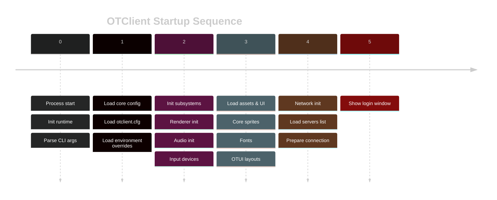
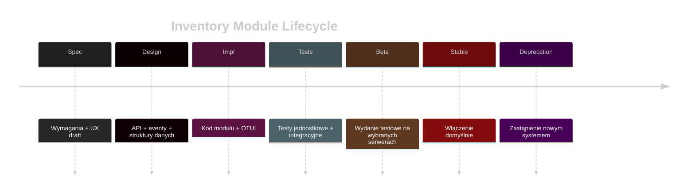
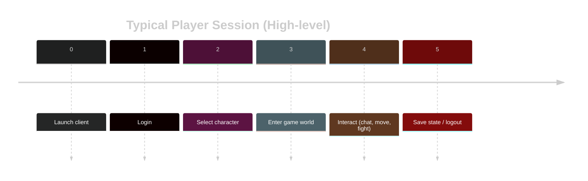
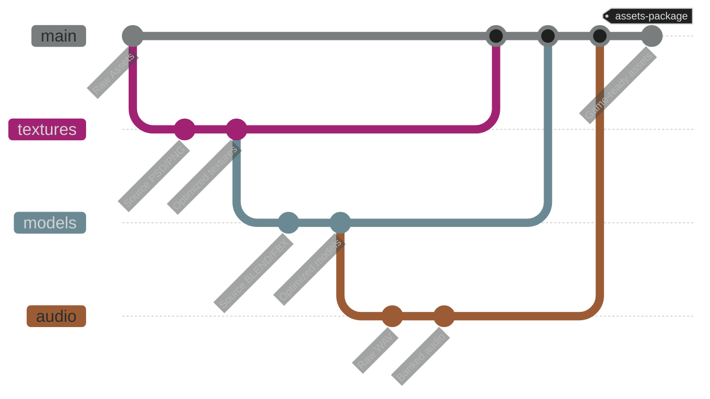

## Część C: Czas i Planowanie

### Wzorzec Sekwencji Chronologicznej (`timeline`)

Diagramy `timeline` są doskonałym narzędziem do wizualizacji **uporządkowanej sekwencji zdarzeń lub kroków wzdłuż jednej osi**. Chociaż najczęściej jest to oś czasu, możemy ją kreatywnie wykorzystać do opisywania struktur i procesów.

> **Ograniczenie:** Stylizacja jest ograniczona do bloku `init` i `themeVariables`. Nie można stosować naszego systemu `classDef`. Poniższe wzorce używają oficjalnego motywu dla wszystkich diagramów `timeline`.

---

#### **Wariant 1: Startup OTClienta (Oś = Kroki Inicjalizacji)**

* **Cel:** Pokazać w jakiej kolejności OTClient inicjalizuje kolejne warstwy i subsystemy oraz gdzie mogą pojawić się problemy startowe.
* **Kiedy stosować:**

  * **Diagnostyka Startu:** Analiza, na którym etapie aplikacja się wysypuje lub blokuje.
  * **Onboarding Devów:** Szybki przegląd krytycznych kroków uruchamiania bez czytania całego kodu startowego.
  * **Dokumentacja Architektury:** Powiązanie etapów inicjalizacji z odpowiednimi modułami / katalogami.
* **Przykładowe użycie:** Pod diagramem linkujesz do sekcji `Core`, `Assets`, `UI`, `Network` i pokazujesz, które katalogi odpowiadają za dany krok.



---

#### **Wariant 2: Sekwencja Przestrzenna (Oś = Struktura)**

*   **Cel:** Kreatywne użycie `timeline` do stworzenia **wizualnego spisu treści** dla pliku, modułu lub nawet skomplikowanego interfejsu użytkownika. Oś reprezentuje tu przestrzeń (np. numery linii, sekcje UI), a nie czas.
*   **Kiedy stosować:**
    *   **Anatomia Pliku Źródłowego:** Aby szybko pokazać, gdzie w dużym pliku znajdują się kluczowe sekcje (nagłówki, konstruktory, główne metody).
    *   **Struktura Modułu/Katalogu:** Aby zwizualizować zawartość i przeznaczenie głównych podkatalogów w module.
    *   **Układ Interfejsu Użytkownika (OTUI):** Aby pokazać, jak widgety są zagnieżdżone i ułożone w pliku `.otui`.
*   **Przykładowy Kod (Anatomia Pliku):**
    ```mermaid
    %%{init: {'theme': 'dark'}}%%
    timeline
        title Anatomy of Player.cpp
        
        section Includes & Headers
            Lines 1-20 : Include dependencies (GameObject.h, Skill.h)
        
        section Class Definition & Constructor
            Lines 22-50 : Player class definition
                        : Constructor initializes health and mana
        
        section Core Logic
            Lines 52-100 : update() method (handles input)
            Lines 102-150 : attack() method (calculates damage)
        
        section Helper Methods
            Lines 152-200 : Private helper functions (e.g., check_stamina())
    ```

---

#### **Wariant 3: Sekwencja Procesu (Oś = Etapy Przetwarzania)**

*   **Cel:** Użycie `timeline` do pokazania **kolejnych etapów transformacji danych lub logiki biznesowej**. Skupia się na kolejności kroków, a nie na konkretnym czasie.
*   **Kiedy stosować:**
    *   **Cykl Życia Pakietu Sieciowego:** Pokazanie, jak pakiet jest tworzony, serializowany, wysyłany, odbierany i przetwarzany.
    *   **Pipeline Renderowania Grafiki:** Wizualizacja kolejnych etapów w klatce (np. Culling -> Shaders -> Post-processing).
    *   **Logika Biznesowa:** Opisanie kroków w złożonej operacji (np. przetwarzanie zakupu w sklepie w grze).
*   **Przykładowy Kod (Cykl Życia Pakietu):**
    ```mermaid
    %%{init: {'theme': 'dark'}}%%
    timeline
        title Network Packet Lifecycle (Client -> Server)
        
        section Client Side
            Step 1 : Create Packet
                   : (e.g., PlayerMovePacket)
            Step 2 : Serialize Data
                   : (object -> byte array)
            Step 3 : Send to Network
        
        section Transmission
            Step 4 : TCP/IP Transmission
        
        section Server Side
            Step 5 : Receive & Deserialize
                   : (byte array -> object)
            Step 6 : Process Logic
                   : (update player position)
            Step 7 : Send Confirmation (optional)
    ```
---

#### **Wariant 4: Lifecycle Modułu OTClienta (Oś = Etapy Życia Feature’a)**

* **Cel:** Zwizualizować cykl życia konkretnego modułu lub większej funkcjonalności (np. Inventory, Party UI, minimapa) od pomysłu do wyłączenia.
* **Kiedy stosować:**

  * **Roadmapa Techniczna:** Pokazanie, gdzie na osi życia znajduje się dany moduł (draft / beta / stable / legacy).
  * **Refactor & Cleanup:** Uzasadnienie, które elementy są do utrzymania, a które do wycięcia.
  * **Komunikacja w zespole:** Zamiast tabel „Status: WIP/Done/Deprecated” jeden czytelny timeline.
* **Przykładowe użycie:** Każdy etap może linkować w tekście do odpowiednich PR-ów, ticketów lub sekcji dokumentacji modułu.



---


#### **Wariant 5: Sesja Użytkownika jako High-level Oś Czasu (Oś = Flow Gracza)**

* **Cel:** Pokazać typowy przebieg sesji gracza w kliencie (od uruchomienia do wyjścia) na jednym prostym widoku.
* **Kiedy stosować:**

  * **User Journey Overview:** Przed szczegółowymi `sequenceDiagram` pokazującymi logowanie, wybór postaci, wejście do świata.
  * **Analiza Friction Points:** Oznaczenie kroków, gdzie najczęściej dochodzi do porzuceń (np. login, wybór świata).
  * **Powiązanie z Telemetrią:** Łatwe mapowanie eventów analitycznych do etapów sesji.
* **Przykładowe użycie:** `timeline` daje ogólny flow, a osobne diagramy (`sequenceDiagram`, `sankey-beta`) pokazują techniczne szczegóły lub proporcje w wybranych krokach.



---

### Wzorzec Harmonogramu Projektu (`gantt`)

Diagramy Gantta są doskonałym narzędziem do wizualizacji **planów, harmonogramów i zależności czasowych** w projektach. Ich siła leży w pokazywaniu, co, kiedy i przez jak długo ma być robione.

> **Ograniczenie:** Stylizacja jest ograniczona do bloku `init` i `themeVariables`. Nie można stosować naszego systemu `classDef`. Poniższe wzorce używają oficjalnego motywu dla wszystkich diagramów `gantt`.

---

#### **Wariant 1: Harmonogram Prac nad Dokumentacją**

*   **Cel:** Wizualizacja postępów w tworzeniu i aktualizacji dokumentacji technicznej. Pozwala szybko zidentyfikować, które rozdziały są ukończone, które są w trakcie, a które jeszcze nie zostały rozpoczęte.
*   **Kiedy stosować:** W plikach `README.md` lub na głównej stronie dokumentacji, aby pokazać status projektu dokumentacyjnego.
*   **Przykładowy Kod:**
    ```mermaid
    %%{init: { "theme": "dark" }}%%
    gantt
        title Status Dokumentacji Technicznej
        dateFormat  YYYY-MM-DD
        axisFormat %b %Y
        
        section Struktura i API
        Dokumentacja Core API      :done, doc1, 2024-01-01, 30d
        Dokumentacja UI API        :active, doc2, 2024-02-01, 30d
        Dokumentacja Modułów API   :doc3, after doc2, 30d
        
        section Poradniki i Wzorce
        Przepisanie Wzorców        :done, guide1, 2024-01-15, 45d
        Poradnik Tworzenia Modułu  :crit, active, guide2, after guide1, 30d
    ```

---

#### **Wariant 2: Analiza Czasu Cyklu Życia Modułu (`otmod`)**

*   **Cel alternatywny:** Użycie `gantt` do wizualizacji, ile czasu (w milisekundach) zajmują poszczególne etapy w cyklu życia modułu podczas startu gry.
*   **Kiedy stosować:** W dokumentacji modułów, aby pokazać deweloperom, które etapy są najbardziej kosztowne czasowo i gdzie powinni optymalizować swój kod.
*   **Przykładowy Kod:**
    ```mermaid
    %%{init: { "theme": "dark" }}%%
    gantt
        title Cykl Życia Modułu "SuperFeature" (w ms)
        dateFormat SSS
        axisFormat %Lms
        
        section Ładowanie
        Wczytywanie pliku modułu :done, load1, 0, 50ms
        Parsowanie manifestu     :done, load2, after load1, 20ms
        
        section Inicjalizacja
        Wywołanie `onLoad()`      :crit, done, init1, after load2, 150ms
        Rejestracja widgetów     :done, init2, after init1, 30ms
        
        section Aktywacja
        Wywołanie `onEnable()`    :active, enable1, after init2, 10ms
    ```
    **Interpretacja:**
    *   Diagram jasno pokazuje, że funkcja `onLoad()` jest "wąskim gardłem" i zajmuje najwięcej czasu (150ms) podczas ładowania tego modułu.

---

#### **Wariant 3: Analiza Wydajności Startu Klienta (Profiling)**

*   **Cel alternatywny:** Użycie `gantt` do zwizualizowania **rzeczywistego profilu wydajności** podczas uruchamiania `otclient`. Pokazuje, które podsystemy najbardziej spowalniają start.
*   **Kiedy stosować:** W dokumentacji `Core`, aby zilustrować architekturę startową i zidentyfikować potencjalne obszary do optymalizacji.
*   **Przykładowy Kod:**
    ```mermaid
    %%{init: { "theme": "dark" }}%%
    gantt
        title Profil Wydajności Startu Klienta (w ms)
        dateFormat SSS
        axisFormat %Lms
        
        section Inicjalizacja Niskopoziomowa
        Start Aplikacji       :done, s1, 0, 10ms
        Inicjalizacja Okna    :done, s2, after s1, 50ms
        
        section Ładowanie Podsystemów
        ConfigManager         :done, sub1, after s2, 25ms
        Logger                :done, sub2, after s2, 15ms
        AssetManager          :crit, active, sub3, after sub2, 350ms
        
        section Faza Końcowa
        ModuleManager         :done, f1, after sub3, 120ms
        Wyświetlenie UI       :f2, after f1, 40ms
    ```
    **Interpretacja:**
    *   Diagram natychmiast ujawnia, że `AssetManager` jest krytycznym "blokerem", który zajmuje 350ms i wstrzymuje cały dalszy proces uruchamiania.

---

### Wzorzec Grafu Zależności / Historii (`gitGraph`)

`gitGraph` jest projektowany głównie do wizualizacji **historii Git i strategii branchowania**. Można go kreatywnie użyć w dokumentacji, ale tylko tam, gdzie dane da się sensownie przedstawić jako „gałęzie + commity + merge”.

> **Ograniczenia:**
> - Stylizacja jest bardzo ograniczona (bez `classDef`, minimalny wpływ `themeVariables`).
> - Składnia jest mocno specyficzna dla Gita: `commit`, `branch`, `checkout`, `merge`, `tag`.
> - Nadaje się do „historii i wariantów”, **nie** do dokładnego modelowania dowolnego DAG ani dziedziczenia klas (do tego jest `classDiagram`).

Dlatego traktujemy `gitGraph` jako wzorzec do:
- pokazywania strategii pracy z repozytorium,
- ilustrowania cyklu releasów i hotfixów,
- wizualizacji alternatywnych ścieżek rozwoju (np. eksperymentalne feature’y).

---

#### **Wariant 1: Strategia Branchowania w Projekcie (Git Workflow)**

**Cel:** Zdefiniowanie zalecanego przepływu pracy w Git dla OTClienta (main, feature branches, hotfixy).  
**Kiedy stosować:** W `CONTRIBUTING.md`, dokumentacji deweloperskiej, onboarding nowych kontrybutorów.  
**Czego uczy:** Jak powstają gałęzie, gdzie robić feature, gdzie hotfix, co trafia do releasu.


**Jak użyć:**

* Jasno tłumaczy:

  * co weszło do stabilnej wersji,
  * które gałęzie są eksperymentalne / odrzucone,
* Lepsze niż opis typu „mieliśmy parę prób, coś się z tego ostało”.

---

#### **Wariant 3: Asset Pipeline / Build Branches (Opcjonalne, Ostrożne)**

**Cel:** Pokazać high-level koncepcję, że różne „linie” przygotowania assetów zbiegają się w finalny build.
**Uwaga:** To jest kreatywne użycie, **tylko jeśli** opowiadasz historię procesu zbliżoną do workflow Gita. Jeśli chcesz precyzyjne proporcje i przepływy, użyj `sankey-beta`.



**Jak użyć:**

* Jako **metafora**: różne ścieżki przygotowania kontentu zbiegają się w jeden punkt „Game-ready assets”.
* Jeśli zaczynasz upychać tu liczby albo prawdziwe zależności, przejdź na:

  * `sankey-beta` dla przepływów,
  * `flowchart` dla etapów procesu.

#### **Wariant 4: Struktura Dziedziczenia i Zależności Funkcji**

*   **Cel alternatywny:** Użycie `gitGraph` do stworzenia zwartej wizualizacji **zależności między funkcjami lub hierarchii dziedziczenia**. "Commity" reprezentują poszczególne funkcje lub klasy, a "gałęzie" i "merge" pokazują, jak są one ze sobą powiązane.
*   **Kiedy stosować:** Do szybkiego pokazania, jak bardziej złożona funkcja jest zbudowana z mniejszych, pomocniczych funkcji, lub jak klasa `Player` dziedziczy i łączy w sobie funkcjonalności z wielu klas bazowych.
*   **Przykładowy Kod:**
    ```mermaid
    %%{init: {'theme': 'dark'}}%%
    gitGraph
        %% 'main' reprezentuje klasę bazową GameObject
        commit id: "GameObject"
        
        branch "Drawable"
        checkout "Drawable"
        commit id: "draw()"
        
        branch "Clickable"
        checkout "Clickable"
        commit id: "onClick()"
        
        checkout main
        %% Character dziedziczy po GameObject
        commit id: "Character"
        
        branch "Player"
        checkout "Player"
        %% Player dziedziczy po Character
        commit id: " "
        
        %% Player "łączy w sobie" funkcjonalności z innych gałęzi
        merge "Drawable"
        merge "Clickable"
        commit id: "Player Ready" tag: "Final Class"
    ```

---

### Czego NIE robić `gitGraph`:

* Nie rysuj nim:

  * hierarchii dziedziczenia (`classDiagram` jest do tego),
  * zależności modułów (`flowchart` / `erDiagram`),
  * ogólnych DAG-ów biznesowych.
* Traktuj go jako:

  * „diagram historii i wariantów”, nie „multi-tool do wszystkiego”.
