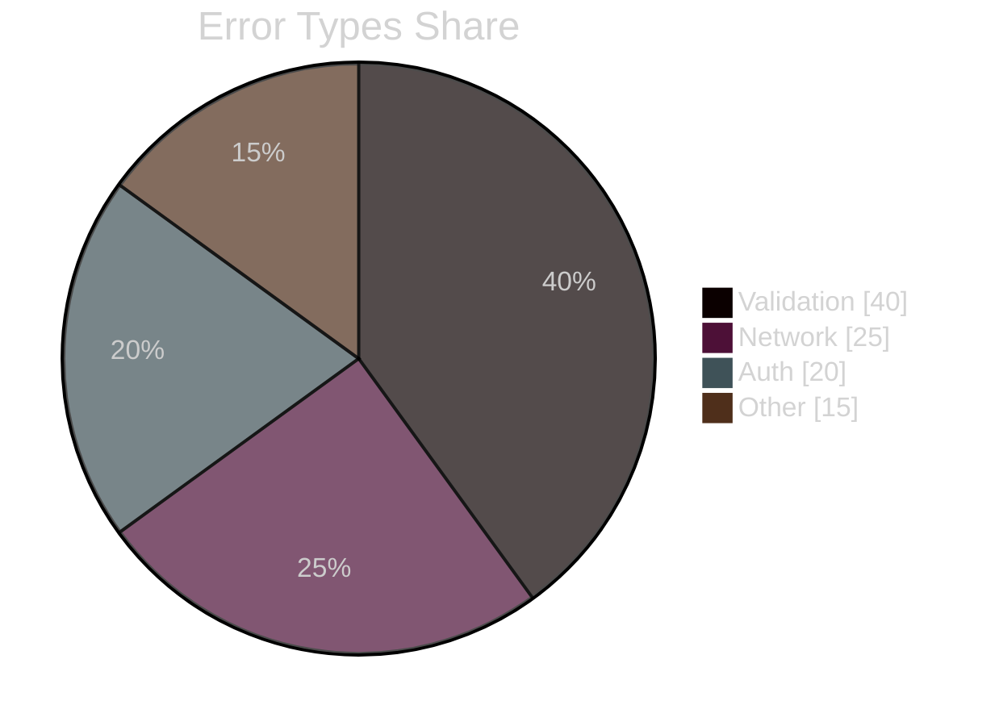
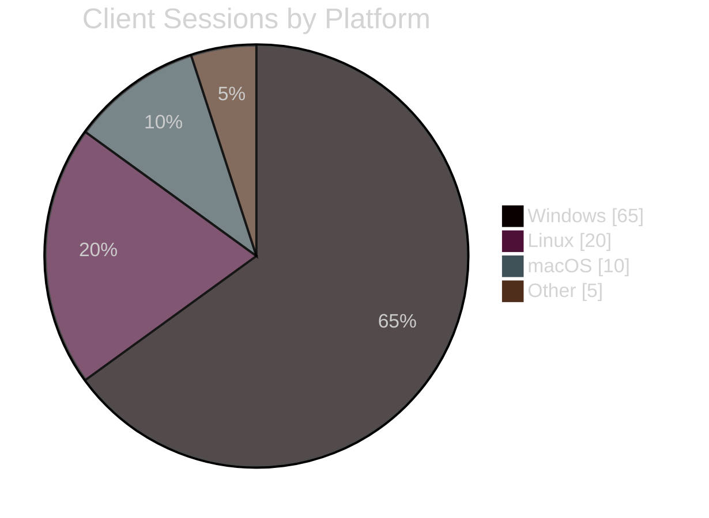
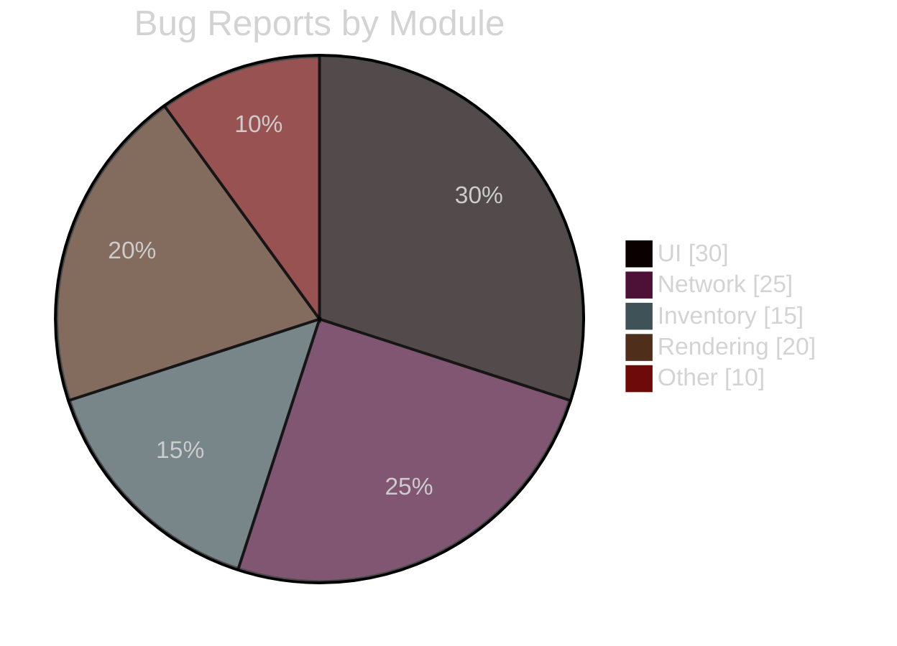
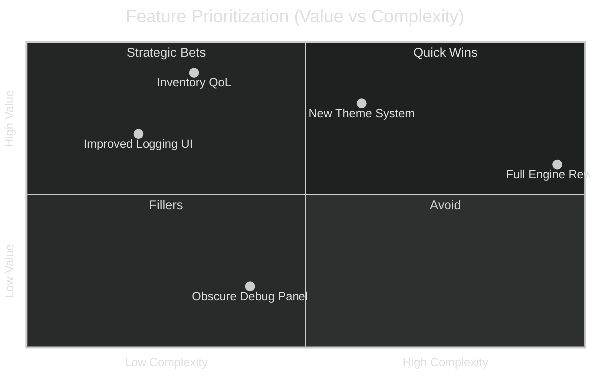
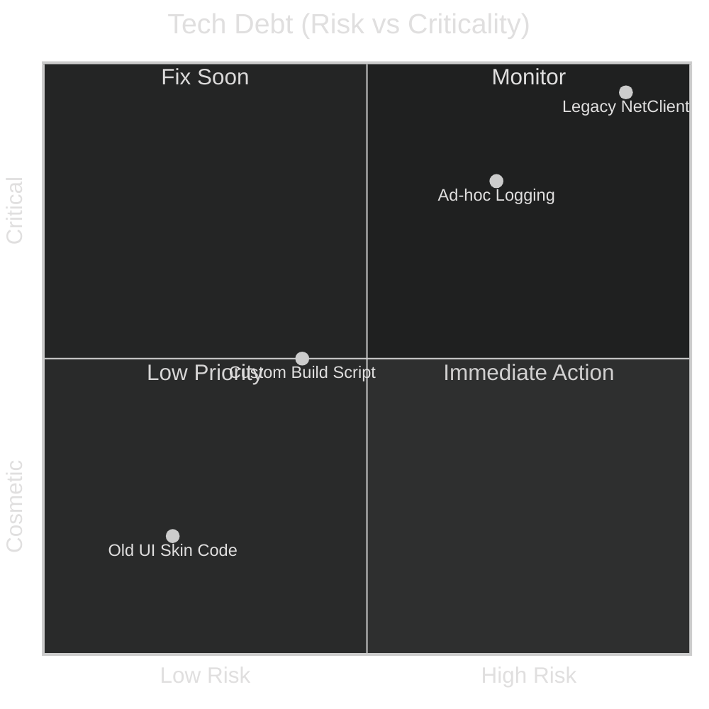
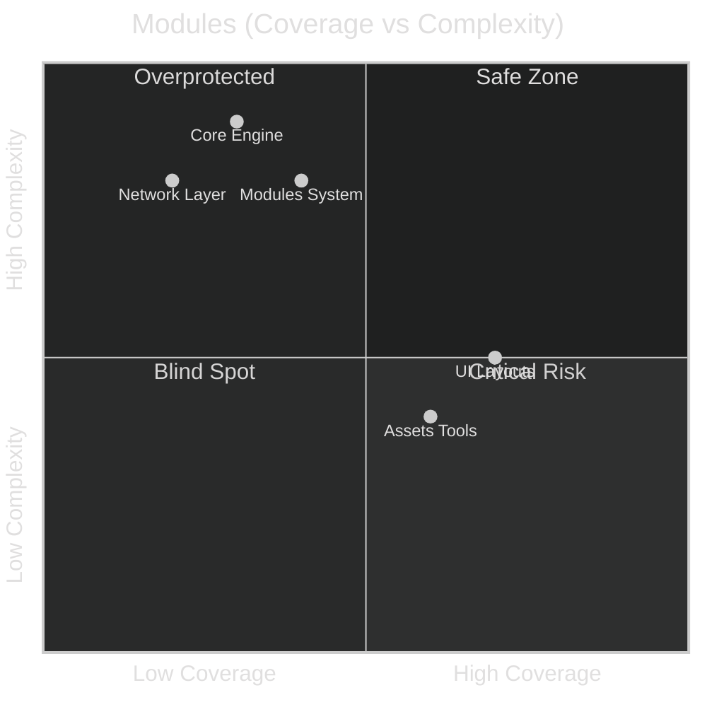
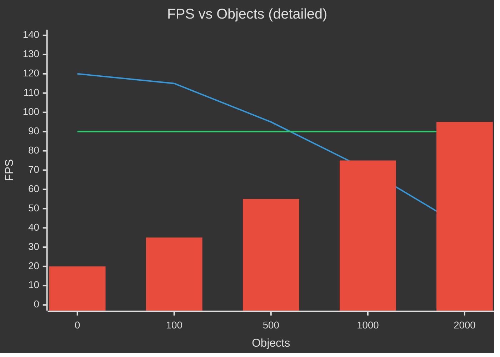

## Część D: Wizualizacja Danych i Analiza

### Wzorzec Dystrybucji Danych (`pie`)

`pie` służy do pokazania **proporcji** w jednym wymiarze. Jest prosty, ograniczony i dokładnie o to chodzi.

**Kiedy stosować:**

- udział typów błędów,
- udział platform / środowisk,
- udział modułów w ruchu / zdarzeniach / ticketach,
- szybki „snapshot” bez potrzeby pełnego `sankey-beta`.

> Jeśli zaczynasz kombinować z więcej niż 6–7 kategoriami, użyj czegoś innego.

---

#### Wariant 1: Typy Błędów w Kliencie

**Cel:** Pokazać, co naprawdę psuje użytkownikom dzień.

**Jak użyć:**
Opis pod spodem: dane z crash reporter + logów za ostatni okres. Szybki argument, gdzie inwestować w stabilizację.

---

#### Wariant 2: Udział Platform / Środowisk

**Cel:** Pokazać, gdzie OTClient jest realnie używany.

**Jak użyć:**
Uzasadnia priorytety: testy, optymalizacje, bugfixy per platforma, bez wypisywania tego w tabelkach.

---

#### Wariant 3: Udział Modułów w Zgłoszeniach Bugów

**Cel:** Pokazać, które obszary kodu generują najwięcej problemów.

**Jak użyć:**

* Pomaga zdecydować, które moduły docelowo dostać:

  * więcej testów,
  * więcej dokumentacji,
  * własne diagramy (`flowchart`, `sequenceDiagram`).

---

To wystarczy. `pie` jest narzędziem jednowymiarowym. Jak tylko próbujesz pokazać coś bardziej złożonego niż „udział X w Y”, przesiadasz się na `sankey-beta`, `xychart-beta` albo `quadrantChart`.

---

### Wzorzec Analizy Strategicznej (`quadrantChart`)

`quadrantChart` służy do podejmowania decyzji na podstawie **dwóch wymiarów**. Typowe zastosowania:

- wartość vs złożoność,
- ryzyko vs krytyczność,
- pokrycie testami vs złożoność,
- wpływ na użytkownika vs koszt utrzymania.

Dobre tam, gdzie normalnie robisz tabelkę „Feature / Value / Cost / Risk”, a każdy interpretuje ją inaczej.

> Jeśli Twój renderer nie wspiera `quadrantChart`, traktuj ten wzorzec jako opcjonalny.

---

#### Wariant 1: Priorytetyzacja Feature’ów OTClienta

**Cel:** Określić, które funkcje robić najpierw, patrząc na stosunek wartości do złożoności.

**Jak użyć:**

* Quick Wins (Q1) → kandydaci na najbliższy sprint.
* Q2 → wysoka wartość, ale wymagają decyzji architektonicznej.
* Q4 → kulturalny parking dla pomysłów, których nie warto ruszać.

---

#### Wariant 2: Tech Debt vs Ryzyko Produkcyjne

**Cel:** Pokazać, które długi techniczne są realnym zagrożeniem, a które są tylko estetycznym wstydem.

**Jak użyć:**

* Q4 → tu pakujesz czas najpierw, bez dyskusji.
* Q1 → obserwuj, ale nie dramatyzuj.
* Zastępuje losowe listy „critical/high/medium/low”.

---

#### Wariant 3: Moduły vs Testowalność / Złożoność

**Cel:** Wskazać moduły wymagające testów, dokumentacji i diagramów w pierwszej kolejności.

**Jak użyć:**

* Q3 + Q4 → lista miejsc do:

  * dopisania testów,
  * opisania w dokumentacji,
  * narysowania (`flowchart`, `sequenceDiagram`).
* Diagram działa jako radar, gdzie realnie przyłożyć wysiłek.

---

### Zasady użycia `quadrantChart` w tej dokumentacji

* Stosuj, gdy masz N opcji i 2 sensowne osie porównania.
* Nie stosuj, gdy opisujesz:

  * czas (`timeline`),
  * przepływy (`sankey-beta`),
  * strukturę (`classDiagram`, `erDiagram`).

---

### Wzorzec Danych XY (`xychart-beta`)

**Kiedy:** Wydajność, metryki, trendy, porównanie stanu realnego z celem i kosztu (np. obciążenie GPU).

Legenda (opis pod diagramem, nie w kodzie):

* **Measured FPS** – realne wyniki benchmarku klienta.
* **Target 90 FPS** – minimalny akceptowalny poziom wydajności.
* **GPU Load (%)** – koszt osiągnięcia danego FPS przy rosnącej liczbie obiektów.

> Uwaga: `xychart-beta` nie wspiera `click` w sposób stabilny w każdym rendererze. Jeśli potrzebujesz nawigacji, dodaj linki Markdown w tekście obok wykresu (np. do rozdziału o benchmarkach lub optymalizacjach).mermaid
> %%{init: {'theme': 'dark'}}%%

> xychart-beta

> title "FPS vs Objects"

> x-axis "Objects" 0 2000

> y-axis "FPS" 0 140

> line "FPS"
> 0 120
> 100 115
> 500 95
> 1000 70
> 2000 40
