## Część E: Techniki Zaawansowane

### Złożony Wzorzec Wizualizacji (Łączenie Diagramów)

* jeden Overview,
* mapę modułów powiązaną z rozdziałami,
* przykład interakcji modułu z Core,
* zero czarnego tekstu na czarnym,
* zero HTML w `mindmap`,
* sensowne linki między diagramami.

---

### Diagram 1: Przegląd architektury (wejście do wszystkiego)

Ulepszenia:

* Core jako centralny węzeł.
* Dodatkowe bloki: Storage, Telemetry.
* Jasne klasy wizualne.
* Klikalne przejścia do innych sekcji/diagramów.

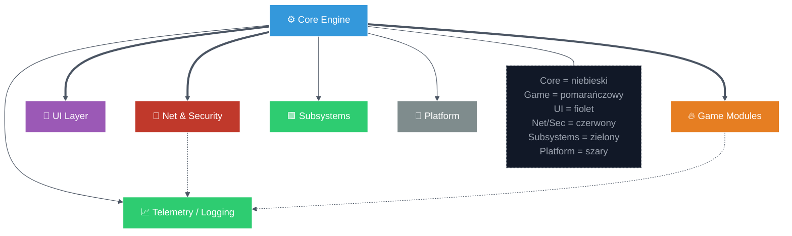

To jest główna mapa. Każdy inny diagram jest zoomem w jeden z tych boxów.

---

### Diagram 2: Mapa modułów (bez HTML syfu, spięta z rozdziałami)

Ulepszenia:

* Kolory przez `classDef`, żadnych `<font>`.
* Moduły odpowiadają rozdziałom dokumentacji.
* Od razu gotowe pod anchory w treści.

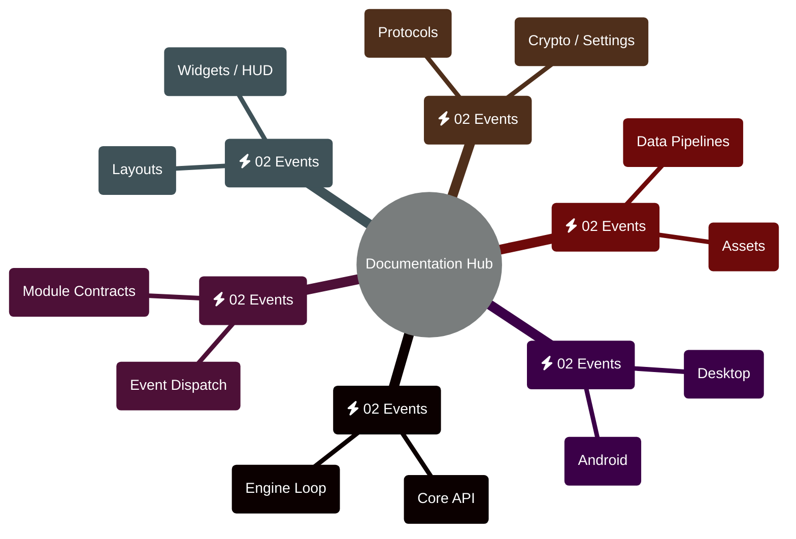

Jeśli chcesz, agent może tu podmieniać etykiety na podstawie CSV (kolumna `chapter`, `topics[]`) i zachowywać klasy.

---

### Diagram 3: Interakcja modułu z Core (konkretny przykład)

Ulepszenia:

* Pokazujesz realny przepływ: klient -> moduł -> Core -> Storage.
* Nadaje sens temu, po co są wcześniejsze mapy.

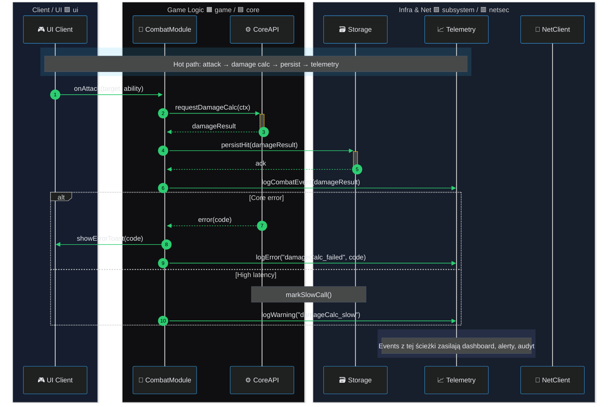

---
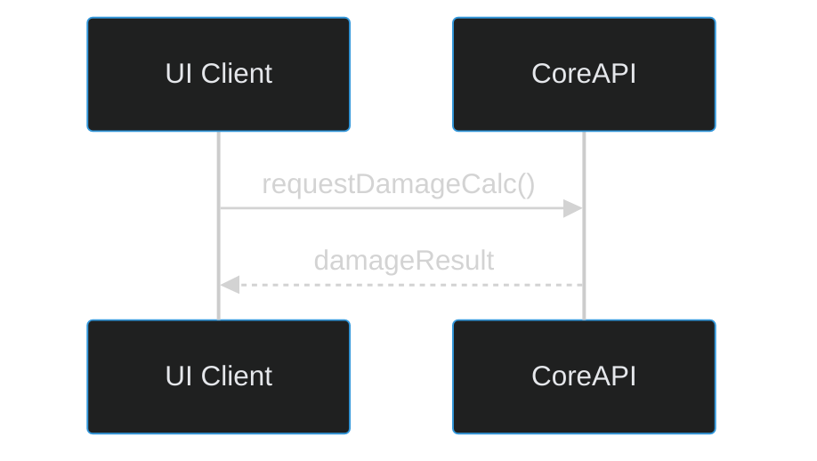


---

### Diagram 4: Sankey: dwa przypadki `sankey-beta`.
* 4A = szczegółowa analiza jednego hot path,
* 4B = strategiczny podział ruchu między modułami.

### Diagram 4A: Sankey — Hot path: request → Core → Storage/Telemetry

**Cel:** pokazać faktyczny przepływ jednego krytycznego scenariusza (np. atak z Diagramu 3): którędy idzie ruch, gdzie lądują dane, gdzie generują się logi.

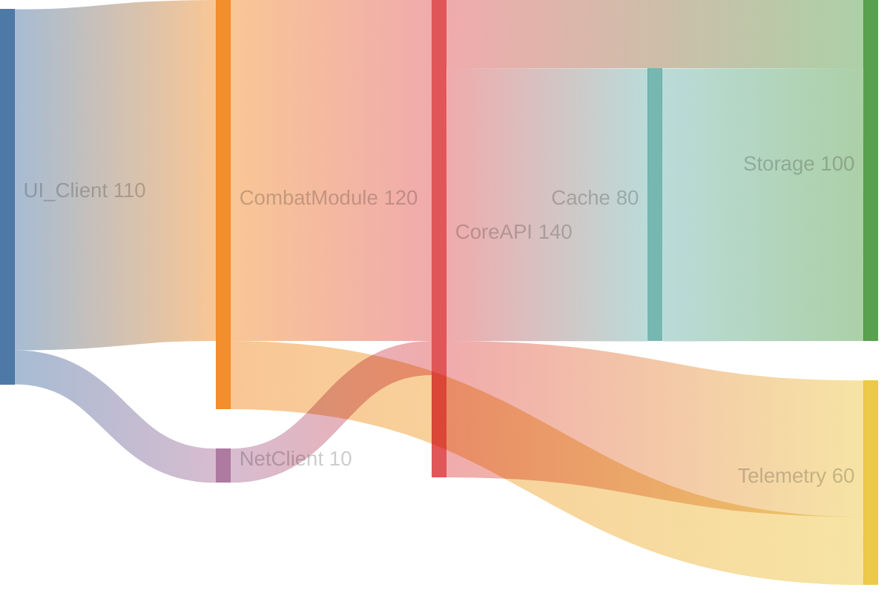

**Jak to czytać:**

* szerokość strumienia = udział ruchu / zapisów,
* `UI_Client → CombatModule → CoreAPI` = główna ścieżka z Diagramu 3,
* większość trafia do `Cache/Storage`, część do `Telemetry`,
* `UI_Client → NetClient → CoreAPI` pokazuje koszt transportu sieciowego,
* używasz tego diagramu przy rozmowie o bottleneckach, cache, IO i logowaniu dla konkretnego flow.

---

### Diagram 4B: Sankey — Rozkład ruchu między modułami (porównanie profili)

**Cel:** inny przypadek użycia. Nie pojedynczy hot path, tylko jak cały klient rozrzuca ruch na moduły i jak to przekłada się na Storage/Telemetry. Dobry do priorytetyzacji optymalizacji.

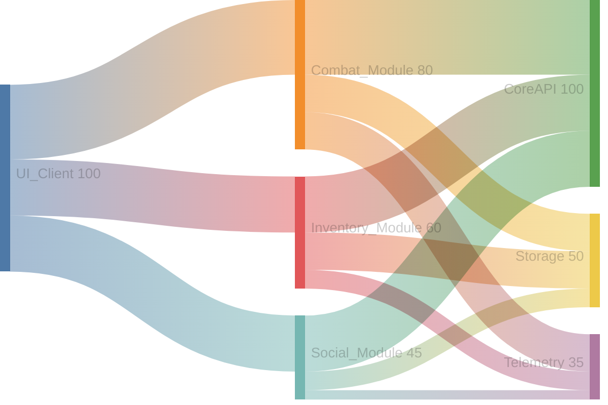

**Jak to czytać:**

* pokazuje, które moduły naprawdę generują koszt (I/O + logi),
* widać, że Combat dominuje, Inventory jest istotne, Social jest tańszy,
* ten diagram służy do:

  * decyzji „który moduł optymalizujemy pierwszy”,
  * mapowania priorytetów logowania i retencji danych,
  * spięcia z Overview (moduły) i ER (tabele Storage/Telemetry).

Możesz w tekście obok doprecyzować mapowanie ID → kolory/specyfikacja, np.:

* `UI_Client` = UI (🟪),
* `CombatModule` / `Combat_Module` = Logika gry (🟧),
* `CoreAPI` = Core (🟦),
* `Storage` / `Telemetry` = Subsystems (🟩),
* `NetClient` = Networking (🟥).

---

### Diagram 5: ERDiagram jako zaawansowany model danych

Ten rozdział pokazuje „production-ready” modele danych w dwóch warstwach:
- `erDiagram` — formalny model relacyjny (pod SQL / migracje / kontrakty).
- `graph` — „kafelkowy” i kompozytowy widok encji jako advanced usage Mermaida (subgraphy, style, relacje domenowe).

Trzy perspektywy:
- 5A — ekwipunek, ekonomia i assety gry.
- 5B — telemetria hot path i SLO.
- 5C — audyt, integralność i PII.

Każda ma wariant „+” pokazujący alternatywny styl i szersze możliwości.

---

### Diagram 5A: ER — Ekwipunek, ekonomia i assety gry

**Cel:** model itemów, wariantów i loadoutów spójny z warstwą Game **(game)** i asset Subsystems **(subsystem)**.

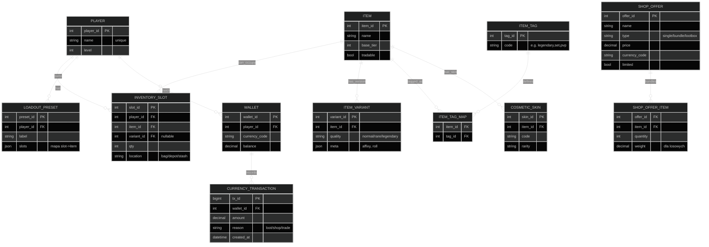

#### Diagram 5A+: Widok kafelkowy ekwipunku i assetów

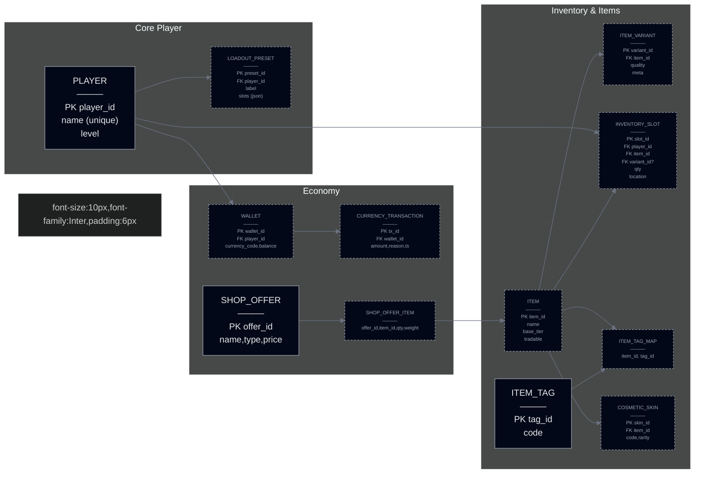

> Pattern: PLAYER/LOADOUT = gameplay, ITEM/VARIANT/INVENTORY = kontrakt z subsystemem assetów. Czysty przykład integracji domen.

---

### Diagram 5B: ER — Telemetria hot path i SLO

**Cel:** model danych pod SLO/SLA, latency, error-rate i korelację z logami dla kluczowych ścieżek.

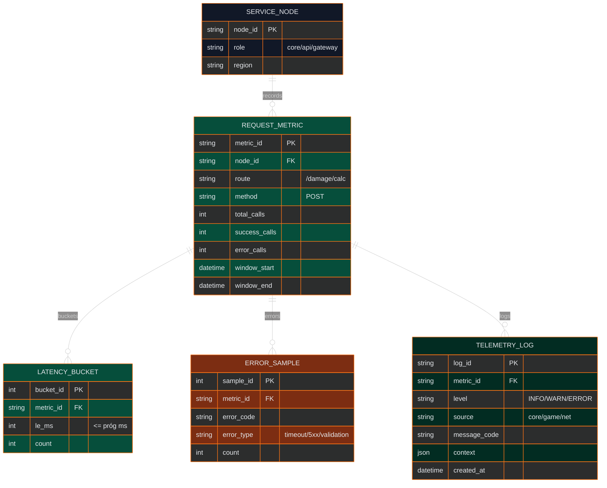

#### Diagram 5B+: Telemetria jako ścieżka przepływu danych

Inny pattern: layout przepływu, subgraphy, różne style krawędzi pokazujące etapy przetwarzania.

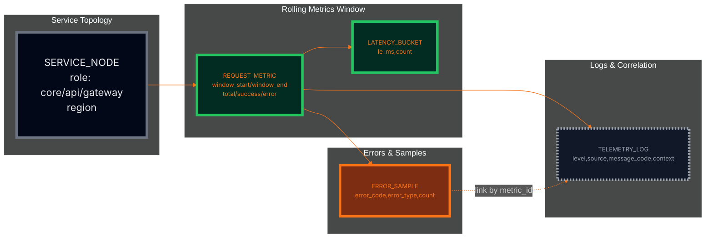

> Pattern: pokazujesz nie tylko tabele, ale przepływ: node → metryki → bucketizacja → próbkowanie błędów → korelacja z logami.

---

### Diagram 5C: ER — Audit, integralność i PII (Security / Compliance)

**Cel:** model audytu z wyraźnym rozdzieleniem PII, podpisów i polityk retencji.

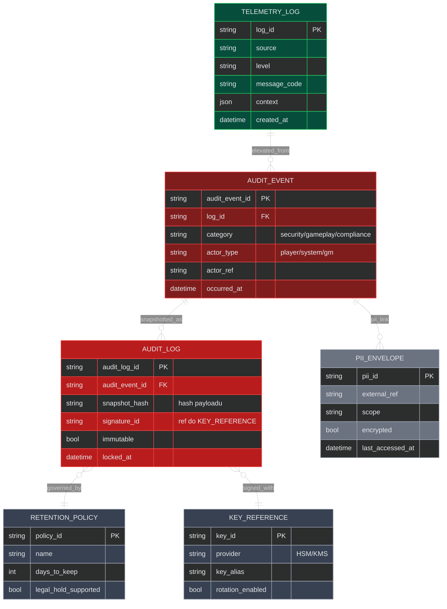

#### Diagram 5C+: Audit jako warstwy bezpieczeństwa i granice PII

Inny pattern: subgraphy jako warstwy bezpieczeństwa, strzałki pokazujące przepływ z logów do „cold storage” PII.

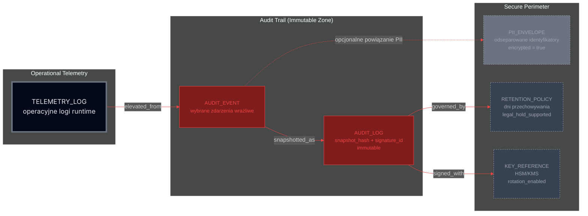

> Pattern: tu pokazujesz granice bezpieczeństwa, separację PII i niezmienialny audit log jako osobną strefę. Działa jako materiał referencyjny pod compliance.

---


### Diagram 6: Wzorzec stanów połączenia (stateDiagram-v2)

Cel tego bloku: pokazać zaawansowane użycie `stateDiagram-v2` jako wzorca dla klient–serwer, z wykorzystaniem różnych „assetów” Mermaida:
- klasy i kolory domen,
- `choice` (decyzje),
- stany z opisem,
- `fork` / `join` (równoległe kanały),
- notatki,
- retry z backoffem,
- opcjonalnie klikalne odnośniki do sekcji dokumentacji.

Uwaga: Dotyczy wyłącznie warstwy połączenia (network/netsec/telemetria). Modele danych domeny (itemy, ekonomia, audit, PII) są w Diagramie 5.

---

### Diagram 6A: Bazowy lifecycle produkcyjnego klienta

**Co pokazuje:**
- minimalny, implementowalny model stanów,
- rozróżnienie stanów stabilnych / przejściowych / krytycznych,
- prosty retry z backoffem,
- integrację z SLO i security events.

```mermaid
%%{init:{
  "theme":"dark",
  "securityLevel":"loose",
  "themeVariables":{
    "primaryTextColor":"#e5e7eb",
    "fontFamily":"Inter, system-ui, sans-serif"
  }
}}%%
stateDiagram-v2
    direction LR

    classDef netsec fill:#c0392b,stroke:#ffffff,color:#ffffff,stroke-width:1.2px
    classDef stable fill:#2ecc71,stroke:#111827,color:#111827,stroke-width:1.4px
    classDef degraded fill:#9b59b6,stroke:#ffffff,color:#ffffff,stroke-width:1.2px
    classDef retry fill:#7f8c8d,stroke:#ffffff,color:#ffffff,stroke-width:1.2px,stroke-dasharray:3 3
    classDef critical fill:#e74c3c,stroke:#ffffff,color:#ffffff,stroke-width:1.6px

    [*] --> Disconnected

    state "Connecting" as CONNECT
    state "Auth" as AUTH
    state "Connected" as OK
    state "Degraded" as SLOW
    state "Retry (backoff)" as RETRY
    state "AuthFailed" as AUTH_FAIL
    state CH <<choice>>

    Disconnected --> CONNECT: connect()
    CONNECT --> AUTH: tcp_ok
    CONNECT --> Disconnected: tcp_fail

    AUTH --> CH: validate_token()
    CH --> OK: 200 OK
    CH --> AUTH_FAIL: 401 / 403

    AUTH_FAIL --> RETRY: schedule_retry()
    RETRY --> CONNECT: retry()
    RETRY --> Disconnected: max_retries_exceeded

    OK --> SLOW: rtt > threshold / loss
    SLOW --> OK: recover()
    SLOW --> RETRY: timeout

    OK --> Disconnected: disconnect() / fatal

    note right of SLOW
      Stan ostrzegawczy:
      - zwiększ sampling,
      - generuj SLO-alerty.
    end note

    note right of AUTH_FAIL
      Emit security_event(critical)
      → pipeline nadużyć / banów.
    end note

    class Disconnected,CONNECT,AUTH,CH netsec
    class OK stable
    class SLOW degraded
    class RETRY retry
    class AUTH_FAIL critical
````

---

### Diagram 6B: Równoległe kanały Telemetry + Heartbeat

**Co dodaje:**

* `fork` do uruchomienia kanałów pomocniczych,
* wewnętrzne sub-stany Telemetry i Heartbeat,
* pokazuje, jak „bajery” stanowe mapują się na realne komponenty (monitoring, ping/pong),
* dalej ten sam kontrakt co 6A, ale bogatszy runtime.

```mermaid
%%{init:{
  "theme":"dark",
  "themeVariables":{
    "primaryTextColor":"#e5e7eb",
    "fontFamily":"Inter, system-ui, sans-serif"
  }
}}%%
stateDiagram-v2
    direction LR

    classDef netsec fill:#c0392b,stroke:#ffffff,color:#ffffff,stroke-width:1.2px
    classDef stable fill:#2ecc71,stroke:#111827,color:#111827,stroke-width:1.4px
    classDef transient fill:#9b59b6,stroke:#ffffff,color:#ffffff,stroke-width:1.2px
    classDef retry fill:#7f8c8d,stroke:#ffffff,color:#ffffff,stroke-width:1.2px,stroke-dasharray:3 3
    classDef critical fill:#e74c3c,stroke:#ffffff,color:#ffffff,stroke-width:1.6px

    [*] --> Disconnected

    Disconnected: no session
    Connecting: TCP handshake
    Auth: validate token
    Connected: ready
    Degraded: high RTT / loss
    ReconnectQueue: backoff
    AuthFailed: invalid / banned

    Disconnected --> Connecting: connect()
    Connecting --> Auth: tcp_ok
    Connecting --> Disconnected: tcp_fail

    state Decision <<choice>>
    Auth --> Decision
    Decision --> Connected: 200 OK
    Decision --> AuthFailed: 401 / 403

    AuthFailed --> ReconnectQueue: schedule_retry()
    ReconnectQueue --> Connecting: retry()
    ReconnectQueue --> Disconnected: max_retries_exceeded

    Connected --> Degraded: rtt > threshold
    Degraded --> Connected: recover()
    Degraded --> ReconnectQueue: timeout

    Connected --> Disconnected: disconnect() / fatal

    %% Fork: kanały równoległe
    state Fork <<fork>>
    Connected --> Fork: start side-channels
    Fork --> Telemetry
    Fork --> Heartbeat

    state Telemetry {
        [*] --> TelemetryOn
        TelemetryOn: logs + metrics
    }

    state Heartbeat {
        [*] --> Alive
        Alive: ping/pong
    }

    note right of Degraded
      Zwiększ częstotliwość Telemetry,
      przygotuj alerty SLO.
    end note

    note right of AuthFailed
      Traktuj jako incydent bezpieczeństwa.
    end note

    class Disconnected,Connecting,Auth,Decision,ReconnectQueue,Fork,Telemetry,Heartbeat netsec
    class Connected,TelemetryOn,Alive stable
    class Degraded transient
    class AuthFailed critical
    class ReconnectQueue retry
```

---

### Diagram 6C: Retry + flush telemetry + linki do dokumentacji

**Co demonstruje:**

* `fork` + `join` jako kontrolowany reconnect:

  * równoległy flush metryk/logów,
  * równoległy retry połączenia,
  * dopiero po obu krokach powrót do `Connecting`.
* spójne kolory warstw (netsec / subsystem),
* opcjonalne klikalne odnośniki do innych rozdziałów dokumentacji.

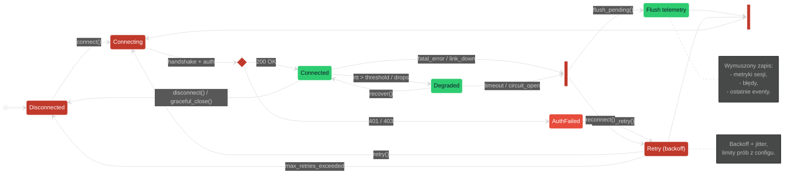

> Ten wariant pokazuje pełne, „produkcyjne” podejście do reconnectów:
> flush danych + kontrolowany retry + powiązania z resztą dokumentacji.
