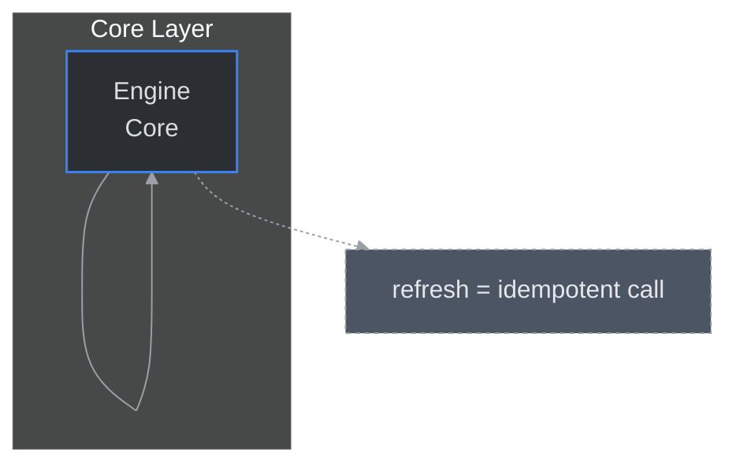

# Biblioteka Wzorców Projektowych — instrukcja adaptacji (finalna)

## 1. Cel i filozofia

Katalog [03_DESIGN_PATTERNS](./03_DESIGN_PATTERNS/) to zbiór praktycznych wzorców: przykłady organizacji diagramów, architektur i przepływów, które należy ADAPTOWAĆ do konkretnego dokumentu. Wzorce służą jako wskazówka projektowa — nigdy nie traktuj ich jako szablonów 1:1.

Zanim adaptujesz wzorzec:
- Przeczytaj: [README.md](../README.md) _(canonical init, idempotencja, frontmatter)_
- Przeczytaj: [02_VISUAL_GUIDELINES.md](../02_VISUAL_GUIDELINES.md) _(classDef, kolory, node-id)_

---

## 2. Czym jest wzorzec, a czym szablon

- Wzorzec = koncept + przykład implementacji + wskazówki adaptacyjne.
- Szablon = kod gotowy do skopiowania 1:1 (u nas: odradzany).

Reguła adaptacji:
1. Zrozum cel wzorca.
2. Dopasuj strukturę (liczba subgraph, typ relacji).
3. Zamień etykiety na rzeczywiste nazwy.
4. Dostosuj classDef do warstw [02_VISUAL_GUIDELINES.md](../02_VISUAL_GUIDELINES.md).
5. Dodaj idempotency marker jeśli diagram generowany.
6. Dodaj fallback dla `click`.

---

## 3. Jak wybrać najbliższy wzorzec (algorytm)

1. Określ typ treści (wykorzystaj heurystyki z README).
2. Wyszukaj w katalogu wzorce z odpowiednimi tagami (sekcje A..E).
3. Dopasuj strukturę (liczbę głównych elementów / subgraph).
4. Przy remisie wybierz wzorzec o najprostszej strukturze i zostaw notkę w PR z wyjaśnieniem.

Tag scoring (skrót):
- procesy → A_Flows_and_Processes
- struktury → B_Structure_and_Relations
- harmonogramy → C_Time_and_Planning
- analiza danych → D_Data_and_Analysis
- techniki zaawansowane → E_Advanced_TechNIQUES

---

## 4. Instrukcja krok po kroku adaptacji wzorca

1. Analiza celu dokumentu — jedna główna historia.
2. Wybór wzorca i wariantu.
3. Dostosuj etykiety (używaj `<br/>` do łamania).
4. Normalizuj node-id (lowercase, spaces→underscore).
5. Skopiuj przykładowe classDef z 02 i przypisz odpowiednie klasy.
6. Dodaj canonical init header.
7. Dodaj idempotency marker nad blokiem (jeśli generowane).
8. Dodaj fallbacky pod diagramem dla `click`.
9. Lokalna walidacja (mermaid-lint / mmdc).
10. PR z opisem adaptacji i listą plików do ręcznej weryfikacji.

---

## 5. Struktura katalogu i szybka nawigacja

Sekcje:
- A_Flows_and_Processes.md — flowchart, sequenceDiagram, stateDiagram-v2, sankey
- B_Structure_and_Relations.md — classDiagram (symulowany), erDiagram, mindmap
- C_Time_and_Planning.md — gantt, timeline, gitGraph
- D_Data_and_Analysis.md — pie, quadrantChart, xychart
- E_Advanced_TechNIQUES.md — łączenie diagramów, overview+details

Zacznij zawsze od README w tym katalogu.

---

## 6. Przykłady adaptacji (konkretne)

Przykład: zależności modułów
- Wybierz: B_Structure_and_Relations
- Działania: zamień nazwy, zastosuj classDef game, dodaj click+fallback, dodaj marker.

Przykład: przepływ autoryzacji
- Wybierz: A_Flows_and_Processes → sequenceDiagram
- Działania: użyj sequenceDiagram (bez classDef), init z themeVariables, fallback linki.

Przykład: placeholder
- Użyj podejścia A lub B z README (placeholder .mmd lub komentarz TODO). Zostaw jasną listę planowanych elementów.

---

## 7. Reguły adaptacyjne i constraints (ważne)

- Nie kopiuj 1:1 — redukuj lub rozszerzaj liczbę węzłów zgodnie z realnym kontekstem.
- Nie używaj `classDef` w typach, które go nie wspierają (sequenceDiagram/erDiagram).
- Jeśli diagram >12 węzłów lub >3 poziomy → podziel na overview + details.
- Dodaj fallback dla `click` i sprawdź targety.

---

## 8. Dokumentacja zmian adaptacyjnych w PR

W opisie PR/commicie dodaj:
- wzorzec źródłowy (plik i sekcja),
- powód wyboru wzorca (heurystyka),
- co zmieniono (liczba węzłów, classDef, node-id normalization),
- czy dodano marker idempotencyjny,
- lista plików wymagających manualnej weryfikacji.

---

## 9. Współpraca z narzędziami (generatorami)

Aby ułatwić automatyzację, wzorce powinny:
- zawierać canonical init header,
- oferować przykładowy classDef,
- zawierać przykład idempotency marker,
- opisywać które linie są do zmiany przy adaptacji (komentarze `%% REPLACE:`).

Generator powinien:
- normalizować node-id,
- rozpoznawać i aktualizować istniejące bloki po markerze,
- raportować pliki do ręcznej weryfikacji.

---

## 10. Testowanie adaptacji

Przed commitem:
- test renderu w GitHub Preview,
- mermaid-lint i/lub mmdc lokalnie,
- sprawdź istnienie linków click (albo umieść je w raporcie PR).

Polecenia:
```bash
npx mermaid-lint docs/authoring/** || true
npx @mermaid-js/mermaid-cli -i docs/.../diagram.mmd -o /tmp/test.svg
```

---

## 11. Checklista adaptacji (szybko)

- [ ] właściwy wzorzec wybrany,
- [ ] etykiety zastąpione rzeczywistymi nazwami,
- [ ] node-id znormalizowane,
- [ ] classDef dopasowane,
- [ ] canonical init header obecny,
- [ ] idempotency marker dodany (jeśli generowane),
- [ ] click → fallback + weryfikacja targetów,
- [ ] lokalna walidacja OK,
- [ ] PR opisuje decyzje adaptacyjne.

---

## 12. Rozszerzenia i dodawanie nowych wzorców

Jeśli dodajesz wzorzec:
1. Stwórz plik w sekcji A..E z opisem celu i zastosowania.
2. Dodaj canonical init i przykładowe classDef.
3. Dodaj tagi na górze pliku (ułatwia wyszukiwanie).
4. Otwórz PR z uzasadnieniem i przykładami użycia.

---

## 13. Przykładowy minimalny snippet adaptacyjny

<!-- mermaid-diagram: generated-by=diagram-agent v1; source_sha=d98152d96da9ca8c14f42b06ebd9bc3e4833769d; generated_at=2025-11-07T09:00:00Z -->

<!-- /mermaid-diagram -->

ten README w katalogu [03_DESIGN_PATTERNS](./03_DESIGN_PATTERNS/) zawiera kompletne, praktyczne wytyczne, które ułatwiają adaptację wzorców zarówno ręcznie, jak i automatycznie. 
