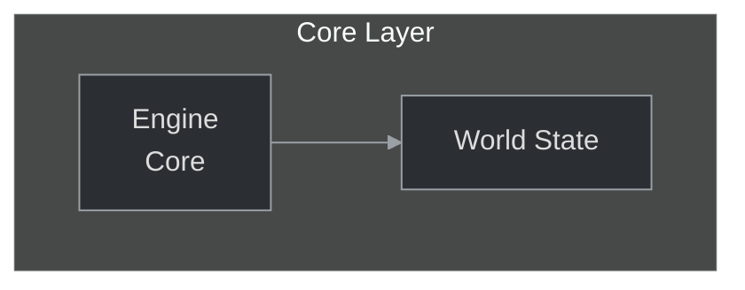

# Biblioteka Wzorców Projektowych — Przewodnik po adaptacji (uzupełniony)

## 1. Cel i filozofia

Ten katalog to zbiór praktycznych wzorców (przykładów) do tworzenia diagramów Mermaid. Służy jako "książka kucharska" — pokazuje sprawdzone techniki i układy, które należy ADAPTOWAĆ do konkretnego dokumentu.  
Wzorce nie są szablonami 1:1 — kopiowanie bez analizy prowadzi do niespójności stylistycznych i semantycznych.

Zanim zaczniesz:
- Przeczytaj: ../README.md (system projektowania, canonical init, idempotency, frontmatter).
- Przeczytaj: ../02_VISUAL_GUIDELINES.md (classDef, kolory, reguły łamania etykiet).

---

## 2. Kluczowa różnica: wzorzec ≠ szablon

- Wzorzec = koncepcja + przykład implementacji. Pokazuje, jak zorganizować elementy, jakie mają role i jakie style są użyte.
- Szablon = gotowy kod do skopiowania.

Reguła: zawsze adaptuj
1. Zmień nazwy węzłów na faktyczne nazwy z dokumentu.
2. Dostosuj classDef zgodnie z lokalizacją komponentów (patrz 02_VISUAL_GUIDELINES).
3. Dodaj idempotency marker jeśli diagram jest generowany automatycznie.
4. Zadbaj o frontmatter (jeśli dodajesz/uzupełniasz w .md) zgodnie z canonical schema (README).

---

## 3. Jak wybrać najbliższy wzorzec — algorytm wyboru

1. Określ typ treści według heurystyk z głównego README (flows → flowchart, interakcje → sequenceDiagram, encje → erDiagram, harmonogram → gantt).
2. Przeszukaj katalog 03_DESIGN_PATTERNS po tagach/nazwach (sekcje A..E). Szukaj wzorców z podobną liczbą grup/subgraph i typem relacji.
3. Dopasuj:
   - liczba głównych elementów (np. 3 główne moduły → wybierz wzorzec z 3 subgraph)
   - typ relacji (synchronizacja / asynchroniczna / zależności)
4. Jeśli kilka wzorców pasuje, wybierz ten o najbliższej strukturze i opisz decyzję w commit message/PR.
5. Jeśli brak dobrego dopasowania — wybierz najbliższy typ (np. flowchart zamiast sequence) i oznacz to w opisie zmian.

Heurystyka pomocnicza (tag scoring):
- dopasuj wzorzec, który dzieli elementy tak, jak Twoja dokumentacja (np. proces→A_Flows, struktura→B_Structure).

---

## 4. Jak adaptować wzorzec — krok po kroku

1. Analiza celu: co diagram ma przekazać (jedna historia).
2. Weź przykład z odpowiedniej sekcji (A..E).
3. Zastąp etykiety węzłów rzeczywistymi nazwami; stosuj `<br/>` do łamania długich etykiet.
4. Znormalizuj node-id (lowercase, spaces→underscore) i opcjonalnie prefiksuj `doc_id_` przy generatorach.
5. Zastosuj canonical init header (README sekcja 12.1).
6. Dopasuj classDef zgodnie z 02_VISUAL_GUIDELINES (core/module/ui/data/event).
7. Dodaj idempotency marker nad blokiem jeśli diagram generowany.
8. Dodaj fallback linki pod diagramem, jeśli używasz `click`.
9. Przetestuj: render w GitHub Preview i lokalne `mmdc`/`mermaid-lint`.
10. W commit/PR opisz: wzorzec źródłowy, powody adaptacji, liczba węzłów, decyzję o podziale (jeśli dotyczy).

Przykładowy commit message:
```
diagram: adapt A_Flows_and_Processes -> docs/authoring/xyz.md
- used flowchart pattern; added classDef core/ui
- reason: document describes stepwise processing
```

---

## 5. Struktura katalogu i szybka nawigacja

Sekcje tematyczne:
- A_Flows_and_Processes.md — flowchart, sequenceDiagram, stateDiagram-v2, sankey
- B_Structure_and_Relations.md — classDiagram (symulowany), erDiagram, mindmap
- C_Time_and_Planning.md — gantt, timeline, gitGraph
- D_Data_and_Analysis.md — pie, quadrantChart, xychart
- E_Advanced_Techniques.md — łączenie diagramów (overview + details), multi-perspective dashboards

Zawsze zaczynaj od pliku README w tym katalogu — ma indeks i wskazówki jak dopasować.

---

## 6. Przykłady adaptacji (konkretne)

Przykład 1 — Zależności modułów (adaptacja z B_Structure_and_Relations):
- Cel: pokazać zależności modułów w `12_otmod`.
- Wybór: flowchart (pattern: structure-as-graph).
- Działania adaptacyjne:
  - Zamień etykiety na faktyczne moduły (game_skills, game_inventory).
  - Zastosuj `classDef game` do wszystkich modułów.
  - Dodaj click do facet anchors z fallbackiem.
  - Dodaj marker idempotencyjny jeśli diagram wygenerowany.

Przykład 2 — Przepływ autoryzacji (adaptacja z A_Flows_and_Processes):
- Cel: pokazać sekwencję request/response między Client a LoginServer.
- Wybór: sequenceDiagram.
- Działania:
  - Użyj `sequenceDiagram` (bez classDef).
  - Dodaj init z themeVariables dla kolorów aktorów.
  - Test renderu w GitHub (sequenceDiagram może nie wspierać click — użyj fallbacków).

Przykład 3 — Placeholder dla przyszłego diagramu:
- Wybierz Podejście A lub B z głównego README (placeholder .mmd lub TODO comment).
- Umieść krótką listę planowanych elementów w komentarzu.

---

## 7. Reguły adaptacyjne i ograniczenia

- Nie kopiuj kodu wzorca 1:1 — usuń zbędne przykładowe węzły, dopasuj poziom szczegółu.
- Nie używaj `classDef` w typach, które go nie wspierają (np. sequenceDiagram, erDiagram) — zamiast tego stylizuj przez `init`.
- Jeśli diagram przekracza progi czytelności (więcej niż 12 węzłów lub >3 poziomy), podziel go na overview + details.
- Zawsze dodaj fallback dla `click`.

---

## 8. Wzorzec dokumentacji zmian (co wpisywać w PR)

W opisie PR/commicie należy umieścić:
- Który wzorzec adaptowano (plik i sekcja).
- Dlaczego ten wzorzec (heurystyka).
- Krótkie porównanie: oryginalny przykład ↔ zaadaptowany diagram (co zmieniono).
- Statystyki: liczba węzłów, czy dodano marker idempotencyjny, czy zmodyfikowano frontmatter.
- Lista plików wymagających manualnej weryfikacji (np. brakujące anchor-y, nieistniejące pliki doc).

---

## 9. Współpraca z generatorami / automatyzacją

Wzorce mają być łatwe do adaptacji przez ludzi i boty. Aby to ułatwić:
- Upewnij się, że wzorzec zawiera:
  - Canonical init header (README sekcja 12.1).
  - Przykładowe classDef zgodne z 02_VISUAL_GUIDELINES.
  - Przykładowy idempotency marker i wzmiankę o frontmatter.
- Dodaj komentarze w przykładach opisujące które linie powinny być zmienione przy adaptacji (np. `%% REPLACE: labels, classDef if needed`).

Generator powinien:
- Normalizować node-id.
- Rozpoznawać i aktualizować istniejące bloki po idempotency markerze.
- Tworzyć raport o wszystkich zmianach i o plikach wymagających ręcznej interwencji.

---

## 10. Testowanie adaptowanych wzorców

Przed commitem:
- Render test: GitHub Preview + lokalne `mmdc`/`mermaid-lint`.
- Sprawdź, że click targets istnieją (albo są wykazane w PR jako brakujące).
- Upewnij się, że frontmatter (jeśli dodany) jest zgodny z canonical schema.

Przykładowe polecenia:
```bash
# lint (opcjonalne)
npx mermaid-lint docs/authoring/**.mmd

# render example file
npx @mermaid-js/mermaid-cli -i docs/authoring/.../diagram.mmd -o /tmp/test.svg
```

---

## 11. Checklist adaptacji wzorca (szybko)

- [ ] Wybrano właściwy wzorzec zgodnie z heurystyką.
- [ ] Etykiety zastąpione rzeczywistymi nazwami i sformatowane (<br/>).
- [ ] Node-id znormalizowane i unikatowe.
- [ ] classDef dopasowane do warstw (02_VISUAL_GUIDELINES).
- [ ] Canonical init header obecny.
- [ ] Idempotency marker dodany (jeśli generowane).
- [ ] Click → fallback oraz weryfikacja targetów.
- [ ] Local render i mermaid-lint OK.
- [ ] Commit/PR opisuje decyzje adaptacyjne i wskazuje pliki do manualnej weryfikacji.

---

## 12. Gdzie dodać nowe wzorce?

Jeśli chcesz dodać nowy wzorzec:
1. Stwórz plik w odpowiadającej sekcji (A..E) z opisem celu, przykładem i wariantami.
2. Użyj canonical init header i dołącz sample classDef.
3. Dodaj tagi (na górze pliku) — ułatwia wyszukiwanie wg heurystyk.
4. Otwórz PR z opisem: dlaczego wzorzec jest potrzebny i przykłady zastosowań.

---

## 13. Przykładowy minimalny snippet adaptacyjny (do kopiowania)

<!-- mermaid-diagram: generated-by=diagram-agent v1; source_sha=d98152d96da9ca8c14f42b06ebd9bc3e4833769d; generated_at=2025-11-07T09:00:00Z -->

<!-- /mermaid-diagram -->

Kluczowe:

- Komentarze HTML nie mogą być w środku ```mermaid.
- Info typu `generated-by`, `source_sha` trzymaj w komentarzu nad/po bloku albo w opisie PR, nie mieszaj z kodem diagramu.
::contentReference[oaicite:0]{index=0}

---

Dzięki za utrzymywanie wzorców w porządku — poprawna adaptacja wzorca jest kluczowa, żeby diagramy automatyczne i ręczne były spójne, czytelne i łatwe w utrzymaniu.
