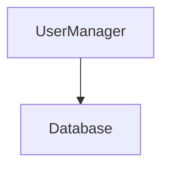
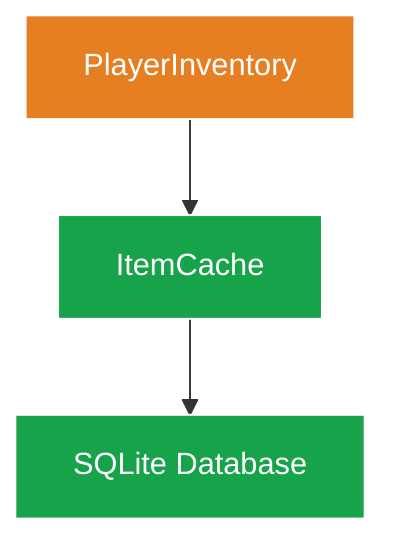

# Biblioteka Wzorców Projektowych Diagramów

## 1. Cel i Filozofia

Ten katalog to zbiór gotowych do użycia **wzorców projektowych ("przepisów")** dla szerokiej gamy zadań wizualizacyjnych. Działa jak "książka kucharska" dla twórców diagramów, pokazując, jak wybrać odpowiednie narzędzie (typ diagramu) do konkretnego problemu i jak zaimplementować je zgodnie ze standardami zdefiniowanymi w nadrzędnych dokumentach:

*   **[../01_DESIGN_PHILOSOPHY.md](../01_DESIGN_PHILOSOPHY.md):** Określa, **dlaczego** tworzymy diagramy w określony sposób.
*   **[../02_VISUAL_GUIDELINES.md](../02_VISUAL_GUIDELINES.md):** Definiuje, **jak** mają wyglądać (nasza paleta stylów).

**Ważne:** Wzorce w tym katalogu są **przykładami i inspiracjami**, nie sztywnymi szablonami. Adaptuj je do swoich potrzeb, zachowując zgodność z systemem wizualnym i filozofią.

### 1.1. Jak Używać Tej Biblioteki

1. **Zidentyfikuj typ treści:** Co chcesz zwizualizować? (przepływ, strukturę, czas, dane?)
2. **Wybierz najbliższy wzorzec:** Użyj poniższego indeksu aby znaleźć odpowiednią kategorię
3. **Adaptuj przykład:** Skopiuj kod, zmień nazwy węzłów, dostosuj kolory warstw
4. **Waliduj:** Sprawdź zgodność z checklistą w [../README.md](../README.md#9-checklista-jakości-diagramu)

### 1.2. Adaptacja Wzorców do Twojego Dokumentu

**Proces adaptacji (krok po kroku):**

1. **Kopiuj strukturę, nie treść:**
   - Zachowaj typ diagramu (np. `flowchart`, `sequenceDiagram`)
   - Zachowaj blok `%%{init: ...}%%`
   - Zachowaj definicje `classDef` jeśli są w przykładzie

2. **Zamień nazwy węzłów:**
   - Przykład: `UserManager` → Twoja klasa: `PlayerInventory`
   - Zachowaj konwencję ID węzłów (CamelCase)

3. **Dostosuj warstwy architektoniczne:**
   - Sprawdź katalog Twojego komponentu w [02_VISUAL_GUIDELINES.md](../02_VISUAL_GUIDELINES.md#21-wymiar-1-warstwy-architektoniczne-kolor-tła)
   - Przypisz odpowiednią klasę (np. `game`, `ui`, `core`)

4. **Zachowaj semantykę linii:**
   - `-->` dla synchronicznych wywołań
   - `-.->` dla asynchronicznych zdarzeń
   - `==>` dla kluczowych przepływów danych

5. **Testuj rendering:**
   - Sprawdź w GitHub preview
   - Użyj `mmdc` lokalnie (patrz: [../README.md#81-lokalna-walidacja](../README.md#81-lokalna-walidacja))

**Przykład adaptacji:**

**Wzorzec (oryginalny):**


**Twoja adaptacja:**


### 1.3. Jak Wybrać Najbliższy Wzorzec?

**Drzewo decyzyjne:**

```
START
│
├─ Czy pokazujesz PRZEPŁYW w czasie lub logikę?
│  ├─ TAK → Część A: Przepływy i Procesy
│  │  ├─ Interakcja między aktorami? → sequenceDiagram (A.2)
│  │  ├─ Zmiana stanu obiektu? → stateDiagram-v2 (A.3)
│  │  ├─ Przepływ danych/kontroli? → flowchart (A.1)
│  │  └─ Przepływ zasobów z wielkościami? → sankey-beta (A.5)
│  │
│  └─ NIE → Czy pokazujesz STRUKTURĘ lub RELACJE?
│     ├─ TAK → Część B: Struktura i Relacje
│     │  ├─ Relacje encji bazy danych? → erDiagram (B.2)
│     │  ├─ Hierarchia konceptów? → mindmap (B.3)
│     │  └─ Struktura klas? → flowchart z klasami (B.1)
│     │
│     └─ NIE → Czy pokazujesz CZAS lub HARMONOGRAM?
│        ├─ TAK → Część C: Czas i Planowanie
│        │  ├─ Wydarzenia na osi czasu? → timeline (C.1)
│        │  ├─ Harmonogram projektu? → gantt (C.2)
│        │  └─ Historia Git? → gitGraph (C.3)
│        │
│        └─ NIE → Czy pokazujesz DANE ILOŚCIOWE?
│           └─ TAK → Część D: Dane i Analiza
│              ├─ Procentowy udział? → pie (D.1)
│              ├─ Macierz 2x2 priorytetów? → quadrantChart (D.2)
│              └─ Wykres XY? → xychart-beta (D.3)
```

**Skróty:**
- **Nie wiesz?** → Zacznij od `flowchart` (najuniwersalniejszy)
- **Zbyt złożone?** → Zobacz Część E: Techniki Zaawansowane (łączenie diagramów)
- **Nowy przypadek użycia?** → Stwórz nowy wzorzec i dodaj do tej biblioteki

## 2. Szczegółowy Indeks Wzorców

Poniżej znajduje się kompletny spis treści tej biblioteki. Każdy link prowadzi do odpowiedniego pliku i nagłówka (anchora), umożliwiając szybką nawigację do konkretnego wzorca.

### [Część A: Przepływy i Procesy](./A_Flows_and_Processes.md)
*   [Wzorzec Przepływu Danych (`flowchart`)](./A_Flows_and_Processes.md#wzorzec-przepływu-danych-flowchart--graph)
*   [Wzorzec Sekwencji Interakcji (`sequenceDiagram`)](./A_Flows_and_Processes.md#wzorzec-sekwencji-interakcji-sequencediagram)
*   [Wzorzec Maszyny Stanów (`stateDiagram-v2`)](./A_Flows_and_Processes.md#wzorzec-maszyny-stanow-statediagram-v2)
*   [Wzorzec Podróży Użytkownika/Systemu (`journey`)](./A_Flows_and_Processes.md#wzorzec-podrozy-uzytkownikssystemu-journey)
*   [Wzorzec Analizy Przepływu Zasobów (`sankey-beta`)](./A_Flows_and_Processes.md#wzorzec-analizy-przepływu-zasobow-sankey-beta)

### [Część B: Struktura i Relacje](./B_Structure_and_Relations.md)
*   [Wzorzec Struktury Klas (symulowany `flowchart`)](./B_Structure_and_Relations.md#wzorzec-struktury-klas-symulowany-za-pomocą-flowchart)
*   [Wzorzec Modelu Danych (`erDiagram`)](./B_Structure_and_Relations.md#wzorzec-modelu-danych-erdiagram)
*   [Wzorzec Mapy Myśli (`mindmap`)](./B_Structure_and_Relations.md#wzorzec-mapy-mysli-mindmap)

### [Część C: Czas i Planowanie](./C_Time_and_Planning.md)
*   [Wzorzec Osi Czasu Zdarzeń (`timeline`)](./C_Time_and_Planning.md#wzorzec-osi-czasu-zdarzen-timeline)
*   [Wzorzec Harmonogramu Projektu (`gantt`)](./C_Time_and_Planning.md#wzorzec-harmonogramu-projektu-gantt)
*   [Wzorzec Historii Wersji (`gitGraph`)](./C_Time_and_Planning.md#wzorzec-historii-wersji-gitgraph)

### [Część D: Wizualizacja Danych i Analiza](./D_Data_and_Analysis.md)
*   [Wzorzec Dystrybucji Danych (`pie`)](./D_Data_and_Analysis.md#wzorzec-dystrybucji-danych-pie)
*   [Wzorzec Analizy Strategicznej (`quadrantChart`)](./D_Data_and_Analysis.md#wzorzec-analizy-strategicznej-quadrantchart)
*   [Wzorzec Danych XY (`xychart-beta`)](./D_Data_and_Analysis.md#wzorzec-danych-xy-xychart-beta)

### [Część E: Techniki Zaawansowane](./E_Advanced_Techniques.md)
*   [Złożony Wzorzec Wizualizacji (Łączenie Diagramów)](./E_Advanced_Techniques.md#zlozony-wzorzec-wizualizacji-laczenie-diagramow)
