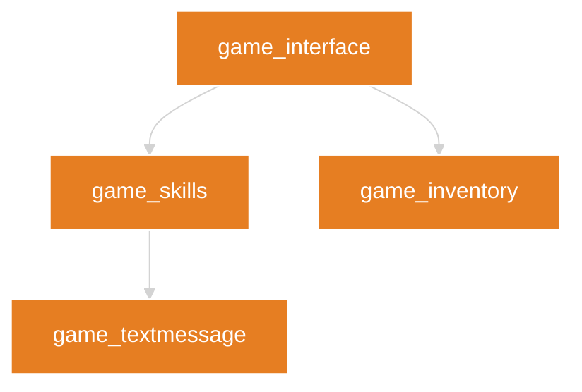
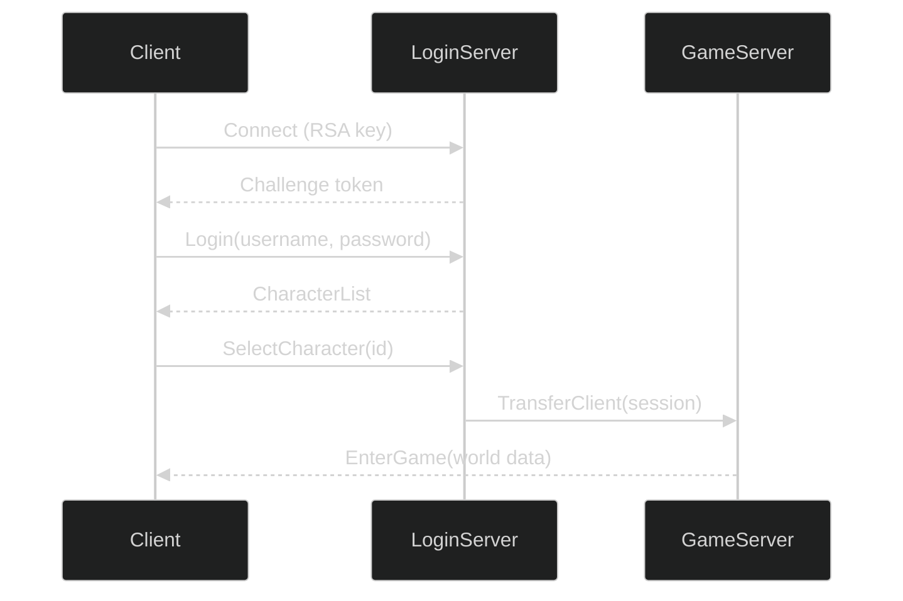
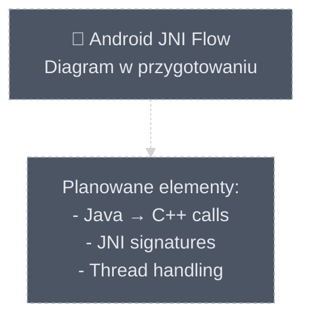

# Biblioteka Wzorców Projektowych Diagramów

## 1. Cel i Filozofia

Ten katalog to zbiór gotowych do użycia **wzorców projektowych ("przepisów")** dla szerokiej gamy zadań wizualizacyjnych. Działa jak "książka kucharska" dla twórców diagramów, pokazując, jak wybrać odpowiednie narzędzie (typ diagramu) do konkretnego problemu i jak zaimplementować je zgodnie ze standardami zdefiniowanymi w nadrzędnych dokumentach:

*   **[../01_DESIGN_PHILOSOPHY.md](../01_DESIGN_PHILOSOPHY.md):** Określa, **dlaczego** tworzymy diagramy w określony sposób.
*   **[../02_VISUAL_GUIDELINES.md](../02_VISUAL_GUIDELINES.md):** Definiuje, **jak** mają wyglądać (nasza paleta stylów).

Wzorce są pogrupowane tematycznie w dedykowane pliki, aby ułatwić nawigację i zapewnić wydajność renderowania.

### 1.1. Wzorce jako Przykłady, Nie Szablony

**Ważne:** Pliki w tym katalogu (`03_DESIGN_PATTERNS/`) zawierają **przykładowe wzorce i techniki**, nie sztywne szablony do bezpośredniego kopiowania. 

**Różnica między wzorcem a szablonem:**
- **Szablon** = gotowy kod do skopiowania 1:1.
- **Wzorzec** = **koncepcja projektowa** + przykład implementacji, który należy **zaadaptować** do konkretnego przypadku użycia.

**Jak używać wzorców:**
1. Przeczytaj opis wzorca, aby zrozumieć jego cel i strukturę.
2. Przeanalizuj przykładowy kod i zidentyfikuj kluczowe elementy (inicjalizacja, typy węzłów, relacje).
3. **Zaadaptuj** przykład do swojej dokumentacji:
   - Zmień nazwy węzłów na rzeczywiste komponenty z projektu.
   - Dostosuj warstwy architektoniczne (`classDef`) do faktycznej lokalizacji kodu.
   - Dodaj/usuń węzły według potrzeb.
4. Zachowaj style i konwencje wizualne zdefiniowane w `02_VISUAL_GUIDELINES.md`.

### 1.2. Jak Wybrać Najbliższy Wzorzec

**Algorytm wyboru wzorca:**

1. **Zidentyfikuj typ treści** (patrz: [README.md, Sekcja 5](../README.md#5-mapping-treści--typ-diagramu)).
2. **Sprawdź tagi wzorców** w indeksie poniżej (Sekcja 2).
3. **Dopasuj nazwę sekcji dokumentacji** do kategorii wzorca:
   - Dokumentujesz przepływ danych? → Część A (Flows and Processes).
   - Pokazujesz strukturę klas/modułów? → Część B (Structure and Relations).
   - Tworzysz harmonogram/oś czasu? → Część C (Time and Planning).
   - Prezentujesz statystyki/analizę? → Część D (Data and Analysis).
4. **Przeczytaj 2-3 wzorce** z wybranej kategorii.
5. **Wybierz wzorzec**, który najbardziej przypomina Twoją sytuację (liczba aktorów, złożoność, kierunek przepływu).

**Heurystyka oparta na tagach:**

| Twoja Dokumentacja Zawiera | Szukaj Wzorca z Tagami |
| :--- | :--- |
| Komunikacja klient-serwer | `sequenceDiagram`, `interaction`, `protocol` |
| Cykl życia obiektu | `stateDiagram-v2`, `lifecycle`, `state-machine` |
| Hierarchia modułów/klas | `flowchart`, `structure`, `hierarchy` |
| Zależności między plikami | `graph`, `dependencies`, `imports` |
| Alokacja zasobów (z wartościami) | `sankey-beta`, `resources`, `flow` |
| Harmonogram wersji | `gantt`, `timeline`, `planning` |
| Udział kategorii | `pie`, `distribution`, `statistics` |

**Przykład:**
- **Cel:** Zadokumentować, jak moduły w `12_otmod` zależą od siebie.
- **Typ treści:** Zależności między modułami (struktura).
- **Tagi:** `dependencies`, `structure`, `modules`.
- **Wybór:** [Część B: Struktura i Relacje](./B_Structure_and_Relations.md) → Wzorzec "Struktura Klas" (zaadaptowany na moduły).

## 2. Szczegółowy Indeks Wzorców

Poniżej znajduje się kompletny spis treści tej biblioteki. Każdy link prowadzi do odpowiedniego pliku i nagłówka (anchora), umożliwiając szybką nawigację do konkretnego wzorca.

### [Część A: Przepływy i Procesy](./A_Flows_and_Processes.md)
*   [Wzorzec Przepływu Danych (`flowchart`)](./A_Flows_and_Processes.md#wzorzec-przepływu-danych-flowchart--graph)
*   [Wzorzec Sekwencji Interakcji (`sequenceDiagram`)](./A_Flows_and_Processes.md#wzorzec-sekwencji-interakcji-sequencediagram)
*   [Wzorzec Maszyny Stanów (`stateDiagram-v2`)](./A_Flows_and_Processes.md#wzorzec-maszyny-stanow-statediagram-v2)
*   [Wzorzec Podróży Użytkownika/Systemu (`journey`)](./A_Flows_and_Processes.md#wzorzec-podrozy-uzytkownikssystemu-journey)
*   [Wzorzec Analizy Przepływu Zasobów (`sankey-beta`)](./A_Flows_and_Processes.md#wzorzec-analizy-przepływu-zasobow-sankey-beta)

### [Część B: Struktura i Relacje](./B_Structure_and_Relations.md)
*   [Wzorzec Struktury Klas (symulowany `flowchart`)](./B_Structure_and_Relations.md#wzorzec-struktury-klas-symulowany-za-pomocą-flowchart)
*   [Wzorzec Modelu Danych (`erDiagram`)](./B_Structure_and_Relations.md#wzorzec-modelu-danych-erdiagram)
*   [Wzorzec Mapy Myśli (`mindmap`)](./B_Structure_and_Relations.md#wzorzec-mapy-mysli-mindmap)

### [Część C: Czas i Planowanie](./C_Time_and_Planning.md)
*   [Wzorzec Osi Czasu Zdarzeń (`timeline`)](./C_Time_and_Planning.md#wzorzec-osi-czasu-zdarzen-timeline)
*   [Wzorzec Harmonogramu Projektu (`gantt`)](./C_Time_and_Planning.md#wzorzec-harmonogramu-projektu-gantt)
*   [Wzorzec Historii Wersji (`gitGraph`)](./C_Time_and_Planning.md#wzorzec-historii-wersji-gitgraph)

### [Część D: Wizualizacja Danych i Analiza](./D_Data_and_Analysis.md)
*   [Wzorzec Dystrybucji Danych (`pie`)](./D_Data_and_Analysis.md#wzorzec-dystrybucji-danych-pie)
*   [Wzorzec Analizy Strategicznej (`quadrantChart`)](./D_Data_and_Analysis.md#wzorzec-analizy-strategicznej-quadrantchart)
*   [Wzorzec Danych XY (`xychart-beta`)](./D_Data_and_Analysis.md#wzorzec-danych-xy-xychart-beta)

### [Część E: Techniki Zaawansowane](./E_Advanced_Techniques.md)
*   [Złożony Wzorzec Wizualizacji (Łączenie Diagramów)](./E_Advanced_Techniques.md#zlozony-wzorzec-wizualizacji-laczenie-diagramow)

---

## 3. Praktyczne Przykłady Adaptacji Wzorców

### 3.1. Scenariusz: Dokumentowanie Zależności Modułów

**Cel:** Pokazać, jak moduły w katalogu `modules/` zależą od siebie.

**Krok 1: Wybór wzorca**
- Typ treści: Struktura i relacje między modułami.
- Wybór: [Część B: Wzorzec Struktury Klas](./B_Structure_and_Relations.md).

**Krok 2: Analiza danych**
- Źródło: `docs/authoring/12_otmod/datasets/module_deps.csv`.
- Kolumny: `module`, `dependencies[]`.

**Krok 3: Adaptacja**


**Krok 4: Weryfikacja**
- ✅ Użyto standardowego `init`.
- ✅ Wszystkie moduły mają klasę `game` (warstwa architektury).
- ✅ Diagram renderuje się w GitHub.

### 3.2. Scenariusz: Wizualizacja Przepływu Autoryzacji

**Cel:** Pokazać interakcję między klientem a serwerem podczas logowania.

**Krok 1: Wybór wzorca**
- Typ treści: Interakcja w czasie.
- Wybór: [Część A: Wzorzec Sekwencji Interakcji](./A_Flows_and_Processes.md#wzorzec-sekwencji-interakcji-sequencediagram).

**Krok 2: Analiza danych**
- Źródło: Dokumentacja protokołu w `docs/authoring/05_network/`.
- Aktorzy: `Client`, `LoginServer`, `GameServer`.

**Krok 3: Adaptacja**


**Krok 4: Weryfikacja**
- ✅ Używa `sequenceDiagram` (nie `flowchart`).
- ✅ Bez `classDef` (nieobsługiwane).
- ✅ Strzałki `->>`/`-->>` zgodnie z semantyką.

### 3.3. Scenariusz: Placeholder dla Przyszłego Diagramu

**Cel:** Zarezerwować miejsce na diagram "Android JNI Flow", który jeszcze nie został zaprojektowany.

**Krok 1: Wybór podejścia**
- Użyj [Sekcji 6 z README.md](../README.md#6-obsługa-placeholderów-i-brakujących-plików) → Placeholder Diagram.

**Krok 2: Implementacja**


**Krok 3: Dodaj TODO w dokumentacji**
```markdown
<!-- TODO: Replace placeholder with full JNI sequence diagram -->
<!-- Source: docs/authoring/14_android/datasets/jni_signatures.csv -->
```

---

## 4. Checklist Adaptacji Wzorca

Przed zatwierdzeniem zaadaptowanego diagramu:

-   [ ] **Przeczytałem wzorzec źródłowy** i zrozumiałem jego strukturę.
-   [ ] **Zidentyfikowałem źródło danych** (CSV, kod, dokumentacja).
-   [ ] **Zmieniłem nazwy węzłów** na rzeczywiste komponenty z projektu.
-   [ ] **Zastosowałem odpowiednie klasy `classDef`** zgodnie z warstwami architektonicznymi.
-   [ ] **Dodałem linki `click`** (jeśli obsługiwane i dostępne pliki).
-   [ ] **Usunąłem zbędne elementy** z przykładu wzorca (nie kopiuję 1:1).
-   [ ] **Zweryfikowałem renderowanie** w GitHub i lokalnie (jeśli możliwe).
-   [ ] **Dodałem frontmatter** do pliku `.md` (jeśli diagram jest osadzony).

---

## 5. Wskazówki Zaawansowane

### 5.1. Łączenie Wielu Wzorców

Możesz łączyć elementy z różnych wzorców w jednym dokumencie:
- **Przykład:** `flowchart` (overview) + `sequenceDiagram` (szczegóły interakcji) + `gantt` (harmonogram implementacji).

### 5.2. Generowanie Diagramów z CSV

Jeśli masz dane w CSV, rozważ napisanie skryptu do automatycznego generowania diagramów:
- Użyj markera `AUTO-GENERATED` (patrz: [Sekcja 7 w README.md](../README.md#7-idempotencja-i-marker-generowanego-bloku)).
- Przykładowy generator: `scripts/generate_module_deps_diagram.js`.

### 5.3. Kiedy NIE Używać Wzorca

Nie kopiuj wzorca, jeśli:
- Twój przypadek użycia jest **zbyt prosty** (np. 2 węzły i 1 połączenie → za mały do pełnego wzorca).
- **Nie pasuje** typ diagramu (np. nie używaj `sequenceDiagram` dla struktury klas).
- **Dane są niekompletne** → użyj placeholder (Sekcja 3.3).
