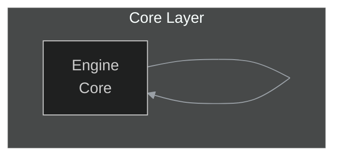

# System Projektowania Diagramów: Przewodnik dla Twórców (finalna, skonsolidowana wersja)

## 1. Wprowadzenie

Witaj w systemie projektowania diagramów. Ten zbiór dokumentów jest kompletnym przewodnikiem do tworzenia spójnych, czytelnych i semantycznie bogatych diagramów Mermaid dla naszego projektu. Celem jest, aby diagramy były nie tylko ilustracją, ale narzędziem inżynierskim.

Zanim zaczniesz: zapoznaj się z kolejnością dokumentów:
1. 01_DESIGN_PHILOSOPHY.md — dlaczego tak projektujemy,
2. 02_VISUAL_GUIDELINES.md — jak ma wyglądać,
3. 03_DESIGN_PATTERNS/ — jak to zrobić (wzorce do adaptacji).

---

## 2. Proces Tworzenia Wizualizacji — skrót procedury

1. Analiza celu: Jaka jest jedna historia, którą diagram ma opowiedzieć?
2. Wybór strategii: prosty diagram czy system overview+details?
3. Wybór wzorca: przeszukaj 03_DESIGN_PATTERNS i dopasuj wzorzec (zaadaptuj, nie kopiuj 1:1).
4. Implementacja: napisz kod Mermaid stosując canonical init i classDef z 02_VISUAL_GUIDELINES.
5. Walidacja: mermaid-lint / mmdc lokalnie i preview w GitHub.
6. PR: opisz decyzje, statystyki i pliki wymagające ręcznej weryfikacji.

---

## 3. Checklista jakości (skrót)

Przed commitem sprawdź minimum:
- diagram opowiada jedną historię;
- canonical init header obecny;
- idempotency marker (jeśli wygenerowano);
- fallbacky dla `click` i weryfikacja targetów;
- frontmatter zgodny ze specyfikacją (jeśli dodany);
- diagram renderuje się w GitHub Preview i przechodzi mermaid-lint/mmdc.

Pełna, rozbudowana checklista znajduje się w sekcji 11.

---

## 4. Mapping treści → wybór typu diagramu (heurystyki i scoring)

Używamy deterministycznej heurystyki opartej na słowach-kluczach z prostym scoringiem.

Przykładowe słowa-klucze i wagi (+2 = silne dopasowanie):
- flowchart: steps, krok, proces, next, then, -> (+2)
- sequenceDiagram: request, response, client, server, actor (+2)
- erDiagram/classDiagram: entity, table, field, schema, column, relation (+2)
- gantt: date, milestone, schedule, plan (+2)
- sankey-beta: flow, value, amount, proportion (+2)

Algorytm:
1. Zlicz punkty dla każdego typu.
2. Wybierz najwyższy wynik.
3. Przy remisie zastosuj tie-breaker: sequenceDiagram > flowchart > erDiagram > gantt.
4. Jeśli wynik bliski/niejednoznaczny, wygeneruj notkę w PR o potrzebie manualnej weryfikacji.

---

## 5. Obsługa placeholderów i brakujących plików

Zasady:
- Jeżeli plik .md zawiera placeholder (np. `<!-- TODO: mermaid -->`), agent domyślnie:
  - może wygenerować diagram zgodnie z heurystyką i wstawić go, albo
  - pozostawić placeholder i dodać komentarz TODO w PR (konfigurowalne).
- Jeśli CSV wskazuje na nieistniejący plik .md: NIE tworzysz pełnych kontentowych plików automatycznie — raportuj brak w PR. Tworzenie minimalnych placeholderów z frontmatter wymaga wyraźnej zgody.
- Placeholder .mmd: minimalny przykład znajduje się w 03_DESIGN_PATTERNS.

---

## 6. Idempotencja (marker) i wykrywanie bloków generowanych

Obowiązkowy marker nad blokiem Mermaid wygenerowanym automatycznie:
```text
<!-- mermaid-diagram: generated-by=diagram-agent v1; source_sha=d98152d96da9ca8c14f42b06ebd9bc3e4833769d; generated_at=2025-11-07T09:00:00Z -->
```

Regex wykrywania (do użycia w narzędziach):
```
/<!--\s*mermaid-diagram:\s*generated-by=[^;]+;\s*source_sha=[0-9a-f]{40};\s*generated_at=[0-9T:\-\.Z]+?\s*-->/
```

Ręczna edycja:
- Jeśli ktoś edytuje wygenerowany blok ręcznie, dodać komentarz `%% MANUALLY EDITED: <reason>`, a najlepiej usunąć/zmodyfikować marker `generated-by`, by generator go nie nadpisał.

---

## 7. Canonical frontmatter — schemat i walidacja

Canonical frontmatter (wymagane pola/formaty tam, gdzie dodajemy frontmatter):

```yaml
---
doc_id: "authoring/game-engine"               # opcjonalny; zachowaj istniejący jeśli występuje
source_path: "docs/authoring/game-engine.md"  # względna ścieżka
source_sha: "d98152d96da9ca8c14f42b06ebd9bc3e4833769d"  # 40-znakowy SHA hex
last_sync_iso: "2025-11-07T09:00:00Z"         # ISO8601 UTC
doc_class: "guide"
language: "pl"
title: "Game Engine — przegląd"
summary: "Krótki opis: co pokazuje diagram i jaka jest jego jednostka."
tags: ["architecture","core"]
---
```

Walidacja frontmatter:
- `source_sha`: 40-znakowy hex,
- `last_sync_iso`: ISO8601 UTC (YYYY-MM-DDTHH:MM:SSZ).
- Reguła MERGE: jeśli frontmatter istnieje, uzupełnij braki i nie nadpisuj pól `title` ani `summary` bez uzasadnienia.

Opcjonalny JSON Schema (do wbudowanej walidacji, przykład do wklejenia w narzędziu CI — nie dodajemy pliku automatycznie tutaj):
```json
{
  "type": "object",
  "properties": {
    "doc_id": {"type": "string"},
    "source_path": {"type": "string"},
    "source_sha": {"type": "string", "pattern": "^[0-9a-f]{40}$"},
    "last_sync_iso": {"type": "string", "format": "date-time"},
    "doc_class": {"type": "string"},
    "language": {"type": "string"},
    "title": {"type": "string"},
    "summary": {"type": "string"},
    "tags": {"type": "array", "items": {"type": "string"}}
  },
  "required": ["source_path","last_sync_iso","doc_class","language"]
}
```

---

## 8. Canonical init header (dokładny format)

Wszystkie diagramy MUSZĄ zaczynać się od tego nagłówka (dokładny zapis):

```text
%%{init: {'theme':'dark','themeVariables': {'primaryTextColor':'#ddd','lineColor':'#9aa0a6'}, 'securityLevel':'loose'}}%%
```

Uwagi:
- Jeżeli środowisko docsite nie wspiera `securityLevel:'loose'`, użyj fallbacku (usuń interaktywność i dodaj fallback linki) i opisz to w PR.

---

## 9. Click / interaktywność i obowiązkowe fallbacki

Reguła:
- `click` dozwolony w `graph`/`flowchart`/`mindmap`.
- Dla każdego `click` obowiązkowy fallback: lista „Powiązane dokumenty” pod diagramem (markdown linki).
- CI powinno sprawdzić istnienie pliku target (dla relatywnych ścieżek) lub ostrzec w raporcie.

Przykład fallbacku pod diagramem:
```markdown
Powiązane dokumenty:
- Engine — ./index.html#facet-01_core.engine
```

---

## 10. Wersja Mermaid i kompatybilność rendererów

- Docelowo: Mermaid v10+. Jeśli docsite używa innej wersji — opisać w PR konieczność dostosowania.
- Uwaga: niektóre funkcje (np. click) mogą być ignorowane przez mermaid-cli lub Sphinx. Testuj w co najmniej dwóch rendererach: GitHub + mermaid-cli (lokalnie).

---

## 11. Walidacja i CI — reguła „nie dodawaj, jeśli istnieje”

Zasada: przed dodaniem workflow sprawdź, czy repo zawiera już workflow walidujący diagramy. Jeżeli tak — zaproponuj aktualizację zamiast tworzyć duplikat.

Proponowany krok w PR:
- W PR napisz, który workflow istnieje i co proponujesz dodać/zmienić.
- Jeśli brak workflow — proponujemy plik `.github/workflows/validate-diagrams.yml` (przykład poniżej). Dodajemy go tylko gdy repo nie ma równoważnego.

Przykładowy job (do wklejenia tylko jeśli dodajemy workflow):
```yaml
name: Validate Mermaid Diagrams
on:
  pull_request:
    paths:
      - 'docs/**/*.mmd'
      - 'docs/**/*.md'
jobs:
  validate:
    runs-on: ubuntu-latest
    steps:
      - uses: actions/checkout@v4
      - uses: actions/setup-node@v4
        with: { node-version: '20' }
      - run: npm ci
      - run: npx mermaid-lint docs/authoring/** || true
      - name: Render found .mmd files
        run: |
          find docs -name '*.mmd' -type f | while read f; do
            echo "Validating $f"
            npx @mermaid-js/mermaid-cli -i "$f" -o /tmp/mermaid_validate.svg || exit 1
          done
```

---

## 12. Rozszerzona checklista (pełna)

Faza planowania:
- [ ] Typ diagramu zgodny z heurystyką.
- [ ] Źródła danych zidentyfikowane.

Faza implementacji:
- [ ] Canonical init obecny.
- [ ] Idempotency marker dodany (jeśli diagram generowany).
- [ ] Frontmatter poprawny (merge zamiast overwrite).
- [ ] Node-id znormalizowane.
- [ ] Etykiety łamane z `<br/>` (max 3 linie).

Faza walidacji:
- [ ] Diagram renderuje się w GitHub Preview.
- [ ] Meramid-lint / mmdc przechodzi.
- [ ] Wszystkie `click` mają fallback i linki istnieją.

Faza PR:
- [ ] W opisie PR: statystyki (przejrzane, naprawione, wygenerowane, brakujące), pliki wymagające ręcznej weryfikacji i decyzje adaptacyjne.

---

## 13. Przykładowe snippet-y (canonical)

Canonical init header:
```text
%%{init: {'theme':'dark','themeVariables': {'primaryTextColor':'#ddd','lineColor':'#9aa0a6'}, 'securityLevel':'loose'}}%%
```

Idempotency marker:
```text
<!-- mermaid-diagram: generated-by=diagram-agent v1; source_sha=d98152d96da9ca8c14f42b06ebd9bc3e4833769d; generated_at=2025-11-07T09:00:00Z -->
```

Minimalny flowchart z subgraph + click + fallback:


---

## 14. FAQ i często zadawane kwestie

Q: Co jeśli `click` psuje render?  
A: Usuń `click`, pozostaw komentarz fallback i opisz problem w PR.

Q: Czy generator może tworzyć pełne pliki .md?  
A: Nie bez wyraźnej zgody; domyślnie raportujemy brakujące pliki i tworzymy tylko minimalne placeholdery po uzgodnieniu.

Q: Co zrobić przy niejednoznacznym wyborze typu diagramu?  
A: Wybierz typ według heurystyk i dodaj notkę w PR z prośbą o manualny review.

---

## 15. Kontakt / Review

Każdy automatyczny PR dotyczący diagramów powinien mieć co najmniej jednego recenzenta dokumentacji. W razie wątpliwości oznacz opiekuna dokumentacji w PR.

---

Dziękujemy za stosowanie reguł — ta wersja README zawiera wszystkie elementy wymagane do bezpiecznej i powtarzalnej automatyzacji diagramów (idempotencja, frontmatter, heurystyki, fallbacki i zasada „nie dodawaj workflow jeśli istnieje”). Jeśli chcesz, wygeneruję teraz finalne patch-e (commit) z tymi treściami do gałęzi i otworzę PR — daj znać czy kontynuować (mogę przygotować patchy lub utworzyć PR, zgodnie z Twoim uprawnieniem).
