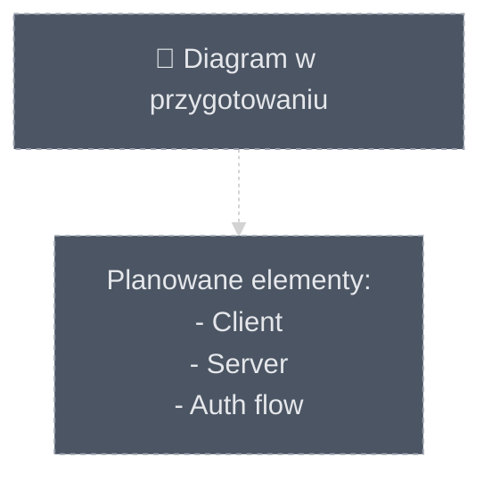
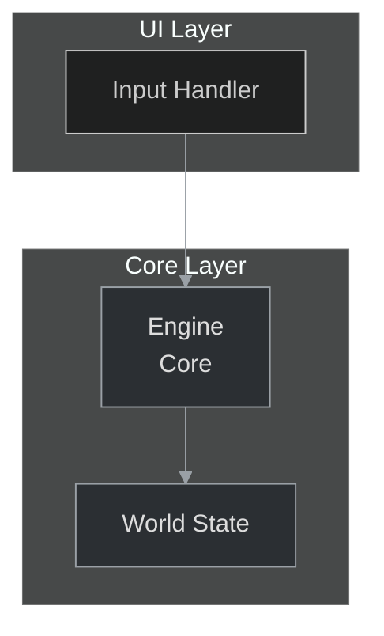

# System Projektowania Diagramów: Przewodnik dla Twórców

## 1. Wprowadzenie

Witaj w systemie projektowania diagramów. Ten zbiór dokumentów stanowi kompletny przewodnik do tworzenia spójnych, czytelnych i semantycznie bogatych diagramów Mermaid dla naszego projektu.

Celem tego systemu jest transformacja diagramów z pasywnych ilustracji w aktywne narzędzia inżynierskie.

## 2. Struktura Systemu

Ten system składa się z trzech fundamentalnych filarów, które razem tworzą kompletny, hierarchiczny framework:

*   **[01_DESIGN_PHILOSOPHY.md](./01_DESIGN_PHILOSOPHY.md)**: **"Dlaczego?"** - Definiuje nasze podstawowe zasady myślowe. Przeczytaj go, aby zrozumieć, co sprawia, że diagram jest skuteczny.
*   **[02_VISUAL_GUIDELINES.md](./02_VISUAL_GUIDELINES.md)**: **"Jak ma wyglądać?"** - Ścisła specyfikacja techniczna wszystkich elementów wizualnych (kolory, ikony, style). To jest Twoja paleta i konwencja.
*   **[Biblioteka Wzorców Projektowych](./03_DESIGN_PATTERNS/) (`03_DESIGN_PATTERNS/`)**: **"Jak to zrobić?"** - Zbiór gotowych do użycia, praktycznych wzorców. Działa jak "książka kucharska".

Zanim zaczniesz tworzyć lub automatycznie generować diagramy, zapoznaj się kolejno z tą triadą: filozofia → wytyczne wizualne → wzorce.

---

## 3. Proces Tworzenia Wizualizacji: Algorytm dla AI i Deweloperów

Aby stworzyć nową wizualizację, postępuj zgodnie z poniższym, strategicznym procesem.

### Krok 1: Analiza i Definicja Celu
Zanim napiszesz kod, odpowiedz: Co chcę pokazać? Jaka jest główna "historia"? Do której warstwy architektonicznej należy główny komponent?

### Krok 2: Wybór Strategii — Jeden Diagram czy System Diagramów?
To jest najważniejsza decyzja projektowa. Zgodnie z naszą Złotą Regułą: **Nigdy nie twórz "Boskiego Diagramu"**.

*   **Scenariusz A (Prosty):** Jeden, skupiony diagram.
*   **Scenariusz B (Złożony):** System połączonych diagramów (np. `overview` + `details`).

### Krok 3: Wybór Wzorca Projektowego
Przejdź do indeksu biblioteki wzorców (03_DESIGN_PATTERNS), wybierz odpowiednią kategorię i plik, a następnie zaadaptuj wariant, który najlepiej pasuje do celu diagramu. Wzorce są przykładami — wymagają adaptacji, nie kopiowania 1:1.

### Krok 4: Implementacja i Zastosowanie Stylu
Napisz kod Mermaid, implementując strukturę z wzorca i stosując style z 02_VISUAL_GUIDELINES.md. Upewnij się, że każdy diagram rozpoczyna się od canonical init header (sekcja 12.1 przykładów).

### Krok 5: Przegląd i Refaktoryzacja
Sprawdź, czy diagram jest czytelny i zgodny z zasadami z 01_DESIGN_PHILOSOPHY.md. Użyj checklisty jakości (sekcja 11).

### Krok 6: Kompozycja Wizualna (dla Scenariusza B)
Jeśli projektujesz system diagramów, zaplanuj układ (overview + details). Zastosuj spójną nawigację (click + fallback linki).

---

## 4. Checklista Jakości Diagramu (skrót)

Użyj tej checklisty przed zatwierdzeniem każdego nowego diagramu. Diagram jest gotowy, jeśli możesz odpowiedzieć "TAK" na wszystkie poniższe pytania.

- Jedna Historia: Czy diagram opowiada jedną, jasno zdefiniowaną historię?  
- Czytelność w 5 sekund: Czy główny cel i kluczowe komponenty są zrozumiałe na pierwszy rzut oka?  
- Odpowiednie narzędzie: Czy typ diagramu jest właściwy (flowchart/sequence/er/gantt/...)?  
- Globalny init: Czy diagram zaczyna się od canonical init header?  
- Idempotencja: Czy automatycznie wygenerowane bloki mają marker identyfikujący generator?  
- Renderowanie: Czy diagram renderuje się bez błędów parsera w docsite (przede wszystkim GitHub Preview)?  
- Interaktywność: Jeśli użyto `click`, czy dodano fallback linki i czy linki istnieją?  
- Frontmatter: Czy frontmatter (jeśli dodany) jest poprawny i zawiera wymagane pola?

Szczegółowa i rozszerzona checklista jest w sekcji 11.

---

## 5. Mapping Treści → Typ Diagramu (heurystyki wyboru)

Wybór typu diagramu jest kluczowy. Poniższe reguły pomagają zautomatyzować wybór i standaryzują decyzję.

### 5.1. Tabela rekomendacji
| Rodzaj treści | Rekomendowany typ |
|---|---|
| Przepływ procesu / kroki / instrukcja | flowchart / graph |
| Interakcja w czasie między aktorami | sequenceDiagram |
| Stany i przejścia | stateDiagram-v2 |
| Struktura klas/encje/relacje | erDiagram / classDiagram |
| Harmonogram / milestoness | gantt / timeline |
| Analiza rozkładu / udziały | pie / quadrantChart |
| Historia Git | gitGraph |
| Przepływ zasobów wartościowych | sankey-beta |

### 5.2. Deterministyczna heurystyka (scoring)
Aby umożliwić automatyczne decyzje, stosujemy prosty scoring oparty na słowach-kluczach.

Przykładowy zestaw słów-kluczy i wagi (+2 = silne dopasowanie):
- flowchart: [steps, krok, proces, następnie, then, next, ->] (+2)
- sequenceDiagram: [request, response, client, server, actor, sends, receives] (+2)
- erDiagram/classDiagram: [entity, table, field, schema, column, relation, id] (+2)
- gantt: [date, day, week, milestone, schedule, plan] (+2)
- sankey-beta: [flow, value, amount, proportion] (+2)

Algorytm:
1. Zlicz wystąpienia słów-kluczy w treści .md (nagłówki, sekcje, listy).
2. Wybierz typ z najwyższym wynikiem.  
3. Przy remisie zastosuj tie-breaker: sequenceDiagram > flowchart > erDiagram > gantt.  
4. Jeśli wybór jest niejednoznaczny (różnica punktów mała), wygeneruj komentarz w PR/commit z informacją, że wybór wymaga przeglądu manualnego.

---

## 6. Obsługa Placeholderów i Brakujących Plików

Przy automatycznym procesie natrafimy na braki — trzeba to ustandaryzować.

### 6.1. Zasady dla placeholderów
- Jeśli w pliku .md znajdziesz placeholder (np. `<!-- TODO: mermaid -->`), domyślnie agent:
  - może wygenerować diagram według heurystyki i wstawić go,
  - lub (opcjonalnie, konfiguracja) pozostawić placeholder i dodać komentarz TODO do PR.
- Jeśli preferujesz ręczne uzupełnienie, wybierz opcję "report only" (agent raportuje brak w PR).

### 6.2. Brak pliku wymienionego w CSV
- Nie tworzymy nowych pełnych dokumentów .md automatycznie. Tylko:
  - raportujemy brakujące pliki w PR,
  - (opcjonalnie) tworzymy mały placeholder z frontmatter i komentarzem TODO — tylko po wyraźnej zgodzie.

### 6.3. Placeholder .mmd (jeśli stosujemy)
Przykład prostego placeholdera:


---

## 7. Idempotencja i Marker Generowanego Bloku

Aby uniknąć duplikatów i umożliwić aktualizację diagramów, wprowadzamy obowiązkowy marker.

### 7.1. Wzorzec markera
Nad każdym blokiem Mermaid wygenerowanym automatycznie umieszczamy komentarz:
```text
<!-- mermaid-diagram: generated-by=diagram-agent v1; source_sha=d98152d96da9ca8c14f42b06ebd9bc3e4833769d; generated_at=2025-11-07T09:00:00Z -->
```

### 7.2. Reguła rozpoznawania
Agent rozpoznaje istniejący, generowany blok używając tego znacznika. Zaktualizuje istniejący blok zamiast wstawiać nowy.

### 7.3. Regex wykrywania (do narzędzi)
```
/<!--\s*mermaid-diagram:\s*generated-by=[^;]+;\s*source_sha=[0-9a-f]{40};\s*generated_at=[0-9T:\-\.Z]+?\s*-->/
```

### 7.4. Ręczne edycje
Jeżeli ktoś ręcznie edytuje wygenerowany blok:
- Usuń lub zmodyfikuj marker `generated-by` (dodaj `MANUALLY EDITED` komentarz), aby uniknąć nadpisania przez generator.

---

## 8. Specyfikacja Frontmatter (canonical schema)

Jeśli dodajemy lub uzupełniamy frontmatter w plikach .md zawierających diagramy, stosujemy jednolity schemat:

Przykład canonical frontmatter:
```yaml
---
doc_id: "authoring/game-engine"
source_path: "docs/authoring/game-engine.md"
source_sha: "d98152d96da9ca8c14f42b06ebd9bc3e4833769d"
last_sync_iso: "2025-11-07T09:00:00Z"
doc_class: "guide"
language: "pl"
title: "Game Engine — przegląd"
summary: "Krótki opis: co pokazuje diagram i jaka jest jego jednostka."
tags: ["architecture","core"]
---
```

Reguły:
- `source_sha` musi być 40-znakowym SHA (hex) — w przykładach używamy wskazanego commit OID.
- `last_sync_iso` — ISO8601 UTC (YYYY-MM-DDTHH:MM:SSZ).
- Jeśli frontmatter już istnieje — MERGUJ: nie nadpisuj pól `title` ani `summary` bez wyraźnego powodu.

---

## 9. Wersja Mermaid i Kompatybilność Rendererów

### 9.1. Wersja docelowa
Docelowo nasze diagramy są zgodne z **Mermaid v10+**. Jeśli Twoje środowisko docsite używa starszej wersji, odnotuj wymóg dostosowania w PR.

### 9.2. Kompatybilność i ograniczenia
- `click` i inne interaktywne funkcje mogą nie być obsługiwane przez mermaid-cli lub Sphinx; w takich wypadkach wymagamy fallbacków (sekcja 5).
- Nie wszystkie typy diagramów wspierają `classDef` (np. sequenceDiagram, erDiagram) — stosuj globalny blok `init` do stylizacji tam, gdzie `classDef` nie działa.

---

## 10. Walidacja i CI — zasada "nie dodawaj workflow, jeśli już istnieje"

Mamy proponowany GitHub Actions workflow do walidacji diagramów, ale instalujemy go tylko jeśli repo nie ma równoważnego rozwiązania.

### 10.1. Reguła dodawania workflow
- Przed utworzeniem nowego workflow sprawdź: czy istnieje plik w `.github/workflows` który:
  - wykonuje `mmdc` / `mermaid-cli` lub `mermaid-lint` lub
  - posiada zadanie odniesione do `docs/**/*.mmd` lub `docs/**/*.md`.
- Jeśli taki workflow istnieje — nie dodawaj nowego. Zamiast tego zaproponuj aktualizację istniejącego workflow (opisać w PR, jakie kroki dodać/zmodyfikować).
- Jeśli nie istnieje — w PR możesz zaproponować nowy plik `.github/workflows/validate-diagrams.yml` z tematem walidacji.

### 10.2. Proponowany job (do wklejenia, ale tylko dodać gdy repo jeszcze nie ma równoważnego)
```yaml
name: Validate Mermaid Diagrams
on:
  pull_request:
    paths:
      - 'docs/**/*.mmd'
      - 'docs/**/*.md'
jobs:
  validate:
    runs-on: ubuntu-latest
    steps:
      - uses: actions/checkout@v4
      - uses: actions/setup-node@v4
        with:
          node-version: '20'
      - run: npm ci
      - run: npx @mermaid-js/mermaid-cli -v
      - name: Find and validate .mmd files
        run: |
          find docs -name '*.mmd' -type f | while read f; do
            echo "Validating $f"
            npx @mermaid-js/mermaid-cli -i "$f" -o /tmp/mermaid_validate.svg || exit 1
          done
```

Dodatkowo rozważ `mermaid-lint` dla szybszej statycznej walidacji.

---

## 11. Rozszerzona Checklista Weryfikacji Diagramu (pełna)

Faza 1: Planowanie
- [ ] Wybór typu zgodny z heuristicami.
- [ ] Zidentyfikowano źródła danych.
- [ ] Jeśli diagram nie jest gotowy — placeholder/TODO.

Faza 2: Implementacja
- [ ] Diagram zaczyna się od canonical init header.
- [ ] Jeśli wygenerowany — posiada idempotency marker.
- [ ] Frontmatter dodany/zmodyfikowany zgodnie ze specyfikacją (merguj, nie nadpisuj).
- [ ] Etykiety łamane z użyciem `<br/>` jeśli dłuższe niż ~28 znaków; max 3 linie.
- [ ] Node-id normalized (lowercase, spaces→underscore, usuń niebezpieczne znaki).

Faza 3: Walidacja
- [ ] Diagram renderuje się w GitHub Preview.
- [ ] Diagram przechodzi lokalne `mmdc` lub `mermaid-lint`.
- [ ] Wszystkie `click` linki mają fallback w postaci listy pod diagramem i wskazują na istniejące pliki/anchors.

Faza 4: Dokumentacja
- [ ] Krótki opis (1–2 zdania) pod diagramem, wyjaśniający co przedstawia.
- [ ] Tagowanie frontmatter (min. 1 tag).
- [ ] Cross-references (overview ↔ details) tam gdzie dotyczy.

Faza 5: CI/CD
- [ ] Workflow walidacji diagramów istnieje lub zaproponowano dodanie w PR.
- [ ] PR zawiera raport o plikach z problemami (jeśli występują).

---

## 12. Przykłady Snippetów (canonical references)

### 12.1. Canonical init header (używaj jak standard)
```text
%%{init: {'theme':'dark','themeVariables': {'primaryTextColor':'#ddd','lineColor':'#9aa0a6'}, 'securityLevel':'loose'}}%%
```

### 12.2. Idempotency marker (przykład)
```text
<!-- mermaid-diagram: generated-by=diagram-agent v1; source_sha=d98152d96da9ca8c14f42b06ebd9bc3e4833769d; generated_at=2025-11-07T09:00:00Z -->
```

### 12.3. Minimalny flowchart z subgraph/style/click i fallback


Pod diagramem (markdown fallback):
```markdown
Powiązane dokumenty:
- Engine — ./index.html#facet-01_core.engine
```

### 12.4. Frontmatter example (do wklejenia w pliku .md)
```yaml
---
doc_id: "authoring/game-engine"
source_path: "docs/authoring/game-engine.md"
source_sha: "d98152d96da9ca8c14f42b06ebd9bc3e4833769d"
last_sync_iso: "2025-11-07T09:00:00Z"
doc_class: "guide"
language: "pl"
title: "Game Engine — przegląd"
summary: "Krótki opis: co pokazuje diagram."
tags: ["architecture","core"]
---
```

---

## 13. Dobre praktyki dla generatorów / agentów

- Zawsze stosuj idempotency marker i canonical init header.  
- Nie nadpisuj ręcznie edytowanych diagramów (rozpoznaj marker MANUALLY EDITED).  
- Przy remisie heurystyk zostaw notkę w commicie/PR ze wskazaniem wybranej opcji i prośbą o manualną weryfikację.  
- Nie twórz workflow jeśli repo ma już równoważny — zamiast tego zaproponuj aktualizację.  
- Testuj w co najmniej 2 rendererach (GitHub + loklany mermaid-cli).

---

## 14. Checklista przed otwarciem PR (dla automatycznych zmian)

- [ ] Zaktualizowano tylko pliki w scope: `docs/authoring/**` (jeśli to ograniczenie projektu).  
- [ ] Wszystkie generowane bloki mają idempotency marker.  
- [ ] Wszystkie nowe/zmodyfikowane diagramy przechodzą `mermaid-lint` / `mmdc`.  
- [ ] PR zawiera raport: liczba plików przejrzanych, naprawionych, wygenerowanych, brakujących plików oraz lista plików wymagających ręcznej interwencji.  
- [ ] Jeśli workflow jest proponowany — sprawdzono, że repo nie ma równoważnego pliku w `.github/workflows`.  

---

## 15. FAQ — typowe wątpliwości

Q: Co jeśli `click` psuje render?  
A: Usuń `click`, zostaw komentarz fallback (sekcja 5). PR powinien opisać powód i wskazać plik/testy.

Q: Czy mogę tworzyć pliki .mmd osobno?  
A: Możesz, ale preferujemy osadzanie bloków Mermaid bezpośrednio w plikach .md, chyba że projekt wymaga oddzielnych plików .mmd (wtedy również stosuj marker).

Q: Co robić przy niejednoznacznym wyborze typu diagramu?  
A: Wybierz najbardziej zbliżony typ według heurystyk i oznacz decyzję w PR/commicie do manualnej weryfikacji.

---

## 16. Kontakt / Review

Jeśli masz wątpliwości co do automatycznych zmian, zostaw komentarz w PR i poproś o review od opiekuna dokumentacji. Każdy automatyczny PR dotyczący diagramów powinien otrzymać przynajmniej jednego recenzenta przed mergem.

---

Dziękujemy za współtworzenie spójnego i użytecznego systemu diagramów. Stosowanie tych reguł pozwoli na bezpieczną automatyzację i znaczące usprawnienie jakości dokumentacji.
