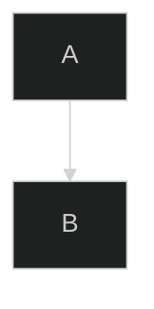
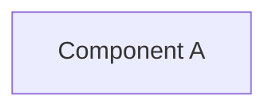
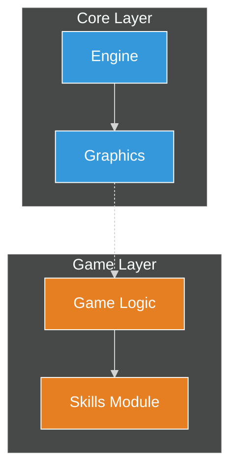
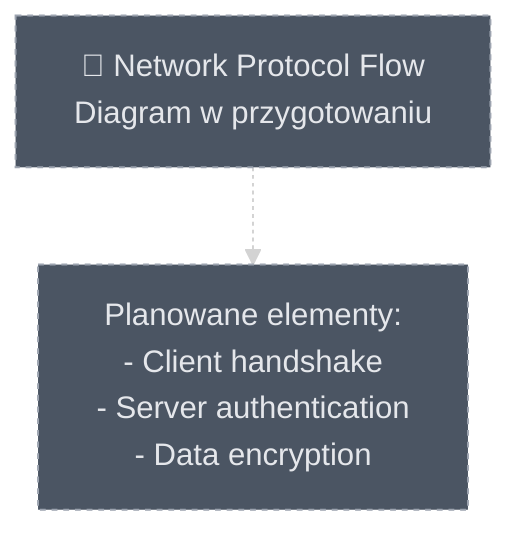

# System Projektowania Diagramów: Przewodnik dla Twórców

## 1. Wprowadzenie

Witaj w systemie projektowania diagramów. Ten zbiór dokumentów stanowi kompletny przewodnik do tworzenia spójnych, czytelnych i semantycznie bogatych diagramów Mermaid dla naszego projektu. Został zaprojektowany tak, aby mógł być interpretowany zarówno przez ludzi, jak i przez zautomatyzowanych agentów AI.

**Celem tego systemu jest transformacja diagramów z pasywnych ilustracji w aktywne narzędzia inżynierskie.**

## 2. Struktura Systemu

Ten system składa się z trzech fundamentalnych filarów, które razem tworzą kompletny, hierarchiczny framework:

*   **[01_DESIGN_PHILOSOPHY.md](./01_DESIGN_PHILOSOPHY.md)**: **"Dlaczego?"** - Definiuje nasze podstawowe zasady myślowe. Przeczytaj go, aby zrozumieć, co sprawia, że diagram jest skuteczny.

*   **[02_VISUAL_GUIDELINES.md](./02_VISUAL_GUIDELINES.md)**: **"Jak ma wyglądać?"** - Ścisła specyfikacja techniczna wszystkich elementów wizualnych (kolory, ikony, style). To jest Twoja paleta narzędzi.

*   **[Biblioteka Wzorców Projektowych](./03_DESIGN_PATTERNS/) (`03_DESIGN_PATTERNS/`)**: **"Jak to zrobić?"** - Zbiór gotowych do użycia, praktycznych wzorców. Działa jak "książka kucharska" dla twórców diagramów. Składa się z następujących plików:
    *   **[README.md](./03_DESIGN_PATTERNS/README.md):** Główny **spis treści** i przewodnik po całej bibliotece wzorców. **Zawsze zaczynaj tutaj.**
    *   **[A_Flows_and_Processes.md](./03_DESIGN_PATTERNS/A_Flows_and_Processes.md):** Wzorce do wizualizacji dynamicznych procesów, logiki i interakcji w czasie (`flowchart`, `sequenceDiagram`, etc.).
    *   **[B_Structure_and_Relations.md](./03_DESIGN_PATTERNS/B_Structure_and_Relations.md):** Wzorce do pokazywania statycznej architektury i relacji (`classDiagram`, `erDiagram`).
    *   **[C_Time_and_Planning.md](./03_DESIGN_PATTERNS/C_Time_and_Planning.md):** Wzorce do wizualizacji harmonogramów i zdarzeń w czasie (`gantt`, `timeline`).
    *   **[D_Data_and_Analysis.md](./03_DESIGN_PATTERNS/D_Data_and_Analysis.md):** Wzorce do prezentacji danych ilościowych i analizy strategicznej (`pie`, `quadrantChart`).
    *   **[E_Advanced_Techniques.md](./03_DESIGN_PATTERNS/E_Advanced_Techniques.md):** Wzorce pokazujące, jak łączyć różne typy diagramów w spójne systemy.

## 3. Proces Tworzenia Wizualizacji: Algorytm dla AI i Deweloperów

Aby stworzyć nową wizualizację, postępuj zgodnie z poniższym, strategicznym procesem. Na końcu tego dokumentu znajduje się **[Checklista Jakości](#4-checklista-jakości-diagramu)**, której należy użyć do weryfikacji finalnego rezultatu.

### Krok 1: Analiza i Definicja Celu
Zanim napiszesz kod, odpowiedz: Co chcę pokazać? Jaka jest główna "historia"? Do której warstwy architektonicznej należy główny komponent?

### Krok 2: Wybór Strategii — Jeden Diagram czy System Diagramów?
To jest najważniejsza decyzja projektowa. Zgodnie z naszą Złotą Regułą: **Nigdy nie twórz "Boskiego Diagramu"**.

*   **Scenariusz A (Prosty):** Tworzysz jeden, skupiony diagram.
*   **Scenariusz B (Złożony):** Projektujesz system połączonych diagramów (np. `overview` + `details`).

### Krok 3: Wybór Wzorca Projektowego
Przejdź do **[indeksu biblioteki wzorców](./03_DESIGN_PATTERNS/README.md)**, wybierz odpowiednią kategorię i plik, a następnie zaadaptuj wariant, który najlepiej pasuje do diagramu, który aktualnie tworzysz.

### Krok 4: Implementacja i Zastosowanie Stylu
Napisz kod Mermaid, implementując strukturę z wzorca i stosując style z **[02_VISUAL_GUIDELINES.md](./02_VISUAL_GUIDELINES.md)**.

### Krok 5: Przegląd i Refaktoryzacja
Sprawdź, czy diagram jest czytelny i zgodny z zasadami z **[01_DESIGN_PHILOSOPHY.md](./01_DESIGN_PHILOSOPHY.md)**.

### Krok 6: Kompozycja Wizualna (dla Scenariusza B)
Jeśli projektujesz system diagramów, zaplanuj, jak zostaną one ułożone na stronie, używając jednej z technik kompozycji (np. Wiele Perspektyw, Deska Rozdzielcza).

---

## 4. Checklista Jakości Diagramu

Użyj tej checklisty przed zatwierdzeniem każdego nowego diagramu. Diagram jest gotowy, jeśli możesz odpowiedzieć "TAK" na wszystkie poniższe pytania.

### Część 1: Filozofia i Cel
-   [ ] **Jedna Historia:** Czy diagram opowiada jedną, jasno zdefiniowaną historię?
-   [ ] **Czytelność w 5 Sekund:** Czy główny cel i kluczowe komponenty są zrozumiałe na pierwszy rzut oka?
-   [ ] **Wartość Dodana:** Czy diagram wizualizuje coś, czego nie widać od razu po przeczytaniu kodu (np. relacje, przepływy)?
-   [ ] **Odpowiednie Narzędzie:** Czy typ diagramu (np. `flowchart`, `sequenceDiagram`) jest właściwie dobrany do "historii", którą opowiada?

### Część 2: Zgodność z Systemem Wizualnym
-   [ ] **Globalny `init`:** Czy diagram zaczyna się od standardowego bloku `%%{init: {'theme': 'dark', ...}}%%`?
-   [ ] **Kolory Warstw:** Czy wszystkie węzły `graph` mają poprawnie przypisany kolor warstwy architektonicznej (np. `core`, `game`, `ui`)?
-   [ ] **Ikony Komponentów:** Czy kluczowe węzły mają przypisane ikony (`fa-...`) zgodnie z ich techniczną rolą?
-   [ ] **Style Linii:** Czy style linii (`-->`, `-.->`, `==>`) i ich kolory (`linkStyle`) są użyte poprawnie i zgodnie ze znaczeniem?
-   [ ] **Zgodność z Ograniczeniami:** Czy diagram przestrzega ograniczeń stylizacji dla swojego typu (np. nie używa `classDef` w `sequenceDiagram`)?

### Część 3: Poprawność i Kompletność
-   [ ] **Renderowanie:** Czy diagram renderuje się poprawnie bez błędów parsera?
-   [ ] **Poprawność Merytoryczna:** Czy diagram wiernie odzwierciedla działanie lub strukturę opisywanego systemu?
-   [ ] **Interaktywność:** Czy kluczowe komponenty mają dodane linki `click` (jeśli są wspierane) do odpowiedniej dokumentacji?
-   [ ] **Kontekst:** Czy pod diagramem (lub w jego tytule) znajduje się krótki opis wyjaśniający, co on przedstawia i jaka jest używana jednostka (dla diagramów analitycznych)?

### Część 4: Kompozycja (jeśli dotyczy)
-   [ ] **Podział Złożoności:** Jeśli diagram jest bardzo skomplikowany, czy na pewno nie powinien być podzielony na mniejszy system `overview` + `details`?
-   [ ] **Spójność Systemu:** Jeśli diagram jest częścią większego systemu wizualizacji, czy jego linki i narracja są spójne z pozostałymi częściami?

---

## 5. Mapping Treści → Typ Diagramu

Wybór odpowiedniego typu diagramu jest kluczowy dla skutecznej komunikacji. Poniższe heurystyki pomogą wybrać właściwe narzędzie wizualizacyjne w zależności od treści, którą chcesz przedstawić.

### 5.1. Heurystyki Wyboru Typu Diagramu

| Rodzaj Treści | Rekomendowany Typ | Kiedy Użyć |
| :--- | :--- | :--- |
| **Przepływ danych/kontroli** | `flowchart` / `graph` | Wizualizacja transformacji danych, algorytmów, lub przepływu sterowania między komponentami. |
| **Interakcja w czasie** | `sequenceDiagram` | Komunikacja między aktorami/systemami z wyraźną osią czasu (request-response, protokoły). |
| **Stany i przejścia** | `stateDiagram-v2` | Cykle życia obiektów, automaty stanowe, workflow ze stanami. |
| **Struktura klas/modeli** | `flowchart` (symulowany) / `erDiagram` | Hierarchie dziedziczenia, relacje między encjami, modele danych. |
| **Hierarchia koncepcyjna** | `mindmap` | Kategoryzacja tematów, struktura dokumentacji, brainstorming. |
| **Harmonogram/milestones** | `gantt` / `timeline` | Planowanie projektu, historia wersji, wydarzenia na osi czasu. |
| **Dystrybucja/proporcje** | `pie` / `quadrantChart` | Procentowy udział kategorii, analiza strategiczna (priorytet/wartość). |
| **Przepływ zasobów** | `sankey-beta` | Alokacja zasobów, transformacje energii/danych z wartościami liczbowymi. |
| **Historia wersji** | `gitGraph` | Branches, merge'e, historia commitów. |

### 5.2. Algorytm Decyzyjny

1. **Czy wizualizujesz interakcję w czasie między aktorami?** → `sequenceDiagram`
2. **Czy pokazujesz stany i przejścia między nimi?** → `stateDiagram-v2`
3. **Czy prezentujesz dane liczbowe (przepływ z wartościami)?** → `sankey-beta`
4. **Czy pokazujesz proporcje/dystrybucję?** → `pie` lub `quadrantChart`
5. **Czy wizualizujesz harmonogram lub oś czasu?** → `gantt` lub `timeline`
6. **Czy to historia Git?** → `gitGraph`
7. **Czy to hierarchia/taksonomia bez przepływu?** → `mindmap`
8. **W pozostałych przypadkach** (przepływ, architektura, relacje) → `flowchart` / `graph`

### 5.3. Przykład Zastosowania

**Scenariusz:** "Muszę zadokumentować, jak moduł `game_skills` ładuje dane z serwera."

- **Analiza:** Występuje interakcja między komponentami (klient ↔ serwer) z wyraźną sekwencją kroków.
- **Wybór:** `sequenceDiagram` (pokazuje komunikację w czasie).
- **Alternatywa:** Jeśli kluczowa jest transformacja danych (nie aktorzy), użyj `flowchart` z `graph TD`.

---

## 6. Obsługa Placeholderów i Brakujących Plików

### 6.1. Strategia dla Brakujących Diagramów

Jeśli dokumentacja odnosi się do diagramu, który jeszcze nie istnieje, zastosuj jeden z poniższych podejść:

#### Podejście A: Placeholder Diagram
Utwórz plik `.mmd` z prostym placeholderem:


**Kiedy użyć:** Jeśli wiadomo, czego diagram będzie dotyczył, ale szczegóły są w trakcie projektowania.

#### Podejście B: Komentarz TODO
Dodaj w dokumentacji Markdown komentarz:

```markdown
<!-- TODO: Diagram przepływu autoryzacji (sequenceDiagram) -->
<!-- Planowane elementy: Client, AuthServer, Database -->
```

**Kiedy użyć:** Jeśli diagram wymaga dogłębnej analizy lub zbierania danych.

### 6.2. Walidacja Referencji do Diagramów

Przed commitowaniem zmian upewnij się, że:
- Wszystkie referencje `` wskazują na istniejące pliki.
- Jeśli plik nie istnieje, jest zastąpiony placeholderem lub TODO.

---

## 7. Idempotencja i Marker Generowanego Bloku

### 7.1. Zasada Idempotencji

Diagramy mogą być generowane automatycznie przez narzędzia/agentów. Aby zapewnić idempotencję (wielokrotne uruchamienie generatora daje ten sam wynik), stosujemy markery.

### 7.2. Marker Generowanego Bloku

Każdy automatycznie generowany diagram **powinien** zawierać komentarz na początku pliku:

```plaintext
%% AUTO-GENERATED: Do not edit manually
%% Generator: <nazwa_narzędzia_lub_agenta>
%% Source: <ścieżka_do_źródła_danych>
%% Generated: <ISO 8601 timestamp>
```

**Przykład:**


### 7.3. Workflow dla Ręcznie Edytowanych Diagramów

Jeśli diagram został pierwotnie wygenerowany, ale wymaga ręcznych poprawek:
1. Usuń marker `AUTO-GENERATED`.
2. Dodaj komentarz: `%% MANUALLY EDITED: <data> - <powód zmian>`.

---

## 8. Specyfikacja Frontmatter

### 8.1. Wymagane Pola

Jeśli diagram jest osadzony w pliku Markdown, **zaleca się** dodanie frontmatter na początku pliku `.md`:

```yaml
---
diagram_id: "module-deps-overview"
type: "flowchart"
source: "docs/authoring/12_otmod/datasets/module_deps.csv"
last_updated: "2025-11-07T08:00:00Z"
author: "diagram-generator-v1.2"
tags: ["otmod", "dependencies", "architecture"]
---
```

### 8.2. Opis Pól

| Pole | Typ | Wymagane | Opis |
| :--- | :--- | :---: | :--- |
| `diagram_id` | string | ✅ | Unikalny identyfikator diagramu (kebab-case). |
| `type` | string | ✅ | Typ diagramu Mermaid (`flowchart`, `sequenceDiagram`, itp.). |
| `source` | string | ❌ | Ścieżka do źródła danych (jeśli diagram jest generowany). |
| `last_updated` | ISO 8601 | ✅ | Data ostatniej aktualizacji (format: `YYYY-MM-DDTHH:MM:SSZ`). |
| `author` | string | ❌ | Nazwa narzędzia/osoby, która utworzyła diagram. |
| `tags` | array | ✅ | Lista tagów dla kategoryzacji (min. 1 tag). |

### 8.3. Format Daty ISO 8601

**Obowiązujący format:** `YYYY-MM-DDTHH:MM:SSZ` (UTC)

**Przykłady:**
- ✅ Poprawny: `2025-11-07T08:00:00Z`
- ✅ Poprawny: `2025-11-07T14:30:15Z`
- ❌ Błędny: `2025-11-07` (brak czasu)
- ❌ Błędny: `07-11-2025 08:00` (błędny format)

---

## 9. Wersja Mermaid i Kompatybilność Rendererów

### 9.1. Obsługiwana Wersja Mermaid

Projekt docelowo wspiera **Mermaid v10.6+**. Wszystkie diagramy powinny być zgodne z tą wersją.

### 9.2. Różnice Między Rendererami

| Renderer | Obsługa `classDef` | Obsługa `click` | Uwagi |
| :--- | :---: | :---: | :--- |
| **GitHub** | ✅ (tylko `graph`) | ✅ (tylko `graph`, `mindmap`) | Najczęściej używany; priorytet kompatybilności. |
| **Sphinx (sphinxcontrib-mermaid)** | ✅ | ❌ (ignorowane) | Używany do generowania dokumentacji HTML. |
| **MkDocs** | ✅ | ✅ | Obsługa zależy od konfiguracji pluginu. |
| **mermaid-cli** | ✅ | ❌ (ignorowane) | Używany w CI/CD do walidacji. |

### 9.3. Reguły Kompatybilności

1. **Priorytet: Poprawne renderowanie na GitHub.**
2. Jeśli funkcjonalność (np. `click`) psuje renderowanie w jednym z rendererów, **usuń ją** lub użyj komentarza TODO.
3. Testuj diagramy w co najmniej dwóch środowiskach przed commitem.

### 9.4. Fallback dla `click`

Jeśli `click` nie jest wspierany:


---

## 10. Walidacja i CI

### 10.1. Automatyczna Walidacja Diagramów

Zalecamy skonfigurowanie GitHub Actions do automatycznej walidacji syntaktyki Mermaid przy każdym PR. Poniżej przykładowa implementacja.

### 10.2. Propozycja GitHub Actions Workflow

Utwórz plik `.github/workflows/validate-diagrams.yml`:

```yaml
name: Validate Mermaid Diagrams

on:
  pull_request:
    paths:
      - 'docs/**/*.mmd'
      - 'docs/**/*.md'

jobs:
  validate:
    runs-on: ubuntu-latest
    steps:
      - name: Checkout code
        uses: actions/checkout@v4

      - name: Setup Node.js
        uses: actions/setup-node@v4
        with:
          node-version: '20'

      - name: Install Mermaid CLI
        run: npm install -g @mermaid-js/mermaid-cli

      - name: Find all .mmd files
        id: find-files
        run: |
          echo "files=$(find docs -name '*.mmd' -type f | tr '\n' ' ')" >> $GITHUB_OUTPUT

      - name: Validate Mermaid syntax
        run: |
          for file in ${{ steps.find-files.outputs.files }}; do
            echo "Validating $file"
            mmdc -i "$file" -o /tmp/output.svg || exit 1
          done

      - name: Check frontmatter (optional)
        run: |
          # Add custom script to validate frontmatter in .md files
          echo "Frontmatter validation placeholder"
```

### 10.3. Narzędzia Alternatywne

- **mermaid-lint:** Statyczna analiza syntaktyki (szybsza niż pełne renderowanie).
  ```bash
  npm install -g mermaid-lint
  mermaid-lint docs/**/*.mmd
  ```

- **markdownlint:** Walidacja formatowania plików Markdown (w tym osadzonych diagramów).
  ```bash
  npx markdownlint-cli docs/**/*.md
  ```

### 10.4. Lokalna Walidacja

Przed commitowaniem uruchom lokalnie:
```bash
# Walidacja pojedynczego pliku
mmdc -i docs/authoring/12_otmod/diagrams/deps.mmd -o /tmp/test.svg

# Walidacja wszystkich diagramów
find docs -name '*.mmd' -exec mmdc -i {} -o /tmp/test.svg \;
```

---

## 11. Rozszerzona Checklista Weryfikacji Diagramu

Poniższa checklista integruje wszystkie reguły z sekcji 5-10 i powinna być stosowana przed finalnym zatwierdzeniem każdego diagramu.

### Faza 1: Planowanie
-   [ ] **Wybór Typu:** Czy typ diagramu został wybrany zgodnie z heurystykami z Sekcji 5?
-   [ ] **Źródła Danych:** Czy zidentyfikowano wszystkie źródła danych (CSV, kod, manifesty)?
-   [ ] **Placeholder:** Jeśli diagram nie jest gotowy, czy użyto placeholder lub TODO?

### Faza 2: Implementacja
-   [ ] **Init Block:** Czy diagram zawiera standardowy blok `%%{init: ...}%%`?
-   [ ] **Marker:** Jeśli diagram jest generowany, czy zawiera marker `AUTO-GENERATED`?
-   [ ] **Frontmatter:** Czy plik `.md` zawiera poprawny frontmatter z datą ISO 8601?
-   [ ] **Style:** Czy wszystkie węzły mają przypisane `classDef` zgodnie z warstwami architektonicznymi?

### Faza 3: Walidacja
-   [ ] **Renderowanie GitHub:** Czy diagram renderuje się poprawnie w GitHub Markdown preview?
-   [ ] **Renderowanie Sphinx:** Czy diagram renderuje się w lokalnym build Sphinx (jeśli dotyczy)?
-   [ ] **Syntaktyka:** Czy diagram przechodzi walidację `mmdc` / `mermaid-lint`?
-   [ ] **Linki:** Czy wszystkie linki `click` prowadzą do istniejących plików lub facet anchors (format: `./index.html#facet-<chapter>.<stem>` dla datasetów)?

### Faza 4: Dokumentacja
-   [ ] **Kontekst:** Czy diagram ma towarzyszący opis wyjaśniający jego cel?
-   [ ] **Tags:** Czy frontmatter zawiera co najmniej 1 tag?
-   [ ] **Cross-references:** Czy diagram jest powiązany z innymi diagramami (jeśli jest częścią systemu)?

### Faza 5: CI/CD
-   [ ] **Pre-commit Hook:** Czy uruchomiono lokalną walidację przed commitem?
-   [ ] **PR Check:** Czy pipeline CI przeszedł bez błędów walidacji diagramów?

---

## 12. Przykładowe Snippety

### 12.1. Standardowy Init Header

**Format pełny** (z zaawansowaną stylizacją):
```mermaid
%%{init: {
  "theme": "dark",
  "themeVariables": {
    "primaryTextColor": "#e5e7eb",
    "lineColor": "#4b5563",
    "fontFamily": "Inter, system-ui, sans-serif"
  },
  "securityLevel": "loose"
}}%%
```

**Format minimalny** (dla większości przypadków):
```mermaid
%%{init: {'theme':'dark','securityLevel':'loose'}}%%
```

> **Uwaga:** `securityLevel:'loose'` jest wymagane dla funkcjonalności `click` i innych interaktywnych elementów.

### 12.2. Komentarz Idempotencji (Generowany)

```plaintext
%% AUTO-GENERATED: Do not edit manually
%% Generator: otmod-dependency-mapper
%% Source: docs/authoring/12_otmod/datasets/module_deps.csv
%% Generated: 2025-11-07T08:15:00Z
```

### 12.3. Minimalny Flowchart z Subgraph, Style i Click



### 12.4. Placeholder dla Brakującego Diagramu


