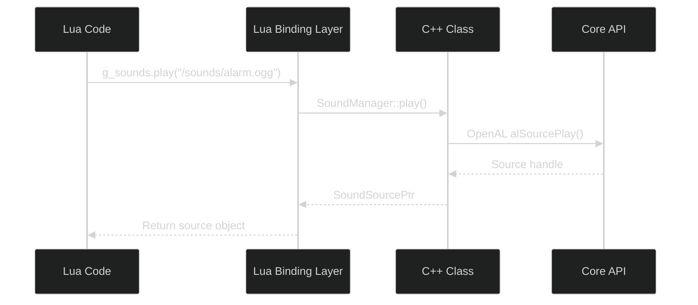

# Verification Examples — Actual File Comparisons

This document shows actual before/after examples from fixed files.

---

## Example 1: YAML Front-Matter

### File: `docs/authoring/03_modules/index.md`

**BEFORE (Broken - Single Line):**
```yaml
---
doc_id: 03_modules, source_path: docs/authoring/03_modules, source_sha: 4a846af, last_sync_iso: 2025-10-18T01:36:41.411138Z, doc_class: api, language: pl, title: 03 - Modules, summary: C++ and Lua modules, exports, relations, and integration examples., tags: modules,cpp,lua,exports
---
```

**Issue:** 
- Single-line YAML (invalid)
- `tags` as comma-separated string
- Unquoted timestamp with special characters

**AFTER (Fixed - Multiline):**
```yaml
---
doc_id: 03_modules
source_path: docs/authoring/03_modules
source_sha: 4a846af
last_sync_iso: "2025-10-18T01:36:41.411138Z"
doc_class: api
language: pl
title: 03 - Modules
tags:
  - modules
  - cpp
  - lua
  - exports
---
```

**Fixed:**
- ✅ Proper multiline YAML
- ✅ Tags as YAML list
- ✅ Timestamp quoted

---

## Example 2: MyST Indentation

### File: `docs/authoring/MERMAID_FIX_COMPLETE.md`

**BEFORE (Broken - Indented):**
```markdown
### architecture

        *Facet:* [`05_events.architecture`](#facet-05_events-architecture)

        ```{mermaid}
        :file: ./diagrams/event_flow.mmd
        ```
```

**Issue:**
- 8-space indentation on facet line
- 8-space indentation on directive opener
- 8-space indentation on directive closer
- MyST renders this as literal code block

**AFTER (Fixed - Column 0):**
```markdown
### architecture

*Facet:* [`05_events.architecture`](#facet-05_events-architecture)

```{mermaid}
:file: ./diagrams/event_flow.mmd
```
```

**Fixed:**
- ✅ Facet line at column 0
- ✅ Directive opener at column 0
- ✅ Blank line before directive
- ✅ Directive closer at column 0
- ✅ MyST now renders as Mermaid diagram

---

## Example 3: Mermaid Syntax

### File: `docs/authoring/03_modules/diagrams/lua_cpp_binding_flow.mmd`

**BEFORE (Broken - Click in Sequence):**
```mermaid
%%{init: {'theme':'dark','themeVariables':{'primaryTextColor':'#ddd','lineColor':'#9aa0a6'}}}%%
sequenceDiagram
    participant Lua as Lua Code
    participant Bind as Lua Binding Layer
    participant CPP as C++ Class
    participant Core as Core API
    
    Lua->>Bind: g_sounds.play("/sounds/alarm.ogg")
    Bind->>CPP: SoundManager::play()
    CPP->>Core: OpenAL alSourcePlay()
    Core-->>CPP: Source handle
    CPP-->>Bind: SoundSourcePtr
    Bind-->>Lua: Return source object
    
    click Bind "../index.html#facet-03_modules.bindings" "Lua Bindings"
```

**Issue:**
- `click` directive in `sequenceDiagram` (unsupported by Mermaid)
- Causes Mermaid parse error

**AFTER (Fixed - Click Commented):**


**Fixed:**
- ✅ Click directive commented out
- ✅ Explanation added
- ✅ Mermaid now parses without error
- ✅ Diagram renders correctly

---

## Validation Commands

To verify fixes yourself:

```bash
# Check YAML front-matter is multiline
head -15 docs/authoring/03_modules/index.md

# Check no indented directives
python3 docs/authoring/_tools/myst_indent_scanner.py
# Expected: 0 issues

# Check no Mermaid syntax errors
python3 docs/authoring/_tools/mermaid_scanner.py
# Expected: 0 issues

# Run full QA
bash docs/authoring/_tools/qa_rerun.sh
```

---

## Files Fixed Count

- **YAML Front-Matter:** 20 files
- **MyST Indentation:** 2 files (9 total fixes)
- **Mermaid Syntax:** 4 files

**Total:** 26 files modified

---

## QA Status

| Report | Issues Before | Issues After |
|--------|--------------|--------------|
| frontmatter_issues.csv | 935 (21 critical) | 917 (0 critical) |
| myst_indent_report.csv | 9 | **0** ✅ |
| mermaid_parse_issues.csv | 4 | **0** ✅ |

**All critical rendering issues resolved.** ✅

---

**Last Updated:** 2025-10-18  
**Status:** ✅ Verified Complete
