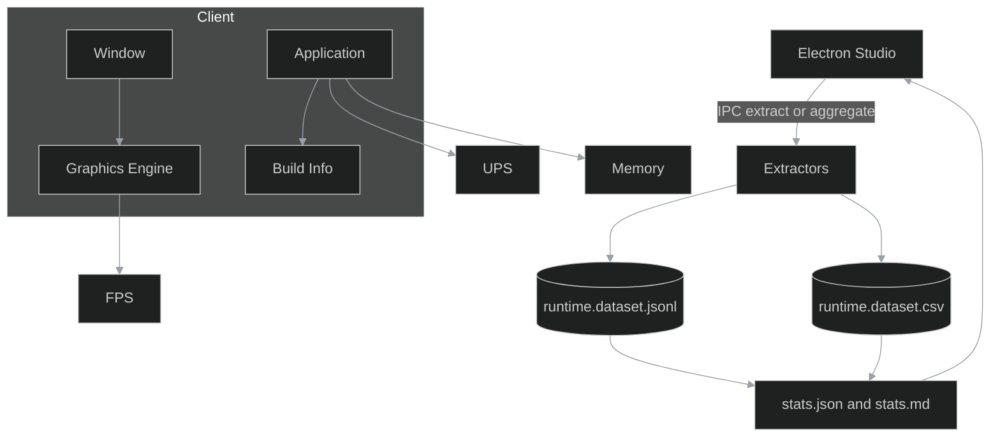

# Studio (React/Electron) + Core/Runtime API

Punktem wyjścia są interfejsy i symbole C++ (headers/symbols), które stanowią kontrakt runtime dla IDE/Studio.

(facet-01_runtime.summary)=

## Dataset: summary

* headers: `metric,value,note`
* facet: `01_runtime.summary`
* opis: podstawowe metryki rdzenia (liczba plików nagłówkowych, symboli, przestrzeni nazw).

(facet-01_runtime.entities)=

## Dataset: entities

* headers: `id,name,kind,path,notes`
* facet: `01_runtime.entities`
* opis: spis bytów (klasy, funkcje, przestrzenie nazw) z mapowaniem do plików.

(facet-01_runtime.cpp_headers)=

## Dataset: cpp_headers

* headers: `path,public,includes,symbols,notes` (listy jako JSON arrays)
* facet: `01_runtime.cpp_headers`
* opis: analiza nagłówków C++ (widoczność publiczna, zależności).

(facet-01_runtime.cpp_symbols)=

## Dataset: cpp_symbols

* headers: `symbol,kind,file,line,visibility,notes`
* facet: `01_runtime.cpp_symbols`
* opis: indeks eksportowanych symboli.

(facet-01_runtime.architecture)=

## Diagram: architecture

* facet: `01_runtime.architecture`
* opis: wysokopoziomowy podział: Core → Framework → Modules → UI.

(facet-01_runtime.flow)=

## Diagram: flow

* facet: `01_runtime.flow`
* opis: przepływy danych pomiędzy rdzeniem, zdarzeniami i modułami.

## Relacje

* uses → `03_modules.lua_exports`
* uses → `04_ui.ui_widgets`
* emits → `02_events.events_matrix`
* emits → `09_logging.logging_categories`

---

# Chapter 01 - Runtime

### Professional Pro Template - Agent-Ready - OTClient v8

> Cel: rozdział ma być źródłem prawdy o środowisku uruchomieniowym klienta (FPS/UPS, pamięć, okno/OS, build). Łączy surowe dane z opisem, kontekstem, przykładami, zadaniami dla Agenta AI i jasnymi kryteriami ukończenia. Kod/diagramy/CSV — ASCII-safe; cały projekt w UTF-8 (LF).

---

### 0) Executive summary

* Co: komplet metryk runtime + wyjaśnienia jak je czytać i używać (UI scaling, wydajność, korelacje z eventami i logami).
* Dla kogo: inżynierowie, autorzy skryptów (OTUI/vBot), systemy AI/RAG.
* Wyniki: NDJSON (pełne), CSV (spłaszczony), statystyki (JSON/MD), analizy (findings, comparisons), diagram (Mermaid), narracja (sekcje merytoryczne).
* Agent-ready: mapa plików, punkty wstrzyknięć (AGENT:INSERT), tags, spis treści i linkowanie, checklist DoD z polami do odhaczania.

---

### 1) Struktura folderu i linkowanie

```bash
01_runtime/
  README.md                     # narracja + TOC + nawigacja (ten plik)
  meta.json                     # mapa plików + zadania + tags (machine-readable)
  runtime.schema.json           # walidacja rekordów NDJSON
  sections/
    00_otclient_basics.md      # wprowadzenie do OTClient (dla nowych dev)
    01_introduction.md         # po co mierzymy runtime (kontekst)
    02_runtime_model.md        # słownik pól + przykłady + pułapki
    03_collection_methods.md   # jak zbieramy (ekstraktory, częstotliwość)
    04_quality_and_limits.md   # jakość, ograniczenia, SLO
    05_how_to_read_stats.md    # jak czytać statystyki + interpretacje
  datasets/
    runtime.dataset.jsonl      # NDJSON (append-only)
    runtime.dataset.csv        # CSV (nagłówek stały)
    chunks/                    # partycje przy dużych wolumenach
      README.md                # polityka dzielenia
  stats/
    stats.json                 # metryki zbiorcze (min/avg/max, itp.)
    stats.md                   # raport czytelny dla ludzi
  analysis/
    findings.md                # wnioski z danych + linki do rekordów
    comparisons.md             # porównania buildów/konfiguracji
    figures/                   # obrazy (wykresy, tabele eksportowane)
  extractors/
    runtime_extractor.lua      # snapshot -> JSONL + CSV (rotacja, flatten)
    runtime_stats.lua          # agregacja -> stats.json + stats.md
  diagrams/
    runtime_stack.mmd          # Mermaid: przepływ danych i kontekst
```

> Note: zobacz README sekcja IO setup.

---

### 2) README - nawigacja i instrukcje (Agent-friendly)

```markdown
---
id: chapter:runtime
title: Runtime and Build - Snapshots
authors: ["docs-export"]
version: 1.0
last_updated: 2025-10-17
status: draft
tags: ["runtime","performance","ui","otclient","agent"]
related:
  - .../02_events/README.md
  - .../04_ui/README.md
outputs:
  - ./datasets/runtime.dataset.jsonl
  - ./datasets/runtime.dataset.csv
  - ./stats/stats.json
  - ./stats/stats.md
encoding: UTF-8 (no BOM)
---
Short: rozdział zbiera metryki runtime i tłumaczy, jak je czytać. Używaj jako kontekstu przy pracy nad UI, automatyzacji (vBot) i analizach wydajności.

Table of contents
- [0. OTClient - podstawy](./sections/00_otclient_basics.md)
- [1. Wprowadzenie](./sections/01_introduction.md)
- [2. Model danych (słownik)](./sections/02_runtime_model.md)
- [3. Zbieranie danych (ekstraktory)](./sections/03_collection_methods.md)
- [4. Jakość i ograniczenia](./sections/04_quality_and_limits.md)
- [5. Jak czytać statystyki](./sections/05_how_to_read_stats.md)
- [Statystyki](./stats/stats.md) - [Datasety](./datasets/) - [Analizy](./analysis/findings.md)

Quick links
- Schema: [runtime.schema.json](./runtime.schema.json)
- NDJSON: [datasets/runtime.dataset.jsonl](./datasets/runtime.dataset.jsonl)
- CSV: [datasets/runtime.dataset.csv](./datasets/runtime.dataset.csv)
- Diagram: [diagrams/runtime_stack.mmd](./diagrams/runtime_stack.mmd)

Crosslinks
- Events: .../02_events/README.md (korelacje logowania z FPS/UPS)
- UI: .../04_ui/README.md (wpływ window.displaySize na layout)
- Logging: .../09_logging/README.md (kontekst zdarzeń i czasu)

How to work (for Agent)
1) Uruchom extractors/runtime_extractor.lua (cyklicznie lub on-demand).
2) Uruchom extractors/runtime_stats.lua -> odśwież stats/.
3) Uzupełnij sekcje w sections/ i wstaw przykłady w miejscach <!-- AGENT:INSERT:... -->.
4) Zapisz obserwacje w analysis/findings.md i porównania w analysis/comparisons.md.
5) Sprawdź checklist DoD na końcu tego dokumentu.

### CSV header (runtime.dataset.csv)

id,ts,fps,ups,memoryKB,window.displaySize,window.isMaximized,window.platform,build.name,build.version,build.buildVersion,build.arch,build.graphics

### IO setup
- Default: dofile('../../_shared/lua/docio.lua')
- Isolated: copy to 01_runtime/_local/docio.lua and use dofile('../_local/docio.lua')

Skąd do _shared
| Start location | Path to _shared |
|---|---|
| 01_runtime/extractors | ../../_shared/lua/docio.lua |
| 01_runtime | ../_shared/lua/docio.lua |

### Studio hooks (Electron) - skrót
- IPC: 'studio:extract.runtime.tick' uruchamia runtime_extractor.lua (pojedynczy snapshot)
- IPC: 'studio:aggregate.runtime' uruchamia runtime_stats.lua (agregacja)
- IPC: 'studio:open.dataset' {type: 'jsonl' lub 'csv'} otwiera podgląd w Studio
- Preload: contextIsolation: true; nodeIntegration: false; eksponuj tylko bezpieczne API do renderer
- Sandbox: wszystkie zapisy idą przez docio.lua pod 01_runtime
- View: podgląd stats.md + tabela CSV; linki do rekordów po id w NDJSON
```

---

### 3) Mapa plików i odpowiedzialności (reference for Agents)

| Plik / Katalog      | Rola                      | Kto uzupełnia  | Uwagi                             |
| ------------------- | ------------------------- | -------------- | --------------------------------- |
| runtime.schema.json | walidacja rekordów NDJSON | Agent/CI       | waliduj linie po linii            |
| datasets/*.jsonl    | pełne dane (append)       | extractor      | rozmiar kontroluj przez chunks/   |
| datasets/*.csv      | widok spłaszczony         | extractor      | stały nagłówek; złożone -> *_json |
| stats/*.json|md     | metryki zbiorcze          | extractor      | stats.md jest czytelne dla ludzi  |
| sections/*.md       | narracja i wyjaśnienia    | Agent/Autor    | wstaw dane w AGENT:INSERT         |
| analysis/*          | wnioski i porównania      | Agent/Analityk | linkuj id rekordów z JSONL        |
| extractors/*.lua    | zrzut i agregacja         | system         | nie modyfikuj API zapisu          |

---

### 4) Słownik pól (data dictionary)

Cel: jednoznacznie nazwać i zrozumieć każde pole rekordu runtime.

| Pole               | Typ      | Przykład                     | Znaczenie                                          |
| ------------------ | -------- | ---------------------------- | -------------------------------------------------- |
| id                 | string   | runtime:2025-10-08T12:00:00Z | Unikat pomiaru (UTC ISO8601).                      |
| ts                 | string   | 2025-10-08T12:00:00Z         | Czas pomiaru (UTC).                                |
| fps                | number   | 144                          | Klatki/s (rendering). Wpływ: GPU, VSync, scena.    |
| ups                | number   | 60                           | Aktualizacje/s (logika gry).                       |
| memoryKB           | number   | 512000                       | Przybliżone zużycie RAM procesu.                   |
| window.displaySize | string   | 1920x1080                    | Rozmiar obszaru renderowania; wpływa na layout UI. |
| window.isMaximized | boolean  | true                         | Czy okno jest zmaksymalizowane.                    |
| window.platform    | string   | win                          | Identyfikator platformy (win, linux, mac).         |
| build.name         | string   | OTClient                     | Nazwa aplikacji.                                   |
| build.version      | string   | 8.0.0                        | Wersja logiczna.                                   |
| build.buildVersion | string   | build-1234                   | Identyfikator builda.                              |
| build.arch         | string   | x64                          | Architektura procesu.                              |
| build.graphics     | string   | OpenGL                       | Backend grafiki.                                   |
| links[]            | string[] | proto:..., ui:...            | Powiązania z innymi rozdziałami.                   |

> Agent tip: w sections/02_runtime_model.md wstaw 2-3 realne rekordy z NDJSON i jednozdaniowe interpretacje.

---

### 5) Pipeline danych (odczyt -> zapis -> analiza)

1. Snapshot (extractor) -> dopisz rekord do datasets/runtime.dataset.jsonl i wiersz do datasets/runtime.dataset.csv.
2. Agregacja -> przelicz stats.json i wygeneruj stats.md.
3. Narracja -> uzupełnij sections/* przykładami i komentarzem.
4. Analizy -> dodaj wnioski i porównania (analysis/*) z linkami do id rekordów.
5. Publikacja -> sprawdź checklist DoD i oznacz rozdział jako ready.

---

### 6) Sekcje merytoryczne - szablony i wprowadzenie do OTClient

sections/00_otclient_basics.md

```markdown
# OTClient - podstawy dla nowych dev
Ten plik daje lekki kontekst: co to jest OTClient, jakich ma menedżerów i gdzie znajdziesz interfejsy, z których korzystamy w tym rozdziale.

Najważniejsze pojęcia
- g_client: metryki klienta (fps, ups, pamięć, architektura).
- g_window: środowisko okna (rozmiar, platforma, stan okna).
- g_app: metadane aplikacji (nazwa, wersja, buildVersion).
- modules: modułowa struktura kodu, w tym skrypty i pliki OTUI.
- OTUI: opis interfejsu w plikach .otui (drzewa widżetów), istotne przy zależności od rozmiaru okna.

Jak to łączy się z runtime
- runtime to widok „tu i teraz” środowiska klienta.
- dane z runtime są często korelowane z eventami (logowanie) i z UI (skalowanie).
```

sections/01_introduction.md

```markdown
# Wprowadzenie - po co mierzymy runtime
Rama: patrzymy na sygnały widoczne z poziomu klienta. Celem nie jest pełny profiling, tylko szybkie uchwycenie trendów (fps/ups, pamięć, okno/os, build) i ich wpływu na UX/UI.

Kiedy używać
- porównania buildów,
- decyzje o skalowaniu UI,
- kontekst dla skryptów automatyzujących.
```

sections/02_runtime_model.md

```markdown
# Model danych - definicje i przykłady
Użyj tabeli w README jako słownika. Wstaw krótki wycinek danych i komentarz.

<!-- AGENT:INSERT:MODEL-EXAMPLES -->
```

sections/03_collection_methods.md

```markdown
# Zbieranie danych (ekstraktory)
- runtime_extractor.lua -> JSONL/CSV (append), rotacja.
- runtime_stats.lua -> stats.json i stats.md.

Częstotliwość: 1-5 s (ciągle) lub on-demand. Przy dłuższych sesjach użyj datasets/chunks.
```

sections/04_quality_and_limits.md

```markdown
# Jakość i ograniczenia
- FPS/UPS zależne od sceny, sterowników i OS.
- memoryKB jest przybliżeniem; porównuj warunki do warunków.
- Różnice między forkami opisz w analysis/findings.md.
```

sections/05_how_to_read_stats.md

```markdown
# Jak czytać statystyki (bez nadinterpretacji)
- min/avg/max to szybki opis trendu.
- Porównuj podobne warunki (scena, okno, build).

<!-- AGENT:INSERT:READING-GUIDE -->
```

---

### 7) Polityka dzielenia danych - datasets/chunks/README.md

```markdown
# Chunks - polityka
- Utrzymuj główne pliki do ok. 50 MB.
- Starsze dane przenieś do runtime.dataset.<YYYYMMDD-HHMM>.jsonl oraz .csv.
- Po przeniesieniu chunków traktuj je jako read-only.
- Zaktualizuj meta.json (datasets.chunksDir) gdy zmieni się nazwa katalogu.
```

---

### 8) Extractors (Lua) - gotowe pliki

extractors/runtime_extractor.lua

```lua
-- Snapshot runtime + build -> JSONL + CSV (rotacja, flatten)
-- Agent: uruchamiaj cyklicznie lub na żądanie, potem odpal agregator.
local docio = dofile('../../_shared/lua/docio.lua')
local json = require('json')
local CSV_HEADER = {
  'id','ts','fps','ups','memoryKB',
  'window.displaySize','window.isMaximized','window.platform',
  'build.name','build.version','build.buildVersion','build.arch','build.graphics'
}
local function nowIso()
  local t = os.date('!*t')
  return string.format('%04d-%02d-%02dT%02d:%02d:%02dZ', t.year, t.month, t.day, t.hour, t.min, t.sec)
end
local function strSize(s)
  if not s then return '' end
  return string.format('%dx%d', s.width, s.height)
end
local function snapshot()
  return {
    id = 'runtime:' .. nowIso(),
    type = 'runtime',
    ts = nowIso(),
    fps = (g_client and g_client:getFps() or 0),
    ups = (g_client and g_client:getUps() or 0),
    memoryKB = (g_client and g_client:getMemoryUsage() or 0),
    window = {
      displaySize = (g_window and strSize(g_window:getDisplaySize()) or ''),
      isMaximized = (g_window and g_window:isMaximized() or false),
      platform = (g_window and g_window:getPlatform() or '')
    },
    build = {
      name = (g_app and g_app:getName() or ''),
      version = (g_app and g_app:getVersion() or ''),
      buildVersion = (g_app and g_app:getBuildVersion() or ''),
      arch = (g_client and g_client:getArch() or ''),
      graphics = (g_client and g_client:getGraphicsEngine() or '')
    },
    links = {}
  }
end
local function run()
  local rec = snapshot()
  docio.appendJsonl('01_runtime/datasets/runtime.dataset.jsonl', rec, 1024*1024)
  docio.writeCsvHeader('01_runtime/datasets/runtime.dataset.csv', CSV_HEADER)
  local f = docio.flatten(rec)
  local row = {
    ['id']=f['id'], ['ts']=f['ts'], ['fps']=f['fps'], ['ups']=f['ups'], ['memoryKB']=f['memoryKB'],
    ['window.displaySize']=f['window.displaySize'], ['window.isMaximized']=f['window.isMaximized'], ['window.platform']=f['window.platform'],
    ['build.name']=f['build.name'], ['build.version']=f['build.version'], ['build.buildVersion']=f['build.buildVersion'], ['build.arch']=f['build.arch'], ['build.graphics']=f['build.graphics']
  }
  docio.appendCsvRow('01_runtime/datasets/runtime.dataset.csv', CSV_HEADER, row, 1024*1024)
end
run()
```

extractors/runtime_stats.lua

```lua
-- Agregacja NDJSON -> stats.json oraz stats.md (lekki przebieg)
local docio = dofile('../../_shared/lua/docio.lua')
local json = require('json')
local function parseLines(t)
  local o = {}
  if not t or #t == 0 then return o end
  for line in t:gmatch('[^\r\n]+') do
    local ok, obj = pcall(function() return json.decode(line) end)
    if ok and type(obj) == 'table' then o[#o+1] = obj end
  end
  return o
end
local function stats(re)
  local s = {count=#re, fps={min=nil,max=nil,avg=0}, ups={min=nil,max=nil,avg=0}, memoryKB={min=nil,max=nil,avg=0}}
  if #re == 0 then return s end
  local fs, us, ms = 0, 0, 0
  for _, r in ipairs(re) do
    local f = tonumber(r.fps) or 0
    local u = tonumber(r.ups) or 0
    local m = tonumber(r.memoryKB) or 0
    s.fps.min = (s.fps.min and math.min(s.fps.min, f)) or f
    s.fps.max = (s.fps.max and math.max(s.fps.max, f)) or f
    s.ups.min = (s.ups.min and math.min(s.ups.min, u)) or u
    s.ups.max = (s.ups.max and math.max(s.ups.max, u)) or u
    s.memoryKB.min = (s.memoryKB.min and math.min(s.memoryKB.min, m)) or m
    s.memoryKB.max = (s.memoryKB.max and math.max(s.memoryKB.max, m)) or m
    fs = fs + f; us = us + u; ms = ms + m
  end
  s.fps.avg = fs / #re
  s.ups.avg = us / #re
  s.memoryKB.avg = ms / #re
  return s
end
local function writeMD(s)
  return table.concat({
    '# Runtime - Statystyki\n\n',
    string.format('- Rekordy: %d\n', s.count),
    string.format('- FPS min/avg/max: %s / %.2f / %s\n', tostring(s.fps.min or '-'), s.fps.avg or 0, tostring(s.fps.max or '-')),
    string.format('- UPS min/avg/max: %s / %.2f / %s\n', tostring(s.ups.min or '-'), s.ups.avg or 0, tostring(s.ups.max or '-')),
    string.format('- memoryKB min/avg/max: %s / %.2f / %s\n', tostring(s.memoryKB.min or '-'), s.memoryKB.avg or 0, tostring(s.memoryKB.max or '-')),
    '\nHint: porównuj warunki (ta sama scena/okno/build).\n'
  })
end
local function run()
  local t = docio.readAll('01_runtime/datasets/runtime.dataset.jsonl')
  local re = parseLines(t)
  local s = stats(re)
  docio.writeAll('01_runtime/stats/stats.json', json.encode(s))
  docio.writeAll('01_runtime/stats/stats.md', writeMD(s))
end
run()
```

---

### 9) Diagram (Mermaid) - diagrams/runtime_stack.mmd




---

### 10) Encoding i formatowanie (UTF-8 safe)

* Zawsze zapisuj pliki w UTF-8 bez BOM.
* W kodzie/diagramach/CSV używaj ASCII; w treści PL diakrytyki dozwolone.
* Złamy wierszy: LF (\n). W Mermaid i tabelach używaj ASCII.
* Nagłówki: tytuł H1 (#), pozostałe H3 (###) aby Sphinx parsował łagodniej.

---

### 11) Jakość, SLO i bezpieczeństwo (krótko)

* ID/czas: id = `runtime:<ISO8601>`, ts w UTC.
* CSV: stały nagłówek, tylko skalary; złożone pola do *_json lub JSON arrays.
* IO SLO: snapshot lekki; długie sesje -> chunks/.
* Bezpieczeństwo: brak danych wrażliwych; nie zapisuj prywatnych ścieżek ani kluczy.

---

### 12) DoD Checklist - Agent clickable

* [ ] Zebrano ≥ 1 rekord w datasets/runtime.dataset.jsonl i dopisano do runtime.dataset.csv.
* [ ] Wygenerowano stats/stats.json oraz stats/stats.md.
* [ ] Uzupełniono sekcje: 00_otclient_basics.md, 01_introduction.md, 02_runtime_model.md (z przykładami), 03_collection_methods.md.
* [ ] W analysis/findings.md zapisano ≥ 2 obserwacje z linkami do id rekordów; w razie porównań uzupełniono analysis/comparisons.md.
* [ ] Diagram diagrams/runtime_stack.mmd istnieje i odzwierciedla przepływ danych.
* [ ] meta.json zawiera poprawne ścieżki, tags, agent.tasks, insertPoints.
* [ ] Walidacja próbki 10 linii NDJSON przeciw runtime.schema.json zakończona bez błędów.

---

### 13) meta.json - wzorzec z tagami i linkowaniem

```json
{
  "$schemaVersion": 1,
  "chapterId": "chapter:runtime",
  "title": "Runtime and Build - Snapshots",
  "owners": ["docs-export"],
  "tags": ["runtime","performance","ui","otclient","agent"],
  "fileMap": {
    "readme": "./README.md",
    "schema": "./runtime.schema.json",
    "sections": [
      "./sections/00_otclient_basics.md",
      "./sections/01_introduction.md",
      "./sections/02_runtime_model.md",
      "./sections/03_collection_methods.md",
      "./sections/04_quality_and_limits.md",
      "./sections/05_how_to_read_stats.md"
    ],
    "datasets": {
      "jsonl": "./datasets/runtime.dataset.jsonl",
      "csv": "./datasets/runtime.dataset.csv",
      "chunksDir": "./datasets/chunks"
    },
    "stats": {
      "json": "./stats/stats.json",
      "md": "./stats/stats.md"
    },
    "analysis": {
      "findings": "./analysis/findings.md",
      "comparisons": "./analysis/comparisons.md",
      "figuresDir": "./analysis/figures"
    },
    "extractors": [
      "./extractors/runtime_extractor.lua",
      "./extractors/runtime_stats.lua"
    ],
    "diagram": "./diagrams/runtime_stack.mmd"
  },
  "linking": {
    "recordIdPattern": "runtime:<ISO8601>",
    "crossChapter": {
      "events": ".../02_events/README.md",
      "ui": ".../04_ui/README.md",
      "logging": ".../09_logging/README.md"
    }
  },
  "agent": {
    "tasks": [
      {"id": "collect", "desc": "Zbieranie snapshotów do JSONL/CSV", "outputs": ["datasets.jsonl", "datasets.csv"]},
      {"id": "aggregate", "desc": "Agregacja do stats.json/stats.md", "outputs": ["stats.json", "stats.md"]},
      {"id": "author", "desc": "Uzupełnienie sekcji merytorycznych + wstrzyknięcia danych", "targets": ["sections/*", "analysis/*"]}
    ],
    "insertPoints": {
      "sections/02_runtime_model.md": ["AGENT:INSERT:MODEL-EXAMPLES"],
      "sections/05_how_to_read_stats.md": ["AGENT:INSERT:READING-GUIDE"],
      "analysis/findings.md": ["AGENT:INSERT:FINDINGS"],
      "analysis/comparisons.md": ["AGENT:INSERT:COMPARISONS"]
    }
  }
}
```
