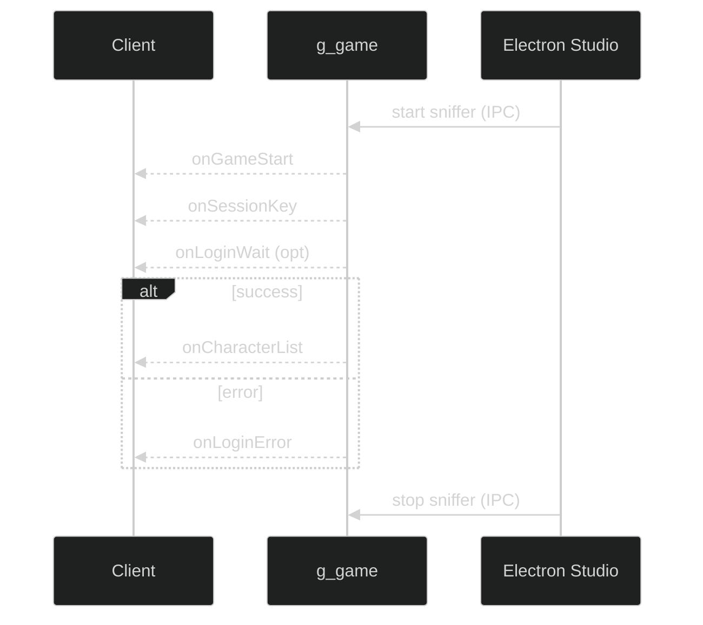
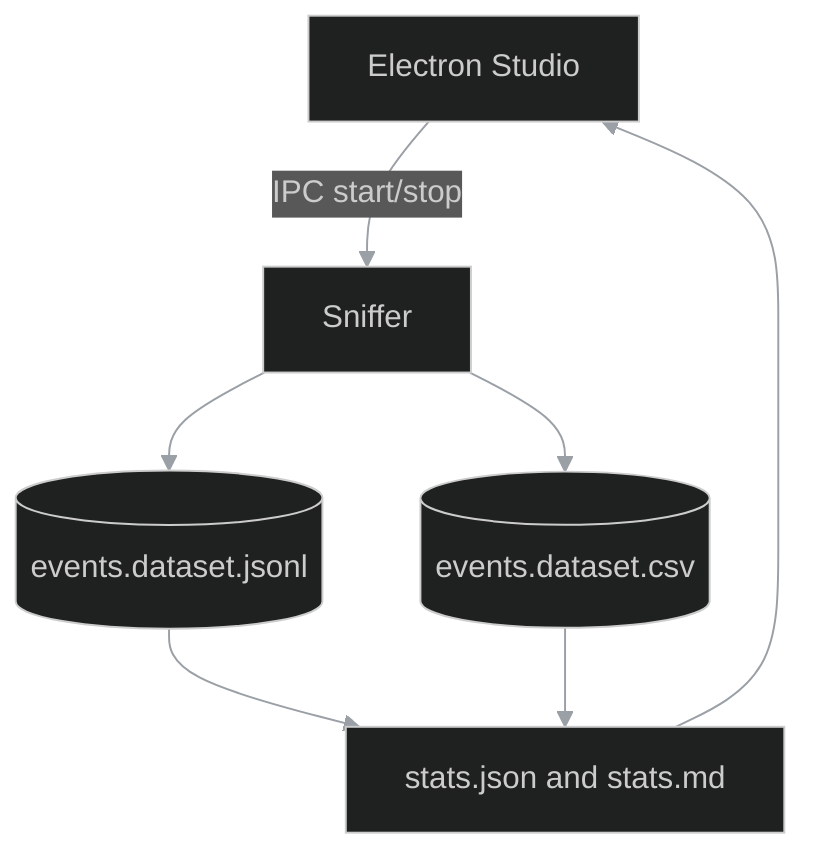

---

# System zdarzeń

(facet-02_events.summary)=

## Dataset: summary

* headers: `metric,value,note`
* facet: `02_events.summary`

(facet-02_events.events_matrix)=

## Dataset: events_matrix

* headers: `id,ts,source,event,payload_schema,handlers,notes`
* facet: `02_events.events_matrix`

(facet-02_events.emitters)=

## Dataset: emitters

* headers: `emitter,event,args,notes`  *(args = JSON array)*
* facet: `02_events.emitters`

(facet-02_events.handlers)=

## Dataset: handlers

* headers: `handler,event,callback,threading,notes`
* facet: `02_events.handlers`

(facet-02_events.bus)=

## Diagram: bus

* facet: `02_events.bus`

(facet-02_events.propagation)=

## Diagram: propagation

* facet: `02_events.propagation`

## Relacje

* handles → `03_modules.lua_exports`
* emits → `04_ui.signals_matrix`
* uses → `09_logging.logging_categories`

---

# Chapter 02 - Events

### Professional Pro Template - Agent-Ready - OTClient v8

> Cel: ten rozdział opisuje i zbiera zdarzenia klienta (g_game i inne sygnały), dostarcza dane w NDJSON i CSV, tłumaczy wzorce (np. sekwencja logowania), oraz daje gotowe ekstraktory i statystyki. Styl elastyczny i konkretny. ASCII-only w kodzie/diagramach/CSV, pliki UTF-8 (LF).

---

### 0) Executive summary

* Co: zdarzenia startu/końca gry, logowania, listy postaci, błędów; ich payload i znaczenie w diagnostyce i korelacjach (runtime, UI, logi).
* Dla kogo: inżynierowie, autorzy skryptów (vBot/OTUI), systemy AI/RAG i Studio (Electron/React).
* Output: NDJSON (pełny), CSV (spłaszczony), statystyki (JSON/MD), analizy (findings, correlations), diagramy (Mermaid), narracja.
* Agent-ready: mapa plików, punkty wstrzyknięć (AGENT:INSERT), IO setup, CSV header, IPC hooki Studio, checklist DoD.

---

### 1) Struktura folderu i linkowanie

```bash
docs/authoring/02_events/
  README.md
  meta.json
  events.schema.json
  sections/
  datasets/
    events.dataset.jsonl
    events.dataset.csv
    chunks/
      README.md
      index.json
  stats/
  analysis/
  extractors/
  diagrams/
```

> IO setup w README poniżej. Zawsze ASCII-only w kodzie/diagramach/CSV, UTF-8 bez BOM, LF końce linii.

---

### 2) README - nawigacja i instrukcje (Agent-friendly)

```markdown
---
id: chapter:events
title: Events - Signals and Sequences
authors: ["docs-export"]
version: 1.0
last_updated: 2025-10-17
status: draft
tags: ["events","signals","login","otclient","agent"]
related:
  - ../01_runtime/README.md
  - ../04_ui/README.md
  - ../09_logging/README.md
outputs:
  - ./datasets/events.dataset.jsonl
  - ./datasets/events.dataset.csv
  - ./stats/stats.json
  - ./stats/stats.md
encoding: UTF-8 (no BOM)
---
Short: rozdział rejestruje i tłumaczy zdarzenia, w tym sekwencje logowania. Dane pod RAG i analizy.

Table of contents
- 0. OTClient - events basics
- 1. Wprowadzenie
- 2. Model eventu (słownik)
- 3. Zbieranie (connect, sygnały)
- 4. Jakość i ograniczenia
- 5. Wzorce i sekwencje
- 6. Jak czytać statystyki
- Statystyki - Datasety - Analizy

Quick links
- Schema: events.schema.json
- NDJSON: datasets/events.dataset.jsonl
- CSV: datasets/events.dataset.csv
- Diagrams: [diagrams/login_sequence.mmd](./diagrams/login_sequence.mmd), [diagrams/events_flow.mmd](./diagrams/events_flow.mmd)

Crosslinks
- Runtime: ../01_runtime/README.md
- UI: ../04_ui/README.md
- Logging: ../09_logging/README.md

CSV header (events.dataset.csv)

id,ts,source,name,payload_json

Header jest stały — narzędzia BI mogą cachować schemat.

IO setup

- Default: dofile('../../_shared/lua/docio.lua')
- Isolated: copy to 02_events/_local/docio.lua and use dofile('../_local/docio.lua')

Skąd do _shared

| Start location | Path to _shared |
|---|---|
| docs/authoring/02_events/extractors | ../../_shared/lua/docio.lua |
| docs/authoring/02_events | ../_shared/lua/docio.lua |

Chunks aggregation

- Aggregator czyta główny plik oraz opcjonalny indeks: docs/authoring/02_events/datasets/chunks/index.json (JSON array nazw chunków).

Studio hooks (Electron) - skrót

- IPC: 'studio:sniffer.events.start' -> wywołaj globalną funkcję start_sniffer() (uruchamia zapis)
- IPC: 'studio:sniffer.events.stop' -> wywołaj globalną funkcję stop_sniffer() (zatrzymuje zapis, odpinanie jeśli możliwe)
- IPC: 'studio:aggregate.events' -> uruchamia events_stats.lua (agregacja deterministyczna)
- IPC: 'studio:open.events' {type: 'jsonl'|'csv'} -> otwiera dataset w Studio
- Preload: contextIsolation: true; nodeIntegration: false; eksponuj bezpieczne API
- Sandbox: wszystkie zapisy idą przez docio.lua pod docs/authoring/02_events
- View: podgląd stats.md + tabela CSV; linki do rekordów po id w NDJSON
```

---

### 3) Mapa plików i odpowiedzialności (reference for Agents)

| Plik / Katalog     | Rola                   | Kto uzupełnia  | Uwagi                    |
| ------------------ | ---------------------- | -------------- | ------------------------ |
| events.schema.json | walidacja eventów      | Agent/CI       | waliduj linie po linii   |
| datasets/*.jsonl   | pełne eventy (append)  | sniffer        | rotacja w chunks/        |
| datasets/*.csv     | widok spłaszczony      | sniffer        | payload jako JSON string |
| stats/*.json|md    | metryki zbiorcze       | aggregator     | top events, counts       |
| sections/*.md      | narracja i wyjaśnienia | Agent/Autor    | AGENT:INSERT punkty      |
| analysis/*         | wnioski i korelacje    | Agent/Analityk | linkuj id rekordów       |
| extractors/*.lua   | zrzut i agregacja      | system         | nie zmieniaj API zapisu  |

---

### 4) Słownik eventu (data dictionary)

| Pole    | Typ      | Przykład                                    | Znaczenie                          |
| ------- | -------- | ------------------------------------------- | ---------------------------------- |
| id      | string   | evt:g_game/onGameStart@2025-10-08T12:00:00Z | Unikat eventu (źródło/nazwa@czas). |
| type    | string   | event                                       | Stała wartość: event.              |
| ts      | string   | 2025-10-08T12:00:00Z                        | Czas wystąpienia (UTC).            |
| source  | string   | g_game                                      | Emiter sygnału.                    |
| name    | string   | onLoginWait                                 | Nazwa eventu.                      |
| payload | object   | {"message":"...","time":3}                  | Parametry eventu (opcjonalne).     |
| links[] | string[] | runtime:..., ui:...                         | Powiązania z innymi rozdziałami.   |

> Agent tip: w sections/02_event_model.md wstaw 3–5 realnych eventów z NDJSON i krótkie komentarze.

---

### 5) Pipeline danych (odczyt -> zapis -> analiza)

1. Sniffer podłącza się do sygnałów i dopisuje eventy do NDJSON + CSV.
2. Aggregator liczy metryki (liczności per event, timeline) i zapisuje stats.*.
3. Narracja: sekcje opisowe z przykładami i odwołaniami do id eventów.
4. Analizy: findings i correlations (np. login error vs runtime spikes).
5. Publikacja: sprawdź checklist DoD i oznacz rozdział jako ready.

---

### 6) Sekcje merytoryczne - szablony i wprowadzenie do events

sections/00_otclient_events_basics.md

```markdown
# OTClient events - podstawy dla nowych dev
Ten plik daje kontekst: co to są sygnały, jak działają connect(...) i jak wygląda cykl życia sesji.

Pojęcia
- g_game: główny emiter zdarzeń gameplay (start, end, login, lista postaci).
- connect(g_game,{...}): atomowe podpięcie handlerów.
- sygnały specyficzne: onGameStart, onGameEnd, onLoginWait, onLoginError, onSessionKey, onCharacterList.
- payload: dodatkowe dane eventu (np. komunikat, czas, liczba postaci).

Jak to łączy się z innymi rozdziałami
- runtime: korelujemy czas eventów z metrykami FPS/UPS/memory.
- ui: zmiany ekranów (np. entergame) vs eventy logowania.
- logging: użyteczne do diagnozy błędów logowania.
```

sections/01_introduction.md

```markdown
# Wprowadzenie - po co rejestrować eventy
Eventy budują timeline akcji klienta. Dzięki nim rozumiemy kiedy i dlaczego nastąpiły zmiany stanu (np. logowanie, błąd). To stanowi oś krzyżowej korelacji z runtime, UI i logami.

Kiedy używać
- diagnoza problemów logowania,
- korelacje performance vs zdarzenia,
- automatyczne testy scenariuszy (E2E) i walidacja.
```

sections/02_event_model.md

```markdown
# Model eventu - definicje i przykłady
Zobacz słownik w README. Wstaw krótkie przykłady z pliku NDJSON i krótki komentarz.

<!-- AGENT:INSERT:EVENT-EXAMPLES -->
```

sections/03_collection_methods.md

```markdown
# Zbieranie (connect, sygnały, sampling)
- Sniffer: events_sniffer.lua z użyciem connect(g_game,{...}).
- Dla innych modułów: analogicznie, jeśli chcesz rozszerzyć (opcjonalne).
- Sampling: nie wymagany — zapis on-event. Przy dużych wolumenach używaj chunks/.
- Studio: start/stop sniffera przez IPC (patrz README Studio hooks).
```

sections/04_quality_and_limits.md

```markdown
# Jakość i ograniczenia
- Nie wszystkie eventy przenoszą pełny kontekst (payload bywa krótki).
- Różnice między forkami mogą zmieniać parametry eventów — zanotuj to w analysis/findings.md.
- Maszyny i sieć: opóźnienia eventów vs czas systemowy — bierz pod uwagę w korelacjach.
```

sections/05_patterns_and_sequences.md

```markdown
# Wzorce i sekwencje (login)
Przykład login flow:
1. onGameStart
2. onSessionKey
3. onLoginWait (opcjonalnie, z time)
4. onCharacterList lub onLoginError

<!-- AGENT:INSERT:SEQUENCE-NOTES -->
```

sections/06_how_to_read_stats.md

```markdown
# Jak czytać statystyki
- Najpierw spójność timeline'ów: czy kolejność eventów ma sens.
- Patrz na liczności per nazwa eventu i ewentualne piki.
- Koreluj z runtime (FPS/UPS spikes) i UI (ekrany).

<!-- AGENT:INSERT:READING-GUIDE -->
```

---

### 7) Polityka dzielenia danych - datasets/chunks/README.md

```markdown
# Chunks - polityka
- Utrzymuj główne pliki do ok. 50 MB (MAX_BYTES = 50*1024*1024).
- Starsze dane przenieś do events.dataset.<YYYYMMDD-HHMM>.jsonl oraz .csv.
- Po przeniesieniu chunków traktuj je jako read-only.
- Opcjonalnie utrzymuj 'index.json' z listą chunków:
  ["events.dataset.20251008-1200.jsonl", "events.dataset.20251008-1300.jsonl"]
```

---

### 8) Schema - events.schema.json

```json
{
  "$schema": "http://json-schema.org/draft-07/schema#",
  "title": "event.record",
  "type": "object",
  "required": ["id","type","source","name","ts"],
  "properties": {
    "id": {"type":"string","pattern":"^evt:[^@]+@[0-9TZ:-]+$"},
    "type": {"type":"string","const":"event"},
    "source": {"type":"string"},
    "name": {"type":"string"},
    "payload": {"type":"object"},
    "ts": {"type":"string","format":"date-time"},
    "links": {"type":"array","items":{"type":"string"}}
  }
}
```

---

### 9) Extractors (Lua) - gotowe pliki

extractors/events_sniffer.lua

```lua
-- docs/authoring/02_events/extractors/events_sniffer.lua
-- Sniffer eventów g_game -> JSONL + CSV (append), z kontrolą start/stop
-- ASCII-only; UTF-8 bez BOM; LF
local docio = dofile('../../_shared/lua/docio.lua')
local json = require('json')

local CSV_HEADER = { 'id','ts','source','name','payload_json' }
local MAX_BYTES = 50*1024*1024 -- spójność z polityką chunks (~50 MB)
local active = true
local conns = {} -- uchwyty do disconnect, jeśli dostępne

local function nowIso()
  local t = os.date('!*t')
  return string.format('%04d-%02d-%02dT%02d:%02d:%02dZ', t.year, t.month, t.day, t.hour, t.min, t.sec)
end

local function emit(source, name, payload)
  if not active then return end
  local rec = {
    id = string.format('evt:%s/%s@%s', source, name, nowIso()),
    type = 'event',
    source = source,
    name = name,
    payload = payload or {},
    ts = nowIso(),
    links = {}
  }
  docio.appendJsonl('docs/authoring/02_events/datasets/events.dataset.jsonl', rec, MAX_BYTES)
  docio.writeCsvHeader('docs/authoring/02_events/datasets/events.dataset.csv', CSV_HEADER)
  local row = { id=rec.id, ts=rec.ts, source=rec.source, name=rec.name, payload_json=json.encode(rec.payload) }
  docio.appendCsvRow('docs/authoring/02_events/datasets/events.dataset.csv', CSV_HEADER, row, MAX_BYTES)
end

local function connectSignals()
  if type(connect) == 'function' then
    connect(g_game, {
      onGameStart = function() emit('g_game','onGameStart') end,
      onGameEnd   = function() emit('g_game','onGameEnd') end,
      onLoginWait = function(message, time) emit('g_game','onLoginWait', {hasMessage = (message ~= nil and message ~= ''), time = time}) end,
      onLoginError= function(message) emit('g_game','onLoginError', {hasMessage = (message ~= nil and message ~= '')}) end,
      onSessionKey= function(_, key) emit('g_game','onSessionKey', {present = key ~= nil}) end,
      onCharacterList = function(_, chars, account, _) emit('g_game','onCharacterList', {count = chars and #chars or 0, account = account}) end
    })
  elseif g_game and g_game.onGameStart and g_game.onGameStart.connect then
    conns[#conns+1] = g_game.onGameStart:connect(function() emit('g_game','onGameStart') end)
    conns[#conns+1] = g_game.onGameEnd:connect(function() emit('g_game','onGameEnd') end)
    conns[#conns+1] = g_game.onLoginWait:connect(function(message, time) emit('g_game','onLoginWait', {hasMessage = (message ~= nil and message ~= ''), time = time}) end)
    conns[#conns+1] = g_game.onLoginError:connect(function(message) emit('g_game','onLoginError', {hasMessage = (message ~= nil and message ~= '')}) end)
    conns[#conns+1] = g_game.onSessionKey:connect(function(_, key) emit('g_game','onSessionKey', {present = key ~= nil}) end)
    if g_game.onCharacterList then
      conns[#conns+1] = g_game.onCharacterList:connect(function(_, chars, account, _) emit('g_game','onCharacterList', {count = chars and #chars or 0, account = account}) end)
    end
  end
end

function start_sniffer() active = true end

function stop_sniffer()
  active = false
  for i = #conns, 1, -1 do
    local ok = pcall(function()
      if conns[i] and conns[i].disconnect then conns[i]:disconnect() end
    end)
    conns[i] = nil
  end
end

connectSignals()
```

extractors/events_stats.lua

```lua
-- docs/authoring/02_events/extractors/events_stats.lua
-- Agregacja NDJSON -> stats.json + stats.md
-- ASCII-only; UTF-8 bez BOM; LF
local docio = dofile('../../_shared/lua/docio.lua')
local json = require('json')

local function parseLines(text)
  local out = {}
  if not text or #text == 0 then return out end
  for line in text:gmatch('[^\r\n]+') do
    local ok, obj = pcall(function() return json.decode(line) end)
    if ok and type(obj) == 'table' then out[#out+1] = obj end
  end
  return out
end

local function loadAllRecords()
  local recs = {}
  local head = docio.readAll('docs/authoring/02_events/datasets/events.dataset.jsonl')
  local headList = parseLines(head)
  for i=1,#headList do recs[#recs+1] = headList[i] end

  -- Opcjonalnie: czytaj index chunków jeśli istnieje
  local indexText = docio.readAll('docs/authoring/02_events/datasets/chunks/index.json')
  if indexText and #indexText > 0 then
    local ok, list = pcall(function() return json.decode(indexText) end)
    if ok and type(list) == 'table' then
      for _,fname in ipairs(list) do
        local path = fname
        if not tostring(fname):match('^docs/') then
          path = 'docs/authoring/02_events/datasets/chunks/' .. tostring(fname)
        end
        local t = docio.readAll(path)
        local more = parseLines(t)
        for i=1,#more do recs[#recs+1] = more[i] end
      end
    end
  end
  return recs
end

local function stats(recs)
  local s = { count = #recs, byName = {}, bySource = {} }
  for _,r in ipairs(recs) do
    s.byName[r.name] = (s.byName[r.name] or 0) + 1
    s.bySource[r.source] = (s.bySource[r.source] or 0) + 1
  end
  return s
end

local function writeMD(s)
  local md = {}
  md[#md+1] = '# Events - Statystyki\n\n'
  md[#md+1] = string.format('- Rekordy: %d\n', s.count)
  md[#md+1] = '\n## Top by name\n'
  local names = {}
  for k,_ in pairs(s.byName) do names[#names+1] = k end
  table.sort(names)
  for _,k in ipairs(names) do md[#md+1] = string.format('- %s: %d\n', k, s.byName[k]) end
  md[#md+1] = '\n## Top by source\n'
  local sources = {}
  for k,_ in pairs(s.bySource) do sources[#sources+1] = k end
  table.sort(sources)
  for _,k in ipairs(sources) do md[#md+1] = string.format('- %s: %d\n', k, s.bySource[k]) end
  md[#md+1] = '\nHint: koreluj ze spikes w runtime i zmianami UI.\n'
  return table.concat(md)
end

local function run()
  local recs = loadAllRecords()
  local s = stats(recs)
  docio.writeAll('docs/authoring/02_events/stats/stats.json', json.encode(s))
  docio.writeAll('docs/authoring/02_events/stats/stats.md', writeMD(s))
end

run()
```

---

### 10) Diagramy (Mermaid)

diagrams/login_sequence.mmd



diagrams/events_flow.mmd



---

### 11) Encoding i formatowanie (UTF-8 safe)

* Pliki: UTF-8 bez BOM; ASCII-only w kodzie/diagramach/CSV.
* Koniec linii: LF. Unikaj znaków specjalnych i długich myślników.
* Nagłówki: H1 (#), pozostałe H3 (###) aby Sphinx parsował łagodniej.

---

### 12) Jakość, SLO i bezpieczeństwo (krótko)

* NDJSON append-only; przy dużych wolumenach użyj chunks.
* CSV z payload_json; parsuj payload po stronie BI lub narzędzi.
* Brak danych wrażliwych; payload może mieć komunikaty — nie zapisuj danych prywatnych.

---

### 13) DoD Checklist - Agent clickable

* [ ] Zapis do datasets/events.dataset.jsonl i events.dataset.csv działa (≥ 5 eventów różnych typów).
* [ ] Wygenerowano stats/stats.json oraz stats/stats.md.
* [ ] Uzupełniono sekcje: 00_otclient_events_basics.md, 01_introduction.md, 02_event_model.md (z przykładami), 03_collection_methods.md.
* [ ] W sections/05_patterns_and_sequences.md opisano login flow; w analysis/correlations.md dodano min. 1 korelację z runtime lub UI.
* [ ] Diagramy login_sequence.mmd i events_flow.mmd istnieją i są logiczne.
* [ ] meta.json ma poprawne crosslinks: ../01_runtime, ../04_ui, ../09_logging.
* [ ] Walidacja próbki 20 linii NDJSON przeciw events.schema.json zakończona bez błędów.

---

### 14) meta.json - wzorzec z tagami i linkowaniem

```json
{
  "$schemaVersion": 1,
  "chapterId": "chapter:events",
  "title": "Events - Signals and Sequences",
  "owners": ["docs-export"],
  "tags": ["events","signals","login","otclient","agent"],
  "fileMap": {
    "readme": "./README.md",
    "schema": "./events.schema.json",
    "sections": [
      "./sections/00_otclient_events_basics.md",
      "./sections/01_introduction.md",
      "./sections/02_event_model.md",
      "./sections/03_collection_methods.md",
      "./sections/04_quality_and_limits.md",
      "./sections/05_patterns_and_sequences.md",
      "./sections/06_how_to_read_stats.md"
    ],
    "datasets": {
      "jsonl": "./datasets/events.dataset.jsonl",
      "csv": "./datasets/events.dataset.csv",
      "chunksDir": "./datasets/chunks"
    },
    "stats": {
      "json": "./stats/stats.json",
      "md": "./stats/stats.md"
    },
    "analysis": {
      "findings": "./analysis/findings.md",
      "correlations": "./analysis/correlations.md",
      "figuresDir": "./analysis/figures"
    },
    "extractors": [
      "./extractors/events_sniffer.lua",
      "./extractors/events_stats.lua"
    ],
    "diagrams": [
      "./diagrams/login_sequence.mmd",
      "./diagrams/events_flow.mmd"
    ]
  },
  "linking": {
    "recordIdPattern": "evt:<source>/<name>@<ISO8601>",
    "crossChapter": {
      "runtime": "../01_runtime/README.md",
      "ui": "../04_ui/README.md",
      "logging": "../09_logging/README.md"
    }
  },
  "agent": {
    "tasks": [
      {"id": "sniff", "desc": "Rejestrowanie zdarzeń do JSONL/CSV", "outputs": ["datasets.jsonl", "datasets.csv"]},
      {"id": "aggregate", "desc": "Agregacja do stats.json/stats.md", "outputs": ["stats.json", "stats.md"]},
      {"id": "author", "desc": "Uzupełnienie sekcji i korelacji + wstrzyknięcia danych", "targets": ["sections/*", "analysis/*"]}
    ],
    "insertPoints": {
      "sections/02_event_model.md": ["AGENT:INSERT:EVENT-EXAMPLES"],
      "sections/05_patterns_and_sequences.md": ["AGENT:INSERT:SEQUENCE-NOTES"],
      "sections/06_how_to_read_stats.md": ["AGENT:INSERT:READING-GUIDE"],
      "analysis/findings.md": ["AGENT:INSERT:FINDINGS"],
      "analysis/correlations.md": ["AGENT:INSERT:CORRELATIONS"]
    }
  }
}
```
