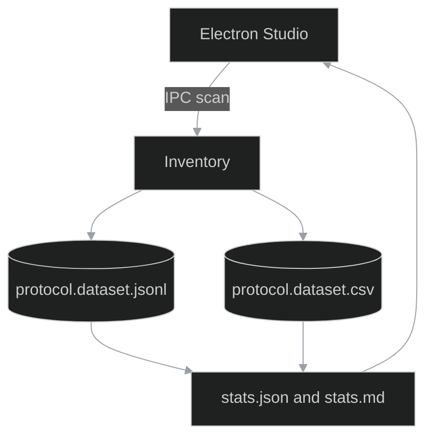
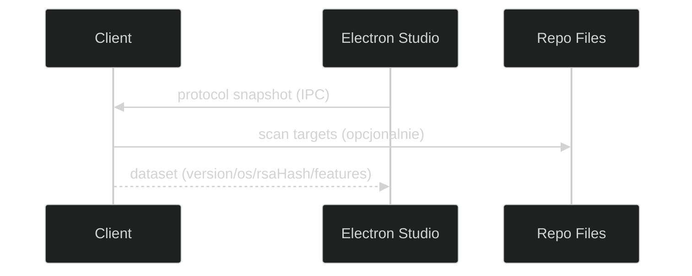

# Sieć i protokół

(facet-05_network.summary)=

## Dataset: summary

* headers: `metric,value,note`
* facet: `05_network.summary`

(facet-05_network.network_messages)=

## Dataset: network_messages

* headers: `id,name,direction,fields,notes`
* facet: `05_network.network_messages`

(facet-05_network.opcodes)=

## Dataset: opcodes

* headers: `opcode,name,direction,notes`
* facet: `05_network.opcodes`

(facet-05_network.flows)=

## Dataset: flows

* headers: `name,client_state,server_state,steps,notes`
* facet: `05_network.flows`

(facet-05_network.handshake)=

## Diagram: handshake

* facet: `05_network.handshake`

## Relacje

* influences → `10_game_runtime.game_state`
* logs → `09_logging.logging_categories`

---

# Chapter 05 - Network

### Professional Pro Template - Agent-Ready - OTClient v8

> Cel: ten rozdzial dokumentuje parametry protokolu klienta (wersja, system/OS, klucz RSA w formie skrótu), opcjonalne cechy (features) i artefakty handshake’u. Generuje rekordy w NDJSON i CSV (append-only), statystyki (JSON/MD) i diagramy (Mermaid). Styl elastyczny i konkretny. Calosc ASCII-only, UTF-8 bez BOM.

---

### 0) Executive summary

* Co: snapshot/y konfiguracji protokolu (clientVersion, customOs, RSA – tylko skrót, bez klucza), zebrane z runtime (jesli API obecne) i/lub z plików repo (skan – wzorce tekstowe).
* Dla kogo: inzynierowie klienta, integratorzy, narzedzia AI/RAG i Studio (Electron/React).
* Output: NDJSON (pelny), CSV (splaszczony), statystyki (JSON/MD), analizy (findings), diagramy (Mermaid), narracja (sekcje merytoryczne).
* Agent-ready: mapa plikow, punkty wstrzykniec (AGENT:INSERT), IO setup, CSV header, IPC hooki Studio, checklist DoD.

---

### 1) Struktura folderu i linkowanie

```bash
05_network/
  README.md
  meta.json
  protocol.schema.json
  sections/
  datasets/
    protocol.dataset.jsonl
    protocol.dataset.csv
    network_messages.csv
    opcodes.csv
    flows.csv
    chunks/
  stats/
  analysis/
  extractors/
    protocol_inventory.lua
    protocol_stats.lua
    network_messages_inventory.lua   # ← NOWE (CSV: network_messages/opcodes)
    flows_builder.lua                # ← NOWE (CSV: flows)
  config/
    protocol.targets.txt
    network_messages.src.lua         # ← NOWE (data-source dla messages/opcodes)
    flows.src.lua                    # ← NOWE (data-source dla flows)
  diagrams/
    network_flow.mmd
    login_handshake.mmd
```

> Note: IO setup w README ponizej. ASCII-only, UTF-8 bez BOM, LF.

---

### 2) README - nawigacja i instrukcje (Agent-friendly)

```markdown
---
id: chapter:network
title: Network - Protocol and Handshake
authors: ["docs-export"]
version: 1.0
last_updated: 2025-10-08
status: draft
tags: ["network","protocol","rsa","clientVersion","otclient","agent"]
related:
  - ../01_runtime/README.md
  - ../02_events/README.md
  - ../09_logging/README.md
outputs:
  - ./datasets/protocol.dataset.jsonl
  - ./datasets/protocol.dataset.csv
  - ./datasets/network_messages.csv
  - ./datasets/opcodes.csv
  - ./datasets/flows.csv
  - ./stats/stats.json
  - ./stats/stats.md
encoding: UTF-8 (no BOM)
---
Short: protokol + wiadomosci/opcodes + przeplywy. Wszystko eksportowane do CSV/NDJSON.

CSV headers
- protocol.dataset.csv → `id,ts,clientVersion,customOs,rsaHash,features_json,source_json`
- network_messages.csv → `id,name,direction,fields,notes`
- opcodes.csv → `opcode,name,direction,notes`
- flows.csv → `name,client_state,server_state,steps,notes`

IO setup
- Default: `dofile('../../_shared/lua/docio.lua')`
- Isolated: kopiuj do `05_network/_local/docio.lua` i użyj `dofile('../_local/docio.lua')`

Studio hooks
- IPC: `studio:network.protocol.scan` → `protocol_inventory.lua`
- IPC: `studio:network.messages.scan` → `network_messages_inventory.lua`
- IPC: `studio:network.flows.build` → `flows_builder.lua`
- IPC: `studio:aggregate.network` → `protocol_stats.lua`
```

---

### 3) Nowe extractory CSV (gotowe)

**extractors/network_messages_inventory.lua**

```lua
-- 05_network/extractors/network_messages_inventory.lua
-- Generuje CSV: network_messages.csv oraz opcodes.csv na podstawie config/network_messages.src.lua
-- ASCII-only; UTF-8 bez BOM; LF
local docio = dofile('../../_shared/lua/docio.lua')

local MSG_HEADER = { 'id','name','direction','fields','notes' }
local OPC_HEADER = { 'opcode','name','direction','notes' }
local MAX_BYTES = 50*1024*1024

local function loadSource()
  -- Plik konfiguracyjny zwraca tabele: { messages = {...}, opcodes = {...} }
  local ok, src = pcall(dofile, 'docs/05_network/config/network_messages.src.lua')
  if ok and type(src) == 'table' then return src end
  return { messages = {}, opcodes = {} }
end

local function serializeFields(fields)
  if type(fields) ~= 'table' then return '' end
  -- format: key:type;key:type
  local parts = {}
  for i, f in ipairs(fields) do
    local k = tostring(f.name or ('f'..i))
    local t = tostring(f.type or 'u8')
    parts[#parts+1] = k .. ':' .. t
  end
  return table.concat(parts, ';')
end

local function run()
  local src = loadSource()
  -- CSV headers
  docio.writeCsvHeader('docs/05_network/datasets/network_messages.csv', MSG_HEADER)
  docio.writeCsvHeader('docs/05_network/datasets/opcodes.csv', OPC_HEADER)

  -- messages
  for _,m in ipairs(src.messages or {}) do
    local row = {
      id = tostring(m.id or ''),
      name = tostring(m.name or ''),
      direction = tostring(m.direction or ''),
      fields = serializeFields(m.fields),
      notes = tostring(m.notes or '')
    }
    docio.appendCsvRow('docs/05_network/datasets/network_messages.csv', MSG_HEADER, row, MAX_BYTES)
  end

  -- opcodes
  for _,o in ipairs(src.opcodes or {}) do
    local row = {
      opcode = tostring(o.opcode or ''),
      name = tostring(o.name or ''),
      direction = tostring(o.direction or ''),
      notes = tostring(o.notes or '')
    }
    docio.appendCsvRow('docs/05_network/datasets/opcodes.csv', OPC_HEADER, row, MAX_BYTES)
  end
end

run()
```

**extractors/flows_builder.lua**

```lua
-- 05_network/extractors/flows_builder.lua
-- Generuje CSV: flows.csv na podstawie config/flows.src.lua
-- ASCII-only; UTF-8 bez BOM; LF
local docio = dofile('../../_shared/lua/docio.lua')

local FLOW_HEADER = { 'name','client_state','server_state','steps','notes' }
local MAX_BYTES = 50*1024*1024

local function loadSource()
  local ok, src = pcall(dofile, 'docs/05_network/config/flows.src.lua')
  if ok and type(src) == 'table' then return src end
  return { flows = {} }
end

local function serializeSteps(steps)
  if type(steps) ~= 'table' then return '' end
  -- format: step1 > step2 > step3
  return table.concat(steps, ' > ')
end

local function run()
  local src = loadSource()
  docio.writeCsvHeader('docs/05_network/datasets/flows.csv', FLOW_HEADER)
  for _,f in ipairs(src.flows or {}) do
    local row = {
      name = tostring(f.name or ''),
      client_state = tostring(f.client_state or ''),
      server_state = tostring(f.server_state or ''),
      steps = serializeSteps(f.steps),
      notes = tostring(f.notes or '')
    }
    docio.appendCsvRow('docs/05_network/datasets/flows.csv', FLOW_HEADER, row, MAX_BYTES)
  end
end

run()
```

---

### 4) Pliki konfiguracyjne źródłowe (proste do edycji)

**config/network_messages.src.lua** (przykład minimalny, możesz rozszerzać)

```lua
-- Zwracaj TYLKO tabele: messages/opcodes; bez require, bez IO
return {
  messages = {
    { id = 'MSG_LOGIN', name = 'Login', direction = 'C→S', fields = {
        {name='version', type='u16'}, {name='account', type='string'}, {name='password', type='string'}
      }, notes = 'Pierwszy pakiet logowania' },
    { id = 'MSG_PING',  name = 'Ping',  direction = 'C→S', fields = {{name='seq', type='u32'}}, notes = '' },
    { id = 'MSG_PONG',  name = 'Pong',  direction = 'S→C', fields = {{name='seq', type='u32'}}, notes = '' }
  },
  opcodes = {
    { opcode = '0x01', name = 'Login', direction = 'C→S', notes = '' },
    { opcode = '0x1D', name = 'Ping',  direction = 'C→S', notes = '' },
    { opcode = '0x1E', name = 'Pong',  direction = 'S→C', notes = '' }
  }
}
```

**config/flows.src.lua** (przykład login)

```lua
return {
  flows = {
    { name = 'login_handshake', client_state = 'client-start', server_state = 'auth-pending',
      steps = { 'Client:Login(version,account,pass)', 'Server:Challenge?', 'Client:Response?', 'Server:CharacterList' },
      notes = 'Wariant bez dodatkowych rozszerzeń' }
  }
}
```

---

### 5) Istniejące extractory (bez zmian)

Używaj nadal `protocol_inventory.lua` i `protocol_stats.lua` (poniżej niezmienione kopie):

```lua
-- 05_network/extractors/protocol_inventory.lua
-- Snapshot protokolu: runtime (gdy API obecne) + skan plikow (wzorce) -> JSONL + CSV
-- ASCII-only; UTF-8 bez BOM; LF
local docio = dofile('../../_shared/lua/docio.lua')
local json = require('json')

local CSV_HEADER = { 'id','ts','clientVersion','customOs','rsaHash','features_json','source_json' }
local MAX_BYTES = 50*1024*1024

local function nowIso()
  local t = os.date('!*t')
  return string.format('%04d-%02d-%02dT%02d:%02d:%02dZ', t.year, t.month, t.day, t.hour, t.min, t.sec)
end

local function fnv1a32(s)
  if not s then return '' end
  local hash = 2166136261
  for i = 1, #s do
    hash = hash ~ string.byte(s, i)
    hash = (hash * 16777619) % 4294967296
  end
  return string.format('fnv1a32:%08x', hash)
end

local function trymethod(obj, name)
  local ok, res = pcall(function()
    if obj and type(obj[name]) == 'function' then return obj[name](obj) end
    return nil
  end)
  if ok then return res end
  return nil
end

local function parseCandidates(text, acc)
  acc = acc or {}
  for line in (text or ''):gmatch('[^\r\n]+') do
    local ver = line:match('[Cc]lient[Vv]ersion%W*[:=]%W*([0-9]+)')
    if ver then acc.clientVersion = tonumber(ver) or ver end
    local osn = line:match('[Cc]ustom[Oo][Ss]%W*[:=]%W*"([^"]+)"')
    if osn then acc.customOs = osn end
    local rsa = line:match('RSA[^\"]*"([A-Fa-f0-9%s]+)"') or line:match('RSA[^\"]*"([%+/%=A-Za-z0-9%s]+)"')
    if rsa and #rsa > 32 then rsa = rsa:gsub('%s+',''); acc.rsaHash = fnv1a32(rsa) end
    local fkey, fval = line:match('[Ff]eature%.([A-Za-z0-9_]+)%W*[:=]%W*([A-Za-z0-9_]+)')
    if fkey and fval then
      local v = (fval == 'true') and true or (fval == 'false') and false or tonumber(fval) or fval
      acc.features = acc.features or {}; acc.features[fkey] = v
    end
  end
  return acc
end

local function loadTargets()
  local out = {}
  local cfg = docio.readAll('docs/05_network/config/protocol.targets.txt')
  if cfg and #cfg > 0 then
    for line in cfg:gmatch('[^\r\n]+') do
      local p = line:match('^%s*(.-)%s*$')
      if p ~= '' and not p:match('^#') then out[#out+1] = p end
    end
  end
  return out
end

local function snapshot()
  local s = { ts = nowIso(), source = { runtime = false, files = {} } }
  local gv = trymethod(g_game, 'getClientVersion') or trymethod(g_game, 'getProtocolVersion')
  if gv then s.clientVersion = gv; s.source.runtime = true end
  local osname = trymethod(g_window, 'getPlatform') or trymethod(g_app, 'getName')
  if osname then s.customOs = osname; s.source.runtime = true end
  local targets = loadTargets()
  for _,path in ipairs(targets) do
    if g_resources and g_resources.fileExists and g_resources.fileExists(path) then
      local txt = g_resources.readFileContents(path)
      parseCandidates(txt, s)
      s.source.files[#s.source.files+1] = path
    end
  end
  s.id = string.format('proto:%s@%s', tostring(s.clientVersion or 'unknown'), s.ts)
  s.type = 'protocol'
  s.features = s.features or {}
  s.rsaHash = s.rsaHash or ''
  s.links = {}
  return s
end

local function run()
  local rec = snapshot()
  docio.appendJsonl('docs/05_network/datasets/protocol.dataset.jsonl', rec, MAX_BYTES)
  docio.writeCsvHeader('docs/05_network/datasets/protocol.dataset.csv', CSV_HEADER)
  local row = {
    id = rec.id, ts = rec.ts,
    clientVersion = rec.clientVersion, customOs = rec.customOs,
    rsaHash = rec.rsaHash,
    features_json = require('json').encode(rec.features or {}),
    source_json = require('json').encode(rec.source or {})
  }
  docio.appendCsvRow('docs/05_network/datasets/protocol.dataset.csv', CSV_HEADER, row, MAX_BYTES)
end

run()
```

```lua
-- 05_network/extractors/protocol_stats.lua
-- Agregacja -> stats.json + stats.md (deterministyczny output; sort kluczy)
-- ASCII-only; UTF-8 bez BOM; LF
local docio = dofile('../../_shared/lua/docio.lua')
local json = require('json')

local function parseLines(text)
  local out = {}
  if not text or #text == 0 then return out end
  for line in text:gmatch('[^\r\n]+') do
    local ok, obj = pcall(function() return json.decode(line) end)
    if ok and type(obj) == 'table' then out[#out+1] = obj end
  end
  return out
end

local function loadAllRecords()
  local recs = {}
  local head = docio.readAll('docs/05_network/datasets/protocol.dataset.jsonl')
  local headList = parseLines(head)
  for i=1,#headList do recs[#recs+1] = headList[i] end
  local indexText = docio.readAll('docs/05_network/datasets/chunks/index.json')
  if indexText and #indexText > 0 then
    local ok, list = pcall(function() return json.decode(indexText) end)
    if ok and type(list) == 'table' then
      for _,fname in ipairs(list) do
        local path = fname
        if not tostring(fname):match('^docs/') then
          path = 'docs/05_network/datasets/chunks/' .. tostring(fname)
        end
        local t = docio.readAll(path)
        local more = parseLines(t)
        for i=1,#more do recs[#recs+1] = more[i] end
      end
    end
  end
  return recs
end

local function stats(recs)
  local s = { count = #recs, byVersion = {}, byOs = {}, byRsaHash = {}, features = {} }
  for _,r in ipairs(recs) do
    local v = tostring(r.clientVersion or 'unknown')
    local o = tostring(r.customOs or 'unknown')
    local h = tostring(r.rsaHash or '')
    s.byVersion[v] = (s.byVersion[v] or 0) + 1
    s.byOs[o] = (s.byOs[o] or 0) + 1
    if h ~= '' then s.byRsaHash[h] = (s.byRsaHash[h] or 0) + 1 end
    if type(r.features) == 'table' then
      for fk,fv in pairs(r.features) do
        local key = string.format('%s=%s', fk, tostring(fv))
        s.features[key] = (s.features[key] or 0) + 1
      end
    end
  end
  return s
end

local function writeSection(title, map)
  local lines, keys = {}, {}
  for k,_ in pairs(map) do keys[#keys+1] = k end
  table.sort(keys)
  lines[#lines+1] = title
  for _,k in ipairs(keys) do lines[#lines+1] = string.format('- %s: %d', k, map[k]) end
  lines[#lines+1] = ''
  return table.concat(lines, '\n')
end

local function writeMD(s)
  local md = {}
  md[#md+1] = '# Network - Statystyki\n'
  md[#md+1] = ''
  md[#md+1] = string.format('- Rekordy: %d\n', s.count)
  md[#md+1] = ''
  md[#md+1] = writeSection('## By clientVersion', s.byVersion)
  md[#md+1] = writeSection('## By customOs', s.byOs)
  md[#md+1] = writeSection('## By rsaHash', s.byRsaHash)
  md[#md+1] = writeSection('## Features', s.features)
  md[#md+1] = 'Hint: zmianom wersji lub rsaHash czesto towarzysza zmiany w eventach logowania.\n'
  return table.concat(md)
end

local function run()
  local recs = loadAllRecords()
  local s = stats(recs)
  docio.writeAll('docs/05_network/stats/stats.json', json.encode(s))
  docio.writeAll('docs/05_network/stats/stats.md', writeMD(s))
end

run()
```

---

### 6) Diagramy (Mermaid) – bez zmian stylistyki

`diagrams/network_flow.mmd`



`diagrams/login_handshake.mmd`



---

### 7) DoD – uzupełnione o CSV messages/opcodes/flows

* [ ] Uruchom `network_messages_inventory.lua` → generuje `datasets/network_messages.csv` i `datasets/opcodes.csv` na bazie `config/network_messages.src.lua`.
* [ ] Uruchom `flows_builder.lua` → generuje `datasets/flows.csv` na bazie `config/flows.src.lua`.
* [ ] Uruchom `protocol_inventory.lua` → `protocol.dataset.jsonl/csv`.
* [ ] Uruchom `protocol_stats.lua` → `stats.json/md`.
* [ ] Waliduj próbki zgodnie ze schematami i sprawdź linki w README.
