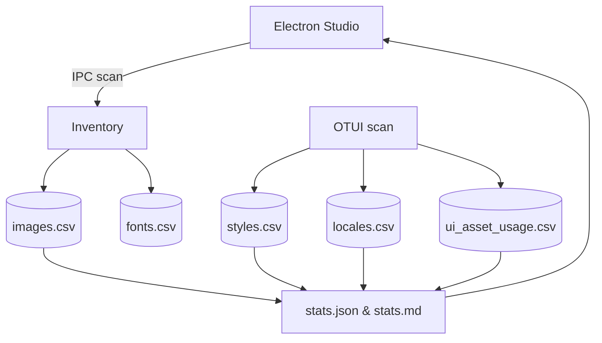
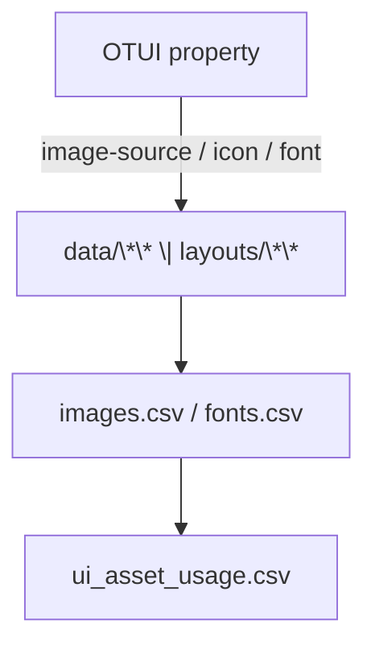

# Data — Assets, Styles, Locales, Shaders, Sounds (Export Kit)

**Cel:** Spójne, agent‑ready indeksy zasobów z `data/**` + *override* z `layouts/**`, wraz z mapowaniem **OTUI → asset** i metadanymi pod RAG/Studio. ASCII‑only, UTF‑8 bez BOM, LF.

## 0) Executive summary

* Co: inwentaryzacja obrazów, czcionek, styli, lokalizacji, shaderów i dźwięków oraz automatyczne **powiązanie z OTUI**.
* Dla kogo: dev/QA, narzędzia BI, RAG, Electron Studio.
* Output: CSV (spłaszczone), statystyki (JSON/MD), diagramy (Mermaid), opcjonalnie NDJSON (dla pełnych rekordów).
* Agent‑ready: punkty wstrzyknięć (AGENT:INSERT), IO setup, stałe nagłówki CSV, checklist DoD.

---

## 1) Struktura folderu (wzorzec jak rozdziały 06/07/08/09/10)

```bash
11_data/
  README.md                      # narracja + TOC + nawigacja (ten plik)
  meta.json                      # mapa plików + zadania + tags (machine-readable)
  schemas/                       # schematy CSV/NDJSON (opcjonalne)
    images.schema.json
    fonts.schema.json
    styles.schema.json
    locales.schema.json
    sounds.schema.json
    shaders.schema.json
    ui_asset_usage.schema.json
  sections/
    00_data_basics.md            # wprowadzenie do katalogu data/** + layouts/**
    01_overrides_and_theme.md    # reguły override (layouts) i motywy
    02_models.md                 # słowniki pól + przykłady
    03_collection_methods.md     # jak zbieramy (skan + OTUI resolver)
    04_quality_and_limits.md     # jakość, ograniczenia, SLO
    05_how_to_read_stats.md      # jak czytać statystyki i znaleźć braki
  datasets/
    images.csv
    fonts.csv
    styles.csv
    locales.csv
    sounds.csv
    shaders.csv
    ui_asset_usage.csv
    chunks/
      README.md
  stats/
    stats.json
    stats.md
  analysis/
    findings.md
    gaps.md
    figures/
  extractors/
    data_inventory.lua           # skan plików data/** + layouts/**
    ui_usage_scan.lua            # parser OTUI → ui_asset_usage.csv
    data_stats.lua               # agregacje → stats.json + stats.md
  config/
    data.scan_roots.txt          # listy korzeni do skanu (opcjonalnie)
    ui.scan_paths.txt            # globy *.otui do mapowania assetów
    layout.active.txt            # nazwa aktywnego layoutu (opcjonalnie)
  diagrams/
    data_flow.mmd
    asset_linking.mmd
```

> Note: IO setup jak w innych rozdziałach — `dofile('../../_shared/lua/docio.lua')` z poziomu `extractors/`.

---

## 2) README – skrót operacyjny (Agent‑friendly)

**CSV headers (stałe):**

* `images.csv`

```
path,kind,width,height,theme,used_by_ui_ids,notes
```

* `fonts.csv`

```
font_id,file,size,weight,mono,fallbacks
```

* `styles.csv`

```
style_id,source_file,selector,property,value,resolved_asset
```

* `locales.csv`

```
lang,key,value,source_file
```

* `sounds.csv`

```
path,duration_ms,channels,rate_hz,kind,used_by
```

* `shaders.csv`

```
name,type,file,uniforms,includes
```

* `ui_asset_usage.csv`

```
ui_id,ui_file,widget_path,prop,value,asset_path,resolved_path,notes
```

**Override (layouts):** `layouts/<ACTIVE>/**` ma **wyższy priorytet** niż `data/**`. Nie używaj nazwy layoutu `default`.

**Studio hooks (Electron):**

* `studio:data.inventory.run` → `data_inventory.lua`
* `studio:data.ui.scan` → `ui_usage_scan.lua`
* `studio:aggregate.data` → `data_stats.lua`
* `studio:open.data` `{type:'csv', which:'images|fonts|...|ui'}`

---

## 3) Słowniki pól (zgodne z resztą rozdziałów)

### Images (images.csv)

| Pole           | Typ    | Przykład                              | Znaczenie                              |      |         |        |
| -------------- | ------ | ------------------------------------- | -------------------------------------- | ---- | ------- | ------ |
| path           | string | `data/images/ui/tabbutton_square.png` | Absolutna ścieżka w repo dokumentacji. |      |         |        |
| kind           | string | `png`                                 | Format pliku.                          |      |         |        |
| width          | number | `98`                                  | Szerokość px.                          |      |         |        |
| height         | number | `18`                                  | Wysokość px.                           |      |         |        |
| theme          | string | `neutral`                             | `light                                 | dark | neutral | auto`. |
| used_by_ui_ids | string | `ui.skills_window;ui.topbar`          | Lista `;`‑separowana.                  |      |         |        |
| notes          | string | `Ikona przycisku Skills`              | Dowolny komentarz.                     |      |         |        |

### Fonts (fonts.csv)

| font_id                   | file                     | size | weight   | mono   | fallbacks |
| ------------------------- | ------------------------ | ---- | -------- | ------ | --------- |
| `verdana-11px-monochrome` | `data/fonts/verdana.ttf` | `11` | `normal` | `true` | `""`      |

### Styles (styles.csv)

Zrzut par `selector.prop=value` (uwzględniając stany `$hover/$checked/$disabled`). `resolved_asset` uzupełniamy, gdy `property` wskazuje na zasób (`image-source`, `icon`, `background`).

### Locales (locales.csv)

Ekstrakcja kluczy z `tr('...')` i `!text: tr('...')` (z `.otui` i `.lua`).

### Sounds (sounds.csv)

Metadane audio i powiązania z UI lub modułami.

### Shaders (shaders.csv)

Lista shaderów wraz z typem (fragment/vertex) i uniformami.

### UI Asset Usage (ui_asset_usage.csv)

Mapowanie **OTUI → asset** z rozstrzygniętą ścieżką (`resolved_path`) wg aktywnego layoutu.

---

## 4) Extractors (Lua) – gotowe pliki

### `extractors/data_inventory.lua`

```lua
-- 11_data/extractors/data_inventory.lua
-- Skan data/** + layouts/<ACTIVE>/** -> CSV: images, fonts, styles, locales, sounds, shaders
-- ASCII-only; UTF-8 without BOM; LF
local docio = dofile('../../_shared/lua/docio.lua')
local json = require('json')

local MAX_BYTES = 50*1024*1024

local HEADERS = {
  images = { 'path','kind','width','height','theme','used_by_ui_ids','notes' },
  fonts  = { 'font_id','file','size','weight','mono','fallbacks' },
  styles = { 'style_id','source_file','selector','property','value','resolved_asset' },
  locales= { 'lang','key','value','source_file' },
  sounds = { 'path','duration_ms','channels','rate_hz','kind','used_by' },
  shaders= { 'name','type','file','uniforms','includes' }
}

local function readActiveLayout()
  local t = docio.readAll('docs/11_data/config/layout.active.txt')
  t = t and t:gsub('%s+$','') or ''
  if t == '' or t:lower() == 'default' then return nil end
  return t
end

local function pushCsv(which, row)
  local file = 'docs/11_data/datasets/' .. which .. '.csv'
  docio.writeCsvHeader(file, HEADERS[which])
  docio.appendCsvRow(file, HEADERS[which], row, MAX_BYTES)
end

-- Light helpers (best-effort; szczegóły wymiarów/formatów mogą być uzupełniane offline)
local function extOf(path)
  return (path:match('%.([A-Za-z0-9]+)$') or ''):lower()
end

local function scanImages(root)
  local list = docio.listFilesRecursive and docio.listFilesRecursive(root .. '/images') or {}
  for _,p in ipairs(list) do
    local kind = extOf(p)
    if kind == 'png' or kind == 'jpg' or kind == 'jpeg' or kind == 'webp' then
      pushCsv('images', { path = p, kind = (kind=='jpeg' and 'jpg' or kind), width = '', height = '', theme = 'neutral', used_by_ui_ids = '', notes = '' })
    end
  end
end

local function scanFonts(root)
  local list = docio.listFilesRecursive and docio.listFilesRecursive(root .. '/fonts') or {}
  for _,p in ipairs(list) do
    local ext = extOf(p)
    if ext == 'ttf' or ext == 'otf' or ext == 'woff' or ext == 'woff2' or ext == 'fnt' then
      local id = p:match('([^/]+)%.%w+$') or p
      pushCsv('fonts', { font_id = id, file = p, size = '', weight = 'normal', mono = 'false', fallbacks = '' })
    end
  end
end

local function scanSounds(root)
  local list = docio.listFilesRecursive and docio.listFilesRecursive(root .. '/sounds') or {}
  for _,p in ipairs(list) do
    local ext = extOf(p)
    if ext == 'ogg' or ext == 'mp3' or ext == 'wav' then
      pushCsv('sounds', { path = p, duration_ms = '', channels = '', rate_hz = '', kind = 'sfx', used_by = '' })
    end
  end
end

local function scanShaders(root)
  local list = docio.listFilesRecursive and docio.listFilesRecursive(root .. '/shaders') or {}
  for _,p in ipairs(list) do
    local ext = extOf(p)
    if ext == 'frag' or ext == 'vert' or ext == 'glsl' then
      local name = p:match('([^/]+)%.%w+$') or p
      local typ = (ext == 'vert') and 'vertex' or 'fragment'
      pushCsv('shaders', { name = name, type = typ, file = p, uniforms = '', includes = '' })
    end
  end
end

-- styles/locales zwykle wyprowadzamy poprzez ui_usage_scan.lua i parsowanie OTUI; tutaj tylko placeholder
local function run()
  local layout = readActiveLayout()
  scanImages('data')
  if layout then scanImages('layouts/' .. layout) end
  scanFonts('data'); if layout then scanFonts('layouts/' .. layout) end
  scanSounds('data'); if layout then scanSounds('layouts/' .. layout) end
  scanShaders('data'); if layout then scanShaders('layouts/' .. layout) end
end

run()
```

### `extractors/ui_usage_scan.lua`

```lua
-- 11_data/extractors/ui_usage_scan.lua
-- Parsuje *.otui, wyciąga właściwości assetowe i tłumaczenia → ui_asset_usage.csv, styles.csv, locales.csv
-- ASCII-only; UTF-8 without BOM; LF
local docio = dofile('../../_shared/lua/docio.lua')
local json = require('json')

local MAX_BYTES = 50*1024*1024
local UI_HEADERS = { 'ui_id','ui_file','widget_path','prop','value','asset_path','resolved_path','notes' }
local STY_HEADERS = { 'style_id','source_file','selector','property','value','resolved_asset' }
local LOC_HEADERS = { 'lang','key','value','source_file' }

local function readActiveLayout()
  local t = docio.readAll('docs/11_data/config/layout.active.txt')
  t = t and t:gsub('%s+$','') or ''
  if t == '' or t:lower() == 'default' then return nil end
  return t
end

local function normImagePath(v)
  if not v or v == '' then return '', '' end
  local path = tostring(v)
  path = path:gsub('^/+','') -- usuń wiodące '/'
  if not path:match('%.%w+$') then path = path .. '.png' end
  return 'data/' .. path, path
end

local function resolvePath(rel)
  local layout = readActiveLayout()
  if layout then
    local lp = 'layouts/' .. layout .. '/' .. rel
    if g_resources and g_resources.fileExists and g_resources.fileExists(lp) then return lp end
  end
  return 'data/' .. rel
end

local function push(which, row, headers)
  local file = 'docs/11_data/datasets/' .. which .. '.csv'
  docio.writeCsvHeader(file, headers)
  docio.appendCsvRow(file, headers, row, MAX_BYTES)
end

local function parseOtui(text, source_file)
  -- Bardzo uproszczone: wyciąga linie z image-source, icon, font, !text: tr('...')
  local ui_id = ''
  local widget_path = ''
  for line in (text or ''):gmatch('[^\r\n]+') do
    local imgk, imgv = line:match('^%s*(image%-source|icon|background)%s*:%s*([%w%./_-]+)')
    if imgk and imgv then
      local abs, rel = normImagePath(imgv:gsub('^/',''))
      local resolved = resolvePath(rel)
      push('ui_asset_usage', {
        ui_id = ui_id, ui_file = source_file, widget_path = widget_path,
        prop = imgk, value = imgv, asset_path = abs, resolved_path = resolved, notes = ''
      }, UI_HEADERS)
      -- styles echo (selector szczątkowo = widget_path lub source_file)
      push('styles', {
        style_id = source_file .. ':' .. (widget_path or '') .. ':' .. imgk,
        source_file = source_file, selector = widget_path, property = imgk, value = imgv, resolved_asset = resolved
      }, STY_HEADERS)
    end
    local fontv = line:match('^%s*font%s*:%s*([%w%./_-]+)')
    if fontv then
      push('styles', {
        style_id = source_file .. ':' .. (widget_path or '') .. ':font',
        source_file = source_file, selector = widget_path, property = 'font', value = fontv, resolved_asset = ''
      }, STY_HEADERS)
    end
    local key = line:match("!text:%s*tr%('%s*([%w%._-]+)%s*'%)")
    if key then
      push('locales', { lang = '', key = key, value = '', source_file = source_file }, LOC_HEADERS)
    end
    -- bardzo proste śledzenie widget_path (np. "Panel"/"UIButton"): informacyjne
    local wid = line:match('^%s*([A-Za-z_][%w_]*)%s*<%s*[A-Za-z_][%w_]*') or line:match('^%s*([A-Za-z_][%w_]*)%s*$')
    if wid then widget_path = (widget_path == '' and wid) or (widget_path .. '/' .. wid) end
    if line:match('^%s*id:%s*([%w_%-]+)') then ui_id = line:match('^%s*id:%s*([%w_%-]+)') end
  end
end

local function run()
  -- Ścieżki plików *.otui do skanu z config/ui.scan_paths.txt (po jednej linii)
  local listtxt = docio.readAll('docs/11_data/config/ui.scan_paths.txt') or ''
  for path in listtxt:gmatch('[^\r\n]+') do
    local p = path:gsub('^%s+',''):gsub('%s+$','')
    if p ~= '' and g_resources and g_resources.fileExists and g_resources.fileExists(p) then
      parseOtui(g_resources.readFileContents(p), p)
    end
  end
end

run()
```

### `extractors/data_stats.lua`

```lua
-- 11_data/extractors/data_stats.lua
-- Agregacja → stats.json + stats.md
-- ASCII-only; UTF-8 without BOM; LF
local docio = dofile('../../_shared/lua/docio.lua')
local json = require('json')

local function readCsv(path)
  local t = docio.readAll(path)
  local rows = {}
  if not t or #t == 0 then return rows end
  local header
  for line in t:gmatch('[^\r\n]+') do
    if not header then header = docio.parseCsvHeader(line) else rows[#rows+1] = docio.parseCsvRow(header, line) end
  end
  return rows
end

local function run()
  local imgs = readCsv('docs/11_data/datasets/images.csv')
  local styl = readCsv('docs/11_data/datasets/styles.csv')
  local loc  = readCsv('docs/11_data/datasets/locales.csv')
  local ui   = readCsv('docs/11_data/datasets/ui_asset_usage.csv')

  local s = { counts = { images=#imgs, styles=#styl, locales=#loc, uiLinks=#ui }, missing = { locales=0, assets=0 } }
  for _,r in ipairs(loc) do if (r.value or '') == '' then s.missing.locales = s.missing.locales + 1 end end
  for _,r in ipairs(ui) do
    local rp = tostring(r.resolved_path or '')
    if rp == '' or not (g_resources and g_resources.fileExists and g_resources.fileExists(rp)) then s.missing.assets = s.missing.assets + 1 end
  end

  docio.writeAll('docs/11_data/stats/stats.json', json.encode(s))
  local md = {}
  md[#md+1] = '# Data — Statystyki\n\n'
  md[#md+1] = string.format('- images: %d\n', s.counts.images)
  md[#md+1] = string.format('- styles: %d\n', s.counts.styles)
  md[#md+1] = string.format('- locales: %d (missing values: %d)\n', s.counts.locales, s.missing.locales)
  md[#md+1] = string.format('- ui links: %d (missing assets resolved: %d)\n', s.counts.uiLinks, s.missing.assets)
  docio.writeAll('docs/11_data/stats/stats.md', table.concat(md))
end

run()
```

---

## 5) Diagramy (Mermaid)

`diagrams/data_flow.mmd`



`diagrams/asset_linking.mmd`



---

## 6) Quality, SLO i bezpieczeństwo

* CSV mają **nagłówki stałe**; puste pola zapisuj jako `""`.
* Nie zapisujemy treści obrazów/soundów; tylko metadane.
* Layout `default` jest zabroniony — brak mylenia z bazowym `data/**`.
* Idempotency: drugi przebieg ekstraktorów nie zmienia plików (poza dopisaniem nowych rekordów).

---

## 7) DoD Checklist (spójne z innymi rozdziałami)

* [ ] `images.csv/fonts.csv/styles.csv/locales.csv/sounds.csv/shaders.csv/ui_asset_usage.csv` wygenerowane (≥ sensowna próbka).
* [ ] `stats.json` i `stats.md` wygenerowane (deterministyczne sekcje).
* [ ] `sections/*` uzupełnione: 00/01/02/03.
* [ ] `analysis/gaps.md` zawiera listę braków (np. `resolved_path` bez pliku).
* [ ] Diagramy `data_flow.mmd` i `asset_linking.mmd` istnieją i renderują się.
* [ ] `meta.json` ma poprawne crosslinks do `04_ui`, `06_assets`, `12_otmod`.

---

## 8) meta.json – wzorzec

```json
{
  "$schemaVersion": 1,
  "chapterId": "chapter:data",
  "title": "Data — Assets, Styles, Locales, Shaders, Sounds",
  "owners": ["docs-export", "github:lukaszj321"],
  "tags": ["data","assets","styles","locales","shaders","sounds","otclient","agent"],
  "fileMap": {
    "readme": "./README.md",
    "schemas": {
      "images": "./schemas/images.schema.json",
      "fonts": "./schemas/fonts.schema.json",
      "styles": "./schemas/styles.schema.json",
      "locales": "./schemas/locales.schema.json",
      "sounds": "./schemas/sounds.schema.json",
      "shaders": "./schemas/shaders.schema.json",
      "ui_usage": "./schemas/ui_asset_usage.schema.json"
    },
    "sections": [
      "./sections/00_data_basics.md",
      "./sections/01_overrides_and_theme.md",
      "./sections/02_models.md",
      "./sections/03_collection_methods.md",
      "./sections/04_quality_and_limits.md",
      "./sections/05_how_to_read_stats.md"
    ],
    "datasets": {
      "images": "./datasets/images.csv",
      "fonts": "./datasets/fonts.csv",
      "styles": "./datasets/styles.csv",
      "locales": "./datasets/locales.csv",
      "sounds": "./datasets/sounds.csv",
      "shaders": "./datasets/shaders.csv",
      "ui": "./datasets/ui_asset_usage.csv",
      "chunksDir": "./datasets/chunks"
    },
    "stats": {
      "json": "./stats/stats.json",
      "md": "./stats/stats.md"
    },
    "analysis": {
      "findings": "./analysis/findings.md",
      "gaps": "./analysis/gaps.md",
      "figuresDir": "./analysis/figures"
    },
    "extractors": [
      "./extractors/data_inventory.lua",
      "./extractors/ui_usage_scan.lua",
      "./extractors/data_stats.lua"
    ],
    "diagrams": [
      "./diagrams/data_flow.mmd",
      "./diagrams/asset_linking.mmd"
    ],
    "config": {
      "roots": "./config/data.scan_roots.txt",
      "uiScan": "./config/ui.scan_paths.txt",
      "layout": "./config/layout.active.txt"
    }
  },
  "linking": {
    "recordIdPattern": {
      "images": "data/images/<path>",
      "fonts": "font:<font_id>",
      "uiUsage": "ui:<ui_id>/<prop>@<file>"
    },
    "crossChapter": {
      "ui": "../04_ui/README.md",
      "assets": "../06_assets/README.md",
      "otmod": "../12_otmod/README.md"
    }
  },
  "agent": {
    "tasks": [
      {"id": "inventory", "desc": "Skan data/** + layouts/** do CSV", "outputs": ["images","fonts","sounds","shaders"]},
      {"id": "scan_ui", "desc": "Mapowanie OTUI → assets/styles/locales", "outputs": ["ui","styles","locales"]},
      {"id": "aggregate", "desc": "Agregacja do stats.json/stats.md", "outputs": ["stats.json","stats.md"]}
    ],
    "insertPoints": {
      "sections/02_models.md": ["AGENT:INSERT:IMAGE-EXAMPLES","AGENT:INSERT:STYLE-EXAMPLES","AGENT:INSERT:UI-USAGE-EXAMPLES"],
      "sections/05_how_to_read_stats.md": ["AGENT:INSERT:READING-GUIDE"],
      "analysis/findings.md": ["AGENT:INSERT:FINDINGS"],
      "analysis/gaps.md": ["AGENT:INSERT:GAPS"]
    }
  }
}
```

---

## 9) Schematy (skrót; opcjonalne w CI)

`schemas/ui_asset_usage.schema.json`

```json
{
  "$schema":"http://json-schema.org/draft-07/schema#",
  "title":"ui_asset_usage.record",
  "type":"object",
  "required":["ui_id","ui_file","widget_path","prop","value","asset_path","resolved_path"],
  "properties":{
    "ui_id":{"type":"string"},
    "ui_file":{"type":"string"},
    "widget_path":{"type":"string"},
    "prop":{"type":"string"},
    "value":{"type":"string"},
    "asset_path":{"type":"string"},
    "resolved_path":{"type":"string"},
    "notes":{"type":"string"}
  }
}
```

---

## 10) Appendix – reguły parsowania OTUI (regex, jak w briefie)

```text
# image-source / icon / background
(?m)^(?:\s*)(image-source|icon|background)\s*:\s*([\w\/-\.]+)

# font
(?m)^(?:\s*)font\s*:\s*([\w\-]+)

# !text: tr('...')
(?m)!text:\s*tr\('\s*([\w\._-]+)\s*'\)
```

---

## 11) See also / Crosslinks

* `04_ui` – OTUI i widgety
* `06_assets` – niski poziom assetów i suma kontrolna
* `12_otmod` – powiązania modułów → UI
