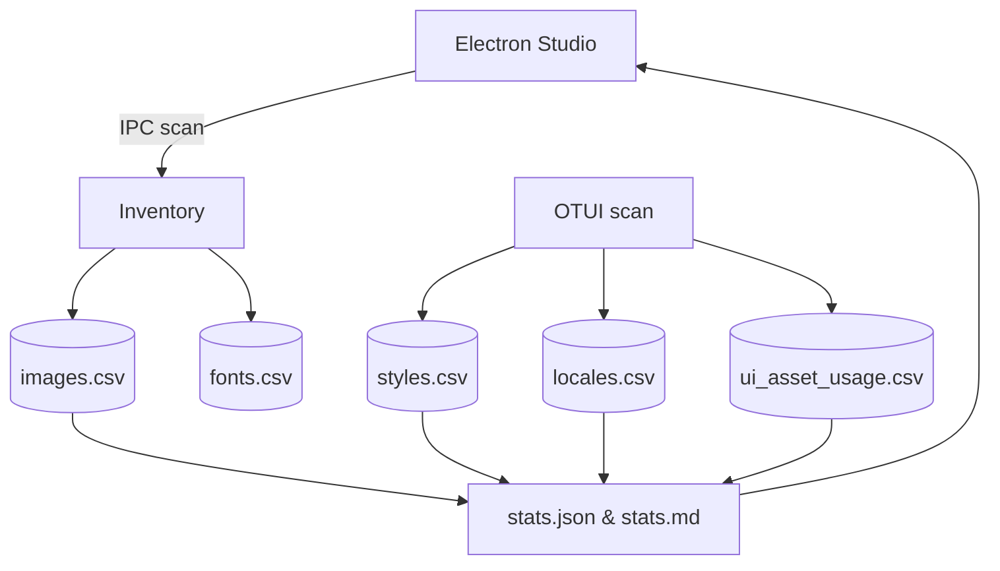
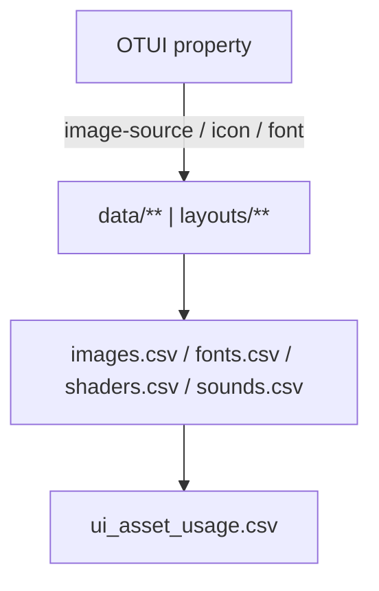

---

id: "chapter:data"
chapter: "11_data"
slug: "11_data"
title: "Data — Assets, Styles, Locales, Shaders, Sounds"
status: "agent_ready"
owners:

* "docs-export"
* "github:lukaszj321"
  version: "1.0"
  last_updated: "2025-10-15"
  language: "pl"
  tags: ["otclient","data","assets","otui","styles","locales","shaders","sounds","rag","agent"]

related:

* "../04_ui/README.md"
* "../06_assets/README.md"
* "../12_otmod/README.md"

# ARTIFACTS 

artifacts:
datasets:
- id: "images"
file: "./datasets/images.csv"
headers: ["path","kind","width","height","theme","used_by_ui_ids","notes"]
facet: "11_data.images"
- id: "fonts"
file: "./datasets/fonts.csv"
headers: ["font_id","file","size","weight","mono","fallbacks"]
facet: "11_data.fonts"
- id: "styles"
file: "./datasets/styles.csv"
headers: ["style_id","source_file","selector","property","value","resolved_asset"]
facet: "11_data.styles"
- id: "locales"
file: "./datasets/locales.csv"
headers: ["lang","key","value","source_file"]
facet: "11_data.locales"
- id: "sounds"
file: "./datasets/sounds.csv"
headers: ["path","duration_ms","channels","rate_hz","kind","used_by"]
facet: "11_data.sounds"
- id: "shaders"
file: "./datasets/shaders.csv"
headers: ["name","type","file","uniforms","includes"]
facet: "11_data.shaders"
- id: "ui_asset_usage"
file: "./datasets/ui_asset_usage.csv"
headers: ["ui_id","ui_file","widget_path","prop","value","asset_path","resolved_path","notes"]
facet: "11_data.ui_asset_usage"
diagrams:
- id: "data_flow"
file: "./diagrams/data_flow.mmd"
facet: "11_data.data_flow"
- id: "asset_linking"
file: "./diagrams/asset_linking.mmd"
facet: "11_data.asset_linking"

# OUTPUTS (zachowane dla zgodności ze skryptami)

outputs:

* "./datasets/images.csv"
* "./datasets/fonts.csv"
* "./datasets/styles.csv"
* "./datasets/locales.csv"
* "./datasets/sounds.csv"
* "./datasets/shaders.csv"
* "./datasets/ui_asset_usage.csv"
* "./stats/stats.json"
* "./stats/stats.md"

## encoding: "UTF-8 (no BOM)"

# Data — Assets, Styles, Locales, Shaders, Sounds (Export Kit)

**Cel:** Spójne, agent-ready indeksy zasobów z `data/**` + *override* z `layouts/**`, wraz z mapowaniem **OTUI → asset** i metadanymi pod RAG/Studio. ASCII-only, UTF-8 bez BOM, LF.

## 0) Executive summary

* **Co:** inwentaryzacja obrazów, czcionek, styli, lokalizacji, shaderów i dźwięków oraz automatyczne **powiązanie z OTUI**.
* **Dla kogo:** dev/QA, narzędzia BI, RAG, Electron Studio.
* **Output:** CSV (spłaszczone), statystyki (JSON/MD), diagramy (Mermaid), opcjonalnie NDJSON.
* **Agent-ready:** stałe nagłówki CSV, punkty IPC, sanity & QA, deterministyczne sortowanie.

---

## 1) Struktura folderu

```bash
11_data/
  README.md
  meta.json
  schemas/
    images.schema.json
    fonts.schema.json
    styles.schema.json
    locales.schema.json
    sounds.schema.json
    shaders.schema.json
    ui_asset_usage.schema.json
  sections/
    00_data_basics.md
    01_overrides_and_theme.md
    02_models.md
    03_collection_methods.md
    04_quality_and_limits.md
    05_how_to_read_stats.md
  datasets/
    images.csv
    fonts.csv
    styles.csv
    locales.csv
    sounds.csv
    shaders.csv
    ui_asset_usage.csv
    chunks/README.md
  stats/
    stats.json
    stats.md
  analysis/
    findings.md
    gaps.md
    figures/
  extractors/
    data_inventory.lua
    ui_usage_scan.lua
    data_stats.lua
  config/
    data.scan_roots.txt
    ui.scan_paths.txt
    layout.active.txt
  diagrams/
    data_flow.mmd
    asset_linking.mmd
```

> IO setup jak w innych rozdziałach — `dofile('../../_shared/lua/docio.lua')` z poziomu `extractors/`.

---

## 2) README – skrót operacyjny (Agent-friendly)

**CSV headers (stałe):**

* `images.csv` → `path,kind,width,height,theme,used_by_ui_ids,notes`
* `fonts.csv` → `font_id,file,size,weight,mono,fallbacks`
* `styles.csv` → `style_id,source_file,selector,property,value,resolved_asset`
* `locales.csv` → `lang,key,value,source_file`
* `sounds.csv` → `path,duration_ms,channels,rate_hz,kind,used_by`
* `shaders.csv` → `name,type,file,uniforms,includes`
* `ui_asset_usage.csv` → `ui_id,ui_file,widget_path,prop,value,asset_path,resolved_path,notes`

**Override (layouts):** `layouts/<ACTIVE>/**` ma **wyższy priorytet** niż `data/**`. Nie używaj nazwy layoutu `default`.

**Studio IPC hooks (Electron):**

* `studio:data.inventory.run` → `extractors/data_inventory.lua`
* `studio:data.ui.scan` → `extractors/ui_usage_scan.lua`
* `studio:aggregate.data` → `extractors/data_stats.lua`
* `studio:open.data` `{type:'csv', which:'images|fonts|styles|locales|sounds|shaders|ui'}`

---

## 3) Słowniki pól (z przykładami)

### Images (`images.csv`)

| path                                | kind | width | height | theme   | used_by_ui_ids               | notes          |
| ----------------------------------- | ---: | ----: | -----: | ------- | ---------------------------- | -------------- |
| `data/images/topbuttons/skills.png` |  png |    16 |     16 | neutral | `ui.skills_window;ui.topbar` | Ikona „Skills” |

### Fonts (`fonts.csv`)

| font_id                 | file                     | size | weight | mono | fallbacks |
| ----------------------- | ------------------------ | ---: | ------ | ---- | --------- |
| verdana-11px-monochrome | `data/fonts/verdana.ttf` |   11 | normal | true | `""`      |

### Styles (`styles.csv`) — przykłady rekordów

| style_id                                 | source_file                       | selector       | property     | value                         | resolved_asset                        |
| ---------------------------------------- | --------------------------------- | -------------- | ------------ | ----------------------------- | ------------------------------------- |
| `skills.otui:/TabBarButton:image-source` | `modules/game_skills/skills.otui` | `TabBarButton` | image-source | `/images/ui/tabbutton_square` | `data/images/ui/tabbutton_square.png` |
| `skills.otui:/TabBarButton:font`         | `modules/game_skills/skills.otui` | `TabBarButton` | font         | `verdana-11px-monochrome`     | `""`                                  |

### Locales (`locales.csv`)

| lang | key               | value | source_file                       |
| ---- | ----------------- | ----- | --------------------------------- |
|      | `ui.skills.title` |       | `modules/game_skills/skills.otui` |

### Sounds (`sounds.csv`)

| path                       | duration_ms | channels | rate_hz | kind | used_by     |
| -------------------------- | ----------: | -------: | ------: | ---- | ----------- |
| `data/sounds/ui/click.ogg` |             |          |         | sfx  | `ui.button` |

### Shaders (`shaders.csv`)

| name      | type     | file                        | uniforms            | includes |
| --------- | -------- | --------------------------- | ------------------- | -------- |
| `uipulse` | fragment | `data/shaders/uipulse.frag` | `u_time;u_strength` |          |

### UI Asset Usage (`ui_asset_usage.csv`)

| ui_id         | ui_file                           | widget_path               | prop         | value                         | asset_path                            | resolved_path                                  | notes |
| ------------- | --------------------------------- | ------------------------- | ------------ | ----------------------------- | ------------------------------------- | ---------------------------------------------- | ----- |
| `skillWindow` | `modules/game_skills/skills.otui` | `MiniWindow/TabBarButton` | image-source | `/images/ui/tabbutton_square` | `data/images/ui/tabbutton_square.png` | `layouts/retro/images/ui/tabbutton_square.png` |       |

---

## 4) Extractors (Lua) – gotowe pliki

### `extractors/data_inventory.lua`

```lua
-- 11_data/extractors/data_inventory.lua
-- Skan data/** + layouts/<ACTIVE>/** -> CSV: images, fonts, styles, locales, sounds, shaders
-- ASCII-only; UTF-8 without BOM; LF
local docio = dofile('../../_shared/lua/docio.lua')
local json = require('json')

local MAX_BYTES = 50*1024*1024

local HEADERS = {
  images = { 'path','kind','width','height','theme','used_by_ui_ids','notes' },
  fonts  = { 'font_id','file','size','weight','mono','fallbacks' },
  styles = { 'style_id','source_file','selector','property','value','resolved_asset' },
  locales= { 'lang','key','value','source_file' },
  sounds = { 'path','duration_ms','channels','rate_hz','kind','used_by' },
  shaders= { 'name','type','file','uniforms','includes' }
}

local function readActiveLayout()
  local t = docio.readAll('docs/11_data/config/layout.active.txt')
  t = t and t:gsub('%s+$','') or ''
  if t == '' or t:lower() == 'default' then return nil end
  return t
end

local function pushCsv(which, row)
  local file = 'docs/11_data/datasets/' .. which .. '.csv'
  docio.writeCsvHeader(file, HEADERS[which])
  docio.appendCsvRow(file, HEADERS[which], row, MAX_BYTES)
end

local function extOf(path) return (path:match('%.([A-Za-z0-9]+)$') or ''):lower() end

local function scanImages(root)
  local list = docio.listFilesRecursive and docio.listFilesRecursive(root .. '/images') or {}
  for _,p in ipairs(list) do
    local kind = extOf(p)
    if kind == 'png' or kind == 'jpg' or kind == 'jpeg' or kind == 'webp' then
      pushCsv('images', { path = p, kind = (kind=='jpeg' and 'jpg' or kind), width = '', height = '', theme = 'neutral', used_by_ui_ids = '', notes = '' })
    end
  end
end

local function scanFonts(root)
  local list = docio.listFilesRecursive and docio.listFilesRecursive(root .. '/fonts') or {}
  for _,p in ipairs(list) do
    local ext = extOf(p)
    if ext == 'ttf' or ext == 'otf' or ext == 'woff' or ext == 'woff2' or ext == 'fnt' then
      local id = p:match('([^/]+)%.%w+$') or p
      pushCsv('fonts', { font_id = id, file = p, size = '', weight = 'normal', mono = 'false', fallbacks = '' })
    end
  end
end

local function scanSounds(root)
  local list = docio.listFilesRecursive and docio.listFilesRecursive(root .. '/sounds') or {}
  for _,p in ipairs(list) do
    local ext = extOf(p)
    if ext == 'ogg' or ext == 'mp3' or ext == 'wav' then
      pushCsv('sounds', { path = p, duration_ms = '', channels = '', rate_hz = '', kind = 'sfx', used_by = '' })
    end
  end
end

local function scanShaders(root)
  local list = docio.listFilesRecursive and docio.listFilesRecursive(root .. '/shaders') or {}
  for _,p in ipairs(list) do
    local ext = extOf(p)
    if ext == 'frag' or ext == 'vert' or ext == 'glsl' then
      local name = p:match('([^/]+)%.%w+$') or p
      local typ = (ext == 'vert') and 'vertex' or 'fragment'
      pushCsv('shaders', { name = name, type = typ, file = p, uniforms = '', includes = '' })
    end
  end
end

local function run()
  local layout = readActiveLayout()
  scanImages('data');  if layout then scanImages('layouts/' .. layout) end
  scanFonts('data');   if layout then scanFonts('layouts/' .. layout) end
  scanSounds('data');  if layout then scanSounds('layouts/' .. layout) end
  scanShaders('data'); if layout then scanShaders('layouts/' .. layout) end
end

run()
```

### `extractors/ui_usage_scan.lua`

```lua
-- 11_data/extractors/ui_usage_scan.lua
-- Parsuje *.otui, wyciąga właściwości assetowe i tłumaczenia → ui_asset_usage.csv, styles.csv, locales.csv
-- ASCII-only; UTF-8 without BOM; LF
local docio = dofile('../../_shared/lua/docio.lua')
local json = require('json')

local MAX_BYTES = 50*1024*1024
local UI_HEADERS = { 'ui_id','ui_file','widget_path','prop','value','asset_path','resolved_path','notes' }
local STY_HEADERS = { 'style_id','source_file','selector','property','value','resolved_asset' }
local LOC_HEADERS = { 'lang','key','value','source_file' }

local function readActiveLayout()
  local t = docio.readAll('docs/11_data/config/layout.active.txt')
  t = t and t:gsub('%s+$','') or ''
  if t == '' or t:lower() == 'default' then return nil end
  return t
end

local function normImagePath(v)
  if not v or v == '' then return '', '' end
  local path = tostring(v):gsub('^/+','')
  if not path:match('%.%w+$') then path = path .. '.png' end
  return 'data/' .. path, path
end

local function resolvePath(rel)
  local layout = readActiveLayout()
  if layout then
    local lp = 'layouts/' .. layout .. '/' .. rel
    if g_resources and g_resources.fileExists and g_resources.fileExists(lp) then return lp end
  end
  return 'data/' .. rel
end

local function push(which, row, headers)
  local file = 'docs/11_data/datasets/' .. which .. '.csv'
  docio.writeCsvHeader(file, headers)
  docio.appendCsvRow(file, headers, row, MAX_BYTES)
end

local function parseOtui(text, source_file)
  local ui_id, widget_path = '', ''
  for line in (text or ''):gmatch('[^\r\n]+') do
    local imgk, imgv = line:match('^%s*(image%-source|icon|background)%s*:%s*([%w%./_-]+)')
    if imgk and imgv then
      local abs, rel = normImagePath(imgv)
      local resolved = resolvePath(rel)
      push('ui_asset_usage', {
        ui_id = ui_id, ui_file = source_file, widget_path = widget_path,
        prop = imgk, value = imgv, asset_path = abs, resolved_path = resolved, notes = ''
      }, UI_HEADERS)
      push('styles', {
        style_id = source_file .. ':' .. (widget_path or '') .. ':' .. imgk,
        source_file = source_file, selector = widget_path, property = imgk, value = imgv, resolved_asset = resolved
      }, STY_HEADERS)
    end
    local fontv = line:match('^%s*font%s*:%s*([%w%./_-]+)')
    if fontv then
      push('styles', {
        style_id = source_file .. ':' .. (widget_path or '') .. ':font',
        source_file = source_file, selector = widget_path, property = 'font', value = fontv, resolved_asset = ''
      }, STY_HEADERS)
    end
    local key = line:match("!text:%s*tr%('%s*([%w%._-]+)%s*'%)")
    if key then
      push('locales', { lang = '', key = key, value = '', source_file = source_file }, LOC_HEADERS)
    end
    local wid = line:match('^%s*([A-Za-z_][%w_]*)%s*<%s*[A-Za-z_][%w_]*') or line:match('^%s*([A-Za-z_][%w_]*)%s*$')
    if wid then widget_path = (widget_path == '' and wid) or (widget_path .. '/' .. wid) end
    local idv = line:match('^%s*id:%s*([%w_%-]+)'); if idv then ui_id = idv end
  end
end

local function run()
  local listtxt = docio.readAll('docs/11_data/config/ui.scan_paths.txt') or ''
  for path in listtxt:gmatch('[^\r\n]+') do
    local p = path:gsub('^%s+',''):gsub('%s+$','')
    if p ~= '' and g_resources and g_resources.fileExists and g_resources.fileExists(p) then
      parseOtui(g_resources.readFileContents(p), p)
    end
  end
end

run()
```

### `extractors/data_stats.lua`

```lua
-- 11_data/extractors/data_stats.lua
-- Agregacja → stats.json + stats.md
-- ASCII-only; UTF-8 without BOM; LF
local docio = dofile('../../_shared/lua/docio.lua')
local json = require('json')

local function readCsv(path)
  local t = docio.readAll(path)
  local rows, header = {}, nil
  if not t or #t == 0 then return rows end
  for line in t:gmatch('[^\r\n]+') do
    if not header then header = docio.parseCsvHeader(line)
    else rows[#rows+1] = docio.parseCsvRow(header, line) end
  end
  return rows
end

local function run()
  local imgs = readCsv('docs/11_data/datasets/images.csv')
  local styl = readCsv('docs/11_data/datasets/styles.csv')
  local loc  = readCsv('docs/11_data/datasets/locales.csv')
  local ui   = readCsv('docs/11_data/datasets/ui_asset_usage.csv')

  local s = { counts = { images=#imgs, styles=#styl, locales=#loc, uiLinks=#ui }, missing = { locales=0, assets=0 } }
  for _,r in ipairs(loc) do if (r.value or '') == '' then s.missing.locales = s.missing.locales + 1 end end
  for _,r in ipairs(ui) do
    local rp = tostring(r.resolved_path or '')
    if rp == '' or not (g_resources and g_resources.fileExists and g_resources.fileExists(rp)) then s.missing.assets = s.missing.assets + 1 end
  end

  docio.writeAll('docs/11_data/stats/stats.json', json.encode(s))
  local md = {}
  md[#md+1] = '# Data — Statystyki\n\n'
  md[#md+1] = string.format('- images: %d\n', s.counts.images)
  md[#md+1] = string.format('- styles: %d\n', s.counts.styles)
  md[#md+1] = string.format('- locales: %d (missing values: %d)\n', s.counts.locales, s.missing.locales)
  md[#md+1] = string.format('- ui links: %d (missing assets resolved: %d)\n', s.counts.uiLinks, s.missing.assets)
  docio.writeAll('docs/11_data/stats/stats.md', table.concat(md))
end

run()
```

---

## 5) Diagramy (Mermaid)

### `data_flow.mmd` *(facet: 11_data.data_flow)*



### `asset_linking.mmd` *(facet: 11_data.asset_linking)*



---

## 6) Quality, SLO i bezpieczeństwo (SANITY)

* CSV mają **nagłówki stałe** dokładnie jak w `artifacts.datasets.headers`; puste pola zapisuj jako `""`.
* **Idempotency**: drugi przebieg ekstraktorów nie zmienia plików (poza dopisaniem nowych rekordów).
* **layout.active.txt**: `""` lub brak = brak override; wartość `default` jest **zabroniona**.
* **link-lint**: wszystkie odwołania do facetów z sekcji *Appendix / Facets* muszą działać.
* **dataset sanity**:

  * brak `NaN`/`null`; brak pustych nazw kolumn,
  * ścieżki `path` zaczynają się od `data/` lub `layouts/`,
  * `resolved_path` wskazuje istniejący plik (dla aktywnego layoutu), inaczej raport w `stats.md`.

---

## 7) DoD Checklist

* [ ] Wygenerowane: `images.csv`, `fonts.csv`, `styles.csv`, `locales.csv`, `sounds.csv`, `shaders.csv`, `ui_asset_usage.csv`.
* [ ] `stats.json` i `stats.md` utworzone, deterministyczne.
* [ ] `sections/*` wypełnione: 00–05.
* [ ] `analysis/gaps.md` posiada listę braków (puste `value` w locales, brak plików na `resolved_path`).
* [ ] Diagramy renderują się poprawnie.
* [ ] `meta.json` ma crosslinks do `04_ui`, `06_assets`, `12_otmod`.

---

## 8) `meta.json` – wzorzec

```json
{
  "$schemaVersion": 1,
  "chapterId": "chapter:data",
  "title": "Data — Assets, Styles, Locales, Shaders, Sounds",
  "owners": ["docs-export", "github:lukaszj321"],
  "tags": ["data","assets","styles","locales","shaders","sounds","otclient","agent"],
  "fileMap": {
    "readme": "./README.md",
    "schemas": {
      "images": "./schemas/images.schema.json",
      "fonts": "./schemas/fonts.schema.json",
      "styles": "./schemas/styles.schema.json",
      "locales": "./schemas/locales.schema.json",
      "sounds": "./schemas/sounds.schema.json",
      "shaders": "./schemas/shaders.schema.json",
      "ui_usage": "./schemas/ui_asset_usage.schema.json"
    },
    "sections": [
      "./sections/00_data_basics.md",
      "./sections/01_overrides_and_theme.md",
      "./sections/02_models.md",
      "./sections/03_collection_methods.md",
      "./sections/04_quality_and_limits.md",
      "./sections/05_how_to_read_stats.md"
    ],
    "datasets": {
      "images": "./datasets/images.csv",
      "fonts": "./datasets/fonts.csv",
      "styles": "./datasets/styles.csv",
      "locales": "./datasets/locales.csv",
      "sounds": "./datasets/sounds.csv",
      "shaders": "./datasets/shaders.csv",
      "ui": "./datasets/ui_asset_usage.csv",
      "chunksDir": "./datasets/chunks"
    },
    "stats": {
      "json": "./stats/stats.json",
      "md": "./stats/stats.md"
    },
    "analysis": {
      "findings": "./analysis/findings.md",
      "gaps": "./analysis/gaps.md",
      "figuresDir": "./analysis/figures"
    },
    "extractors": [
      "./extractors/data_inventory.lua",
      "./extractors/ui_usage_scan.lua",
      "./extractors/data_stats.lua"
    ],
    "diagrams": [
      "./diagrams/data_flow.mmd",
      "./diagrams/asset_linking.mmd"
    ],
    "config": {
      "roots": "./config/data.scan_roots.txt",
      "uiScan": "./config/ui.scan_paths.txt",
      "layout": "./config/layout.active.txt"
    }
  },
  "linking": {
    "recordIdPattern": {
      "images": "data/images/<path>",
      "fonts": "font:<font_id>",
      "uiUsage": "ui:<ui_id>/<prop>@<file>"
    },
    "crossChapter": {
      "ui": "../04_ui/README.md",
      "assets": "../06_assets/README.md",
      "otmod": "../12_otmod/README.md"
    }
  },
  "agent": {
    "tasks": [
      {"id": "inventory", "desc": "Skan data/** + layouts/** do CSV", "outputs": ["images","fonts","sounds","shaders"]},
      {"id": "scan_ui", "desc": "Mapowanie OTUI → assets/styles/locales", "outputs": ["ui","styles","locales"]},
      {"id": "aggregate", "desc": "Agregacja do stats.json/stats.md", "outputs": ["stats.json","stats.md"]}
    ],
    "insertPoints": {
      "sections/02_models.md": ["AGENT:INSERT:IMAGE-EXAMPLES","AGENT:INSERT:STYLE-EXAMPLES","AGENT:INSERT:UI-USAGE-EXAMPLES"],
      "sections/05_how_to_read_stats.md": ["AGENT:INSERT:READING-GUIDE"],
      "analysis/findings.md": ["AGENT:INSERT:FINDINGS"],
      "analysis/gaps.md": ["AGENT:INSERT:GAPS"]
    }
  }
}
```

---

## 9) Schematy (opcjonalne w CI)

`schemas/ui_asset_usage.schema.json`

```json
{
  "$schema":"http://json-schema.org/draft-07/schema#",
  "title":"ui_asset_usage.record",
  "type":"object",
  "required":["ui_id","ui_file","widget_path","prop","value","asset_path","resolved_path"],
  "properties":{
    "ui_id":{"type":"string"},
    "ui_file":{"type":"string"},
    "widget_path":{"type":"string"},
    "prop":{"type":"string"},
    "value":{"type":"string"},
    "asset_path":{"type":"string"},
    "resolved_path":{"type":"string"},
    "notes":{"type":"string"}
  }
}
```

---

## 10) Reguły parsowania OTUI (regex)

```text
# image-source / icon / background
(?m)^(?:\s*)(image-source|icon|background)\s*:\s*([\w\/\.-]+)

# font
(?m)^(?:\s*)font\s*:\s*([\w\-]+)

# !text: tr('...')
(?m)!text:\s*tr\('\s*([\w\._-]+)\s*'\)
```

---

## 11) Datasets (podgląd)

```{csv-table} images
:header-rows: 1
:file: ./datasets/images.csv
:widths: auto
```

```{csv-table} fonts
:header-rows: 1
:file: ./datasets/fonts.csv
:widths: auto
```

```{csv-table} styles
:header-rows: 1
:file: ./datasets/styles.csv
:widths: auto
```

```{csv-table} locales
:header-rows: 1
:file: ./datasets/locales.csv
:widths: auto
```

```{csv-table} sounds
:header-rows: 1
:file: ./datasets/sounds.csv
:widths: auto
```

```{csv-table} shaders
:header-rows: 1
:file: ./datasets/shaders.csv
:widths: auto
```

```{csv-table} ui_asset_usage
:header-rows: 1
:file: ./datasets/ui_asset_usage.csv
:widths: auto
```

---

## 12) Diagramy

### `data_flow.mmd` *(facet: 11_data.data_flow)*

```{mermaid}
%%{init: { 'theme': 'neutral' }}%%
flowchart LR
  A[data/*] --> B[Indexer CSV]
  B --> C[Datasets]
  C --> D[UI Pages]
  B --> E[Crosslinks]
  D --> F[RAG]
```

### `asset_linking.mmd` *(facet: 11_data.asset_linking)*

```{mermaid}
%%{init: { 'theme': 'neutral' }}%%
graph TD
  I[OTUI property] -->|image-source/icon/font| ASSET[(Asset file)]
  ASSET --> INDEX[images.csv/fonts.csv/...]
  INDEX --> UI[ui_asset_usage.csv]
```

---

## 13) IPC (Studio ↔ Data)

* `studio:data.scan` → buduje `images.csv`, `fonts.csv`, `sounds.csv`, `shaders.csv`.
* `studio:data.ui.map` → wypełnia `ui_asset_usage.csv`, `styles.csv`, `locales.csv`.
* `studio:data.locales.scan` → waliduje `locales.csv` i raportuje braki.
* `studio:data.aggregate` → tworzy `stats.json` i `stats.md`.

---

## 14) RAG & chunking

* Chunkuj po **H2–H4**, ≤ **1200 tokenów**, **overlap ~10%**.
* Nie tnij tabel CSV ani bloków `otui`.
* *See also* i cross-linki: `11_data` ↔ `04_ui` ↔ `12_otmod`.

---

## 15) Appendix / Facets

(facet-11_data.images)=**Facet: `11_data.images`** — dataset
(facet-11_data.fonts)=**Facet: `11_data.fonts`** — dataset
(facet-11_data.styles)=**Facet: `11_data.styles`** — dataset
(facet-11_data.locales)=**Facet: `11_data.locales`** — dataset
(facet-11_data.sounds)=**Facet: `11_data.sounds`** — dataset
(facet-11_data.shaders)=**Facet: `11_data.shaders`** — dataset
(facet-11_data.ui_asset_usage)=**Facet: `11_data.ui_asset_usage`** — dataset
(facet-11_data.data_flow)=**Facet: `11_data.data_flow`** — diagram
(facet-11_data.asset_linking)=**Facet: `11_data.asset_linking`** — diagram
