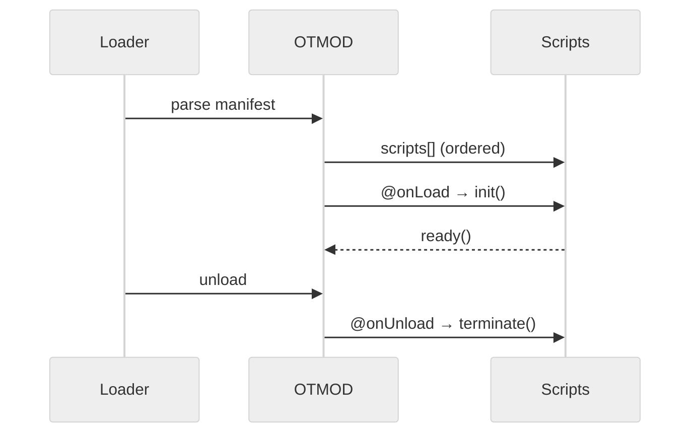
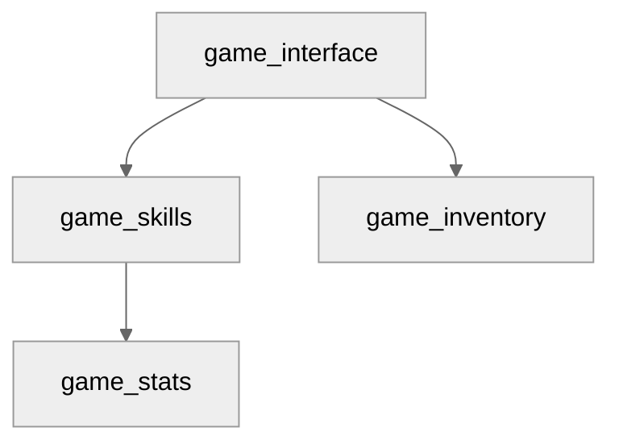

# OTMOD — Moduły, hooki, zależności, UI i lifecycle (specyfikacja + praktyka)

> Cel: **standaryzowany rozdział agent-ready** do inwentaryzacji modułów `.otmod`, ich skryptów Lua, hooków cyklu życia i powiązań z OTUI. Publikuje **CSV (kontraktowe)**, opcjonalne **NDJSON** (pełne rekordy), statystyki oraz diagramy. Styl zgodny z rozdziałami 07/08/09/10.

---

## 0) Executive summary

* **Co**: indeks modułów (manifesty, skrypty, zależności), hooki `@onLoad/@onUnload`, linki do OTUI, prosty graf deps i lifecycle.
* **Dla kogo**: inżynierowie klienta, QA, narzędzia BI/RAG, Studio (Electron/React).
* **Output**: CSV (kontraktowe), NDJSON (opcjonalnie), statystyki (`stats.json`/`stats.md`), diagramy (Mermaid), narracja.
* **Agent-ready**: mapa plików, punkty wstrzyknięć (AGENT:INSERT), IO setup, stałe nagłówki CSV, Studio hooks, DoD checklist.

---

## 1) Struktura folderu i linkowanie

```bash
docs/12_otmod/
  README.md                        # ten plik (nawigacja + TOC)
  meta.json                        # mapa plików + zadania + tags (machine-readable)
  schemas/
    modules_index.schema.json
    module_scripts.schema.json
    module_deps.schema.json
    module_hooks.schema.json
    module_ui_links.schema.json
  sections/
    00_otmod_basics.md             # podstawy OTMOD
    01_manifest_and_rules.md       # zasady manifestu i porządek ładowania
    02_models.md                   # słowniki pól + przykłady (AGENT:INSERT)
    03_collection_methods.md       # jak zbieramy (parser .otmod, Lua exports)
    04_quality_and_limits.md       # jakość, ograniczenia, SLO
    05_how_to_read_stats.md        # jak czytać statystyki i wykresy
  datasets/
    modules_index.csv
    module_scripts.csv
    module_deps.csv
    module_hooks.csv
    module_ui_links.csv
    ndjson/
      modules_index.jsonl          # opcjonalnie pełne rekordy
      module_scripts.jsonl
      module_deps.jsonl
      module_hooks.jsonl
      module_ui_links.jsonl
  stats/
    stats.json
    stats.md
  analysis/
    findings.md
    compliance.md
    figures/
  extractors/
    otmod_indexer.lua              # skan .otmod + lua → CSV/NDJSON
    otmod_stats.lua                # agregacje → stats.json + stats.md
  diagrams/
    lifecycle.mmd
    deps.mmd
```

> **IO setup:** `dofile('../../_shared/lua/docio.lua')` (jak w poprzednich rozdziałach). Wersja izolowana: skopiuj do `12_otmod/_local/docio.lua` i użyj `dofile('../_local/docio.lua')`.

---

## 2) README — nawigacja i instrukcje (Agent-friendly)

**Table of contents**

* [0. OTMOD basics](./sections/00_otmod_basics.md)
* [1. Manifest i zasady ładowania](./sections/01_manifest_and_rules.md)
* [2. Modele danych](./sections/02_models.md)
* [3. Zbieranie (parser + Lua)](./sections/03_collection_methods.md)
* [4. Jakość i ograniczenia](./sections/04_quality_and_limits.md)
* [5. Jak czytać statystyki](./sections/05_how_to_read_stats.md)
* [Statystyki](./stats/stats.md) — [Datasety](./datasets/) — [Analizy](./analysis/findings.md)

**Quick links**

* Schemas: [`schemas/*.schema.json`](./schemas)
* Datasets: [`datasets/*.csv`](./datasets)
* Diagrams: [`diagrams/lifecycle.mmd`](./diagrams/lifecycle.mmd), [`diagrams/deps.mmd`](./diagrams/deps.mmd)

**Crosslinks**

* UI: `../04_ui/README.md`
* Data: `../11_data/README.md`

**CSV headers (kontrakt)**

```
modules_index.csv
module,description,author,sandboxed,scripts,load_later,dependencies,website,path

module_scripts.csv
module,script,order,source_file,lines,exports,requires

module_deps.csv
module,depends_on,type,note

module_hooks.csv
module,hook,function,priority,source_file,line

module_ui_links.csv
module,otui_file,widget_root,widgets_count,images_count,fonts_used,styles_used
```

Header jest **stały** — narzędzia BI/RAG mogą cachować schemat.

**Studio hooks (Electron)**

* IPC: `studio:otmod.index` → uruchamia `extractors/otmod_indexer.lua`
* IPC: `studio:aggregate.otmod` → uruchamia `extractors/otmod_stats.lua`
* IPC: `studio:open.otmod` `{file: 'modules_index'|'module_scripts'|...}` → otwarcie datasetu
* Preload: `contextIsolation: true`, `nodeIntegration: false`
* Sandbox: wszystkie zapisy idą przez `docio.lua` pod `12_otmod`

---

## 3) Mapowanie plików i odpowiedzialności (reference for Agents)

| Plik/Katalog              | Rola                        | Kto uzupełnia    | Uwagi                               |                               |
| ------------------------- | --------------------------- | ---------------- | ----------------------------------- | ----------------------------- |
| `schemas/*.schema.json`   | walidacja CSV/NDJSON        | Agent/CI         | waliduj w CI                        |                               |
| `datasets/*.csv`          | kontrakt danych             | indexer          | tylko wartości skalarne (listy `;`) |                               |
| `datasets/ndjson/*.jsonl` | pełne rekordy (opcjonalnie) | indexer          | append-only                         |                               |
| `stats/*.json             | md`                         | metryki zbiorcze | aggregator                          | licznik modułów, deps, hooków |
| `sections/*`              | narracja                    | Autor/Agent      | punkty `AGENT:INSERT`               |                               |
| `analysis/*`              | wnioski i compliance        | Analityk         | linkuj moduły                       |                               |
| `extractors/*.lua`        | zrzut i agregacja           | system           | nie zmieniaj API zapisu             |                               |

---

## 4) Słowniki pól (data dictionaries)

**modules_index (CSV/NDJSON)**

| Pole         | Typ     | Przykład                                      | Znaczenie                           |
| ------------ | ------- | --------------------------------------------- | ----------------------------------- |
| module       | string  | `game_interface`                              | Unikalna nazwa modułu (kebab_case). |
| description  | string  | `Create the game interface`                   | Opis z manifestu.                   |
| author       | string  | `OTClient team`                               | Autor/autorzy.                      |
| sandboxed    | boolean | `true`                                        | Flaga sandboxu.                     |
| scripts      | string  | `widgets/uigamemap;gameinterface`             | Lista `;` w kolejności.             |
| load_later   | string  | `game_skills;game_inventory`                  | Miękkie zależności.                 |
| dependencies | string  | `game_interface`                              | Twarde deps (opcjonalnie).          |
| website      | string  | `https://...`                                 | URL projektu.                       |
| path         | string  | `modules/game_interface/game_interface.otmod` | Ścieżka pliku.                      |

**module_scripts** — skrypty Lua zliczone i wzbogacone o `exports` / `requires` (heurystyka przez regex).

**module_deps** — wiersz per krawędź (`type=hard|soft`).

**module_hooks** — hooki z manifestu i te wykryte w Lua (np. `connect`, `disconnect`).

**module_ui_links** — powiązanie z `.otui` (root, liczby widgetów, assets, fonts/styles).

> **AGENT:INSERT:OTMOD-EXAMPLES** — wstaw 3–5 przykładów modułów (zanonimizowanych) z `*.otmod` + krótki komentarz.

---

## 5) Pipeline danych

1. **Indexer** skanuje katalog `modules/**` w poszukiwaniu `*.otmod` → wypełnia `modules_index.csv` i rozwija listy: `scripts`, `load-later`, `dependencies` → `module_scripts.csv`, `module_deps.csv`.
2. Analiza Lua: dla każdej pozycji w `scripts` znajduje pliki `.lua`, liczy linie, heurystycznie wykrywa `exports` (np. `modules.game_skills.*`) i `requires` (`require('...')`).
3. Linki do OTUI: w katalogu modułu wyszukuje `*.otui`, liczy widgety i assety (spójnie z rozdz. **11_data**).
4. **Aggregator** liczy statystyki: liczba modułów, rozkład `sandboxed`, top deps, top hooki; zapisuje `stats.*`.

---

## 6) Sekcje merytoryczne — szablony

**sections/00_otmod_basics.md**

```markdown
# OTMOD — podstawy dla nowych dev
Plik `.otmod` opisuje moduł OTClient (manifest + lista skryptów + hooki). Utrzymuj deterministyczny porządek ładowania i korzystaj z `sandboxed: true` tam, gdzie to możliwe.
```

**sections/01_manifest_and_rules.md**

```markdown
# Manifest i zasady ładowania
- `scripts`: kolejność ma znaczenie (bootstrap → widgets → integracje).
- `load-later`: miękkie zależności; nie wymusza natychmiastowego ładowania.
- `dependencies`: twarde zależności — budują graf ładowania.
- Hooki: `@onLoad: init()` / `@onUnload: terminate()`.
```

**sections/02_models.md**

```markdown
# Modele danych — definicje i przykłady
Zobacz słowniki w README. Poniżej przykłady rekordów (zanonimizowane).

<!-- AGENT:INSERT:OTMOD-EXAMPLES -->
```

**sections/03_collection_methods.md**

```markdown
# Zbieranie (parser + Lua)
- otmod_indexer.lua skanuje `*.otmod` i katalogi modułów.
- Lua: liczy linie w skryptach, szuka `exports`/`requires` (regex), wykrywa hooki i `.otui`.
- Studio: IPC `studio:otmod.index`, `studio:aggregate.otmod`.
```

**sections/04_quality_and_limits.md**

```markdown
# Jakość i ograniczenia
- Format `.otmod` bywa niespójny (spacje, przecinki); parser jest defensywny.
- Eksporty Lua wyznaczamy heurystycznie; potwierdzaj w code review.
- UI links: niektóre moduły ładują `.otui` dynamicznie — oznacz `widgets_count=0` i notuj.
```

**sections/05_how_to_read_stats.md**

```markdown
# Jak czytać statystyki
- Rozkład `sandboxed` vs niesandboxowane — ryzyko side-effects.
- Top deps i głębokość grafu — miejsca o dużej centralności.
- Top hooki — wąskie gardła inicjalizacji.
```

---

## 7) Schematy (JSON Schema) — walidacja CSV/NDJSON

`schemas/modules_index.schema.json`

```json
{
  "$schema": "http://json-schema.org/draft-07/schema#",
  "title": "modules_index.record",
  "type": "object",
  "required": ["module","path"],
  "properties": {
    "module": {"type":"string"},
    "description": {"type":"string"},
    "author": {"type":"string"},
    "sandboxed": {"type":"boolean"},
    "scripts": {"type":"string"},
    "load_later": {"type":"string"},
    "dependencies": {"type":"string"},
    "website": {"type":"string"},
    "path": {"type":"string"}
  }
}
```

`schemas/module_scripts.schema.json`

```json
{
  "$schema": "http://json-schema.org/draft-07/schema#",
  "title": "module_scripts.record",
  "type": "object",
  "required": ["module","script","order"],
  "properties": {
    "module": {"type":"string"},
    "script": {"type":"string"},
    "order": {"type":"number"},
    "source_file": {"type":"string"},
    "lines": {"type":"number"},
    "exports": {"type":"string"},
    "requires": {"type":"string"}
  }
}
```

`schemas/module_deps.schema.json`

```json
{
  "$schema": "http://json-schema.org/draft-07/schema#",
  "title": "module_deps.record",
  "type": "object",
  "required": ["module","depends_on","type"],
  "properties": {
    "module": {"type":"string"},
    "depends_on": {"type":"string"},
    "type": {"type":"string","enum":["hard","soft"]},
    "note": {"type":"string"}
  }
}
```

`schemas/module_hooks.schema.json`

```json
{
  "$schema": "http://json-schema.org/draft-07/schema#",
  "title": "module_hooks.record",
  "type": "object",
  "required": ["module","hook","function"],
  "properties": {
    "module": {"type":"string"},
    "hook": {"type":"string"},
    "function": {"type":"string"},
    "priority": {"type":"number"},
    "source_file": {"type":"string"},
    "line": {"type":"number"}
  }
}
```

`schemas/module_ui_links.schema.json`

```json
{
  "$schema": "http://json-schema.org/draft-07/schema#",
  "title": "module_ui_links.record",
  "type": "object",
  "required": ["module","otui_file","widget_root"],
  "properties": {
    "module": {"type":"string"},
    "otui_file": {"type":"string"},
    "widget_root": {"type":"string"},
    "widgets_count": {"type":"number"},
    "images_count": {"type":"number"},
    "fonts_used": {"type":"string"},
    "styles_used": {"type":"string"}
  }
}
```

---

## 8) Extractors (Lua) — gotowe pliki

**extractors/otmod_indexer.lua**

```lua
-- docs/12_otmod/extractors/otmod_indexer.lua
-- Indeksuje *.otmod + Lua + OTUI → CSV oraz opcjonalnie NDJSON
-- ASCII-only; UTF-8 bez BOM; LF
local docio = dofile('../../_shared/lua/docio.lua')
local json = require('json')

local CSV_HDR_MI = { 'module','description','author','sandboxed','scripts','load_later','dependencies','website','path' }
local CSV_HDR_MS = { 'module','script','order','source_file','lines','exports','requires' }
local CSV_HDR_MD = { 'module','depends_on','type','note' }
local CSV_HDR_MH = { 'module','hook','function','priority','source_file','line' }
local CSV_HDR_MU = { 'module','otui_file','widget_root','widgets_count','images_count','fonts_used','styles_used' }
local MAX_BYTES = 50*1024*1024

local function trim(s) return (tostring(s or ''):gsub('^%s+',''):gsub('%s+$','')) end
local function split_list(s)
  local out = {}
  for token in tostring(s or ''):gmatch('[^,;%s]+') do out[#out+1] = token end
  return out
end

local function readFile(path)
  if g_resources and g_resources.fileExists and g_resources:fileExists(path) then
    return g_resources:readFileContents(path)
  end
  return docio.readAll(path)
end

local function write_csv_row(path, header, row)
  docio.writeCsvHeader(path, header)
  docio.appendCsvRow(path, header, row, MAX_BYTES)
end

local function append_ndjson(path, obj)
  docio.appendJsonl(path, obj, MAX_BYTES)
end

-- Minimalny parser *.otmod (defensywny; dopuszcza listy w [] lub ,/;)
local function parse_otmod(text)
  local t = text or ''
  local M = {}
  M.name = trim(t:match('\n%s*name:%s*([%w_%-]+)'))
  M.description = trim((t:match('\n%s*description:%s*(.-)\n') or ''):gsub('[\r]',''))
  M.author = trim((t:match('\n%s*author:%s*(.-)\n') or ''))
  M.website = trim((t:match('\n%s*website:%s*(.-)\n') or ''))
  local sandbox = t:match('\n%s*sandboxed:%s*(%a+)')
  M.sandboxed = (sandbox and sandbox:lower() == 'true') or false
  local scripts = t:match('scripts:%s*%[(.-)%]') or t:match('\n%s*scripts:%s*(.-)\n') or ''
  local loadlater = t:match('load%-later:%s*%[(.-)%]') or t:match('\n%s*load%-later:%s*(.-)\n') or ''
  local deps = t:match('dependencies:%s*%[(.-)%]') or t:match('\n%s*dependencies:%s*(.-)\n') or ''
  M.scripts = table.concat(split_list(scripts), ';')
  M.load_later = table.concat(split_list(loadlater), ';')
  M.dependencies = table.concat(split_list(deps), ';')
  -- Hooki bez priorytetów
  local onLoad = t:match('@onLoad:%s*([%w_%.]+)')
  local onUnload = t:match('@onUnload:%s*([%w_%.]+)')
  M.hooks = {}
  if onLoad then table.insert(M.hooks, { hook='@onLoad', fn=onLoad }) end
  if onUnload then table.insert(M.hooks, { hook='@onUnload', fn=onUnload }) end
  return M
end

-- Heurystyka Lua: policz linie, exports (modules.<name>.*) i requires
local function analyze_lua(moduleName, luaPath)
  local txt = readFile(luaPath) or ''
  local lines = 0; for _ in txt:gmatch('\n') do lines = lines + 1 end
  local exports = {}
  for sym in txt:gmatch('modules%.'..moduleName:gsub('%-','_')..'%.[%w_]+') do exports[#exports+1] = sym end
  local requires = {}
  for rq in txt:gmatch("require%(['\"]([%w_%./%-]+)['\"]%)") do requires[#requires+1] = rq end
  return lines, table.concat(exports,'|'), table.concat(requires,'|')
end

-- Heurystyka OTUI: policz widgety/assetowe właściwości
local function analyze_otui(otuiPath)
  local txt = readFile(otuiPath) or ''
  local widgets = 0
  for _ in txt:gmatch('\n[%w_]+%s*<%s*[%w_]') do widgets = widgets + 1 end
  local images = 0; for _ in txt:gmatch('image%-source%s*:') do images = images + 1 end
  local fonts = 0; for _ in txt:gmatch('\n%s*font%s*:') do fonts = fonts + 1 end
  local styles = 0; for _ in txt:gmatch('image%-clip%s*:') do styles = styles + 1 end
  return widgets, images, fonts, styles
end

local function index_module(otmodPath)
  local text = readFile(otmodPath) or ''
  local M = parse_otmod(text)
  if not M.name or M.name == '' then return end
  local moduleName = M.name

  -- modules_index
  write_csv_row('docs/12_otmod/datasets/modules_index.csv', CSV_HDR_MI, {
    module = moduleName,
    description = M.description or '',
    author = M.author or '',
    sandboxed = tostring(M.sandboxed),
    scripts = M.scripts or '',
    load_later = M.load_later or '',
    dependencies = M.dependencies or '',
    website = M.website or '',
    path = otmodPath
  })
  append_ndjson('docs/12_otmod/datasets/ndjson/modules_index.jsonl', {
    module = moduleName, description = M.description, author = M.author, sandboxed = M.sandboxed,
    scripts = split_list(M.scripts), load_later = split_list(M.load_later), dependencies = split_list(M.dependencies),
    website = M.website, path = otmodPath
  })

  -- hooks
  for _,h in ipairs(M.hooks or {}) do
    write_csv_row('docs/12_otmod/datasets/module_hooks.csv', CSV_HDR_MH, {
      module = moduleName, hook = h.hook, ['function'] = h.fn, priority = '', source_file = otmodPath, line = ''
    })
    append_ndjson('docs/12_otmod/datasets/ndjson/module_hooks.jsonl', {
      module = moduleName, hook = h.hook, func = h.fn, source = otmodPath
    })
  end

  -- deps (hard/soft)
  for _,d in ipairs(split_list(M.dependencies)) do
    if d ~= '' then write_csv_row('docs/12_otmod/datasets/module_deps.csv', CSV_HDR_MD, { module = moduleName, depends_on = d, type = 'hard', note = '' }) end
  end
  for _,d in ipairs(split_list(M.load_later)) do
    if d ~= '' then write_csv_row('docs/12_otmod/datasets/module_deps.csv', CSV_HDR_MD, { module = moduleName, depends_on = d, type = 'soft', note = '' }) end
  end

  -- scripts
  local order = 0
  for _,s in ipairs(split_list(M.scripts)) do
    if s ~= '' then
      order = order + 1
      local luaPath = ('modules/%s/%s.lua'):format(moduleName, s)
      local lines, exports, requires = analyze_lua(moduleName, luaPath)
      write_csv_row('docs/12_otmod/datasets/module_scripts.csv', CSV_HDR_MS, {
        module = moduleName, script = s, order = order, source_file = luaPath, lines = lines, exports = exports, requires = requires
      })
      append_ndjson('docs/12_otmod/datasets/ndjson/module_scripts.jsonl', {
        module = moduleName, script = s, order = order, source_file = luaPath, lines = lines,
        exports = exports, requires = requires
      })
    end
  end

  -- ui links
  local otuiMain = ('modules/%s/*.otui'):format(moduleName)
  local files = docio.glob and docio.glob(otuiMain) or {}
  for _,p in ipairs(files) do
    local w,i,f,st = analyze_otui(p)
    write_csv_row('docs/12_otmod/datasets/module_ui_links.csv', CSV_HDR_MU, {
      module = moduleName, otui_file = p, widget_root = moduleName, widgets_count = w, images_count = i, fonts_used = f, styles_used = st
    })
    append_ndjson('docs/12_otmod/datasets/ndjson/module_ui_links.jsonl', {
      module = moduleName, otui_file = p, widget_root = moduleName, widgets_count = w, images_count = i, fonts_used = f, styles_used = st
    })
  end
end

local function run()
  -- Uwaga: dostosuj glob do Twojego drzewa
  local list = docio.glob('modules/**/**.otmod') or {}
  for _,path in ipairs(list) do index_module(path) end
end

run()
```

**extractors/otmod_stats.lua**

```lua
-- docs/12_otmod/extractors/otmod_stats.lua
-- Agregacja → stats.json + stats.md (deterministyczny output)
-- ASCII-only; UTF-8 bez BOM; LF
local docio = dofile('../../_shared/lua/docio.lua')
local json = require('json')

local function read_csv(path)
  local t = docio.readAll(path)
  if not t or #t == 0 then return {}, {} end
  local rows, header = {}, nil
  for line in t:gmatch('[^\r\n]+') do
    if not header then header = {}; for c in line:gmatch('[^,]+') do header[#header+1] = c end
    else
      local row, i = {}, 1
      for c in line:gmatch('([^,]*)') do if c == '' and i > #header then break end row[header[i]] = c; i = i + 1 end
      rows[#rows+1] = row
    end
  end
  return rows, header
end

local function stats()
  local s = { modules = 0, sandboxed = {true=0,false=0}, hooks = {}, deps = {hard=0, soft=0}, scripts = {count=0, lines=0} }
  local mi = read_csv('docs/12_otmod/datasets/modules_index.csv')
  for _,r in ipairs(mi) do
    s.modules = s.modules + 1
    local sb = (r.sandboxed == 'true') and 'true' or 'false'
    s.sandboxed[sb == 'true'] = (s.sandboxed[sb == 'true'] or 0) + 1
  end
  local mh = read_csv('docs/12_otmod/datasets/module_hooks.csv')
  for _,r in ipairs(mh) do s.hooks[r.hook or ''] = (s.hooks[r.hook or ''] or 0) + 1 end
  local md = read_csv('docs/12_otmod/datasets/module_deps.csv')
  for _,r in ipairs(md) do s.deps[r.type or 'soft'] = (s.deps[r.type or 'soft'] or 0) + 1 end
  local ms = read_csv('docs/12_otmod/datasets/module_scripts.csv')
  for _,r in ipairs(ms) do s.scripts.count = s.scripts.count + 1; s.scripts.lines = s.scripts.lines + (tonumber(r.lines or '0') or 0) end
  return s
end

local function writeMD(s)
  local md = {}
  md[#md+1] = '# OTMOD — Statystyki\n\n'
  md[#md+1] = ('- Moduły: %d\n'):format(s.modules)
  md[#md+1] = ('- Sandboxed: true=%d, false=%d\n'):format(s.sandboxed.true or 0, s.sandboxed.false or 0)
  md[#md+1] = ('- Deps: hard=%d, soft=%d\n'):format(s.deps.hard or 0, s.deps.soft or 0)
  md[#md+1] = ('- Skrypty: %d plików, %d linii (razem)\n\n'):format(s.scripts.count or 0, s.scripts.lines or 0)
  md[#md+1] = '## Hooki\n'
  for k,v in pairs(s.hooks) do md[#md+1] = ('- %s: %d\n'):format(k, v) end
  md[#md+1] = '\nHint: sprawdź moduły niesandboxowane i głębokie łańcuchy zależności.\n'
  return table.concat(md)
end

local function run()
  local s = stats()
  docio.writeAll('docs/12_otmod/stats/stats.json', json.encode(s))
  docio.writeAll('docs/12_otmod/stats/stats.md', writeMD(s))
end

run()
```

---

## 9) Diagramy (Mermaid)

**diagrams/lifecycle.mmd**



**diagrams/deps.mmd**



---

## 10) Encoding i formatowanie (UTF-8 safe)

* Pliki: UTF-8 bez BOM, ASCII-only w treści.
* Koniec linii: LF.
* Nagłówki: `#` dla H1, dalej `###`/`##` wg potrzeb.

---

## 11) Jakość, SLO i bezpieczeństwo (krótko)

* CSV: kolumny zawsze kompletne (puste → `""`).
* NDJSON: append-only; rotacja wg potrzeb.
* Parser `.otmod`: defensywny; nie wykonuje kodu.

---

## 12) DoD Checklist — Agent clickable

* [ ] Wygenerowano `datasets/modules_index.csv`, `module_scripts.csv`, `module_deps.csv`, `module_hooks.csv`, `module_ui_links.csv`.
* [ ] (Opcja) NDJSON w `datasets/ndjson/*.jsonl` utworzone.
* [ ] `stats/stats.json` i `stats/stats.md` wygenerowane (deterministyczny output list).
* [ ] Uzupełniono sekcje `00..05` (minimum 02_models.md z przykładami via `AGENT:INSERT`).
* [ ] Diagramy `lifecycle.mmd` i `deps.mmd` istnieją i parsują się.
* [ ] `meta.json` ma poprawne crosslinks do `../04_ui` i `../11_data`.
* [ ] Walidacja próbki 20 wierszy CSV/NDJSON przeciw `schemas/*.schema.json` bez błędów.

---

## 13) meta.json — wzorzec z tagami i linkowaniem

```json
{
  "$schemaVersion": 1,
  "chapterId": "chapter:otmod",
  "title": "OTMOD — Modules, Hooks, Lifecycle",
  "owners": ["docs-export", "github:lukaszj321"],
  "tags": ["otmod","modules","lua","ui","lifecycle","authoring","rag"],
  "fileMap": {
    "readme": "./README.md",
    "schemas": {
      "modules_index": "./schemas/modules_index.schema.json",
      "module_scripts": "./schemas/module_scripts.schema.json",
      "module_deps": "./schemas/module_deps.schema.json",
      "module_hooks": "./schemas/module_hooks.schema.json",
      "module_ui_links": "./schemas/module_ui_links.schema.json"
    },
    "sections": [
      "./sections/00_otmod_basics.md",
      "./sections/01_manifest_and_rules.md",
      "./sections/02_models.md",
      "./sections/03_collection_methods.md",
      "./sections/04_quality_and_limits.md",
      "./sections/05_how_to_read_stats.md"
    ],
    "datasets": {
      "csv": {
        "modules_index": "./datasets/modules_index.csv",
        "module_scripts": "./datasets/module_scripts.csv",
        "module_deps": "./datasets/module_deps.csv",
        "module_hooks": "./datasets/module_hooks.csv",
        "module_ui_links": "./datasets/module_ui_links.csv"
      },
      "ndjson": {
        "modules_index": "./datasets/ndjson/modules_index.jsonl",
        "module_scripts": "./datasets/ndjson/module_scripts.jsonl",
        "module_deps": "./datasets/ndjson/module_deps.jsonl",
        "module_hooks": "./datasets/ndjson/module_hooks.jsonl",
        "module_ui_links": "./datasets/ndjson/module_ui_links.jsonl"
      }
    },
    "stats": {
      "json": "./stats/stats.json",
      "md": "./stats/stats.md"
    },
    "analysis": {
      "findings": "./analysis/findings.md",
      "compliance": "./analysis/compliance.md",
      "figuresDir": "./analysis/figures"
    },
    "extractors": [
      "./extractors/otmod_indexer.lua",
      "./extractors/otmod_stats.lua"
    ],
    "diagrams": [
      "./diagrams/lifecycle.mmd",
      "./diagrams/deps.mmd"
    ]
  },
  "linking": {
    "crossChapter": {
      "ui": "../04_ui/README.md",
      "data": "../11_data/README.md"
    }
  },
  "agent": {
    "tasks": [
      {"id":"index","desc":"Indeksacja .otmod + Lua + OTUI do CSV/NDJSON","outputs":["datasets.csv","datasets.ndjson"]},
      {"id":"aggregate","desc":"Agregacja do stats.json/stats.md","outputs":["stats.json","stats.md"]},
      {"id":"author","desc":"Uzupełnienie sekcji i compliance + przykłady","targets":["sections/*","analysis/*"]}
    ],
    "insertPoints": {
      "sections/02_models.md": ["AGENT:INSERT:OTMOD-EXAMPLES"],
      "analysis/findings.md": ["AGENT:INSERT:FINDINGS"],
      "analysis/compliance.md": ["AGENT:INSERT:COMPLIANCE"]
    }
  }
}
```

---

## 14) Zgodność z resztą rozdziałów (alignment fix)

* **Nazewnictwo IPC**: `studio:otmod.index`, `studio:aggregate.otmod`, `studio:open.otmod` — spójnie z 07/08/09/10.
* **Stałe nagłówki CSV**: wyszczególnione wyżej (jak w 08/09/10).
* **DocIO**: ten sam kontrakt (`appendJsonl`, `writeCsvHeader`, `appendCsvRow`).
* **Mermaid**: inic `theme: neutral`, brak niestandardowych klas.
* **DoD**: checkboxy jak w innych rozdziałach.
