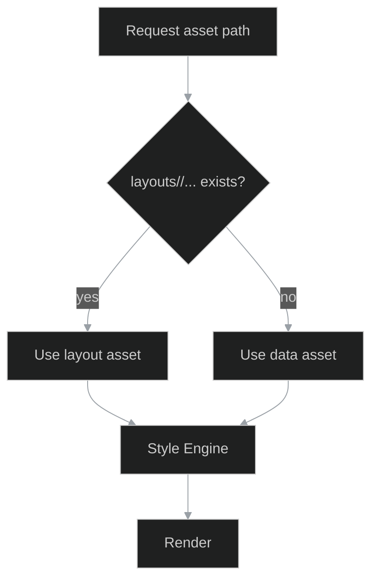
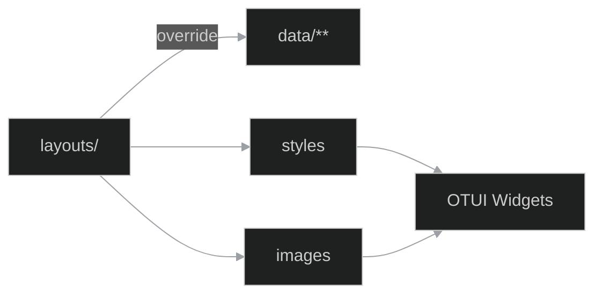

# 13_layouts — system motywów i nadpisań zasobów

**Cel:** Jednoznaczny kontrakt na to, **co i jak** layout może nadpisać względem `data/**`. Gotowe CSV do BI/RAG, przykłady, sanity-checki i IPC do Studio.

```{contents}
:local:
:depth: 2
````

---

## 1) Zasada działania (skrót)

* Layout to *pierwsza warstwa* nad `data/`. Jeśli plik istnieje w `layouts/<active>/…`, **wygrywa**.
* Brak zmian w siatce sprite → brak zmian w `image-clip` (kontrakt). Jeśli siatka inna → zaktualizuj `styles`.

**Funkcja rozwiązywania:**

```python
def resolve(path, layout):
    layout_path = f"layouts/{layout}/{path.lstrip('/')}"
    return layout_path if exists(layout_path) else f"data/{path.lstrip('/')}"
```

---

## 2) Struktura katalogu layoutu (spec)

```{list-table}
:header-rows: 1
* - ścieżka
  - typ
  - przeznaczenie
* - layouts/<active>/images
  - grafika
  - sprite-sheety, ikony, kursory
* - layouts/<active>/styles
  - otui
  - style i skórki widgetów
* - layouts/<active>/sounds
  - audio
  - kliknięcia, dźwięki UI
* - layouts/<active>/shaders
  - glsl
  - nadpisania shaderów post-process
```

---

## 3) Kontrakty datasetów (GROUND TRUTH)

### `layout_overrides.csv`  *(facet: {ref}`facet-13_layouts.overrides`)*

**Kolumny:** `layout,path,type,resolved_from,original_path,dims_old,dims_new,clips_changed,note`

* `layout` – identyfikator aktywnego motywu, np. `retro`.
* `path` – ścieżka absolutna w repo (np. `layouts/retro/images/ui/tabbutton_square.png`).
* `type` – `image|style|sound|shader|cursor`.
* `resolved_from` – `layouts|data` (źródło wyniku `resolve`).
* `original_path` – oryginał w `data/**` (jeśli istnieje).
* `dims_old|dims_new` – `WxH` dla obrazów (puste dla niemedialnych).
* `clips_changed` – `true|false|partial` (czy trzeba było zmienić `image-clip`).
* `note` – dowolny komentarz.

**Przykład (fragment):**

```csv
layout,path,type,resolved_from,original_path,dims_old,dims_new,clips_changed,note
retro,layouts/retro/images/ui/tabbutton_square.png,image,layouts,data/images/ui/tabbutton_square.png,98x54,98x54,false,Kolorystyka zmieniona; siatka 3x1 bez zmian
retro,layouts/retro/styles/tabbar.otui,style,layouts,data/styles/tabbar.otui,,,,Dodano $hover $checked tint
retro,layouts/retro/sounds/ui/click.ogg,sound,layouts,data/sounds/ui/click.ogg,,,,Głośność -2 dBFS
```

### `sprite_grid_report.csv` *(facet: {ref}`facet-13_layouts.sprite_grid_report`)*

**Kolumny:** `layout,asset,w_old,h_old,w_new,h_new,frames_old,frames_new,status,note`
`status` – `OK|WARN|FAIL`.

**Przykład:**

```csv
layout,asset,w_old,h_old,w_new,h_new,frames_old,frames_new,status,note
retro,images/ui/tabbutton_square.png,98,54,98,54,3,3,OK,Siatka identyczna
retro,images/ui/toggle.png,12,24,12,36,2,3,WARN,Dodano 3. stan (sprawdź styles)
```

### `style_states_map.csv` *(facet: {ref}`facet-13_layouts.style_states_map`)*

**Kolumny:** `layout,otui_file,selector,state,prop,value,valid`

**Przykład:**

```csv
layout,otui_file,selector,state,prop,value,valid
retro,styles/tabbar.otui,TabBarButton,,image-source,/images/ui/tabbutton_square,true
retro,styles/tabbar.otui,TabBarButton,$hover,image-clip,"0 18 98 18",true
retro,styles/tabbar.otui,TabBarButton,$checked,image-clip,"0 36 98 18",true
```

---

## 4) Sprite-sheety i klipy (kontrakt + przykład)

Mapa klipów dla 3 stanów (98×18):

```text
0 0 98 18    # normal
0 18 98 18   # hover
0 36 98 18   # checked
```

**Fragment OTUI (gotowiec):**

```otui
TabBarButton < UIButton
  size: 17 18
  image-source: /images/ui/tabbutton_square
  image-clip: 0 0 98 18
  image-border: 3
  $hover !checked: image-clip: 0 18 98 18
  $disabled: image-color: #aaaaaa
  $checked: image-clip: 0 36 98 18
```

---

## 5) IPC — Studio (Electron) **layouty**

**Kanały IPC (standard v8):**

* `studio:layouts.setActive` `{ name: string }` → ustawia aktywny layout.
* `studio:layouts.resolve` `{ path: "/images/..." }` → zwraca `resolved_path`.
* `studio:layouts.diff` `{ layout: string }` → generuje `layout_overrides.csv` + `sprite_grid_report.csv`.
* `studio:lint.layouts` → uruchamia sanity: `sprite-grid-check`, `otui-lint`, `link-lint` i zapisuje wyniki.
* `studio:render.smoke` `{ layout: string }` → smoke-test: TabBar, Skills, Inventory.
* `studio:open.layouts` `{ facet: "13_layouts.overrides" | "13_layouts.sprite_grid_report" }` → otwiera dataset w Studio.

**Preload:** `contextIsolation: true`, `nodeIntegration: false` — udostępniaj wyłącznie bezpieczne API (proxy do narzędzi).

---

## 6) Sanity & QA (automaty)

1. **layout_overrides sanity**

   * Puste kolumny niedozwolone (poza `note`).
   * Ścieżki **względne** wobec repo; brak spacji; separator `/`.

2. **sprite grid check**

   * Porównaj `dims_old` vs `dims_new`; gdy różne → `status=WARN/FAIL`.
   * Gdy `frames_new != frames_old` → wymuś aktualizację `styles` i oznacz `clips_changed`.

3. **style compile (otui-lint)**

   * Waliduj nazwy właściwości, stany `$hover/$checked/$disabled`, brak nieznanych klas.

4. **link-lint**

   * Sprawdź kotwice `{ref}`: `facet-13_layouts.overrides`, `facet-13_layouts.resolve_flow` itd.

5. **determinism check**

   * Drugi przebieg `studio:layouts.diff` nie zmienia CSV (idempotentnie).

**Wyjścia:**
`datasets/layout_overrides.csv`, `datasets/sprite_grid_report.csv`, `datasets/style_states_map.csv`

---

## 7) Diagramy (Mermaid)

(facet-13_layouts.resolve_flow)=

### Facet: `13_layouts.resolve_flow`



(facet-13_layouts.layout_to_ui)=

### Facet: `13_layouts.layout_to_ui`



---

## 8) Przykłady kompletne (kopiuj-wklej)

### A) Minimalny override obrazka + stylu

```diff
- image-source: /images/ui/tabbutton_square
+ image-source: /images/ui/tabbutton_square  # plik nadpisany w layouts/retro
```

```csv
layout,path,type,resolved_from,original_path,dims_old,dims_new,clips_changed,note
retro,layouts/retro/images/ui/tabbutton_square.png,image,layouts,data/images/ui/tabbutton_square.png,98x54,98x54,false,Zmiana koloru
retro,layouts/retro/styles/tabbar.otui,style,layouts,data/styles/tabbar.otui,,,,Dodany $hover tint
```

### B) Dodany trzeci stan w sprite (ostrzegamy)

```csv
layout,asset,w_old,h_old,w_new,h_new,frames_old,frames_new,status,note
retro,images/ui/toggle.png,12,24,12,36,2,3,WARN,Dodano 3. stan (update OTUI)
```

`styles/tabbar.otui` (fragment):

```otui
Toggle < UIButton
  width: 12
  height: 12
  image-source: /images/ui/toggle
  image-clip: 0 0 12 12
  $checked: image-clip: 0 12 12 12
  $disabled: image-clip: 0 24 12 12
```

---

## 9) Integracja z OTMOD & 11_data (crosslinks)

* `11_data.ui_asset_usage.csv` – wskazuje gdzie asset jest **użyty** (`ui_id, ui_file, widget_path, prop`).
* `12_otmod.module_ui_links.csv` – które moduły **renderują** dane OTUI.

**Praktyka:** po `studio:layouts.diff` wykonaj `studio:open.layouts` dla obu facetów, aby sprawdzić spójność.

---

## 10) IPC — przykładowe wywołania (pseudo)

```js
// aktywuj layout
ipcRenderer.invoke('studio:layouts.setActive', { name: 'retro' });

// zrób diff i sanity
await ipcRenderer.invoke('studio:layouts.diff', { layout: 'retro' });
await ipcRenderer.invoke('studio:lint.layouts');

// render smoke test
await ipcRenderer.invoke('studio:render.smoke', { layout: 'retro' });

// otwórz dataset w Studio
ipcRenderer.invoke('studio:open.layouts', { facet: '13_layouts.overrides' });
```

---

## 11) DoD — Definition of Done (klikana lista)

* [ ] `layout_overrides.csv` zawiera wpisy dla **każdej** różnicy.
* [ ] `sprite_grid_report.csv` ma statusy `OK/WARN/FAIL` bez `UNKNOWN`.
* [ ] `style_states_map.csv` pokrywa `$hover/$checked/$disabled` gdzie stosowne.
* [ ] Smoke-test (TabBar, Skills, Inventory) **przeszedł**.
* [ ] Linki facetów i diagramy działają (`link-lint`).
* [ ] Idempotencja: drugi bieg `studio:layouts.diff` → 0 zmian.

---

## 12) QA/CI — gotowiec

```yaml
jobs:
  qa_layouts:
    steps:
      - run: studio cli studio:layouts.setActive retro
      - run: studio cli studio:layouts.diff --layout retro --out datasets/
      - run: sprite-diff --base data/images --layout layouts/retro/images --report datasets/sprite_grid_report.csv
      - run: otui-lint layouts/retro/styles/*.otui --report datasets/style_states_map.csv
      - run: link-lint docs/13_layouts/*.md
```

---

## 13) Aneks — tokeny motywu (przykład)

```text
--color-accent        = #d7b15e
--color-accent-hover  = #e0c06f
--color-bg            = #1a1a1a
--color-bg-panel      = #222222
--color-fg            = #e6e6e6
--color-muted         = #999999
--radius-small        = 2px
--radius-medium       = 4px
--radius-large        = 8px
--space-1             = 2px
--space-2             = 4px
--space-3             = 8px
--space-4             = 12px
```

---

## 14) Facets (kotwice)

(facet-13_layouts.overrides)=

### Facet: `13_layouts.overrides`

Type: dataset

(facet-13_layouts.sprite_grid_report)=

### Facet: `13_layouts.sprite_grid_report`

Type: dataset

(facet-13_layouts.style_states_map)=

### Facet: `13_layouts.style_states_map`

Type: dataset

(facet-13_layouts.resolve_flow)=

### Facet: `13_layouts.resolve_flow`

Type: diagram

(facet-13_layouts.layout_to_ui)=

### Facet: `13_layouts.layout_to_ui`

Type: diagram
