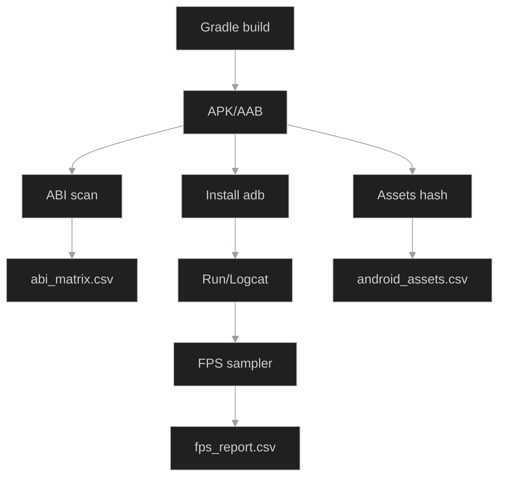
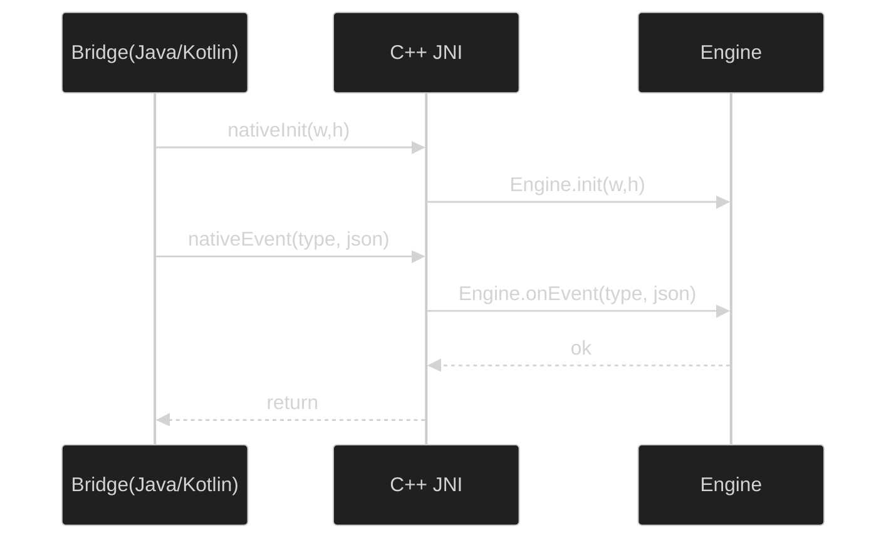

```{contents}
:local:
:depth: 2
````

# 0) Executive summary

* **Co:** build Android z warstwą **Java/JNI**, **matrycą ABI** (`armeabi-v7a`, `arm64-v8a`, `x86_64`), **wspólnymi assets** oraz stabilnym CMake/Gradle.
* **Dla kogo:** inżynierowie, QA, Studio (Electron) — sterowanie ADB i sanity przez **IPC**.
* **Output:** CSV (libs/assets/abi/jni/fps), raporty QA, diagramy Mermaid, przykłady kodu.
* **Privacy & size:** brak danych wrażliwych; kontrola rozmiaru APK/AAB i zasobów.

---

# 1) Przegląd projektu

Katalog `android/` zawiera manifest, zasoby (`res/`), warstwę Java (`src/com/otclientv8`) i bibliotekę JNI (`.so` per ABI). Zasoby (`assets/`) są **wspólne** dla wszystkich ABI.

# 2) Struktura (kontrakt)

```{list-table} Katalogi Android
:header-rows: 1
* - ścieżka
  - opis
* - android/AndroidManifest.xml
  - Ustawienia aplikacji, GL ES, uprawnienia
* - android/app/src/main/java/com/otclientv8
  - Kod Java/Kotlin (Bridge, MainActivity, Renderer)
* - android/app/src/main/cpp
  - Kod C/C++ (NDK), pliki JNI
* - android/app/src/main/jniLibs/<abi>/
  - Artefakty `.so` w debug lub prebuilt
* - android/app/src/main/assets
  - Zasoby współdzielone (data/, shaders/, configs/)
* - android/app/src/main/res
  - Layouty/ikonografia Android (nie mylić z OTUI)
```

# 3) ABI i biblioteki JNI

Obsługiwane ABI: `armeabi-v7a`, `arm64-v8a`, `x86_64`. Każdy wariant generuje `libotclientv8.so` z tym samym API.

Rekomendacje:

* **SEMVER API:** `JNI_API=1` w `target_compile_definitions`.
* **Smoke-test** ładowania każdej `.so` na emulatorze/urządzeniu.
* **Weryfikacja symboli:** `readelf -Ws`, `llvm-nm` — brak konfliktów i nieużywanych exportów.

```{csv-table} android_libs
:header-rows: 1
:file: ../datasets/android_libs.csv
:widths: auto
```

(facet-14_android.libs)=

### Facet: `14_android.libs`

# 4) Assets: pakowanie i spójność

* Struktura jak desktop (`data/`, `shaders/`, `configs/`), by łatwo diffować.
* **Rozmiary:** unikaj > 5 MB/plik; PNG/JPG/WebP z kontrolą jakości.
* **Hashing w CI:** spójność między branchami bez commitu do repo.

```{csv-table} android_assets
:header-rows: 1
:file: ../datasets/android_assets.csv
:widths: auto
```

(facet-14_android.assets)=

### Facet: `14_android.assets`

# 5) JNI: kontrakt i zdarzenia (przykłady)

Java/Kotlin (Bridge):

```java
package com.otclientv8;
public final class Bridge {
  static { System.loadLibrary("otclientv8"); }
  public static native void nativeInit(int width, int height);
  public static native void nativeEvent(int type, String payloadJson);
}
```

C++ (bridge):

```cpp
#include <jni.h>
#include "Engine.hpp"
extern "C" JNIEXPORT void JNICALL
Java_com_otclientv8_Bridge_nativeInit(JNIEnv* env, jclass, jint w, jint h) {
  Engine::instance().init((int)w, (int)h);
}
extern "C" JNIEXPORT void JNICALL
Java_com_otclientv8_Bridge_nativeEvent(JNIEnv* env, jclass, jint type, jstring payload){
  const char* s = env->GetStringUTFChars(payload, nullptr);
  Engine::instance().onEvent((int)type, s ? s : "{}");
  env->ReleaseStringUTFChars(payload, s);
}
```

Mapowanie zdarzeń (JSON payload):

```{list-table} Event map
:header-rows: 1
* - typ
  - payload (JSON)
  - opis
* - 1
  - {"x":128,"y":64,"action":"down"}
  - Dotyk/mysz — wciśnięcie
* - 2
  - {"x":130,"y":64,"action":"move"}
  - Ruch
* - 3
  - {"action":"key","code":13}
  - Klawiatura — Enter
* - 100
  - {"resize":"1080x2400"}
  - Zmiana powierzchni
* - 200
  - {"tick":1}
  - Pętla renderu (heartbeat)
```

```{csv-table} jni_signatures
:header-rows: 1
:file: ../datasets/jni_signatures.csv
:widths: auto
```

(facet-14_android.jni_signatures)=

### Facet: `14_android.jni_signatures`

# 6) CMake / Gradle (integracja, przykłady)

CMake:

```cmake
add_library(otclientv8 SHARED
  src/main/cpp/main.cpp
  src/main/cpp/bridge_jni.cpp)

find_library(log-lib log)
target_link_libraries(otclientv8 PRIVATE ${log-lib})
target_compile_definitions(otclientv8 PRIVATE JNI_API=1)
target_compile_options(otclientv8 PRIVATE -fvisibility=hidden -fno-exceptions -fno-rtti)
```

Gradle (splity ABI + AAB):

```gradle
android {
  defaultConfig {
    ndk { abiFilters "armeabi-v7a","arm64-v8a","x86_64" }
    externalNativeBuild.cmake {
      cppFlags "-std=c++17 -fvisibility=hidden -fno-exceptions -fno-rtti"
      arguments "-DANDROID_STL=c++_shared","-DJNI_API=1"
    }
  }
  bundle { abi { enableSplit = true } }
  packagingOptions { jniLibs.keepDebugSymbols += ["**/*.so"] }
}
```

# 7) GL konfiguracja i wydajność

* Manifest: `android:glEsVersion="0x00020000"` (GLES2) lub wyżej.
* Bufor i swap: dobierz strategię do urządzenia (preserve vs clear).
* `largeHeap` tylko gdy uzasadnione.

# 8) ABI-matrix i FPS (datasety)

```{csv-table} abi_matrix
:header-rows: 1
:file: ../datasets/abi_matrix.csv
:widths: auto
```

(facet-14_android.abi_matrix)=

### Facet: `14_android.abi_matrix`

```{csv-table} fps_report
:header-rows: 1
:file: ../datasets/fps_report.csv
:widths: auto
```

(facet-14_android.fps_report)=

### Facet: `14_android.fps_report`

# 9) IPC (Studio ↔ Android/ADB/JNI)

Kanały IPC (używane przez Studio/Electron):

* `studio:android.build` → buduje APK/AAB (Gradle), zwraca ścieżki artefaktów.
* `studio:android.install` `{device, variant}` → instaluje na `adb`.
* `studio:android.run` `{activity, extras}` → startuje `am start` i loguje `logcat`.
* `studio:android.abi-matrix` → skanuje APK pod kątem `.so`, weryfikuje load na emulatorach; wypełnia `abi_matrix.csv`.
* `studio:android.assets.hash` → liczy SHA256 assets i uzupełnia `android_assets.csv`.
* `studio:android.jni.check` → parsuje `javap` + `nm` i wypełnia `jni_signatures.csv`.
* `studio:android.fps.sample` `{scene, duration_s}` → pobiera próbkę FPS i dopisuje do `fps_report.csv`.

**Uwaga:** IPC zapisuje wyniki pod `docs/14_android/datasets/*.csv` poprzez wspólne API `docio.lua`.

# 10) Sanity (automaty)

**android_libs.csv** — `so_name` niepuste, `size_bytes>0`, `sha256=[0-9a-f]{64}`, `abi∈{armeabi-v7a,arm64-v8a,x86_64}`.
**android_assets.csv** — `path` względny do `assets/`, `bytes>0`, `bundle∈{data,shaders,configs,other}`.
**abi_matrix.csv** — `present_in_apk∈{true,false}`, `load_ok∈{true,false}`, `java_calls>=0`, `jni_exports>=0`.
**jni_signatures.csv** — `status∈{ok,missing_java,missing_cpp,sig_mismatch}`.
**fps_report.csv** — `avg_fps>0`, `p99_frametime_ms>0` (ms), scena z listy (`login,map,skills,inventory`).

# 11) QA (Android)

* **abi-matrix** — `.so` wykryte i załadowane; SHA spójne.
* **asset-hash** — porównanie `assets/` z datasetami.
* **jni-signature** — zgodność sygnatur Java↔C++.
* **fps** — minimalny FPS na scenie testowej (np. `>= 55` na „map” dla urządzeń referencyjnych).

# 12) Diagramy

## Pipeline (build/test)



(facet-14_android.pipeline)=

### Facet: `14_android.pipeline`

## JNI flow



(facet-14_android.jni_flow)=

### Facet: `14_android.jni_flow`

# 13) Manifest i MainActivity (przykład)

Manifest (GL ES):

```xml
<uses-feature android:glEsVersion="0x00020000" android:required="true"/>
```

Minimalna `MainActivity` (GLSurfaceView):

```java
public class MainActivity extends Activity {
  private GLSurfaceView glView;
  @Override protected void onCreate(Bundle s) {
    super.onCreate(s);
    glView = new GLSurfaceView(this);
    glView.setEGLContextClientVersion(2);
    glView.setRenderer(new Renderer());
    setContentView(glView);
  }
  @Override protected void onPause(){ super.onPause(); glView.onPause(); }
  @Override protected void onResume(){ super.onResume(); glView.onResume(); }
}
```

Renderer (szkic):

```java
final class Renderer implements GLSurfaceView.Renderer {
  @Override public void onSurfaceCreated(GL10 gl, EGLConfig cfg) {
    Bridge.nativeInit(0, 0);
  }
  @Override public void onSurfaceChanged(GL10 gl, int w, int h) {
    Bridge.nativeEvent(100, "{\"resize\":\""+w+"x"+h+"\"}");
  }
  @Override public void onDrawFrame(GL10 gl) {
    Bridge.nativeEvent(200, "{\"tick\":1}");
  }
}
```

# 14) CI (skróty)

```yaml
jobs:
  android_build:
    steps:
      - run: ./gradlew :app:assembleRelease :app:bundleRelease
      - run: unzip -l app/build/outputs/apk/release/app-release.apk | grep -E "lib/|assets/"
      - run: bundletool dump manifest --bundle app/build/outputs/bundle/release/app-release.aab | head -n 80
  android_sanity:
    steps:
      - run: tools/scan-abi --apk app-release.apk > docs/14_android/datasets/abi_matrix.csv
      - run: tools/hash-assets assets > docs/14_android/datasets/android_assets.csv
      - run: tools/jni-check > docs/14_android/datasets/jni_signatures.csv
```

# 15) DoD checklist (Agent clickable)

* [ ] `android_libs.csv` zawiera wpisy dla wszystkich ABI; SHA256 poprawne.
* [ ] `android_assets.csv` wygenerowany i zhashowany; brak pustych pól.
* [ ] `abi_matrix.csv`: `present_in_apk=true` i `load_ok=true` dla każdego wspieranego ABI.
* [ ] `jni_signatures.csv`: `status=ok` dla wszystkich metod mostka.
* [ ] `fps_report.csv`: próba `>= 60 s` na scenie „map”; `avg_fps` w normie.
* [ ] Diagramy `pipeline.mmd`, `jni_flow.mmd` istnieją i parsują się.
* [ ] Manifest i Gradle zgodne z kontraktem (`abiFilters`, `bundle.abi.enableSplit=true`).
* [ ] Smoke-test instalacji przez IPC: `studio:android.install` + `studio:android.run` działa.

# 16) FAQ (skrót)

**Czy można dodać asset tylko dla jednego ABI?** — Nie, assets są wspólne; ABI dotyczy `.so`.
**Jak debugować JNI?** — LLDB w Android Studio; kompiluj z symbolami (`-g`), włącz `packagingOptions.jniLibs.keepDebugSymbols`.
**Jak ograniczyć rozmiar?** — Splity ABI w AAB + kompresja assets, WebP/ETC2 gdzie sensowne.

# 17) Aneks: narzędzia, testy, publikacja (wybór)

* **Logcat filtry:** `adb logcat | grep -E "OTC|EGL|GLES|JNI"`.
* **ABI presence:**

  ```bash
  unzip -l app-release.apk | grep "lib/.*/libotclientv8.so"
```
* **Instalacja per ABI (pseudociąg):**

  ```bash
  for abi in armeabi-v7a arm64-v8a x86_64; do
    adb install --abi $abi app-release.apk || exit 1
    adb shell am start -n com.otclientv8/.MainActivity
    sleep 5; adb shell am force-stop com.otclientv8
  done
```

---

## Facets (kotwice)

(facet-14_android.libs)=

### Facet: `14_android.libs`

Type: dataset

(facet-14_android.assets)=

### Facet: `14_android.assets`

Type: dataset

(facet-14_android.abi_matrix)=

### Facet: `14_android.abi_matrix`

Type: dataset

(facet-14_android.jni_signatures)=

### Facet: `14_android.jni_signatures`

Type: dataset

(facet-14_android.fps_report)=

### Facet: `14_android.fps_report`

Type: dataset

(facet-14_android.pipeline)=

### Facet: `14_android.pipeline`

Type: diagram

(facet-14_android.jni_flow)=

### Facet: `14_android.jni_flow`

Type: diagram
