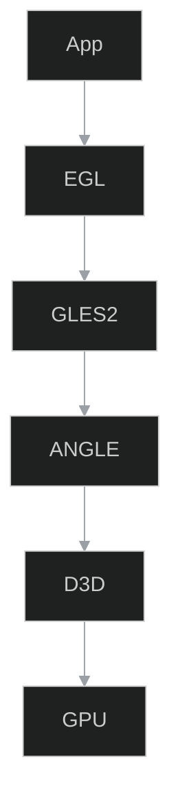
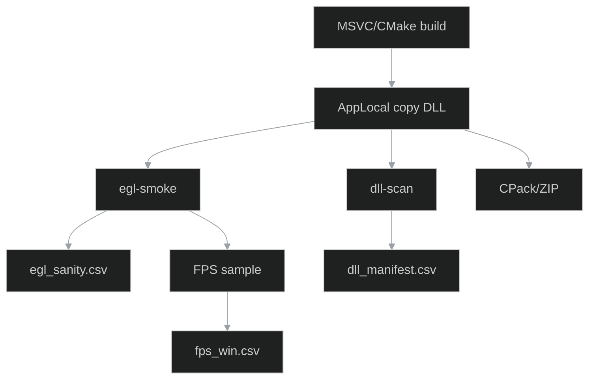

```{contents}
:local:
:depth: 2
````

# 0) Executive summary

* **Co:** Zestaw **VC16 + ANGLE** do uruchamiania **GLES2/3** na Windows (D3D backend).
* **Jak:** **AppLocal** (DLL obok `.exe`), CMake/MSVC integracja, sanity i testy dymne sterowane przez **IPC**.
* **Output:** CSV (headers/libs/dll_manifest/egl_sanity/fps_win), diagramy, przykłady kodu i skrypty.

---

# 1) Cel

`vc16/` dostarcza nagłówki i biblioteki **ANGLE** (EGL/GLES) dla toolchainu **MSVC v16**. Dystrybucja runtime w modelu **AppLocal** gwarantuje deterministyczne ładowanie.

---

# 2) Zawartość i kontrakt (datasets)

```{csv-table} Nagłówki ANGLE
:header-rows: 1
:file: ../datasets/vc16_angle_headers.csv
:widths: auto
```

```{csv-table} Biblioteki (DLL/IMPORT)
:header-rows: 1
:file: ../datasets/vc16_angle_libs.csv
:widths: auto
```

(facet-15_vc16.headers)=

### Facet: `15_vc16.headers`

(facet-15_vc16.libs)=

### Facet: `15_vc16.libs`

---

# 3) Integracja (CMake/MSVC) — przykład kompletny

```cmake
cmake_minimum_required(VERSION 3.24)
project(otclient_angle_win LANGUAGES CXX)
set(CMAKE_CXX_STANDARD 17)

# 1) EXE
add_executable(otclient WIN32 main.cpp)

# 2) Include + link (ANGLE)
target_include_directories(otclient PRIVATE ${CMAKE_SOURCE_DIR}/vc16/include)
target_link_libraries(otclient PRIVATE
  ${CMAKE_SOURCE_DIR}/vc16/lib/libEGL.dll.lib
  ${CMAKE_SOURCE_DIR}/vc16/lib/libGLESv2.dll.lib)

# 3) CRT — spójny (Debug/Release)
set_target_properties(otclient PROPERTIES
  MSVC_RUNTIME_LIBRARY "MultiThreaded$<$<CONFIG:Debug>:Debug>")

# 4) AppLocal kopiowanie DLL
add_custom_command(TARGET otclient POST_BUILD
  COMMAND ${CMAKE_COMMAND} -E copy_if_different
    ${CMAKE_SOURCE_DIR}/vc16/lib/libEGL.dll $<TARGET_FILE_DIR:otclient>
  COMMAND ${CMAKE_COMMAND} -E copy_if_different
    ${CMAKE_SOURCE_DIR}/vc16/lib/libGLESv2.dll $<TARGET_FILE_DIR:otclient>)
```

> **Uwaga:** część konfiguracji wymaga `d3dcompiler_47.dll` – gdy brak, dołącz AppLocal.

---

# 4) Test dymny EGL (C++)

```cpp
#include <EGL/egl.h>
#include <GLES2/gl2.h>
#include <cstdio>

int main(){
  EGLDisplay d = eglGetDisplay(EGL_DEFAULT_DISPLAY);
  if(d == EGL_NO_DISPLAY){ std::puts("No display"); return 1; }
  EGLint M=0,m=0;
  if(!eglInitialize(d, &M, &m)){ std::puts("eglInitialize failed"); return 1; }
  std::printf("EGL %d.%d\n", M, m);
  eglTerminate(d);
  return 0;
}
```

---

# 5) Minimalny render trójkąta (GLES2)

```cpp
static const char* VS = R"(attribute vec2 aPos; void main(){ gl_Position=vec4(aPos,0.0,1.0);} )";
static const char* FS = R"(precision mediump float; void main(){ gl_FragColor=vec4(0.84,0.69,0.37,1.0);} )";
static GLuint mk(GLenum t, const char* src){
  GLuint s=glCreateShader(t); glShaderSource(s,1,&src,nullptr); glCompileShader(s); return s;
}
static GLuint prog(){
  GLuint p=glCreateProgram(); glAttachShader(p,mk(GL_VERTEX_SHADER,VS)); glAttachShader(p,mk(GL_FRAGMENT_SHADER,FS));
  glBindAttribLocation(p,0,"aPos"); glLinkProgram(p); return p;
}
```

---

# 6) Render stack (diagram)



(facet-15_vc16.render_stack)=

### Facet: `15_vc16.render_stack`

---

# 7) Pipeline (build → sanity → pakowanie)



(facet-15_vc16.pipeline)=

### Facet: `15_vc16.pipeline`

---

# 8) IPC (Studio ↔ Windows)

Kanały IPC (wywoływane ze **Studio/Electron**):

* `studio:win.angle.scan` `{bin}` → skanuje obecność DLL, wypełnia `dll_manifest.csv`.
* `studio:win.angle.egl_smoke` `{bin}` → uruchamia test dymny, dopisuje `egl_sanity.csv`.
* `studio:win.angle.fps_sample` `{bin,scene,duration_s,vsync}` → odpala scenę testową, dopisuje `fps_win.csv`.
* `studio:win.angle.pack` `{bin,out}` → pakuje AppLocal ZIP (z `checksums.txt`).

**Konwencja zapisu:** wszystkie IPC korzystają z `docio` i zapisują do `docs/15_vc16/datasets/*.csv`.

---

# 9) Sanity (automaty) — kontrakty kolumn

**vc16_angle_headers.csv**

* `file` niepuste; `size_bytes>0`; `sha256=[0-9a-f]{64}`; `rel_path` zaczyna się od `vc16/include/`.

**vc16_angle_libs.csv**

* `name∈{libEGL.dll,libGLESv2.dll,*.lib}`; `kind∈{dll,import}`; `arch∈{x86,x64}`; `size_bytes>0`.

**dll_manifest.csv**

* `present∈{true,false}`; gdy `present=true` → `size_bytes>0` i `sha256` wypełnione.

**egl_sanity.csv**

* `ok∈{true,false}`; gdy `ok=true` → `egl_version>=1.4`, `gles_version` np. `OpenGL ES 2.0`.

**fps_win.csv**

* `avg_fps>0`, `p99_ms>0`; `scene∈{login,map,skills,inventory}`; `vsync∈{on,off}`.

---

# 10) QA (Windows)

* **dll-present** — `libEGL.dll` i `libGLESv2.dll` w folderze binarnym.
* **egl-init** — init OK, `EGL >= 1.4`; wypisz renderer/vendor.
* **surface** — utworzenie powierzchni i `eglSwapBuffers()` bez błędów.
* **fps** — stabilny FPS dla sceny „map” (np. `>= 60` z VSYNC on na GPU referencyjnym).

---

# 11) Skrypty pomocnicze (PowerShell/BAT)

**Sprawdzenie DLL (PowerShell):**

```powershell
param([string]$Bin = ".\bin\Release")
$req = @('libEGL.dll','libGLESv2.dll')
$rows = @()
foreach($n in $req){
  $p = Join-Path $Bin $n
  $present = Test-Path $p
  $size = $present ? (Get-Item $p).Length : 0
  $sha  = $present ? (Get-FileHash $p -Algorithm SHA256).Hash.ToLower() : ""
  $rows += "$Bin,$n,$present,$size,$sha,AppLocal,"
}
$rows | Set-Content -Encoding ASCII "docs/15_vc16/datasets/dll_manifest.csv"
```

**Batch — szybki check:**

```bat
@echo off
set BIN=%~1
if "%BIN%"=="" set BIN=.\bin\Release
if not exist "%BIN%\libEGL.dll" echo MISSING libEGL.dll & exit /b 1
if not exist "%BIN%\libGLESv2.dll" echo MISSING libGLESv2.dll & exit /b 1
echo OK
```

---

# 12) CMake: CRT i CPack (ZIP)

```cmake
set(CMAKE_CXX_STANDARD 17)
set_target_properties(otclient PROPERTIES
  MSVC_RUNTIME_LIBRARY "MultiThreaded$<$<CONFIG:Debug>:Debug>"
  RUNTIME_OUTPUT_DIRECTORY ${CMAKE_BINARY_DIR}/bin)

include(CPack)
set(CPACK_GENERATOR ZIP)
set(CPACK_PACKAGE_FILE_NAME "otclient-angle-win")
install(TARGETS otclient RUNTIME DESTINATION .)
install(FILES
  ${CMAKE_SOURCE_DIR}/vc16/lib/libEGL.dll
  ${CMAKE_SOURCE_DIR}/vc16/lib/libGLESv2.dll
  DESTINATION .)
```

---

# 13) Inicjalizacja EGL — szkic Win32

```cpp
HWND hwnd = CreateWindowA("STATIC","OTC",WS_OVERLAPPEDWINDOW,100,100,640,480,0,0,GetModuleHandle(0),0);
HDC  hdc  = GetDC(hwnd);
EGLDisplay d = eglGetDisplay(EGL_DEFAULT_DISPLAY);
eglInitialize(d, 0, 0);
EGLint attrs[] = {
  EGL_RED_SIZE,8, EGL_GREEN_SIZE,8, EGL_BLUE_SIZE,8,
  EGL_DEPTH_SIZE,16, EGL_STENCIL_SIZE,8,
  EGL_RENDERABLE_TYPE, EGL_OPENGL_ES2_BIT, EGL_NONE
};
EGLConfig cfg; EGLint n;
eglChooseConfig(d, attrs, &cfg, 1, &n);
EGLSurface s = eglCreateWindowSurface(d, cfg, (EGLNativeWindowType)hwnd, 0);
EGLint ctxAttrs[] = { EGL_CONTEXT_CLIENT_VERSION, 2, EGL_NONE };
EGLContext ctx = eglCreateContext(d, cfg, EGL_NO_CONTEXT, ctxAttrs);
eglMakeCurrent(d, s, s, ctx);
```

---

# 14) Diagnostyka — typowe komunikaty

* `EGL_BAD_MATCH` — zła konfiguracja formatu.
* `GL_INVALID_ENUM` po `glTexImage2D` — niedostępny format.
* `missing d3dcompiler_47.dll` — dołącz AppLocal DLL.

---

# 15) DoD checklist (Agent-clickable)

* [ ] `vc16_angle_headers.csv` i `vc16_angle_libs.csv` uzupełnione, SHA256 zgodne.
* [ ] `dll_manifest.csv` → `present=true` dla `libEGL.dll` i `libGLESv2.dll`.
* [ ] `egl_sanity.csv` → `ok=true`, wersje EGL/GLES wypisane.
* [ ] `fps_win.csv` → sample ≥ 60 s na scenie „map”, VSYNC on.
* [ ] Diagramy `render_stack.mmd`, `pipeline.mmd` parsują się.
* [ ] Artefakt ZIP z `checksums.txt` i licencją ANGLE (BSD-3-Clause).

---

# 16) FAQ

**PATH vs AppLocal?** — Trzymaj się **AppLocal**; nie zależ od PATH.
**GLES3?** — Zależnie od ANGLE/sterownika. Sprawdź `glGetString(GL_VERSION)`.
**PDB?** — W QA trzymaj; w release opcjonalnie poza ZIP.

---

# 17) Słownik

* **AppLocal** — DLL obok `.exe`.
* **ANGLE** — warstwa GLES→D3D.
* **EGL** — konteksty/surfaces.
* **CRT** — MSVC runtime, musi pasować do buildu.

---

# 18) Załącznik: helper do shaderów

```cpp
static GLuint compile(GLenum t, const char* src){
  GLuint s=glCreateShader(t);
  glShaderSource(s,1,&src,nullptr);
  glCompileShader(s);
  GLint ok=0; glGetShaderiv(s, GL_COMPILE_STATUS,&ok);
  if(!ok){ char log[2048]; GLsizei n=0; glGetShaderInfoLog(s,2048,&n,log); OutputDebugStringA(log); }
  return s;
}
static GLuint link(GLuint vs, GLuint fs){
  GLuint p=glCreateProgram(); glAttachShader(p,vs); glAttachShader(p,fs); glLinkProgram(p);
  GLint ok=0; glGetProgramiv(p, GL_LINK_STATUS,&ok);
  if(!ok){ char log[2048]; GLsizei n=0; glGetProgramInfoLog(p,2048,&n,log); OutputDebugStringA(log); }
  return p;
}
```

---

# 19) Manifest sum kontrolnych (wzorzec)

```text
SHA256  libEGL.dll     = <hash>
SHA256  libGLESv2.dll  = <hash>
SHA256  otclient.exe   = <hash>
```

> Przechowuj w `checksums.txt` w artefakcie ZIP.
