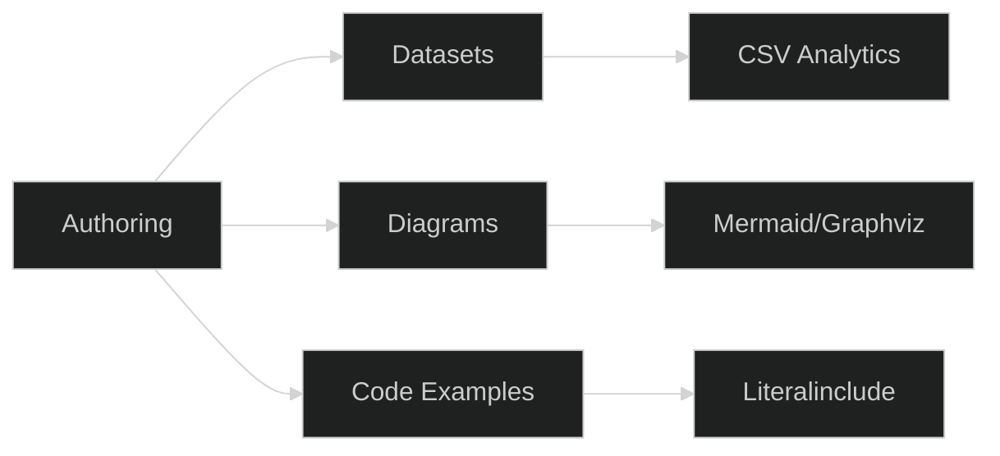

## Authoring (Chapters)

```{toctree}
:hidden:
:maxdepth: 2
01_core/index
01_runtime/index
02_events/index
03_modules/index
04_ui/index
05_events/index
05_network/index
06_assets/index
07_settings_crypto/index
08_audio/index
09_logging/index
10_game_runtime/index
11_data/index
12_otmod/index
13_layouts/index
14_android/index
15_vc16/index
analytics/index
qa/index
```

:::{grid} 1 1 2 3
:gutter: 2

:::{grid-item-card} 01 — Core
:link: 01_core/index
Podstawy klienta, framework, C++ i API.
:::

:::{grid-item-card} 02 — Events
:link: 02_events/index
System zdarzeń, strumienie, emitery.
:::

:::{grid-item-card} 03 — Modules
:link: 03_modules/index
Moduły Lua, eksporty i API.
:::

:::{grid-item-card} 04 — UI (OTUI)
:link: 04_ui/index
Widżety, layouty, presety i style.
:::

:::{grid-item-card} 05 — Network
:link: 05_network/index
Protokoły, pakiety i komunikacja.
:::

:::{grid-item-card} 11 — Data
:link: 11_data/index
Assets, images, fonts, sounds, shaders.
:::

:::{grid-item-card} 12 — OTMOD
:link: 12_otmod/index
Moduły, pakiety, zależności.
:::

:::{grid-item-card} 13 — Layouts
:link: 13_layouts/index
Layouty, overrides, sprite grids.
:::

:::{grid-item-card} 14 — Android
:link: 14_android/index
Build Android, JNI, ABI, manifesty.
:::
:::

```{tab} Guide

**Struktura Authoring:** każdy rozdział zawiera:
- `datasets/` — dane strukturalne (CSV) do walidacji i analiz
- `diagrams/` — wizualizacje (Mermaid/Graphviz) w dark mode
- `examples/` — fragmenty kodu z regions dla literalinclude

**Checklisty:**
- [ ] Każdy rozdział ma min. 1 diagram Mermaid i 1 Graphviz
- [ ] CSV tables renderują nagłówki poprawnie
- [ ] Literalinclude używa regionów (nie linii)
- [ ] Dark mode aktywny dla wszystkich diagramów
```

```{tab} Reference

**Indeksy rozdziałów** (patrz TOC). Każdy rozdział dokumentuje:
- Typy/klasy (Core/UI)
- Funkcje/API (Modules/Network)
- Assets/zasoby (Data/Layouts)
- Platformy (Android/VC16)

**Facety:** oznaczenia dla cross-references między rozdziałami.

**Datasets:** strukturalne CSV dla narzędzi analitycznych.
```

```{tab} Examples

**CSV Table — UI Signals**
```{csv-table} Signals (sample)
:header-rows: 1
:file: 04_ui/datasets/signals.csv
:widths: 20, 20, 30, 30
```

**Mermaid Diagram — Flow:**



**Graphviz Diagram — Structure:**

```{graphviz}
:align: center

digraph G {
  rankdir=LR;
  bgcolor="transparent";
  node [style=filled, fillcolor="#1e1e1e", fontcolor="#ddd"];
  edge [color="#9aa0a6"];

  Authoring -> Datasets;
  Authoring -> Diagrams;
  Authoring -> Examples;
  Datasets -> Analytics;
  Diagrams -> "Dark Mode";
  Examples -> Literalinclude;
}
```

**Literalinclude — C++ Example:**

```{literalinclude} ../../src/framework/xml/tinyxml.cpp
:language: cpp
:start-after: // region file_open_example
:end-before: // endregion file_open_example
```

**Literalinclude — Lua Example:**

```{literalinclude} ../../modules/corelib/globals.lua
:language: lua
:start-after: -- region schedule_event_example
:end-before: -- endregion schedule_event_example
```

:::{card}
**Quality gates**
{badge}`lint OK,success` {badge}`examples ✓,info` {badge}`dark-mode ✓,success`
:::

```{dropdown} Quick tasks (Authoring)
- [ ] `csv-table` renderuje nagłówki z datasets/
- [ ] Mermaid/Graphviz w dark‑mode OK
- [ ] „See also" prowadzi do UI/Events/Data
- [ ] Literalinclude używa regionów
- [ ] Brak ostrzeżeń OTUI (fallback: none/ini)
```

:::{grid} 1 1 2 3
:class-row: gap-2

**See also:** {ref}`04_ui/index` · {ref}`02_events/index` · {ref}`11_data/index` · {ref}`copilot/sphinx/index`
:::
