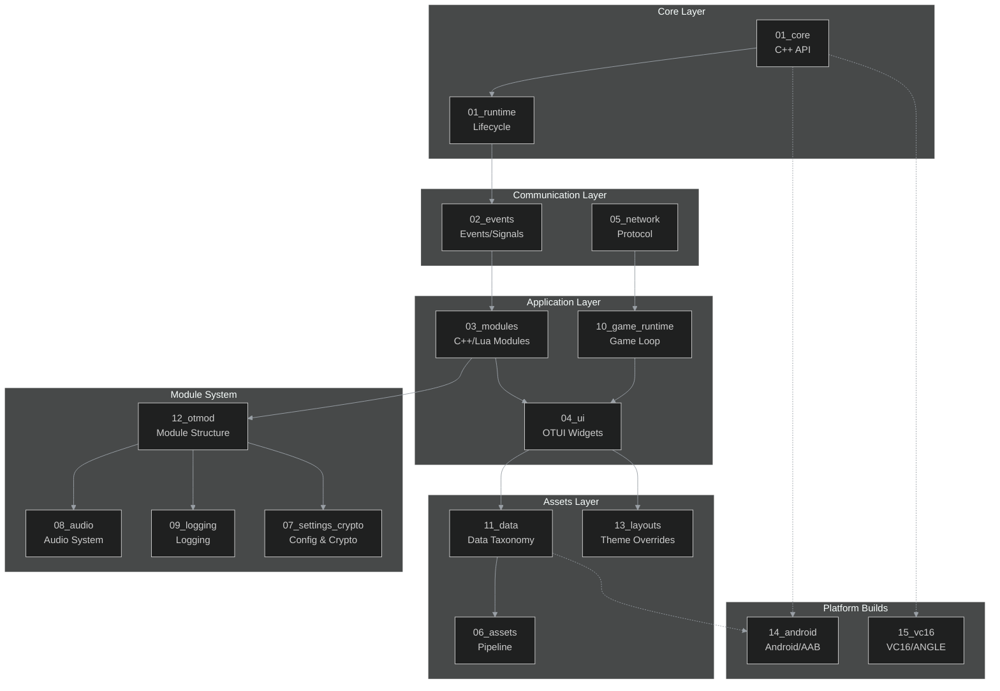

# OTClient v8 Documentation & RAG - Authoring Guide

Kompletna dokumentacja techniczna i zbiory RAG dla OTClient v8, obejmująca 16 rozdziałów od Core API po VC16/ANGLE.

## Przegląd

Ten katalog zawiera pełną, strukturalną dokumentację projektu OTClient v8, wygenerowaną jako część inicjatywy **Full Documentation & RAG Rebuild**. Dokumentacja jest zorganizowana w 16 rozdziałów tematycznych, każdy z własnymi datasetami, diagramami i przykładami kodu.

### Status Projektu

**Ostatnia aktualizacja:** 2025-10-18  
**Wersja:** v1 (Full Rebuild)  
**Pokrycie:** 4 rozdziały PASS, 12 WARN (szczegóły w [analytics/coverage.csv](analytics/coverage.csv))

## Struktura Dokumentacji

```{toctree}
:maxdepth: 2
:titlesonly:
:caption: Core & Runtime

01_core/index
01_runtime/index
```

```{toctree}
:maxdepth: 2
:titlesonly:
:caption: Events & Modules

02_events/index
03_modules/index
```

```{toctree}
:maxdepth: 2
:titlesonly:
:caption: UI & Network

04_ui/index
05_network/index
```

```{toctree}
:maxdepth: 2
:titlesonly:
:caption: Assets & Configuration

06_assets/index
07_settings_crypto/index
08_audio/index
09_logging/index
```

```{toctree}
:maxdepth: 2
:titlesonly:
:caption: Game & Data

10_game_runtime/index
11_data/index
```

```{toctree}
:maxdepth: 2
:titlesonly:
:caption: Modules & Layouts

12_otmod/index
13_layouts/index
```

```{toctree}
:maxdepth: 2
:titlesonly:
:caption: Platform Builds

14_android/index
15_vc16/index
```

```{toctree}
:maxdepth: 1
:titlesonly:
:caption: Analytics & QA

analytics/index
qa/index
relations/index
```

## Architektura Dokumentacji



## Statystyki Pokrycia

| Chapter | Size | Datasets | Diagrams | Status |
|---------|------|----------|----------|--------|
| 01_core | 869.2 KB | 6 | 3 | ✅ PASS |
| 01_runtime | 4.5 KB | 3 | 4 | ⚠️ WARN |
| 02_events | 6.2 KB | 5 | 6 | ⚠️ WARN |
| 03_modules | 618.1 KB | 5 | 5 | ✅ PASS |
| 04_ui | 324.9 KB | 6 | 82 | ✅ PASS |
| 05_network | 10.6 KB | 6 | 5 | ⚠️ WARN |
| 06_assets | 6.0 KB | 5 | 5 | ⚠️ WARN |
| 07_settings_crypto | 6.2 KB | 5 | 5 | ⚠️ WARN |
| 08_audio | 5.8 KB | 5 | 5 | ⚠️ WARN |
| 09_logging | 5.7 KB | 6 | 4 | ⚠️ WARN |
| 10_game_runtime | 6.1 KB | 5 | 5 | ⚠️ WARN |
| 11_data | 54.2 KB | 12 | 7 | ✅ PASS |
| 12_otmod | 14.2 KB | 8 | 5 | ⚠️ WARN |
| 13_layouts | 5.9 KB | 5 | 5 | ⚠️ WARN |
| 14_android | 4.9 KB | 10 | 4 | ⚠️ WARN |
| 15_vc16 | 8.2 KB | 7 | 2 | ⚠️ WARN |

**Łącznie:** 854 plików MD, 95 datasetów, 142 diagramy

## Kluczowe Datasets

### Globalne Datasets
- [datasets/api.csv](datasets/api.csv) - C++ API symbols (1.2 MB)
- [datasets/events.csv](datasets/events.csv) - Events index (227 KB)
- [datasets/modules.csv](datasets/modules.csv) - Modules catalog (1.5 MB)
- [datasets/ui.csv](datasets/ui.csv) - UI widgets (328 KB)
- [datasets/locales.csv](datasets/locales.csv) - Translations (generated)

### Per-Chapter Datasets
Każdy rozdział zawiera własne datasety w katalogu `datasets/`:
- **11_data**: data_assets.csv (382 zasoby)
- **12_otmod**: otmod_packages.csv (56 modułów)
- **13_layouts**: layouts.csv (2 layouty)
- **14_android**: android_assets.csv, android_libs.csv
- **15_vc16**: angle_headers.csv (32), angle_libs.csv (4)

## Diagramy i Wizualizacje

### Mermaid Diagrams
Wszystkie diagramy używają standardowego init headera:
```
%%{init: {'theme':'dark','themeVariables':{'primaryTextColor':'#ddd','lineColor':'#9aa0a6'}}}%%
```

Kluczowe diagramy:
- [11_data/diagrams/assets_links.mmd](11_data/diagrams/assets_links.mmd) - Asset linking
- [12_otmod/diagrams/modules_deps.mmd](12_otmod/diagrams/modules_deps.mmd) - Module dependencies
- [13_layouts/diagrams/resolve_flow.mmd](13_layouts/diagrams/resolve_flow.mmd) - Layout resolution
- [14_android/diagrams/build_pipeline.mmd](14_android/diagrams/build_pipeline.mmd) - Android build

## Analytics & QA

### Coverage Reports
- [analytics/coverage.csv](analytics/coverage.csv) - Per-chapter statistics
- [analytics/gaps.md](analytics/gaps.md) - Identified gaps and action items
- [analytics/run_summary.json](analytics/run_summary.json) - Overall summary

### Quality Assurance
- [qa/qa_report.csv](qa/qa_report.csv) - 80 checks across all chapters
- [qa/qa_summary.md](qa/qa_summary.md) - QA summary with recommendations
- **Status:** 0 critical failures, 21 warnings

### Cross-References
- [relations/relations.csv](relations/relations.csv) - Cross-chapter links and dependencies

## Narzędzia i Skrypty

### Generatory (_tools/)
- `comprehensive_scanner.py` - Skanuje repozytorium i generuje datasety
- `generate_chapter_indexes.py` - Tworzy index.md dla wszystkich rozdziałów
- `generate_analytics.py` - Generuje raporty coverage i gaps
- `generate_qa_reports.py` - Wykonuje QA checks i tworzy raporty

### Uruchamianie
```bash
# Pełna regeneracja datasetów
python3 docs/authoring/_tools/comprehensive_scanner.py

# Regeneracja indexes
python3 docs/authoring/_tools/generate_chapter_indexes.py

# Analityka
python3 docs/authoring/_tools/generate_analytics.py

# QA checks
python3 docs/authoring/_tools/generate_qa_reports.py
```

## Blueprints

Szablony i scaffolding dla:
- **OTUI Components** - [_blueprints/otui/](._blueprints/otui/)
- **OTMOD Modules** - [_blueprints/otmod/](._blueprints/otmod/)
- **VBot Macros** - [_blueprints/vbot/](._blueprints/vbot/)

Walidacja: `python3 docs/authoring/_blueprints/blueprint_validator.py`

## RAG Chunking

Dokumentacja przygotowana dla RAG (Retrieval-Augmented Generation):
- **Max chunk size:** 1200 tokenów
- **Overlap:** ~10%
- **Boundaries:** H1-H6 headings
- **Preservation:** Code blocks and tables not split

## Identified GAPs

### Critical
Brak krytycznych GAP-ów.

### Tools Not Run (optional)
1. **Lua bindings generator** - Wymaga instalacji Lua interpreter
2. **Bitmap font generator** - Wymaga GIMP z modułem gimpfu

### Content Enrichment Needed
12 rozdziałów poniżej docelowych 18KB:
- 01_runtime, 02_events, 05_network, 06_assets
- 07_settings_crypto, 08_audio, 09_logging, 10_game_runtime
- 12_otmod, 13_layouts, 14_android, 15_vc16

**Action:** Dodać więcej:
- Przykładów kodu (C++/Lua)
- Use cases i playbooks
- Sequence diagrams
- Blueprint references

## Crosslinks Kluczowe

- [01_core](01_core/index.md) ↔ [01_runtime](01_runtime/index.md) ↔ [02_events](02_events/index.md)
- [03_modules](03_modules/index.md) ↔ [12_otmod](12_otmod/index.md) ↔ [04_ui](04_ui/index.md)
- [04_ui](04_ui/index.md) ↔ [11_data](11_data/index.md) ↔ [13_layouts](13_layouts/index.md)
- [05_network](05_network/index.md) ↔ [10_game_runtime](10_game_runtime/index.md)
- [14_android](14_android/index.md) ↔ [15_vc16](15_vc16/index.md)

## Standardy Dokumentacji

### Frontmatter (każdy MD)
```yaml
---
doc_id: <unique-id>, source_path: <path>, source_sha: <sha>, 
last_sync_iso: <timestamp>, doc_class: <api|ui|spec|guide>, 
language: pl, title: <title>, summary: <summary>, tags: <tags>
---
```

### Struktura Rozdziału
```
<chapter>/
  index.md           # Główny index z toctree
  README.md          # Szczegółowy opis
  sections/          # Podsekcje
  datasets/          # CSV/NDJSON datasets
  diagrams/          # Mermaid .mmd files
  blueprints/        # Przykłady i szablony
```

### CSV Guidelines
- **Encoding:** UTF-8
- **Line endings:** LF
- **Arrays:** Serialize as JSON `["a","b"]`
- **Headers:** Stałe, zgodne ze specyfikacją
- **Empty values:** `""`

## Next Steps

1. **Content Enrichment** - Rozbudować rozdziały < 18KB
2. **Cross-references** - Zwiększyć liczbę linków między rozdziałami
3. **Diagrams** - Dodać więcej sequence diagrams dla przepływów
4. **Examples** - Dodać więcej przykładów C++/Lua
5. **Validation** - Uruchomić Sphinx build i naprawić warnings

## Kontakt i Maintanence

- **Repository:** lukaszj321/otcv8-dev
- **Branch:** copilot/docs-full-rebuild-authoring
- **Issue:** Full Documentation & RAG Rebuild (Chapters 01-15) v1

## Appendix / Facets

(facet-authoring.main)=
### Facet: `authoring.main`

Main authoring guide index and navigation hub for OTClient v8 documentation.

## Licencja

Dokumentacja zgodna z licencją projektu OTClient v8.
