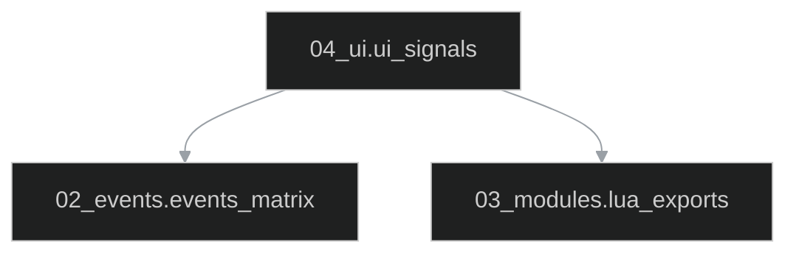

---
title: Relations — cross-chapter graph
---

# Relations — cross-chapter graph

```mermaid
%%{init: { 'theme': 'dark', 'themeVariables': { 'primaryTextColor': '#ddd', 'lineColor': '#9aa0a6' } }}%%
graph TD
  A[04_ui.ui_signals] --> B[02_events.events_matrix]
  A --> C[03_modules.lua_exports]
```
