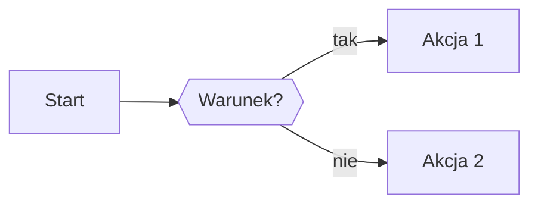

# Diagramy (Mermaid / Graphviz)

## Mermaid


```mermaid
flowchart LR
  A[Start] --> B{{Warunek?}}
  B -->|tak| C[Akcja 1]
  B -->|nie| D[Akcja 2]
```

## Graphviz

```{graphviz}
digraph G {
  graph [bgcolor=transparent]
  rankdir=LR;
  A -> B -> C;
}
```
