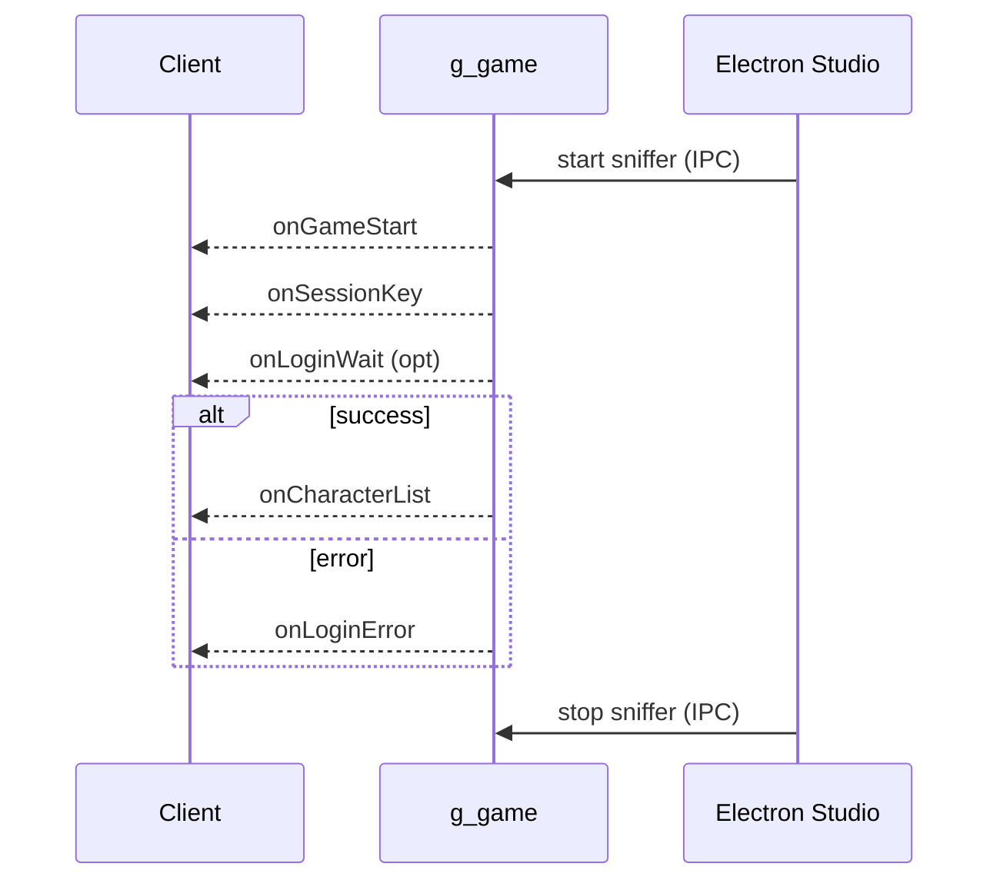
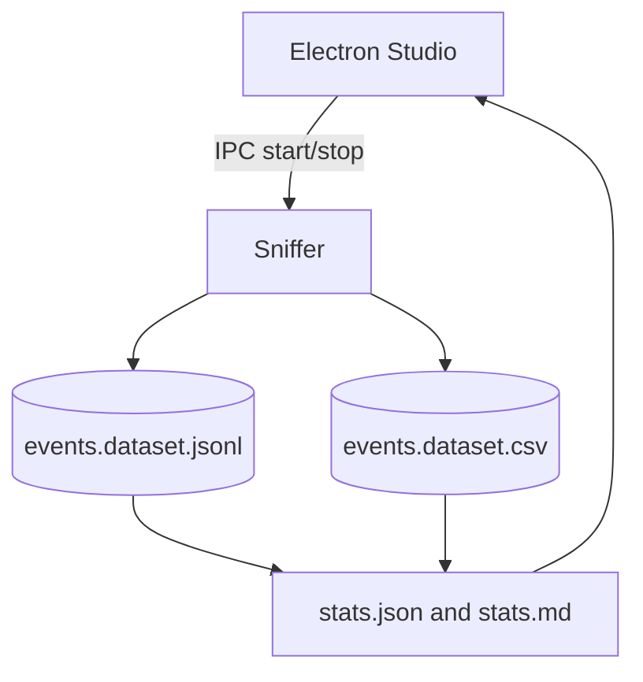

# Chapter 02 - Events

### Professional Pro Template - Agent-Ready - OTClient v8

> Cel: ten rozdzial opisuje i zbiera zdarzenia klienta (g_game i inne sygnaly), dostarcza dane w NDJSON i CSV, tlumaczy wzorce (np. sekwencja logowania), oraz daje gotowe ekstraktory i statystyki. Styl jest elastyczny i konkretny. Calosc ASCII-only, UTF-8 bez BOM.

---

### 0) Executive summary

- Co: zdarzenia startu/konca gry, logowania, listy postaci, bledow, itp.; ich parametr payload; znaczenie w diagnostyce i korelacjach (runtime, UI, logi).
- Dla kogo: inzynierowie, autorzy skryptow (vBot/OTUI), systemy AI/RAG i Studio (Electron/React).
- Output: NDJSON (pelny), CSV (splaszczony), statystyki (JSON/MD), analizy (findings, correlations), diagramy (Mermaid), narracja (sekcje merytoryczne).
- Agent-ready: mapa plikow, punkty wstrzykniec (AGENT:INSERT), IO setup, CSV header, IPC hooki Studio, checklist DoD.

---

### 1) Struktura folderu i linkowanie

```bash
docs/02_events/
  README.md                     # narracja + TOC + nawigacja (ten plik)
  meta.json                     # mapa plikow + zadania + tags (machine-readable)
  events.schema.json            # walidacja rekordow NDJSON (event)
  sections/
    00_otclient_events_basics.md # wprowadzenie do systemu zdarzen (dla nowych dev)
    01_introduction.md           # po co rejestrowac zdarzenia (kontekst)
    02_event_model.md            # slownik pol eventu + przyklady + pulapki
    03_collection_methods.md     # jak zbieramy (connect, sygnaly, sampling)
    04_quality_and_limits.md     # jakosc, ograniczenia, SLO
    05_patterns_and_sequences.md # wzorce: login sequence, session lifecycle
    06_how_to_read_stats.md      # jak czytac statystyki i korelowac
  datasets/
    events.dataset.jsonl        # NDJSON (append-only)
    events.dataset.csv          # CSV (naglowek staly)
    chunks/
      README.md                 # polityka dzielenia
      index.json                # lista chunkow do agregacji (opcjonalne)
  stats/
    stats.json                  # metryki zbiorcze (np. count per event)
    stats.md                    # raport czytelny dla ludzi
  analysis/
    findings.md                 # wnioski z danych + linki do rekordow
    correlations.md             # korelacje z runtime/UI/logami
    figures/                    # wykresy i tabele eksportowane
  extractors/
    events_sniffer.lua          # podpiecia do g_game -> NDJSON+CSV (start/stop)
    events_stats.lua            # agregacje -> stats.json + stats.md (deterministyczne)
  diagrams/
    login_sequence.mmd          # Mermaid: sekwencja logowania
    events_flow.mmd             # Mermaid: przeplyw zdarzen i Studio
```

> Note: IO setup w README ponizej. Zawsze ASCII-only, UTF-8 bez BOM, LF konce linii.

---

### 2) README - nawigacja i instrukcje (Agent-friendly)

```markdown
---
id: chapter:events
title: Events - Signals and Sequences
authors: ["docs-export"]
version: 1.0
last_updated: 2025-10-08
status: draft
tags: ["events","signals","login","otclient","agent"]
related:
  - ../01_runtime/README.md
  - ../04_ui/README.md
  - ../09_logging/README.md
outputs:
  - ./datasets/events.dataset.jsonl
  - ./datasets/events.dataset.csv
  - ./stats/stats.json
  - ./stats/stats.md
encoding: UTF-8 (no BOM)
---
Short: rozdzial rejestruje i tlumaczy zdarzenia, w tym sekwencje logowania. Dane sa pod RAG i analizy.

Table of contents
- [0. OTClient - events basics](./sections/00_otclient_events_basics.md)
- [1. Wprowadzenie](./sections/01_introduction.md)
- [2. Model eventu (slownik)](./sections/02_event_model.md)
- [3. Zbieranie (connect, sygnaly)](./sections/03_collection_methods.md)
- [4. Jakosc i ograniczenia](./sections/04_quality_and_limits.md)
- [5. Wzorce i sekwencje](./sections/05_patterns_and_sequences.md)
- [6. Jak czytac statystyki](./sections/06_how_to_read_stats.md)
- [Statystyki](./stats/stats.md) - [Datasety](./datasets/) - [Analizy](./analysis/findings.md)

Quick links
- Schema: [events.schema.json](./events.schema.json)
- NDJSON: [datasets/events.dataset.jsonl](./datasets/events.dataset.jsonl)
- CSV: [datasets/events.dataset.csv](./datasets/events.dataset.csv)
- Diagrams: [diagrams/login_sequence.mmd](./diagrams/login_sequence.mmd), [diagrams/events_flow.mmd](./diagrams/events_flow.mmd)

Crosslinks
- Runtime: ../01_runtime/README.md
- UI: ../04_ui/README.md
- Logging: ../09_logging/README.md

CSV header (events.dataset.csv)

id,ts,source,name,payload_json


Header jest staly - narzedzia BI moga cachowac schemat.

Naglowek jest staly - BI moze cachowac schemat.

IO setup

- Default: dofile('../../_shared/lua/docio.lua')
- Isolated: copy to 02_events/_local/docio.lua and use dofile('../_local/docio.lua')

Skad do _shared

| Start location | Path to _shared |
|---|---|
| docs/02_events/extractors | ../../_shared/lua/docio.lua |
| docs/02_events | ../_shared/lua/docio.lua |

Chunks aggregation

- Aggregator czyta glowny plik oraz opcjonalny indeks: docs/02_events/datasets/chunks/index.json (JSON array nazw chunkow).

Studio hooks (Electron) - skrot

- IPC: 'studio:sniffer.events.start' -> wywolaj globalna funkcje start_sniffer() (uruchamia zapis)
- IPC: 'studio:sniffer.events.stop' -> wywolaj globalna funkcje stop_sniffer() (zatrzymuje zapis, odpinanie jesli mozliwe)
- IPC: 'studio:aggregate.events' -> uruchamia events_stats.lua (agregacja deterministyczna)
- IPC: 'studio:open.events' {type: 'jsonl'|'csv'} -> otwiera dataset w Studio
- Preload: contextIsolation: true; nodeIntegration: false; eksponuj bezpieczne API
- Sandbox: wszystkie zapisy ida przez docio.lua pod docs/02_events
- View: podglad stats.md + tabela CSV; linki do rekordow po id w NDJSON
```

---

### 3) Mapa plikow i odpowiedzialnosci (reference for Agents)

| Plik / Katalog | Rola | Kto uzupelnia | Uwagi |
|---|---|---|---|
| events.schema.json | walidacja eventow | Agent/CI | waliduj linie po linii |
| datasets/*.jsonl | pelne eventy (append) | sniffer | rotacja w chunks/ |
| datasets/*.csv | widok splaszczony | sniffer | payload jako JSON string |
| stats/*.json\|md | metryki zbiorcze | aggregator | top events, counts |
| sections/*.md | narracja i wyjasnienia | Agent/Autor | AGENT:INSERT punkty |
| analysis/* | wnioski i korelacje | Agent/Analityk | linkuj id rekordow |
| extractors/*.lua | zrzut i agregacja | system | nie zmieniaj API zapisu |

---

### 4) Slownik eventu (data dictionary)

| Pole | Typ | Przyklad | Znaczenie |
|---|---|---|---|
| id | string | evt:g_game/onGameStart@2025-10-08T12:00:00Z | Unikat eventu (zrodlo/nazwa@czas). |
| type | string | event | Stala wartosc: event. |
| ts | string | 2025-10-08T12:00:00Z | Czas wystapienia (UTC). |
| source | string | g_game | Emiter sygnalu. |
| name | string | onLoginWait | Nazwa eventu. |
| payload | object | {"message":"...","time":3} | Parametry eventu (opcjonalne). |
| links[] | string[] | runtime:..., ui:... | Powiazania z innymi rozdzialami. |

> Agent tip: w sections/02_event_model.md wstaw 3-5 realnych eventow z NDJSON (rozne nazwy) i jednozdaniowy komentarz do kazdego.

---

### 5) Pipeline danych (odczyt -> zapis -> analiza)

1. Sniffer podlacza sie do sygnalow i dopisuje eventy do NDJSON + CSV.
2. Aggregator liczy metryki (licznosci per event, timeline, itp.) i zapisuje stats.*.
3. Narracja: sekcje opisowe z przykladami i odwolaniami do id eventow.
4. Analizy: findings i correlations (np. login error vs runtime spikes).
5. Publikacja: sprawdz checklist DoD i oznacz rozdzial jako ready.

---

### 6) Sekcje merytoryczne - szablony i wprowadzenie do events

sections/00_otclient_events_basics.md

```markdown
# OTClient events - podstawy dla nowych dev
Ten plik daje kontekst: co to sa sygnaly, jak dzialaja connect(...) i jak wyglada cykl zycia sesji.

Pojecia
- g_game: glowny emiter zdarzen gameplay (start, end, login, lista postaci).
- connect(g_game,{...}): atomowe podpiecie handlerow.
- sygnaly specyficzne: onGameStart, onGameEnd, onLoginWait, onLoginError, onSessionKey, onCharacterList.
- payload: dodatkowe dane eventu (np. komunikat, czas, liczba postaci).

Jak to laczy sie z innymi rozdzialami
- runtime: korelujemy czas eventow z metrykami FPS/UPS/memory.
- ui: zmiany ekranow (np. entergame) vs eventy logowania.
- logging: uzyteczne do diagnozy bledow logowania.
```

sections/01_introduction.md

```markdown
# Wprowadzenie - po co rejestrowac eventy
Eventy buduja timeline akcji klienta. Dzieki nim rozumiemy kiedy i dlaczego nastapily zmiany stanu (np. logowanie, blad). To stanowi os krzyzowej korelacji z runtime, UI i logami.

Kiedy uzywac
- diagnoza problemow logowania,
- korelacje performance vs zdarzenia,
- automatyczne testy scenariuszy (E2E) i walidacja.
```

sections/02_event_model.md

```markdown
# Model eventu - definicje i przyklady
Zobacz slownik w README. Wstaw krótkie przyklady z pliku NDJSON i krotki komentarz.

<!-- AGENT:INSERT:EVENT-EXAMPLES -->
```

sections/03_collection_methods.md

```markdown
# Zbieranie (connect, sygnaly, sampling)
- Sniffer: events_sniffer.lua z uzyciem connect(g_game,{...}).
- Dla innych modulow: analogicznie, jesli chcesz rozszerzyc (opcjonalne).
- Sampling: nie wymagany - zapis on-event. Przy duzych wolumenach uzywaj chunks/.
- Studio: start/stop sniffera przez IPC (patrz README Studio hooks).
```

sections/04_quality_and_limits.md

```markdown
# Jakosc i ograniczenia
- Nie wszystkie eventy przenosza pelny kontekst (payload bywa krotki).
- Roznice miedzy forkami moga zmieniac parametry eventow - zanotuj to w analysis/findings.md.
- Maszyny i siec: opuznienia eventow vs czas systemowy - bierz pod uwage w korelacjach.
```

sections/05_patterns_and_sequences.md

```markdown
# Wzorce i sekwencje (login)
Przyklad login flow:
1. onGameStart
2. onSessionKey
3. onLoginWait (opcjonalnie, z time)
4. onCharacterList lub onLoginError

<!-- AGENT:INSERT:SEQUENCE-> NoteS -->
```

sections/06_how_to_read_stats.md

```markdown
# Jak czytac statystyki
- Najpierw spojnosc timelinow: czy kolejnosc eventow ma sens.
- Patrz na licznosci per nazwa eventu i ewentualne piki.
- Koreluj z runtime (FPS/UPS spikes) i UI (ekrany).

<!-- AGENT:INSERT:READING-GUIDE -->
```

---

### 7) Polityka dzielenia danych - datasets/chunks/README.md

```markdown
# Chunks - polityka
- Utrzymuj glowne pliki do ok. 50 MB (MAX_BYTES = 50*1024*1024).
- Starsze dane przenos do events.dataset.<YYYYMMDD-HHMM>.jsonl oraz .csv.
- Po przeniesieniu chunkow traktuj je jako read-only.
- Opcjonalnie utrzymuj 'index.json' z lista chunkow:
  ["events.dataset.20251008-1200.jsonl", "events.dataset.20251008-1300.jsonl"]

Przyklad rekordu indeksu (tablica nazw):
[
  "events.dataset.20251008-1200.jsonl",
  "events.dataset.20251008-1300.jsonl"
]

Mini-tabela metadanych (opcjonalna, w osobnym pliku):

| chunk_name | from_ts | to_ts | count |
|--- |--- |--- |--- |
| events.dataset.20251008-1200.jsonl | 2025-10-08T12:00:00Z |2025-10-08T12:59:59Z | 1234 |
```
---

### 8) Schema - events.schema.json

```json
{
  "$schema": "http://json-schema.org/draft-07/schema#",
  "title": "event.record",
  "type": "object",
  "required": ["id","type","source","name","ts"],
  "properties": {
    "id": {"type":"string","pattern":"^evt:[^@]+@[0-9TZ:-]+$"},
    "type": {"type":"string","const":"event"},
    "source": {"type":"string"},
    "name": {"type":"string"},
    "payload": {"type":"object"},
    "ts": {"type":"string","format":"date-time"},
    "links": {"type":"array","items":{"type":"string"}}
  }
}
```

---

### 9) Extractors (Lua) - gotowe pliki

extractors/events_sniffer.lua

```lua
-- 02_events/extractors/events_sniffer.lua
-- Sniffer eventow g_game -> JSONL + CSV (append), z kontrola start/stop
-- ASCII-only; UTF-8 bez BOM; LF
local docio = dofile('../../_shared/lua/docio.lua')
local json = require('json')

local CSV_HEADER = { 'id','ts','source','name','payload_json' }
local MAX_BYTES = 50*1024*1024 -- spojnosc z polityka chunks (~50 MB)
local active = true
local conns = {} -- uchwyty do disconnect, jesli dostepne

local function nowIso()
  local t = os.date('!*t')
  return string.format('%04d-%02d-%02dT%02d:%02d:%02dZ', t.year, t.month, t.day, t.hour, t.min, t.sec)
end

local function emit(source, name, payload)
  if not active then return end
  local rec = {
    id = string.format('evt:%s/%s@%s', source, name, nowIso()),
    type = 'event',
    source = source,
    name = name,
    payload = payload or {},
    ts = nowIso(),
    links = {}
  }
  docio.appendJsonl('docs/02_events/datasets/events.dataset.jsonl', rec, MAX_BYTES)
  docio.writeCsvHeader('docs/02_events/datasets/events.dataset.csv', CSV_HEADER)
  local row = { id=rec.id, ts=rec.ts, source=rec.source, name=rec.name, payload_json=json.encode(rec.payload) }
  docio.appendCsvRow('docs/02_events/datasets/events.dataset.csv', CSV_HEADER, row, MAX_BYTES)
end

local function connectSignals()
  if type(connect) == 'function' then
    connect(g_game, {
      onGameStart = function() emit('g_game','onGameStart') end,
      onGameEnd   = function() emit('g_game','onGameEnd') end,
      onLoginWait = function(message, time) emit('g_game','onLoginWait', {hasMessage = (message ~= nil and message ~= ''), time = time}) end,
      onLoginError= function(message) emit('g_game','onLoginError', {hasMessage = (message ~= nil and message ~= '')}) end,
      onSessionKey= function(_, key) emit('g_game','onSessionKey', {present = key ~= nil}) end,
      onCharacterList = function(_, chars, account, _) emit('g_game','onCharacterList', {count = chars and #chars or 0, account = account}) end
    })
  elseif g_game and g_game.onGameStart and g_game.onGameStart.connect then
    conns[#conns+1] = g_game.onGameStart:connect(function() emit('g_game','onGameStart') end)
    conns[#conns+1] = g_game.onGameEnd:connect(function() emit('g_game','onGameEnd') end)
    conns[#conns+1] = g_game.onLoginWait:connect(function(message, time) emit('g_game','onLoginWait', {hasMessage = (message ~= nil and message ~= ''), time = time}) end)
    conns[#conns+1] = g_game.onLoginError:connect(function(message) emit('g_game','onLoginError', {hasMessage = (message ~= nil and message ~= '')}) end)
    conns[#conns+1] = g_game.onSessionKey:connect(function(_, key) emit('g_game','onSessionKey', {present = key ~= nil}) end)
    if g_game.onCharacterList then
      conns[#conns+1] = g_game.onCharacterList:connect(function(_, chars, account, _) emit('g_game','onCharacterList', {count = chars and #chars or 0, account = account}) end)
    end
  end
end

function start_sniffer() active = true end

function stop_sniffer()
  active = false
  for i = #conns, 1, -1 do
    local ok = pcall(function()
      if conns[i] and conns[i].disconnect then conns[i]:disconnect() end
    end)
    conns[i] = nil
  end
end

connectSignals()
```

extractors/events_stats.lua

```lua
-- 02_events/extractors/events_stats.lua
-- Agregacja NDJSON -> stats.json + stats.md
-- ASCII-only; UTF-8 bez BOM; LF
local docio = dofile('../../_shared/lua/docio.lua')
local json = require('json')

local function parseLines(text)
  local out = {}
  if not text or #text == 0 then return out end
  for line in text:gmatch('[^\r\n]+') do
    local ok, obj = pcall(function() return json.decode(line) end)
    if ok and type(obj) == 'table' then out[#out+1] = obj end
  end
  return out
end

local function loadAllRecords()
  local recs = {}
  local head = docio.readAll('docs/02_events/datasets/events.dataset.jsonl')
  local headList = parseLines(head)
  for i=1,#headList do recs[#recs+1] = headList[i] end

  -- Opcjonalnie: czytaj index chunkow jesli istnieje
  local indexText = docio.readAll('docs/02_events/datasets/chunks/index.json')
  if indexText and #indexText > 0 then
    local ok, list = pcall(function() return json.decode(indexText) end)
    if ok and type(list) == 'table' then
      for _,fname in ipairs(list) do
        local path = fname
        if not tostring(fname):match('^docs/') then
          path = 'docs/02_events/datasets/chunks/' .. tostring(fname)
        end
        local t = docio.readAll(path)
        local more = parseLines(t)
        for i=1,#more do recs[#recs+1] = more[i] end
      end
    end
  end
  return recs
end

local function stats(recs)
  local s = { count = #recs, byName = {}, bySource = {} }
  for _,r in ipairs(recs) do
    s.byName[r.name] = (s.byName[r.name] or 0) + 1
    s.bySource[r.source] = (s.bySource[r.source] or 0) + 1
  end
  return s
end

local function writeMD(s)
  local md = {}
  md[#md+1] = '# Events - Statystyki

'
  md[#md+1] = string.format('- Rekordy: %d
', s.count)
  md[#md+1] = '
## Top by name
'
  local names = {}
  for k,_ in pairs(s.byName) do names[#names+1] = k end
  table.sort(names)
  for _,k in ipairs(names) do md[#md+1] = string.format('- %s: %d
', k, s.byName[k]) end
  md[#md+1] = '
## Top by source
'
  local sources = {}
  for k,_ in pairs(s.bySource) do sources[#sources+1] = k end
  table.sort(sources)
  for _,k in ipairs(sources) do md[#md+1] = string.format('- %s: %d
', k, s.bySource[k]) end
  md[#md+1] = '
Hint: koreluj ze spikes w runtime i zmianami UI.
'
  return table.concat(md)
end

local function run()
  local recs = loadAllRecords()
  local s = stats(recs)
  docio.writeAll('docs/02_events/stats/stats.json', json.encode(s))
  docio.writeAll('docs/02_events/stats/stats.md', writeMD(s))
end

run()
```

---

### 10) Diagramy (Mermaid)

diagrams/login_sequence.mmd



diagrams/events_flow.mmd



---

### 11) Encoding i formatowanie (UTF-8 safe)

- Pliki: UTF-8 bez BOM, ASCII-only w tresci (kreska '-', cudzyslow ", apostrof ').
- Koniec linii: LF. Unikaj znakow specjalnych i dlugich myslnikow.
- Naglowki: H1 (#), pozostale H3 (###) aby Sphinx parsowal lagodniej.

---

### 12) Jakosc, SLO i bezpieczenstwo (krotko)

- NDJSON append-only; przy duzych wolumenach uzyj chunks.
- CSV z payload_json; parsuj payload po stronie BI lub narzedzi.
- Brak danych wrazliwych; payload moze miec komunikaty - nie zapisuj danych prywatnych.

---

### 13) DoD Checklist - Agent clickable

- [ ] Zapis do datasets/events.dataset.jsonl i events.dataset.csv dziala (>= 5 eventow roznych typow).
- [ ] Wygenerowano stats/stats.json oraz stats/stats.md.
- [ ] Uzupelniono sekcje: 00_otclient_events_basics.md, 01_introduction.md, 02_event_model.md (z przykladami), 03_collection_methods.md.
- [ ] W sections/05_patterns_and_sequences.md opisano login flow; w analysis/correlations.md dodano min. 1 korelacje z runtime lub UI.
- [ ] Diagramy login_sequence.mmd i events_flow.mmd istnieja i sa logiczne.
- [ ] meta.json ma poprawne crosslinks: ../01_runtime, ../04_ui, ../09_logging.
- [ ] Walidacja probki 20 linii NDJSON przeciw events.schema.json zakonczona bez bledow.

---

### 14) meta.json - wzorzec z tagami i linkowaniem

```json
{
  "$schemaVersion": 1,
  "chapterId": "chapter:events",
  "title": "Events - Signals and Sequences",
  "owners": ["docs-export"],
  "tags": ["events","signals","login","otclient","agent"],
  "fileMap": {
    "readme": "./README.md",
    "schema": "./events.schema.json",
    "sections": [
      "./sections/00_otclient_events_basics.md",
      "./sections/01_introduction.md",
      "./sections/02_event_model.md",
      "./sections/03_collection_methods.md",
      "./sections/04_quality_and_limits.md",
      "./sections/05_patterns_and_sequences.md",
      "./sections/06_how_to_read_stats.md"
    ],
    "datasets": {
      "jsonl": "./datasets/events.dataset.jsonl",
      "csv": "./datasets/events.dataset.csv",
      "chunksDir": "./datasets/chunks"
    },
    "stats": {
      "json": "./stats/stats.json",
      "md": "./stats/stats.md"
    },
    "analysis": {
      "findings": "./analysis/findings.md",
      "correlations": "./analysis/correlations.md",
      "figuresDir": "./analysis/figures"
    },
    "extractors": [
      "./extractors/events_sniffer.lua",
      "./extractors/events_stats.lua"
    ],
    "diagrams": [
      "./diagrams/login_sequence.mmd",
      "./diagrams/events_flow.mmd"
    ]
  },
  "linking": {
    "recordIdPattern": "evt:<source>/<name>@<ISO8601>",
    "crossChapter": {
      "runtime": "../01_runtime/README.md",
      "ui": "../04_ui/README.md",
      "logging": "../09_logging/README.md"
    }
  },
  "agent": {
    "tasks": [
      {"id": "sniff", "desc": "Rejestrowanie zdarzen do JSONL/CSV", "outputs": ["datasets.jsonl", "datasets.csv"]},
      {"id": "aggregate", "desc": "Agregacja do stats.json/stats.md", "outputs": ["stats.json", "stats.md"]},
      {"id": "author", "desc": "Uzupelnienie sekcji i korelacji + wstrzykniecia danych", "targets": ["sections/*", "analysis/*"]}
    ],
    "insertPoints": {
      "sections/02_event_model.md": ["AGENT:INSERT:EVENT-EXAMPLES"],
      "sections/05_patterns_and_sequences.md": ["AGENT:INSERT:SEQUENCE-> NoteS"],
      "sections/06_how_to_read_stats.md": ["AGENT:INSERT:READING-GUIDE"],
      "analysis/findings.md": ["AGENT:INSERT:FINDINGS"],
      "analysis/correlations.md": ["AGENT:INSERT:CORRELATIONS"]
    }
  }
}
```
