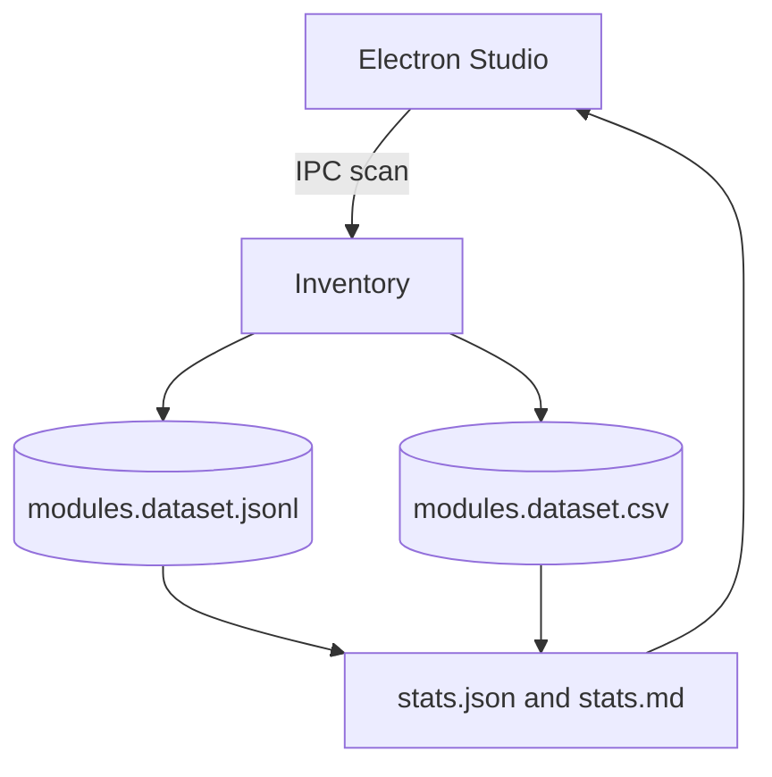
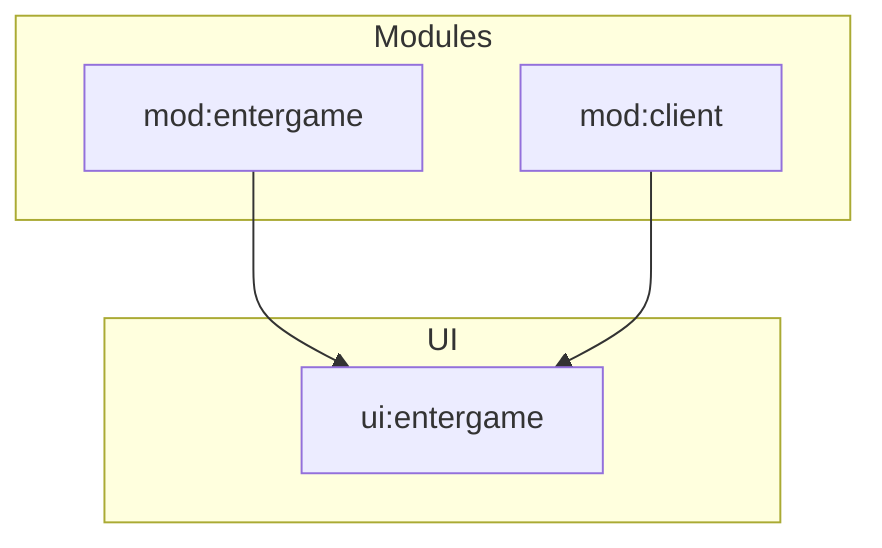

# Chapter 03 - Modules

### Professional Pro Template - Agent-Ready - OTClient v8

> Cel: ten rozdzial inwentaryzuje moduly OTClienta na podstawie plikow .otmod, generuje dane w NDJSON i CSV, tlumaczy pola i relacje, oraz dostarcza gotowe ekstraktory i statystyki. Styl jest elastyczny i konkretny. Calosc ASCII-only, UTF-8 bez BOM.

---

### 0) Executive summary

- Co: metadane modulow (.otmod), w tym nazwa, autor, flagi (reloadable, sandboxed), listy skryptow i hookow, oraz relacje do UI i runtime.
- Dla kogo: inzynierowie, maintainerzy modulow, narzedzia AI/RAG i Studio (Electron/React).
- Output: NDJSON (pelny), CSV (splaszczony), statystyki (JSON/MD), analizy (findings, correlations), diagramy (Mermaid), narracja (sekcje merytoryczne).
- Agent-ready: mapa plikow, punkty wstrzykniec (AGENT:INSERT), IO setup, CSV header, IPC hooki Studio, checklist DoD.

---

### 1) Struktura folderu i linkowanie

```bash
03_modules/
  README.md                      # narracja + TOC + nawigacja (ten plik)
  meta.json                      # mapa plikow + zadania + tags (machine-readable)
  modules.schema.json            # walidacja rekordow NDJSON (module)
  sections/
    00_otclient_modules_basics.md # wprowadzenie do modulow i .otmod
    01_introduction.md            # po co inwentaryzowac moduly (kontekst)
    02_module_model.md            # slownik pol modulu + przyklady + pulapki
    03_collection_methods.md      # jak zbieramy (skan .otmod, zrodla, fallbacki)
    04_quality_and_limits.md      # jakosc, ograniczenia, SLO
    05_how_to_read_stats.md       # jak czytac statystyki i korelowac
  datasets/
    modules.dataset.jsonl         # NDJSON (append-only)
    modules.dataset.csv           # CSV (naglowek staly)
    chunks/
      README.md                   # polityka dzielenia
  stats/
    stats.json                    # metryki zbiorcze (np. rozklad flag)
    stats.md                      # raport czytelny dla ludzi
  analysis/
    findings.md                   # wnioski z danych + linki do rekordow
    correlations.md               # korelacje z runtime/events/ui
    figures/                      # wykresy i tabele eksportowane
  extractors/
    modules_inventory.lua         # skan .otmod -> NDJSON+CSV
    modules_stats.lua             # agregacje -> stats.json + stats.md
  diagrams/
    modules_flow.mmd              # Mermaid: przeplyw inwentaryzacji
    modules_relations.mmd         # Mermaid: relacje modul - UI - runtime
```

Note: IO setup w README ponizej. Zawsze ASCII-only, UTF-8 bez BOM, LF konce linii.

---

### 2) README - nawigacja i instrukcje (Agent-friendly)

```markdown
---
id: chapter:modules
title: Modules - Inventory and Relations
authors: ["docs-export"]
version: 1.0
last_updated: 2025-10-08
status: draft
tags: ["modules","inventory","otmod","otclient","agent"]
related:
  - ../01_runtime/README.md
  - ../02_events/README.md
  - ../04_ui/README.md
outputs:
  - ./datasets/modules.dataset.jsonl
  - ./datasets/modules.dataset.csv
  - ./stats/stats.json
  - ./stats/stats.md
encoding: UTF-8 (no BOM)
---
Short: rozdzial kataloguje moduly (.otmod), ich metadane i relacje. Dane sa pod RAG i analizy oraz do walidacji spojnosc builda.

Table of contents
- [0. OTClient - modules basics](./sections/00_otclient_modules_basics.md)
- [1. Wprowadzenie](./sections/01_introduction.md)
- [2. Model modulu (slownik)](./sections/02_module_model.md)
- [3. Zbieranie (skan .otmod)](./sections/03_collection_methods.md)
- [4. Jakosc i ograniczenia](./sections/04_quality_and_limits.md)
- [5. Jak czytac statystyki](./sections/05_how_to_read_stats.md)
- [Statystyki](./stats/stats.md) - [Datasety](./datasets/) - [Analizy](./analysis/findings.md)

Quick links
- Schema: [modules.schema.json](./modules.schema.json)
- NDJSON: [datasets/modules.dataset.jsonl](./datasets/modules.dataset.jsonl)
- CSV: [datasets/modules.dataset.csv](./datasets/modules.dataset.csv)
- Diagrams: [diagrams/modules_flow.mmd](./diagrams/modules_flow.mmd), [diagrams/modules_relations.mmd](./diagrams/modules_relations.mmd)

Crosslinks
- Runtime: ../01_runtime/README.md
- Events: ../02_events/README.md
- UI: ../04_ui/README.md

CSV header (modules.dataset.csv)

id,ts,name,reloadable,sandboxed,scripts_count,loadLater_count,author,website

Header jest staly - narzedzia BI moga cachowac schemat.

IO setup
- Default: dofile('../../_shared/lua/docio.lua')
- Isolated: copy to 03_modules/_local/docio.lua and use dofile('../_local/docio.lua')

Skad do _shared
| Start location | Path to _shared |
|---|---|
| 03_modules/extractors | ../../_shared/lua/docio.lua |
| 03_modules | ../_shared/lua/docio.lua |

Chunks aggregation
- Aggregator czyta glowny plik oraz opcjonalny indeks: docs/03_modules/datasets/chunks/index.json (JSON array nazw chunkow).

Studio hooks (Electron) - skrot
- IPC: 'studio:modules.inventory.scan' -> uruchamia modules_inventory.lua
- IPC: 'studio:aggregate.modules' -> uruchamia modules_stats.lua
- IPC: 'studio:open.modules' {type: 'jsonl'|'csv'} -> otwiera dataset w Studio
- Preload: contextIsolation: true; nodeIntegration: false; eksponuj bezpieczne API
- Sandbox: wszystkie zapisy ida przez docio.lua pod 03_modules
- View: podglad stats.md + tabela CSV; linki do rekordow po id w NDJSON
```

---

### 3) Mapa plikow i odpowiedzialnosci (reference for Agents)

| Plik / Katalog | Rola | Kto uzupelnia | Uwagi |
|---|---|---|---|
| modules.schema.json | walidacja rekordow modulu | Agent/CI | waliduj linie po linii |
| datasets/*.jsonl | pelne rekordy (append) | inventory | rotacja w chunks/ |
| datasets/*.csv | widok splaszczony | inventory | liczby skryptow w kolumnach |
| stats/*.json\|md | metryki zbiorcze | aggregator | rozklad flag, top scripts |
| sections/*.md | narracja i wyjasnienia | Agent/Autor | AGENT:INSERT punkty |
| analysis/* | wnioski i korelacje | Agent/Analityk | linkuj id rekordow |
| extractors/*.lua | zrzut i agregacja | system | nie zmieniaj API zapisu |

---

### 4) Slownik modulu (data dictionary)

| Pole | Typ | Przyklad | Znaczenie |
|---|---|---|---|
| id | string | mod:client | Unikat modulu: `mod:<name>`. |
| type | string | module | Stala wartosc: module. |
| ts | string | 2025-10-08T12:00:00Z | Czas inwentaryzacji (UTC). |
| name | string | client | Nazwa modulu z .otmod. |
| description | string | Client base module | Opis (jesli wystepuje). |
| author | string | Example Author | Autor modulu. |
| website | string | <https://example.tld> | Witryna (opcjonalna). |
| reloadable | boolean | true | Czy modul mozna przezaladowac. |
| sandboxed | boolean | false | Czy modul dziala w piaskownicy. |
| scripts[] | string[] | [main.lua,...] | Lista skryptow ladowanych. |
| loadLater[] | string[] | [extra.lua] | Lista skryptow ladowanych pozniej. |
| onLoad | string | handler | Nazwa hooka onLoad (opcjonalnie). |
| onUnload | string | handler | Nazwa hooka onUnload (opcjonalnie). |
| links[] | string[] | ui:..., runtime:... | Powiazania z innymi rozdzialami. |

> Agent tip: w sections/02_module_model.md wstaw 3-5 realnych modulow z NDJSON i jednozdaniowy komentarz do kazdego.

---

### 5) Pipeline danych (odczyt -> zapis -> analiza)

1. Inventory skanuje wskazane .otmod i dopisuje rekordy do NDJSON + CSV.
2. Aggregator liczy metryki (rozklad reloadable/sandboxed, top scripts) i zapisuje stats.*.
3. Narracja: sekcje opisowe z przykladami i odwolaniami do id modulow.
4. Analizy: findings i correlations (np. modul vs ekran UI, modul vs eventy).
5. Publikacja: sprawdz checklist DoD i oznacz rozdzial jako ready.

---

### 6) Sekcje merytoryczne - szablony i wprowadzenie do modules

sections/00_otclient_modules_basics.md

```markdown
# Modules - podstawy dla nowych dev
Moduly to jednostki funkcjonalne OTClienta, zdefiniowane przez pliki .otmod (manifesty). Okreslaja metadane, listy skryptow i zasoby.

Pojecia
- .otmod: manifest z polami name, description, author, website, reloadable, sandboxed, scripts, load-later, onLoad, onUnload.
- Kolejnosc ladowania: czesto istotna dla zaleznosci miedzy modulami.
- Relacje: moduly dostarczaja OTUI i skrypty, wplywajac na runtime i eventy.
```

sections/01_introduction.md

```markdown
# Wprowadzenie - po co inwentaryzowac moduly
Inventory daje caly obraz konfiguracji i skladu klienta: kto jest wlascicielem funkcji, jak rozkladac odpowiedzialnosci, jakie skrypty wchodza w sklad, oraz ktore moduly sa reloadable.

Kiedy uzywac
- diagnoza problemow ladowania,
- analiza bezpieczenstwa (sandboxed),
- przeglad zaleznosci i spojnosc builda.
```

sections/02_module_model.md

```markdown
# Model modulu - definicje i przyklady
Zobacz slownik w README. Wstaw krótkie przyklady z pliku NDJSON i krotki komentarz.

<!-- AGENT:INSERT:MODULE-EXAMPLES -->
```

sections/03_collection_methods.md

```markdown
# Zbieranie (skan .otmod)
- modules_inventory.lua czyta sciezki do .otmod z configu lub z listy domyslnej.
- payload recordu zawiera pelne metadane i listy skryptow; CSV dostaje zliczenia.
- Studio: uruchamiaj inventory przez IPC (patrz README Studio hooks).
```

sections/04_quality_and_limits.md

```markdown
# Jakosc i ograniczenia
- Format .otmod w forkach moze byc rozszerzony - opisz to w analysis/findings.md.
- Nazwy modulow musza byc stabilne - zmiana wymaga mapy aliasow.
- Jesli modul nie ma wszystkich pol, rekord pozostaje czesciowy; nie przerywaj inwentaryzacji.
```

sections/05_how_to_read_stats.md

```markdown
# Jak czytac statystyki
- Rozklad reloadable i sandboxed pokazuje gotowosc builda do hot-reload i bezpieczenstwo.
- Top modules by scripts_count wskazuje zlozone komponenty - dobry kandydat do przegladów.

<!-- AGENT:INSERT:READING-GUIDE -->
```

---

### 7) Polityka dzielenia danych - datasets/chunks/README.md

```markdown
# Chunks - polityka
- Utrzymuj glowne pliki do ok. 50 MB.
- Starsze dane przenos do modules.dataset.<YYYYMMDD-HHMM>.jsonl oraz .csv.
- Po przeniesieniu chunkow traktuj je jako read-only.
- Zaktualizuj meta.json (datasets.chunksDir) gdy zmieni sie nazwa katalogu.
```

---

### 8) Schema - modules.schema.json

```json
{
  "$schema": "http://json-schema.org/draft-07/schema#",
  "title": "module.record",
  "type": "object",
  "required": ["id","type","name","ts"],
  "properties": {
    "id": {"type":"string","pattern":"^mod:[A-Za-z0-9_.-]+$"},
    "type": {"type":"string","const":"module"},
    "ts": {"type":"string","format":"date-time"},
    "name": {"type":"string"},
    "description": {"type":"string"},
    "author": {"type":"string"},
    "website": {"type":"string"},
    "reloadable": {"type":"boolean"},
    "sandboxed": {"type":"boolean"},
    "scripts": {"type":"array","items":{"type":"string"}},
    "loadLater": {"type":"array","items":{"type":"string"}},
    "onLoad": {"type":"string"},
    "onUnload": {"type":"string"},
    "links": {"type":"array","items":{"type":"string"}}
  }
}
```

---

### 9) Extractors (Lua) - gotowe pliki

extractors/modules_inventory.lua

```lua
-- 03_modules/extractors/modules_inventory.lua
-- Inwentaryzacja plikow .otmod -> JSONL + CSV (splaszczone kluczowe pola)
-- ASCII-only; UTF-8 bez BOM; LF
local docio = dofile('../../_shared/lua/docio.lua')
local json = require('json')

local CSV_HEADER = { 'id','ts','name','reloadable','sandboxed','scripts_count','loadLater_count','author','website' }
local MAX_BYTES = 50*1024*1024

local function nowIso()
  local t = os.date('!*t')
  return string.format('%04d-%02d-%02dT%02d:%02d:%02dZ', t.year, t.month, t.day, t.hour, t.min, t.sec)
end

local function trim(s)
  if not s then return '' end
  return (s:gsub('^%s+',''):gsub('%s+$',''))
end

local function parseOtmod(text)
  local m = { name='', description='', author='', website='', reloadable=false, sandboxed=false, scripts={}, loadLater={}, onLoad=nil, onUnload=nil }
  for line in (text or ''):gmatch('[^\r\n]+') do
    local k,v = line:match('^%s*([%w%-@]+)%s*:%s*(.+)$')
    if k == 'name' then m.name = trim(v)
    elseif k == 'description' then m.description = trim(v)
    elseif k == 'author' then m.author = trim(v)
    elseif k == 'website' then m.website = trim(v)
    elseif k == 'reloadable' then m.reloadable = v:find('true') ~= nil
    elseif k == 'sandboxed' then m.sandboxed = v:find('true') ~= nil
    elseif k == 'scripts' or k == 'load-later' then
      local list = {}
      for s in v:gmatch('[%w_%.%/]+') do list[#list+1] = s end
      if k == 'scripts' then m.scripts = list else m.loadLater = list end
    elseif k == '@onLoad' then m.onLoad = trim(v)
    elseif k == '@onUnload' then m.onUnload = trim(v)
    end
  end
  return m
end

local function sanitizeName(s)
  s = s or ''
  -- tylko [A-Za-z0-9_.-] zgodnie z modules.schema.json (id = mod:<name>)
  s = s:gsub('[^A-Za-z0-9_.%-]', '_')
  return s
end

local function addModule(fpath)
  if not g_resources or not g_resources.fileExists or not g_resources.readFileContents then return end
  if not g_resources.fileExists(fpath) then return end
  local txt = g_resources.readFileContents(fpath)
  local m = parseOtmod(txt)
  if m.name == '' then
    -- nazwij tymczasowo po sciezce
    m.name = fpath:match('([^/]+)%.otmod$') or fpath
  end
  if m.name == '' then
    -- fallback: basename pliku .otmod, nastepnie sanitizacja pod schema
    local base = fpath:match('([^/]+)%.otmod$') or fpath:match('([^/]+)$') or 'module'
    m.name = sanitizeName(base)
  else
    m.name = sanitizeName(m.name)
  end
  local rec = {
    id = 'mod:' .. m.name,
    type = 'module',
    ts = nowIso(),
    name = m.name,
    description = m.description,
    author = m.author,
    website = m.website,
    reloadable = m.reloadable,
    sandboxed = m.sandboxed,
    scripts = m.scripts,
    loadLater = m.loadLater,
    onLoad = m.onLoad,
    onUnload = m.onUnload,
    links = {}
  }
  -- JSONL
  docio.appendJsonl('docs/03_modules/datasets/modules.dataset.jsonl', rec, MAX_BYTES)
  -- CSV
  docio.writeCsvHeader('docs/03_modules/datasets/modules.dataset.csv', CSV_HEADER)
  local row = {
    id = rec.id, ts = rec.ts, name = rec.name,
    reloadable = rec.reloadable, sandboxed = rec.sandboxed,
    scripts_count = #rec.scripts, loadLater_count = #rec.loadLater,
    author = rec.author, website = rec.website
  }
  docio.appendCsvRow('docs/03_modules/datasets/modules.dataset.csv', CSV_HEADER, row, MAX_BYTES)
end

local function loadTargets()
  -- Priorytet: jesli istnieje lista sciezek z configu, uzyj jej
  local cfg = docio.readAll('docs/03_modules/config/modules.paths.txt')
  local out = {}
  if cfg and #cfg > 0 then
    for line in cfg:gmatch('[^\r\n]+') do
      local p = line:match('^%s*(.-)%s*$')
      if p ~= '' then out[#out+1] = p end
    end
    return out
  end
  -- Fallback: heurystyczna lista najczestszych modulow
  return {
    '/modules/client/client.otmod',
    '/modules/entergame/entergame.otmod',
    '/modules/characterlist/characterlist.otmod',
    '/modules/game_interface/game_interface.otmod',
    '/modules/game_hotkeys/game_hotkeys.otmod'
  }
end

local function run()
  local files = loadTargets()
  for _,f in ipairs(files) do addModule(f) end
end

run()
```

extractors/modules_stats.lua

```lua
-- 03_modules/extractors/modules_stats.lua
-- Agregacja NDJSON -> stats.json + stats.md (deterministyczny output)
-- ASCII-only; UTF-8 bez BOM; LF
local docio = dofile('../../_shared/lua/docio.lua')
local json = require('json')

local function parseLines(text)
  local out = {}
  if not text or #text == 0 then return out end
  for line in text:gmatch('[^\r\n]+') do
    local ok, obj = pcall(function() return json.decode(line) end)
    if ok and type(obj) == 'table' then out[#out+1] = obj end
  end
  return out
end

local function loadAllRecords()
  local recs = {}
  local head = docio.readAll('docs/03_modules/datasets/modules.dataset.jsonl')
  local headList = parseLines(head)
  for i=1,#headList do recs[#recs+1] = headList[i] end
  local indexText = docio.readAll('docs/03_modules/datasets/chunks/index.json')
  if indexText and #indexText > 0 then
    local ok, list = pcall(function() return json.decode(indexText) end)
    if ok and type(list) == 'table' then
      for _,fname in ipairs(list) do
        local path = fname
        if not tostring(fname):match('^docs/') then
          path = 'docs/03_modules/datasets/chunks/' .. tostring(fname)
        end
        local t = docio.readAll(path)
        local more = parseLines(t)
        for i=1,#more do recs[#recs+1] = more[i] end
      end
    end
  end
  return recs
end

local function stats(recs)
  local s = { count = #recs, reloadable = {true=0,false=0}, sandboxed = {true=0,false=0}, topScripts = {} }
  for _,r in ipairs(recs) do
    if r.reloadable then s.reloadable.true = s.reloadable.true + 1 else s.reloadable.false = s.reloadable.false + 1 end
    if r.sandboxed then s.sandboxed.true = s.sandboxed.true + 1 else s.sandboxed.false = s.sandboxed.false + 1 end
    local sc = (r.scripts and #r.scripts or 0) + (r.loadLater and #r.loadLater or 0)
    s.topScripts[r.name or r.id] = sc
  end
  return s
end

local function writeMD(s)
  local md = {}
  md[#md+1] = '# Modules - Statystyki\n\n'
  md[#md+1] = string.format('- Rekordy: %d\n', s.count)
  md[#md+1] = string.format('- Reloadable: true=%d, false=%d\n', s.reloadable.true, s.reloadable.false)
  md[#md+1] = string.format('- Sandboxed: true=%d, false=%d\n', s.sandboxed.true, s.sandboxed.false)
  md[#md+1] = '\n## Top modules by scripts_count\n'
  local names = {}
  for k,_ in pairs(s.topScripts) do names[#names+1] = k end
  table.sort(names)
  for _,k in ipairs(names) do md[#md+1] = string.format('- %s: %d\n', k, s.topScripts[k]) end
  md[#md+1] = '\nHint: duza liczba skryptow moze wskazywac na zlozony modul wymagajacy wiekszej uwagi.\n'
  return table.concat(md)
end

local function run()
  local recs = loadAllRecords()
  local s = stats(recs)
  docio.writeAll('docs/03_modules/stats/stats.json', json.encode(s))
  docio.writeAll('docs/03_modules/stats/stats.md', writeMD(s))
end

run()
```

---

### 10) Diagramy (Mermaid)

diagrams/modules_flow.mmd



diagrams/modules_relations.mmd



---

### 11) Encoding i formatowanie (UTF-8 safe)

- Pliki: UTF-8 bez BOM, ASCII-only w tresci (kreska '-', cudzyslow ", apostrof ').
- Koniec linii: LF. Unikaj znakow specjalnych i dlugich myslnikow.
- Naglowki: H1 (#), pozostale H3 (###) aby Sphinx parsowal lagodniej.

---

### 12) Jakosc, SLO i bezpieczenstwo (krotko)

- NDJSON append-only; przy duzych wolumenach uzyj chunks.
- CSV zawiera zliczenia skryptow; pelne listy tylko w NDJSON.
- Brak danych wrazliwych; zachowaj ostroznosc przy polach description lub website.

---

### 13) DoD Checklist - Agent clickable

- [ ] Zapis do docs/03_modules/datasets/modules.dataset.jsonl i modules.dataset.csv dziala (>= 5 modulow, jesli dostepne).
- [ ] Wygenerowano stats/stats.json oraz stats/stats.md (deterministyczny output list).
- [ ] Uzupelniono sekcje: 00_otclient_modules_basics.md, 01_introduction.md, 02_module_model.md (z przykladami), 03_collection_methods.md.
- [ ] W analysis/correlations.md dodano min. 1 korelacje modul -> UI lub modul -> events.
- [ ] Diagramy modules_flow.mmd i modules_relations.mmd istnieja i sa logiczne.
- [ ] meta.json ma poprawne crosslinks: ../01_runtime, ../02_events, ../04_ui.
- [ ] Walidacja probki 10 linii NDJSON przeciw modules.schema.json zakonczona bez bledow.

---

### 14) meta.json - wzorzec z tagami i linkowaniem

```json
{
  "$schemaVersion": 1,
  "chapterId": "chapter:modules",
  "title": "Modules - Inventory and Relations",
  "owners": ["docs-export"],
  "tags": ["modules","inventory","otmod","otclient","agent"],
  "fileMap": {
    "readme": "./README.md",
    "schema": "./modules.schema.json",
    "sections": [
      "./sections/00_otclient_modules_basics.md",
      "./sections/01_introduction.md",
      "./sections/02_module_model.md",
      "./sections/03_collection_methods.md",
      "./sections/04_quality_and_limits.md",
      "./sections/05_how_to_read_stats.md"
    ],
    "datasets": {
      "jsonl": "./datasets/modules.dataset.jsonl",
      "csv": "./datasets/modules.dataset.csv",
      "chunksDir": "./datasets/chunks"
    },
    "stats": {
      "json": "./stats/stats.json",
      "md": "./stats/stats.md"
    },
    "analysis": {
      "findings": "./analysis/findings.md",
      "correlations": "./analysis/correlations.md",
      "figuresDir": "./analysis/figures"
    },
    "extractors": [
      "./extractors/modules_inventory.lua",
      "./extractors/modules_stats.lua"
    ],
    "diagrams": [
      "./diagrams/modules_flow.mmd",
      "./diagrams/modules_relations.mmd"
    ]
  },
  "linking": {
    "recordIdPattern": "mod:<name>",
    "crossChapter": {
      "runtime": "../01_runtime/README.md",
      "events": "../02_events/README.md",
      "ui": "../04_ui/README.md"
    }
  },
  "agent": {
    "tasks": [
      {"id": "inventory", "desc": "Skan .otmod do JSONL/CSV", "outputs": ["datasets.jsonl", "datasets.csv"]},
      {"id": "aggregate", "desc": "Agregacja do stats.json/stats.md", "outputs": ["stats.json", "stats.md"]},
      {"id": "author", "desc": "Uzupelnienie sekcji i korelacji + wstrzykniecia danych", "targets": ["sections/*", "analysis/*"]}
    ],
    "insertPoints": {
      "sections/02_module_model.md": ["AGENT:INSERT:MODULE-EXAMPLES"],
      "sections/05_how_to_read_stats.md": ["AGENT:INSERT:READING-GUIDE"],
      "analysis/findings.md": ["AGENT:INSERT:FINDINGS"],
      "analysis/correlations.md": ["AGENT:INSERT:CORRELATIONS"]
    }
  }
}
```
