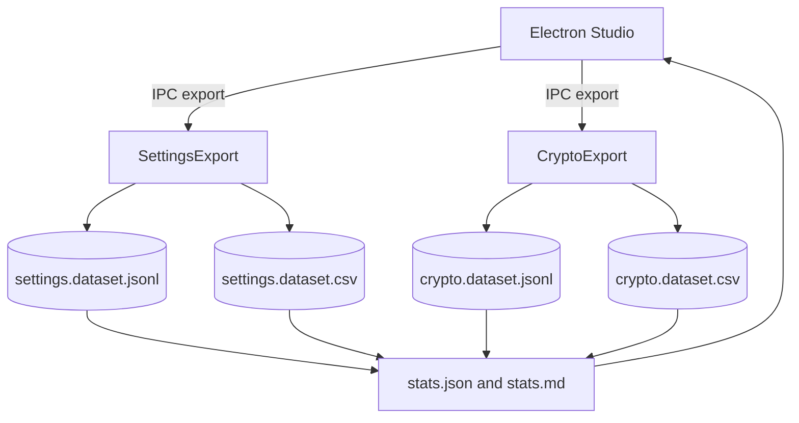

# Chapter 07 - Settings & Crypto

### Professional Pro Template - Agent-Ready - OTClient v8

> Cel: ten rozdzial eksportuje ustawienia (selected keys) oraz informacje kryptograficzno-protokolowe klienta (np. wersje, RSA, opcje protokolu). Wyniki: NDJSON + CSV + statystyki i narracja. Styl elastyczny, konkretny. Calosc ASCII-only, UTF-8 bez BOM.

---

### 0) Executive summary

- Co: kontrolowana inwentaryzacja wybranych ustawien (whitelist) oraz metadane protokolu/crypto (wersje, RSA info) z klienta.
- Dla kogo: inzynierowie, integratorzy builda, narzedzia AI/RAG i Studio (Electron/React).
- Output: NDJSON (pelny), CSV (splaszczony), statystyki (JSON/MD), analizy (findings, compliance), diagramy (Mermaid), narracja (sekcje merytoryczne).
- Agent-ready: mapa plikow, punkty wstrzykniec (AGENT:INSERT), IO setup, CSV headers, Studio hooks, checklist DoD.

---

### 1) Struktura folderu i linkowanie

```bash
07_settings_crypto/
  README.md                          # narracja + TOC + nawigacja (ten plik)
  meta.json                          # mapa plikow + zadania + tags (machine-readable)
  settings.schema.json               # walidacja rekordow NDJSON (setting)
  crypto.schema.json                 # walidacja rekordow NDJSON (crypto/protocol)
  sections/
    00_settings_basics.md            # wprowadzenie do settings (dla nowych dev)
    01_crypto_protocol_basics.md     # podstawy crypto/protocol (dla nowych dev)
    02_models.md                     # slowniki pol (settings + crypto) + przyklady
    03_collection_methods.md         # jak zbieramy (whitelist, bezpieczenstwo)
    04_quality_and_limits.md         # jakosc, ograniczenia, SLO
    05_how_to_read_stats.md          # jak czytac statystyki i compliance
  datasets/
    settings.dataset.jsonl           # NDJSON (append-only; records setting)
    settings.dataset.csv             # CSV (splaszczenie settings)
    crypto.dataset.jsonl             # NDJSON (append-only; records crypto)
    crypto.dataset.csv               # CSV (splaszczenie crypto)
    chunks/
      README.md                      # polityka dzielenia
  stats/
    stats.json                       # metryki zbiorcze (counts, coverage)
    stats.md                         # raport czytelny dla ludzi
  analysis/
    findings.md                      # wnioski z danych + linki do rekordow
    compliance.md                    # zgodnosc, polityki, rekomendacje
    figures/                         # wykresy i tabele eksportowane
  extractors/
    settings_export.lua              # eksport settings (whitelist) -> NDJSON+CSV
    crypto_export.lua                # eksport crypto/protocol -> NDJSON+CSV
    settings_crypto_stats.lua        # agregacje -> stats.json + stats.md
  config/
    settings.keys.txt                # whitelist kluczy do odczytu (po jednej linii)
  diagrams/
    settings_crypto_flow.mmd         # Mermaid: przeplyw eksportu i Studio
```

Note: IO setup w README ponizej. Zawsze ASCII-only, UTF-8 bez BOM, LF konce linii.

---

### 2) README - nawigacja i instrukcje (Agent-friendly)

```markdown
---
id: chapter:settings_crypto
title: Settings & Crypto - Inventory and Protocol
authors: ["docs-export"]
version: 1.0
last_updated: 2025-10-08
status: draft
tags: ["settings","crypto","protocol","otclient","agent"]
related:
  - ../01_runtime/README.md
  - ../02_events/README.md
  - ../06_network/README.md
outputs:
  - ./datasets/settings.dataset.jsonl
  - ./datasets/settings.dataset.csv
  - ./datasets/crypto.dataset.jsonl
  - ./datasets/crypto.dataset.csv
  - ./stats/stats.json
  - ./stats/stats.md
encoding: UTF-8 (no BOM)
---
Short: rozdzial zbiera whitelisted settings oraz metadane crypto/protocol. Dane sa pod BI, RAG i audyt zgodnosci.

Table of contents
- [0. Settings basics](./sections/00_settings_basics.md)
- [1. Crypto/Protocol basics](./sections/01_crypto_protocol_basics.md)
- [2. Modele danych](./sections/02_models.md)
- [3. Zbieranie (whitelist, bezpieczenstwo)](./sections/03_collection_methods.md)
- [4. Jakosc i ograniczenia](./sections/04_quality_and_limits.md)
- [5. Jak czytac statystyki](./sections/05_how_to_read_stats.md)
- [Statystyki](./stats/stats.md) - [Datasety](./datasets/) - [Analizy](./analysis/findings.md)

Quick links
- Schemas: [settings.schema.json](./settings.schema.json), [crypto.schema.json](./crypto.schema.json)
- Settings NDJSON: [datasets/settings.dataset.jsonl](./datasets/settings.dataset.jsonl)
- Settings CSV: [datasets/settings.dataset.csv](./datasets/settings.dataset.csv)
- Crypto NDJSON: [datasets/crypto.dataset.jsonl](./datasets/crypto.dataset.jsonl)
- Crypto CSV: [datasets/crypto.dataset.csv](./datasets/crypto.dataset.csv)
- Diagrams: [diagrams/settings_crypto_flow.mmd](./diagrams/settings_crypto_flow.mmd)

Crosslinks
- Runtime: ../01_runtime/README.md
- Events: ../02_events/README.md
- Network: ../06_network/README.md

CSV headers
- settings.dataset.csv


id,key,value_json,source


- crypto.dataset.csv


id,ts,clientVersion,protoVersion,customOs,rsaBits,rsaPrefix


Header jest staly - narzedzia BI moga cachowac schemat.

IO setup
- Default: dofile('../../_shared/lua/docio.lua')
- Isolated: copy to 07_settings_crypto/_local/docio.lua and use dofile('../_local/docio.lua')

Skad do _shared
| Start location | Path to _shared |
|---|---|
| 07_settings_crypto/extractors | ../../_shared/lua/docio.lua |
| 07_settings_crypto | ../_shared/lua/docio.lua |

Chunks aggregation
- Aggregator czyta glowne pliki oraz opcjonalny indeks: docs/07_settings_crypto/datasets/chunks/index.json (JSON array nazw chunkow).

Studio hooks (Electron) - skrot
- IPC: 'studio:settings.export' -> uruchamia settings_export.lua (whitelist)
- IPC: 'studio:crypto.export' -> uruchamia crypto_export.lua
- IPC: 'studio:aggregate.settings_crypto' -> uruchamia settings_crypto_stats.lua
- IPC: 'studio:open.settings_crypto' {type: 'jsonl'|'csv', domain: 'settings'|'crypto'} -> otwiera dataset
- Preload: contextIsolation: true; nodeIntegration: false; eksponuj bezpieczne API
- Sandbox: wszystkie zapisy ida przez docio.lua pod 07_settings_crypto
- View: podglad stats.md + tabela CSV; linki do rekordow po id w NDJSON
```

---

### 3) Mapa plikow i odpowiedzialnosci (reference for Agents)

| Plik / Katalog | Rola | Kto uzupelnia | Uwagi |
|---|---|---|---|
| settings.schema.json | walidacja rekordow settings | Agent/CI | waliduj linie po linii |
| crypto.schema.json | walidacja rekordow crypto | Agent/CI | waliduj linie po linii |
| datasets/*.jsonl | pelne rekordy (append) | exporters | rotacja w chunks/ |
| datasets/*.csv | widok splaszczony | exporters | only scalars + value_json |
| stats/*.json\|md | metryki zbiorcze | aggregator | coverage, warianty |
| sections/*.md | narracja i wyjasnienia | Agent/Autor | AGENT:INSERT punkty |
| analysis/* | wnioski i compliance | Agent/Analityk | linkuj id rekordow |
| extractors/*.lua | zrzut i agregacja | system | nie zmieniaj API zapisu |

---

### 4) Slownik pol (data dictionaries)

Settings record (NDJSON)

| Pole | Typ | Przyklad | Znaczenie |
|---|---|---|---|
| id | string | set:window.displaySize | Unikat: `set:<key>`. |
| type | string | setting | Stala wartosc: setting. |
| key | string | window.displaySize | Klucz ustawienia (whitelist). |
| value | any | "1024x768" lub 60 | Wartosc (dowolna). |
| source | string | runtime\|ui\|module\|file | Zrodlo wartosci. |
| links[] | string[] | ui:..., mod:..., runtime:... | Powiazania. |

Crypto/Protocol record (NDJSON)

| Pole | Typ | Przyklad | Znaczenie |
|---|---|---|---|
| id | string | proto:active | Unikat: `proto:<label>`. |
| type | string | crypto | Stala wartosc: crypto. |
| ts | string | 2025-10-08T12:00:00Z | Czas snapshotu. |
| clientVersion | string | "v8.XX" | Wersja klienta (jesli dostepna). |
| protoVersion | string | "10.98" | Wersja protokolu (jesli dostepna). |
| customOs | boolean | true | Opcja custom OS (jesli dot.). |
| rsaBits | number | 1024 | Dlugosc klucza RSA (jesli dot.). |
| rsaPrefix | string | "03 01 00 01 ..." | Prefix/modulus summary (bez wrażliwych danych). |
| links[] | string[] | runtime:..., events:... | Powiazania. |

---

### 5) Pipeline danych (odczyt -> zapis -> analiza)

1. Settings exporter czyta whitelist z config/settings.keys.txt i wypelnia rekordy.
2. Crypto exporter pobiera metadane protokolu i RSA (o ile API udostepnia) i wypelnia rekordy.
3. Aggregator buduje metryki coverage, warianty i zapisuje stats.*.
4. Narracja: sekcje opisowe z przykladami i odwolaniami do id.
5. Analizy: findings i compliance (np. zgodnosc RSA, wersje protokolu vs network).

---

### 6) Sekcje merytoryczne - szablony i wprowadzenie

sections/00_settings_basics.md

```markdown
# Settings basics - dla nowych dev
Zbieramy tylko whitelisted keys, aby nie wyciekac wrazliwych danych. Zrodla ustawien: runtime, UI, moduly, pliki konfiguracyjne.

Pojecia
- Whitelist: config/settings.keys.txt (po jednej linii; kropkowana notacja kluczy).
- Zrodlo: `source` w rekordzie wskazuje skad pochodzi wartosc.
```

sections/01_crypto_protocol_basics.md

```markdown
# Crypto/Protocol basics - dla nowych dev
Ten rozdzial celuje w metadane protokolu (wersje, flagi) i info o kluczu RSA (naglowkowe dane, bez prywatnych materialow).

Uwaga
- Nie zapisujemy kluczy prywatnych ani pelnego modulu RSA.
- Pola sa opcjonalne i zalezne od dostepnosci API.
```

sections/02_models.md

```markdown
# Modele danych - definicje i przyklady
Zobacz slowniki w README. Wstaw przyklady z NDJSON (zanonimizowane).

<!-- AGENT:INSERT:SETTINGS-EXAMPLES -->
<!-- AGENT:INSERT:CRYPTO-EXAMPLES -->
```

sections/03_collection_methods.md

```markdown
# Zbieranie (whitelist, bezpieczenstwo)
- settings_export.lua: czyta config/settings.keys.txt i pobiera wartosci z API jesli dostepne.
- crypto_export.lua: pobiera meta z odpowiednich API jesli dostepne.
- Studio: uruchamiaj eksporty przez IPC (patrz README Studio hooks).
- Bezpieczenstwo: zbieraj tylko jawnie whitelisted keys.
```

sections/04_quality_and_limits.md

```markdown
# Jakosc i ograniczenia
- Brak gwarancji dostepnosci wszystkich pol w kazdym buildzie/forku.
- Wartosci moga byc zalezne od platformy lub srodowiska.
- Dokumentuj roznice w analysis/findings.md.
```

sections/05_how_to_read_stats.md

```markdown
# Jak czytac statystyki
- Coverage: jaki procent kluczy z whitelist ma wartosci.
- Wariancje: roznice wersji/flag protokolu.

<!-- AGENT:INSERT:READING-GUIDE -->
```

---

### 7) Polityka dzielenia danych - datasets/chunks/README.md

```markdown
# Chunks - polityka
- Utrzymuj glowne pliki do ok. 50 MB.
- Starsze dane przenos do settings.dataset.<YYYYMMDD-HHMM>.jsonl/.csv oraz crypto.dataset.<YYYYMMDD-HHMM>.jsonl/.csv.
- Po przeniesieniu chunkow traktuj je jako read-only.
- Zaktualizuj meta.json (datasets.chunksDir) gdy zmieni sie nazwa katalogu.
```

---

### 8) Schemas - settings.schema.json i crypto.schema.json

settings.schema.json

```json
{
  "$schema": "http://json-schema.org/draft-07/schema#",
  "title": "setting.record",
  "type": "object",
  "required": ["id","type","key"],
  "properties": {
    "id": {"type":"string","pattern":"^set:[A-Za-z0-9_.-]+$"},
    "type": {"type":"string","const":"setting"},
    "key": {"type":"string"},
    "value": {},
    "source": {"type":"string"},
    "links": {"type":"array","items":{"type":"string"}}
  }
}
```

crypto.schema.json

```json
{
  "$schema": "http://json-schema.org/draft-07/schema#",
  "title": "crypto.record",
  "type": "object",
  "required": ["id","type","ts"],
  "properties": {
    "id": {"type":"string","pattern":"^proto:[A-Za-z0-9_.-]+$"},
    "type": {"type":"string","const":"crypto"},
    "ts": {"type":"string","format":"date-time"},
    "clientVersion": {"type":"string"},
    "protoVersion": {"type":"string"},
    "customOs": {
      "oneOf": [
        {"type":"boolean"},
        {"type":"number"},
        {"type":"string"}
      ]
    },
    "rsaBits": {"type":"number"},
    "rsaPrefix": {"type":"string"},
    "links": {"type":"array","items":{"type":"string"}}
  }
}
```

---

### 9) Extractors (Lua) - gotowe pliki

extractors/settings_export.lua

```lua
-- 07_settings_crypto/extractors/settings_export.lua
-- Eksport settings (whitelist) -> NDJSON + CSV
-- ASCII-only; UTF-8 bez BOM; LF
local docio = dofile('../../_shared/lua/docio.lua')
local json = require('json')

local CSV_HEADER = { 'id','key','value_json','source' }
local MAX_BYTES = 50*1024*1024

local function readLines(path)
  local t = docio.readAll(path)
  local out = {}
  if not t or #t == 0 then return out end
  for line in t:gmatch('[^\r\n]+') do
    local s = line:match('^%s*(.-)%s*$')
    if s ~= '' and not s:match('^#') then out[#out+1] = s end
  end
  return out
end

local function getSettingValue(key)
  -- Proba odczytu z g_settings, w sposob defensywny (API bywa rozne w forkach)
  local v = nil
  if g_settings then
    if g_settings.get then
      local ok, res = pcall(function() return g_settings:get(key) end)
      if ok then v = res end
    end
    if v == nil and g_settings.getString then
      local ok, res = pcall(function() return g_settings:getString(key) end)
      if ok then v = res end
    end
    if v == nil and g_settings.getBoolean then
      local ok, res = pcall(function() return g_settings:getBoolean(key) end)
      if ok then v = res end
    end
    if v == nil and g_settings.getInteger then
      local ok, res = pcall(function() return g_settings:getInteger(key) end)
      if ok then v = res end
    end
  end
  return v
end

local function emit(key, value, source)
  local rec = {
    id = 'set:' .. key,
    type = 'setting',
    key = key,
    value = value,
    source = source or 'runtime',
    links = {}
  }
  docio.appendJsonl('docs/07_settings_crypto/datasets/settings.dataset.jsonl', rec, MAX_BYTES)
  docio.writeCsvHeader('docs/07_settings_crypto/datasets/settings.dataset.csv', CSV_HEADER)
  docio.appendCsvRow('docs/07_settings_crypto/datasets/settings.dataset.csv', CSV_HEADER, {
    id = rec.id, key = rec.key, value_json = json.encode(rec.value), source = rec.source
  }, MAX_BYTES)
end

local function run()
  local keys = readLines('docs/07_settings_crypto/config/settings.keys.txt')
  for _,k in ipairs(keys) do
    local v = getSettingValue(k)
    emit(k, v, v ~= nil and 'runtime' or 'unknown')
  end
end

run()
```

extractors/crypto_export.lua

```lua
-- 07_settings_crypto/extractors/crypto_export.lua
-- Eksport metadanych crypto/protocol -> NDJSON + CSV (pola opcjonalne)
-- ASCII-only; UTF-8 bez BOM; LF
local docio = dofile('../../_shared/lua/docio.lua')
local json = require('json')

local CSV_HEADER = { 'id','ts','clientVersion','protoVersion','customOs','rsaBits','rsaPrefix' }
local MAX_BYTES = 50*1024*1024

local function nowIso()
  local t = os.date('!*t')
  return string.format('%04d-%02d-%02dT%02d:%02d:%02dZ', t.year, t.month, t.day, t.hour, t.min, t.sec)
end

local function shortPrefix(s)
  if not s or #s == 0 then return '' end
  s = tostring(s)
  if #s > 32 then return s:sub(1, 32) .. '...' end
  return s
end

local function snapshot()
  local rec = {
    id = 'proto:active',
    type = 'crypto',
    ts = nowIso(),
    clientVersion = nil,
    protoVersion = nil,
    customOs = nil,
    rsaBits = nil,
    rsaPrefix = nil,
    links = {}
  }
  -- Proby odczytu; kazde w trybie pcall i opcjonalne
  if g_app and g_app.getVersion then
    local ok, v = pcall(function() return g_app:getVersion() end)
    if ok then rec.clientVersion = v end
  end
  if g_game and g_game.getProtocolVersion then
    local ok, v = pcall(function() return g_game:getProtocolVersion() end)
    if ok then rec.protoVersion = v end
  end
  if g_game and g_game.getClientOs and g_game.getClientOs then
    local ok, v = pcall(function() return g_game:getClientOs() end)
    if ok then rec.customOs = v end
  end
  -- RSA: zachowaj tylko nieinwazyjne metadane jesli API istnieje
  if g_game and g_game.getRsaPublicKey then
    local ok, k = pcall(function() return g_game:getRsaPublicKey() end)
    if ok and k then
      local prefix = shortPrefix(k)
      rec.rsaPrefix = prefix
      -- jesli API udostepnia bit-size (przykladowo):
      if g_game.getRsaBits then
        local okb, b = pcall(function() return g_game:getRsaBits() end)
        if okb then rec.rsaBits = b end
      end
    end
  end
  return rec
end

local function run()
  local rec = snapshot()
  docio.appendJsonl('docs/07_settings_crypto/datasets/crypto.dataset.jsonl', rec, MAX_BYTES)
  docio.writeCsvHeader('docs/07_settings_crypto/datasets/crypto.dataset.csv', CSV_HEADER)
  docio.appendCsvRow('docs/07_settings_crypto/datasets/crypto.dataset.csv', CSV_HEADER, {
    id = rec.id, ts = rec.ts, clientVersion = rec.clientVersion or '', protoVersion = rec.protoVersion or '',
    customOs = tostring(rec.customOs or ''), rsaBits = rec.rsaBits or '', rsaPrefix = rec.rsaPrefix or ''
  }, MAX_BYTES)
end

run()
```

extractors/settings_crypto_stats.lua

```lua
-- 07_settings_crypto/extractors/settings_crypto_stats.lua
-- Agregacja settings + crypto -> stats.json + stats.md (deterministyczny output)
-- ASCII-only; UTF-8 bez BOM; LF
local docio = dofile('../../_shared/lua/docio.lua')
local json = require('json')

local function parseLines(text)
  local out = {}
  if not text or #text == 0 then return out end
  for line in text:gmatch('[^\r\n]+') do
    local ok, obj = pcall(function() return json.decode(line) end)
    if ok and type(obj) == 'table' then out[#out+1] = obj end
  end
  return out
end

local function loadAll(domain)
  local base = 'docs/07_settings_crypto/datasets/'
  local file = base .. domain .. '.dataset.jsonl'
  local recs = parseLines(docio.readAll(file))
  local idx = docio.readAll('docs/07_settings_crypto/datasets/chunks/index.json')
  if idx and #idx > 0 then
    local ok, list = pcall(function() return json.decode(idx) end)
    if ok and type(list) == 'table' then
      for _,fname in ipairs(list) do
        if tostring(fname):match('^' .. domain .. '%.dataset') then
          local p = fname
          if not tostring(fname):match('^docs/') then
            p = 'docs/07_settings_crypto/datasets/chunks/' .. tostring(fname)
          end
          local more = parseLines(docio.readAll(p))
          for i=1,#more do recs[#recs+1] = more[i] end
        end
      end
    end
  end
  return recs
end

local function stats()
  local s = { settings = {count=0, bySource={}}, crypto = {count=0, byProtoVersion={}} }
  local ss = loadAll('settings')
  s.settings.count = #ss
  for _,r in ipairs(ss) do
    local src = r.source or 'unknown'
    s.settings.bySource[src] = (s.settings.bySource[src] or 0) + 1
  end
  local cc = loadAll('crypto')
  s.crypto.count = #cc
  for _,r in ipairs(cc) do
    local pv = r.protoVersion or 'n/a'
    s.crypto.byProtoVersion[pv] = (s.crypto.byProtoVersion[pv] or 0) + 1
  end
  return s
end

local function writeMD(s)
  local md = {}
  md[#md+1] = '# Settings & Crypto - Statystyki\n\n'
  md[#md+1] = string.format('## Settings\n- Rekordy: %d\n', s.settings.count)
  md[#md+1] = '\n### By source\n'
  local sources = {}
  for k,_ in pairs(s.settings.bySource) do sources[#sources+1] = k end
  table.sort(sources)
  for _,k in ipairs(sources) do md[#md+1] = string.format('- %s: %d\n', k, s.settings.bySource[k]) end
  md[#md+1] = string.format('\n## Crypto\n- Rekordy: %d\n', s.crypto.count)
  md[#md+1] = '\n### By protoVersion\n'
  local pvers = {}
  for k,_ in pairs(s.crypto.byProtoVersion) do pvers[#pvers+1] = k end
  table.sort(pvers)
  for _,k in ipairs(pvers) do md[#md+1] = string.format('- %s: %d\n', k, s.crypto.byProtoVersion[k]) end
  return table.concat(md)
end

local function run()
  local s = stats()
  docio.writeAll('docs/07_settings_crypto/stats/stats.json', json.encode(s))
  docio.writeAll('docs/07_settings_crypto/stats/stats.md', writeMD(s))
end

run()
```

---

### 10) Diagram (Mermaid)

diagrams/settings_crypto_flow.mmd



---

### 11) Encoding i formatowanie (UTF-8 safe)

- Pliki: UTF-8 bez BOM, ASCII-only w tresci (kreska '-', cudzyslow ", apostrof ').
- Koniec linii: LF. Unikaj znakow specjalnych i dlugich myslnikow.
- Naglowki: H1 (#), pozostale H3 (###) aby Sphinx parsowal lagodniej.

---

### 12) Jakosc, SLO i bezpieczenstwo (krotko)

- NDJSON append-only; przy duzych wolumenach uzyj chunks.
- Settings: tylko whitelist; **nie** zbieraj danych wrazliwych (PII, sekrety).
- Crypto: wystrzegaj sie zapisu pelnych materialow kluczowych; tylko metadane.

---

### 13) DoD Checklist - Agent clickable

- [ ] Zapis do docs/07_settings_crypto/datasets/settings.dataset.jsonl/.csv oraz crypto.dataset.jsonl/.csv dziala.
- [ ] Wygenerowano stats/stats.json oraz stats/stats.md (deterministyczny output list).
- [ ] Uzupelniono sekcje: 00_settings_basics.md, 01_crypto_protocol_basics.md, 02_models.md (z przykladami), 03_collection_methods.md.
- [ ] W analysis/compliance.md dodano min. 1 regule compliance (np. dopuszczalne protoVersion lub RSA bits >= N).
- [ ] Diagram settings_crypto_flow.mmd istnieje i jest logiczny.
- [ ] meta.json ma poprawne crosslinks: ../01_runtime, ../02_events, ../06_network.
- [ ] Walidacja probki 10 linii NDJSON przeciw schemas zakonczona bez bledow.

---

### 14) meta.json - wzorzec z tagami i linkowaniem

```json
{
  "$schemaVersion": 1,
  "chapterId": "chapter:settings_crypto",
  "title": "Settings & Crypto - Inventory and Protocol",
  "owners": ["docs-export"],
  "tags": ["settings","crypto","protocol","otclient","agent"],
  "fileMap": {
    "readme": "./README.md",
    "schemas": {
      "settings": "./settings.schema.json",
      "crypto": "./crypto.schema.json"
    },
    "sections": [
      "./sections/00_settings_basics.md",
      "./sections/01_crypto_protocol_basics.md",
      "./sections/02_models.md",
      "./sections/03_collection_methods.md",
      "./sections/04_quality_and_limits.md",
      "./sections/05_how_to_read_stats.md"
    ],
    "datasets": {
      "settingsJsonl": "./datasets/settings.dataset.jsonl",
      "settingsCsv": "./datasets/settings.dataset.csv",
      "cryptoJsonl": "./datasets/crypto.dataset.jsonl",
      "cryptoCsv": "./datasets/crypto.dataset.csv",
      "chunksDir": "./datasets/chunks"
    },
    "stats": {
      "json": "./stats/stats.json",
      "md": "./stats/stats.md"
    },
    "analysis": {
      "findings": "./analysis/findings.md",
      "compliance": "./analysis/compliance.md",
      "figuresDir": "./analysis/figures"
    },
    "extractors": [
      "./extractors/settings_export.lua",
      "./extractors/crypto_export.lua",
      "./extractors/settings_crypto_stats.lua"
    ],
    "diagrams": [
      "./diagrams/settings_crypto_flow.mmd"
    ],
    "config": {
      "settingsKeys": "./config/settings.keys.txt"
    }
  },
  "linking": {
    "recordIdPattern": {
      "settings": "set:<key>",
      "crypto": "proto:<label>"
    },
    "crossChapter": {
      "runtime": "../01_runtime/README.md",
      "events": "../02_events/README.md",
      "network": "../06_network/README.md"
    }
  },
  "agent": {
    "tasks": [
      {"id": "export_settings", "desc": "Eksport whitelisted settings do JSONL/CSV", "outputs": ["settingsJsonl", "settingsCsv"]},
      {"id": "export_crypto", "desc": "Eksport meta crypto/protocol do JSONL/CSV", "outputs": ["cryptoJsonl", "cryptoCsv"]},
      {"id": "aggregate", "desc": "Agregacja do stats.json/stats.md", "outputs": ["stats.json", "stats.md"]},
      {"id": "author", "desc": "Uzupelnienie sekcji i compliance + wstrzykniecia danych", "targets": ["sections/*", "analysis/*"]}
    ],
    "insertPoints": {
      "sections/02_models.md": ["AGENT:INSERT:SETTINGS-EXAMPLES", "AGENT:INSERT:CRYPTO-EXAMPLES"],
      "sections/05_how_to_read_stats.md": ["AGENT:INSERT:READING-GUIDE"],
      "analysis/findings.md": ["AGENT:INSERT:FINDINGS"],
      "analysis/compliance.md": ["AGENT:INSERT:COMPLIANCE"]
    }
  }
}
```
