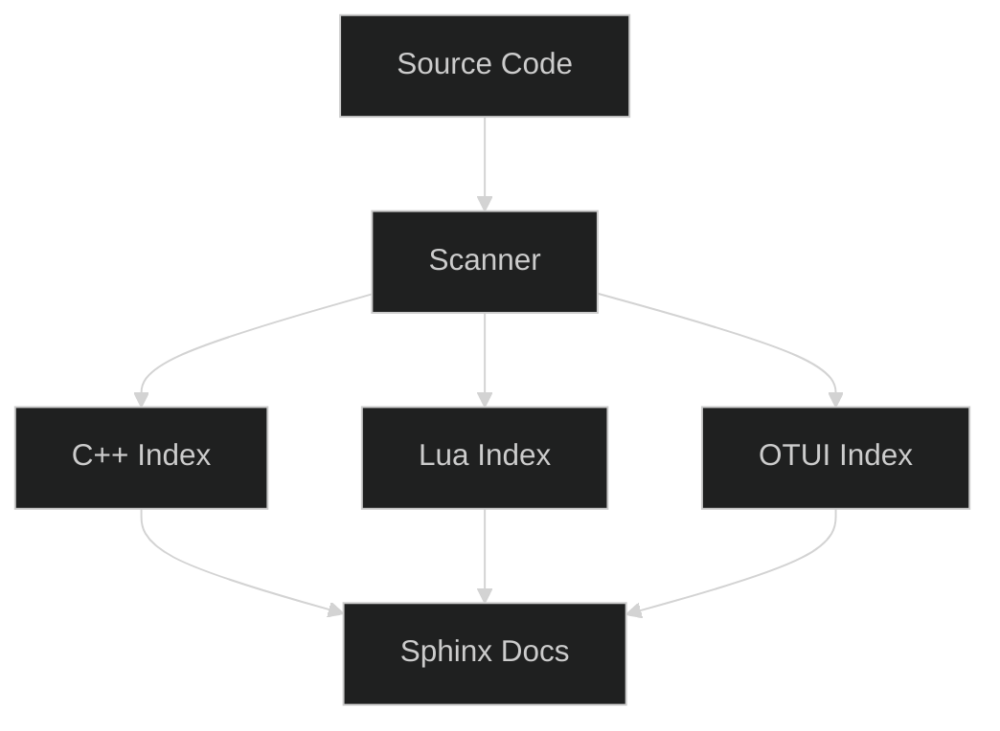

# Copilot Docs — DEV‑SCAN 1:1 + PLUS

:::{grid} 1 1 2 3
:gutter: 2

:::{grid-item-card} Integracja ze Sphinx
:link: integration_guide
{badge}`guide`
Opis integracji wyników skanu (indeksy kodu, cross‑linki) z PyData.
:::

:::{grid-item-card} Indeksy kodu
:link: code_index
{badge}`reference`
C++/Lua/OTUI: klasy, funkcje, eventy.
:::

:::{grid-item-card} Diagramy i struktury
:link: trees
{badge}`examples`
Mapy zależności, drzewa modułów.
:::
:::


**DEV‑SCAN pipeline:** gdzie lądują artefakty i jak są linkowane w Sphinx (PyData sidebar + search).

**Workflow:**
1. Scan kodu źródłowego (C++/Lua/OTUI)
2. Generowanie indeksów i cross-references
3. Integracja z dokumentacją główną
4. Publikacja w GitHub Pages

**Checklist:**
- [ ] Indeksy kodu zaktualizowane
- [ ] Cross-linki działają
- [ ] Search index zawiera nowe symbole
- [ ] Dark mode aktywny dla diagramów


**Generatory:** formaty wyjściowe, reguły parsowania, ograniczenia.

**Dopiąć cross‑referencje:**
- C++ symbols → API docs
- Lua functions → Module docs
- OTUI widgets → UI docs
- Events → Events chapter

**Dostępne narzędzia:**
- Code scanner (C++/Lua)
- Cross-reference builder
- Search index generator
- Diagram renderer (Mermaid/Graphviz)


**Literalinclude — C++ (with regions)**
```{literalinclude} ../../../src/framework/xml/tinyxml.cpp
:language: cpp
:start-after: // region file_open_example
:end-before: // endregion file_open_example
```

**Literalinclude — Lua (with regions)**
```{literalinclude} ../../../modules/corelib/globals.lua
:language: lua
:start-after: -- region schedule_event_example
:end-before: -- endregion schedule_event_example
```

**Mermaid — Code Structure**


**Graphviz — Module Dependencies**
```{graphviz}
:align: center

digraph G {
  rankdir=LR;
  bgcolor="transparent";
  node [style=filled, fillcolor="#1e1e1e", fontcolor="#ddd"];
  edge [color="#9aa0a6"];
  
  "Code Scanner" -> "C++ Parser";
  "Code Scanner" -> "Lua Parser";
  "Code Scanner" -> "OTUI Parser";
  "C++ Parser" -> "Index Builder";
  "Lua Parser" -> "Index Builder";
  "OTUI Parser" -> "Index Builder";
  "Index Builder" -> "Sphinx Integration";
}
```

:::{card}
**Quality gates**
{badge}`scan ok,success` {badge}`crosslinks ✓,success` {badge}`perf check,info`
:::

```{dropdown} Quick tasks (Copilot Docs)
- [ ] `literalinclude` tylko z regionami
- [ ] Mini „See also" (Authoring/UI/Events)
- [ ] TOC nie przepełnia prawego paska
- [ ] Dark mode dla wszystkich diagramów
- [ ] Indeksy zaktualizowane po każdym scan
```

:::{grid} 1 1 2 3
**See also:** {ref}`authoring/index` · {ref}`authoring/04_ui/index` · {ref}`authoring/02_events/index`
:::

```{toctree}
:hidden:
:maxdepth: 2
:caption: Przegląd i indeksy

overview
integration_guide
```

```{toctree}
:hidden:
:maxdepth: 2
:caption: Kod źródłowy

src_code
src_client
src_framework
code_index
anchors
```

```{toctree}
:hidden:
:maxdepth: 2
:caption: Moduły i UI

modules
modules_repo
layouts
mods
lua_api
```

```{toctree}
:hidden:
:maxdepth: 2
:caption: Eventy i cross-linki

events_hooks
crosslinks
```

```{toctree}
:hidden:
:maxdepth: 2
:caption: Struktury danych

trees
trees_real
```

```{toctree}
:hidden:
:maxdepth: 2
:caption: Platformy i build

vc16
```

```{toctree}
:hidden:
:maxdepth: 2
:caption: Narzędzia z repo

lua_bindings_repo
bitmaps_generated
```
