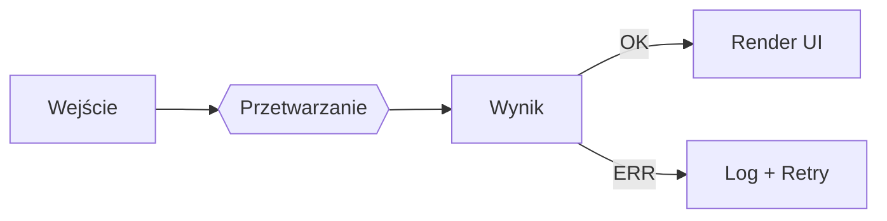

# Diagramy i grafy

## Mermaid (H2)

```mermaid
flowchart LR
  A[Wejście] --> B{{Przetwarzanie}}
  B --> C[Wynik]
  C -->|OK| D[Render UI]
  C -->|ERR| E[Log + Retry]
```

### Wskazówki (H3)
- Unikaj zbyt długich etykiet.
- Testuj w light/dark — pydata-sphinx-theme przełącza motywy.
