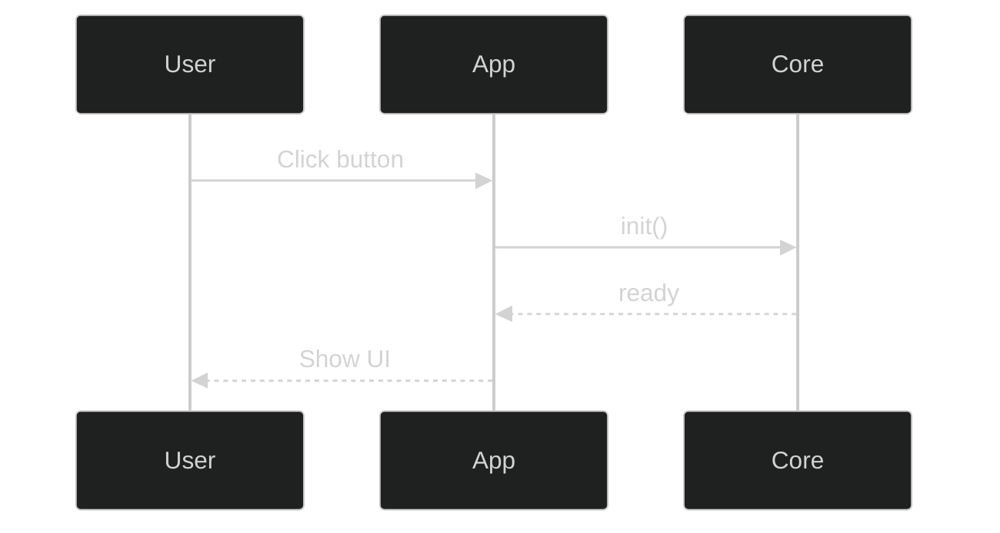

# Guide & Components

Praktyczne elementy PyData + sphinx‑design w układzie **kod po lewej / efekt po prawej**.

```{toctree}
:maxdepth: 2
:hidden:
kitchen/admonitions
kitchen/blocks
kitchen/tables
kitchen/lists
kitchen/generic
kitchen/components
kitchen/indices
```

---

## Kitchen‑sink in practice — karty nawigacyjne

:::{grid} 1 1 2 2
:gutter: 3

:::{grid-item}
**Kod**

```md
:::{grid} 1 1 2 2
:gutter: 2

:::{grid-item-card} Admonitions
:link: kitchen/admonitions
Notatki, ostrzeżenia, tips.
:::

:::{grid-item-card} Komponenty
:link: kitchen/components
Grids, cards, tabs, badges.
:::

:::{grid-item-card} Tabele
:link: kitchen/tables
CSV-table i inne.
:::

:::{grid-item-card} Indeksy
:link: kitchen/indices
Generowanie indeksów.
:::
:::
```

:::

:::{grid-item}
**Efekt**

:::{grid} 1 1 2 2
:gutter: 2

:::{grid-item-card} Admonitions
:link: kitchen/admonitions
Notatki, ostrzeżenia, tips.
:::

:::{grid-item-card} Komponenty
:link: kitchen/components
Grids, cards, tabs, badges.
:::

:::{grid-item-card} Tabele
:link: kitchen/tables
CSV-table i inne.
:::

:::{grid-item-card} Indeksy
:link: kitchen/indices
Generowanie indeksów.
:::
:::
:::

---

## Tabs — Guide / Reference / Examples

:::{grid} 1 1 2 2
:gutter: 3

:::{grid-item}
**Kod**

:::{tab-set}
:::{tab-item} Guide
**Best practices + checklisty:**

- Używaj grid-item-card dla navigation
- Tabs (Guide/Reference/Examples) dla struktury treści
- Dropdowns dla checklistów i zadań
- Mermaid/Graphviz z dark mode init
- CSV-table dla danych tabelarycznych
- Literalinclude z regionami dla kodu

**Workflow:**
1. Projektuj strukturę (grid + tabs)
2. Dodaj content w każdym tab
3. Osadź przykłady (CSV/kod/diagramy)
4. Zweryfikuj dark mode i responsywność
:::

:::{tab-item} Reference
**Dostępne komponenty:**
- **sphinx-design:** grid, card, tabs, dropdown, badge
- **myst-nb:** MyST Markdown z Jupyter
- **sphinxcontrib-mermaid:** Mermaid diagrams
- **sphinx.ext.graphviz:** Graphviz diagrams
- **sphinx-copybutton:** Copy button na blokach kodu

**Konfiguracja (conf.py):**
- `secondary_sidebar_items`: page-toc, sourcelink, edit-this-page
- `mermaid_output_format`: svg (lepszy dla CI)
- `mermaid_init_js`: dark theme
- `html_theme_options`: PyData theme config

**Linki do indeksów:**
- {ref}`authoring/index` — Główne rozdziały
- {ref}`copilot/sphinx/index` — Code scanner output
- {ref}`authoring/04_ui/index` — UI widgets
:::

:::{tab-item} Examples
**CSV‑table (datasets)**
```

```{csv-table} UI Signals — przykład z authoring
:header-rows: 1
:file: ../authoring/04_ui/datasets/signals.csv
:widths: 20, 20, 30, 30
```

**Mermaid — Sequence Diagram**



**Graphviz — Component Architecture**

```{graphviz}
:align: center

digraph G {
  rankdir=TB;
  bgcolor="transparent";
  node [style=filled, fillcolor="#1e1e1e", fontcolor="#ddd", shape=box];
  edge [color="#9aa0a6"];
  "PyData Theme" -> "MyST Markdown";
  "MyST Markdown" -> "CSV Tables";
}
```

:::
:::


:::

:::{grid-item}
**Efekt**

:::{tab-set}
:::{tab-item} Guide
**Best practices + checklisty:**

- Używaj grid-item-card dla navigation
- Tabs (Guide/Reference/Examples) dla struktury treści
- Dropdowns dla checklistów i zadań
- Mermaid/Graphviz z dark mode init
- CSV-table dla danych tabelarycznych
- Literalinclude z regionami dla kodu

**Workflow:**
1. Projektuj strukturę (grid + tabs)
2. Dodaj content w każdym tab
3. Osadź przykłady (CSV/kod/diagramy)
4. Zweryfikuj dark mode i responsywność
:::

:::{tab-item} Reference
**Dostępne komponenty:**
- **sphinx-design:** grid, card, tabs, dropdown, badge
- **myst-nb:** MyST Markdown z Jupyter
- **sphinxcontrib-mermaid:** Mermaid diagrams
- **sphinx.ext.graphviz:** Graphviz diagrams
- **sphinx-copybutton:** Copy button na blokach kodu

**Konfiguracja (conf.py):**
- `secondary_sidebar_items`: page-toc, sourcelink, edit-this-page
- `mermaid_output_format`: svg (lepszy dla CI)
- `mermaid_init_js`: dark theme
- `html_theme_options`: PyData theme config

**Linki do indeksów:**
- {ref}`authoring/index`
- {ref}`copilot/sphinx/index`
- {ref}`authoring/04_ui/index`
:::

:::{tab-item} Examples

```{csv-table} UI Signals — przykład z authoring
:header-rows: 1
:file: ../authoring/04_ui/datasets/signals.csv
:widths: 20, 20, 30, 30


```{graphviz}
:align: center

digraph G {
  rankdir=TB;
  bgcolor="transparent";
  node [style=filled, fillcolor="#1e1e1e", fontcolor="#ddd", shape=box];
  edge [color="#9aa0a6"];
  "PyData Theme" -> "MyST Markdown";
  "MyST Markdown" -> "CSV Tables";
}
```

:::
:::
:::

---

## Sidebar & buttons (PyData)

:::{grid} 1 1 2 2
:gutter: 3

:::{grid-item}
**Kod**


Prawy TOC + „Show source" + „Edit this page" włączone globalnie.

```python
html_theme_options = {
    "secondary_sidebar_items": ["page-toc", "sourcelink", "edit-this-page"],
    "show_prev_next": True,
    "navigation_with_keys": True,
}
```


:::

:::{grid-item}
**Efekt**

Prawy TOC + „Show source" + „Edit this page" aktywne (według motywu).
:::

:::

---

## Dark mode verification — dropdown checklist
:::{grid} 1 1 2 2
:gutter: 3

:::{grid-item}
**Kod**

```{dropdown} Quick tasks (Guide)
- [x] Dark‑mode przykładów OK (Mermaid/Graphviz)
- [x] `copybutton` na blokach kodu działa
- [x] „See also" spójny z Authoring/Copilot Docs
- [x] Grid cards renderują się responsywnie
- [x] Tabs przełączają się poprawnie
- [x] CSV tables mają nagłówki
- [x] Literalinclude używa regionów (nie linii)
```


:::

:::{grid-item}
**Efekt**

```{dropdown} Quick tasks (Guide)
- [x] Dark‑mode przykładów OK (Mermaid/Graphviz)
- [x] `copybutton` na blokach kodu działa
- [x] „See also" spójny z Authoring/Copilot Docs
- [x] Grid cards renderują się responsywnie
- [x] Tabs przełączają się poprawnie
- [x] CSV tables mają nagłówki
- [x] Literalinclude używa regionów (nie linii)
```

:::

:::

---

## See also — karty z linkami

:::{grid} 1 1 2 3
:gutter: 3

:::{grid-item-card} Authoring
:link: authoring/index
:link-type: ref
:::

:::{grid-item-card} Copilot Docs
:link: copilot/sphinx/index
:link-type: ref
:::

:::{grid-item-card} UI Widgets
:link: authoring/04_ui/index
:link-type: ref
:::

:::
