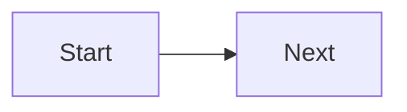

# Theme elements & web-components

> Założenie: masz włączone `pydata-sphinx-theme`, `sphinx_design`, `sphinx-copybutton`, `myst_parser`.

---

## Przyciski „Edit / Source” (PyData — automatyczne)

> Działają automatycznie po ustawieniu w `conf.py` (`html_context` + `html_theme_options`). Poniżej **przycisk ręczny** jako alternatywa.


```{button-link} https://github.com/ORG/REPO/edit/master/docs/path/to/file.md
:color: primary
:outline:
:expand:
Edytuj tę stronę na GitHubie
```


---

## Badge (etykieta)

```{badge} Stable
:color: success
```

```{badge} Experimental
:color: warning
```

```{badge} Deprecated
:color: danger
```


---

## Dropdown / Details (rozwijane bloki)

```{dropdown} Zobacz więcej (dropdown)
:open:
Tu treść rozwijana, może zawierać listy, kod, itp.
```


```{details} Szczegóły (details)
HTML5 `<details>` kompatybilne z motywem.
```


---

## Karty (cards) — 3 kolumny

:::{grid} 1 1 2 3
:gutter: 3

:::{grid-item-card} 🚀 Szybki start
:link: overview/getting_started
:link-type: doc
Wprowadzenie i instalacja.
:::

:::{grid-item-card} 🧩 Moduły
:link: modules/index
:link-type: doc
Opis modułów i przykłady.
:::

:::{grid-item-card} 📚 API
:link: api/index
:link-type: doc
Auto‑API i odwołania.
:::

:::


---

## Przyciski akcji (CTA)


```{button-link} ../install
:color: primary
:shadow:
Zainstaluj teraz
```

```{button-link} ../changelog
:color: secondary
Zobacz zmiany
```


---

## Ikony w tekście (emoji lub SVG)

**GitHub** :octocat:  · **Info** ℹ️  · **Uwaga** ⚠️


> Wersja stricte SVG: osadź `<svg>` (PyData wspiera inline HTML).

---

## Tabele porównawcze (design + klasy)


```{list-table} Porównanie wariantów
:header-rows: 1
:class: sd-table sd-width-100
```
* - Wariant
  - Opis
  - Akcja
* - Basic
  - Minimalny zestaw funkcji
  - ```{button-link} ../buy/basic\n:color: primary\nKup\n```
* - Pro
  - Więcej funkcji i wsparcie
  - ```{button-link} ../buy/pro\n:color: success\nKup Pro\n```


---

## Zakładki (tabs) z kodem

:::{tab-set}
:::{tab-item} Bash
```bash
pip install -r requirements.txt
```

:::
:::{tab-item} PowerShell

```powershell
pip install -r requirements.txt
```

:::
:::


---

## Alerty (admonitions) stylowane

:::{admonition} Uwaga — build
:class: warning sd-font-weight-bold
Może potrwać dłużej w CI.
:::


---

## Osadzony HTML (web‑component / raw HTML)


<div class="sd-shadow-sm sd-rounded-2 sd-p-2 sd-bg-muted">
  <details>
    <summary>Kliknij, by rozwinąć</summary>
    <p>To jest surowy HTML, wspierany przez PyData/MyST.</p>
  </details>
</div>
```

---

## Sticky TOC / przyklejany blok (styl przez klasę)


:::{admonition} Szybka nawigacja
:class: sd-sticky sd-top-4 sd-shadow-sm
- [:ref:`genindex`]
- [:ref:`modindex`]
- [:ref:`search`]
:::

---

## Sekcja hero (nagłówek z CTA)


:::{grid} 1 1 2 2
:gutter: 3

:::{grid-item}
# OTClientV8 Docs
Krótki opis projektu i linki startowe.

```{button-link} overview/getting_started
:color: primary
:expand:
Zacznij teraz
```

:::

:::{grid-item}



:::

:::


---

## Stopka z linkami (inline refs)

— [:ref:`genindex`] · [:ref:`modindex`] · [:ref:`search`]

