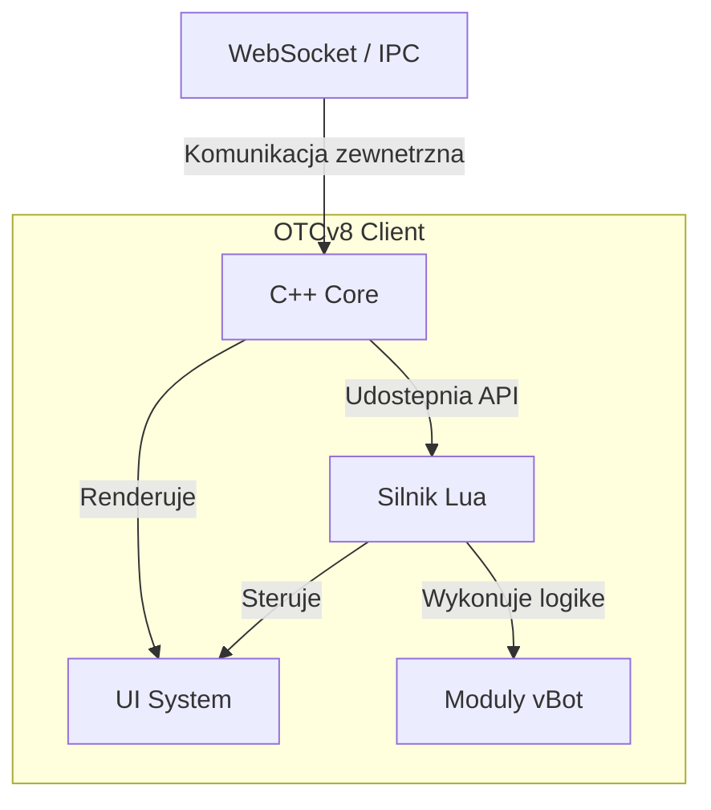

# Architektura (w skr�cie)

Ponizszy diagram przedstawia kluczowe komponenty i przeplyw danych w architekturze OTCv8.

### Opis Warstw

=== "Warstwy"

- **C++ Core** - Niskopoziomowy silnik odpowiedzialny za renderowanie, obsluge sieci, dzwieku i operacje na plikach.
- **Lua** - Warstwa skryptowa, w kt�rej dziala cala logika gry, moduly i interfejs (np. vBot).
- **OTUI** - Deklaratywny system oparty na skladni `yaml`, uzywany do szybkiego budowania i stylowania interfejsu uzytkownika.

=== "Kontrakty"

- **Eventy Lua ? UI, IPC/WS, Zasoby** - Logika pisana w Lua reaguje na zdarzenia i komunikuje sie z reszta aplikacji, sterujac interfejsem, obslugujac komunikacje i zarzadzajac zasobami.
