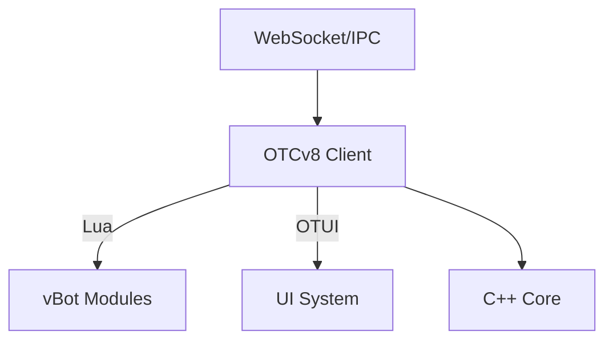

# Architektura (skrót)

```mermaid
graph TD
  Client[OTCv8 Client] -->|Lua| vBot[vBot Modules]
  Client -->|OTUI| UI[UI System]
  Client --> CppCore[C++ Core]
  WS[WebSocket/IPC] --> Client

```

=== "Warstwy"

C++ Core – silnik render/UI/IO

Lua – logika modułów (vBot)

OTUI – deklaratywne layouty

=== "Kontrakty"

Eventy Lua ⟷ UI, IPC/WS, zasoby

