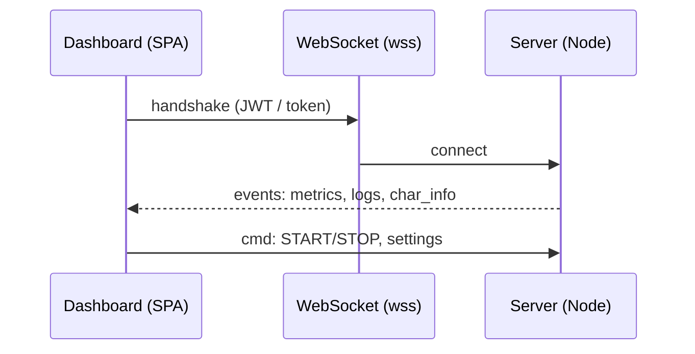

?# Realtime (

W

e

b

S

o

c

k

e

t

)


# # Z

a

s

a

d

y

- **WSS** + origin allowlist + rate-limit.
- Autoryzacja w handshake (JWT / session).
- Walidacja schemat�w wiadomosci.
# # Przyklad (Node +

s

o

c

k

e

t

i

o

)

```ts
io.use(authMiddleware);
io.on("connection", (s) => {
  s.join(`user:${s.user.id}`);
  s.on("cmd", (payload) => {
    /* validate + run */
  });
});
```
